# Exercise 4: Create FSLogix Profile Solution

Duration: 45 minutes

[Previous Challenge Solution](./03-multi-session-Hostpools-solution.md) - **[Home](../Readme.md)** - [Next Challenge Solution](05-start-VM-on-connect-solution.md)

In this challenge you will learn how to implement the FSLogix profile solution for multi-session hostpools.
The Azure Virtual Desktop service recommends FSLogix profile containers as a user profile solution. FSLogix is designed to roam profiles in remote computing environments, such as Azure Virtual Desktop. It stores a complete user profile in a single container. At sign in, this container is dynamically attached to the computing environment using natively supported Virtual Hard Disk (VHD) and Hyper-V Virtual Hard disk (VHDX). The user profile is immediately available and appears in the system exactly like a native user profile.

**Additional Resources**

  |              |            |  
|----------|:-------------:|
| Description | Links |
| Create a storage account | https://learn.microsoft.com/en-us/azure/storage/common/storage-account-create?tabs=azure-portal |
| Create an Azure file share | https://learn.microsoft.com/en-us/azure/storage/files/storage-how-to-create-file-share?tabs=azure-portal |
|Create a profile container with Azure Files and Azure Active Directory   |  https://learn.microsoft.com/en-us/azure/virtual-desktop/create-profile-container-azure-ad  | 
| Circumvent port 445 issues | https://learn.microsoft.com/en-us/azure/storage/files/storage-files-networking-overview#azure-networking |
  |              |            | 

## Task 1: Create a storage account
Azure file shares are deployed into storage accounts, which are top-level objects that represent a shared pool of storage. This pool of storage can be used to deploy multiple file shares.

Azure supports multiple types of storage accounts for different storage scenarios customers may have, but there are two main types of storage accounts for Azure Files. Which storage account type you need to create depends on whether you want to create a standard file share or a premium file share:

General purpose version 2 (GPv2) storage accounts: GPv2 storage accounts allow you to deploy Azure file shares on standard/hard disk-based (HDD-based) hardware. In addition to storing Azure file shares, GPv2 storage accounts can store other storage resources such as blob containers, queues, or tables. File shares can be deployed into the transaction optimized (default), hot, or cool tiers.

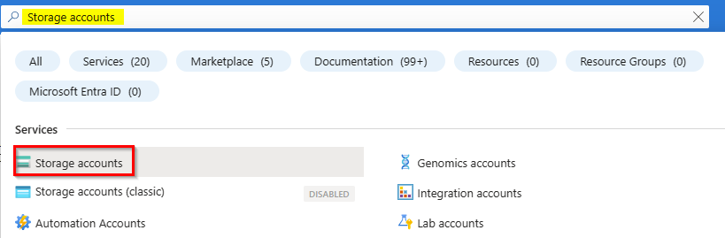

To create a storage account via the Azure portal, select + Create a resource from the dashboard. In the resulting Azure Marketplace search window, search for storage account and select the resulting search result. This will lead to an overview page for storage accounts; select Create to proceed with the storage account creation wizard.

FileStorage storage accounts: FileStorage storage accounts allow you to deploy Azure file shares on premium/solid-state disk-based (SSD-based) hardware. FileStorage accounts can only be used to store Azure file shares; no other storage resources (blob containers, queues, tables, etc.) can be deployed in a FileStorage account.

Create a general-purposev2 storage account with the following settings:
- Resource group: **select your Resource group**
- Storage account name: **fslogixprofilefs (or something similar)**
- Region: **West Europe**
- Performance: **Standard**
- Redundancy: **Locally-redundant storage (LRS)**
- Click **Review** and then **Create**

> Note: The advanced, Networking, Data protection and Encryption settings we don't need to change anything as we choose default settings

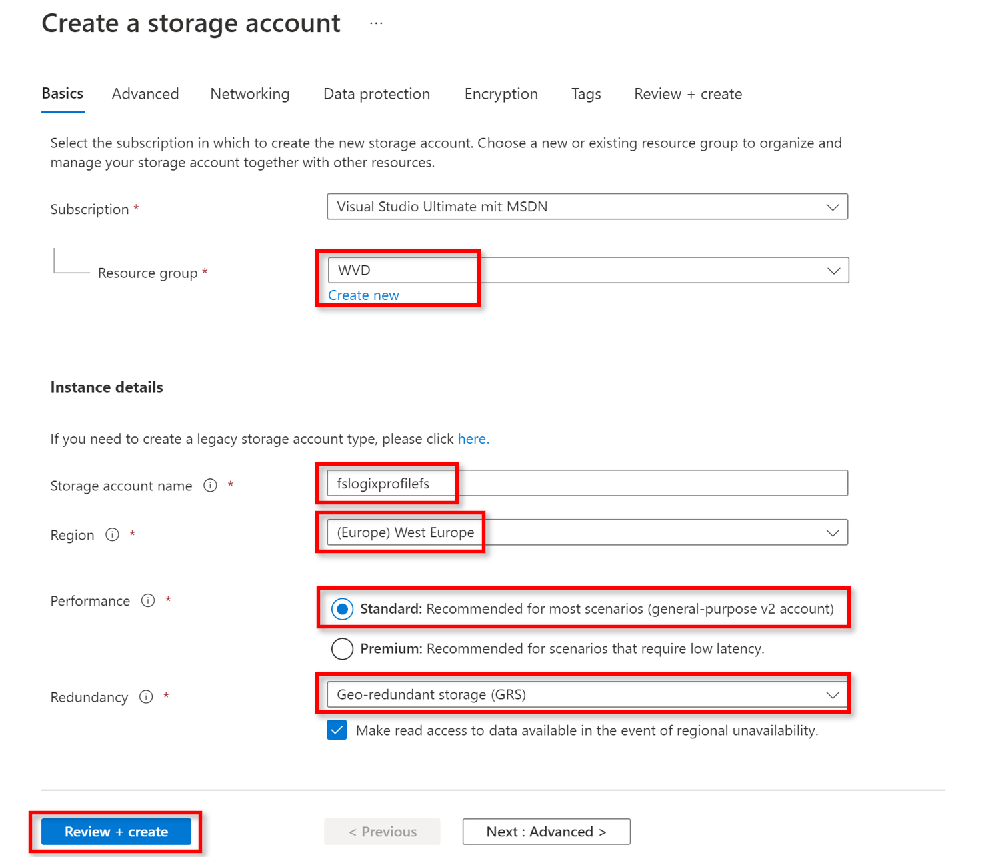

The storage account is created. Now navigate to the section **Data storage** and select **File shares**.
Click on **+ File share** on the top.

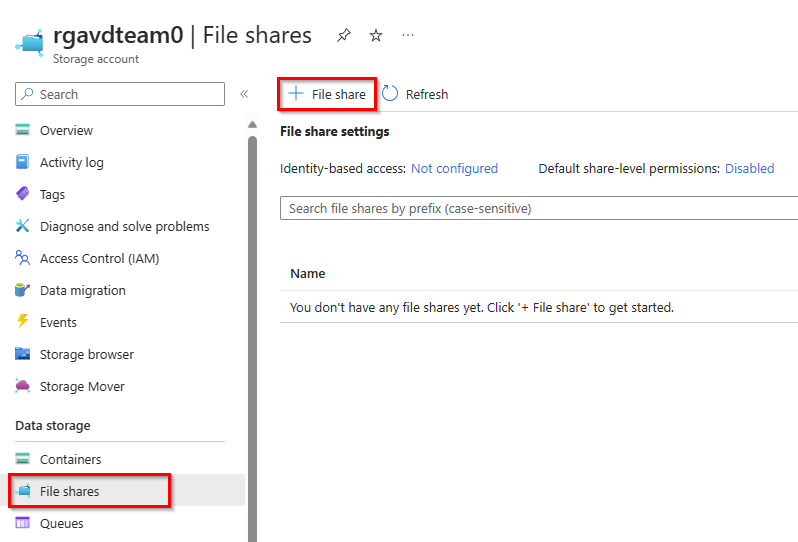

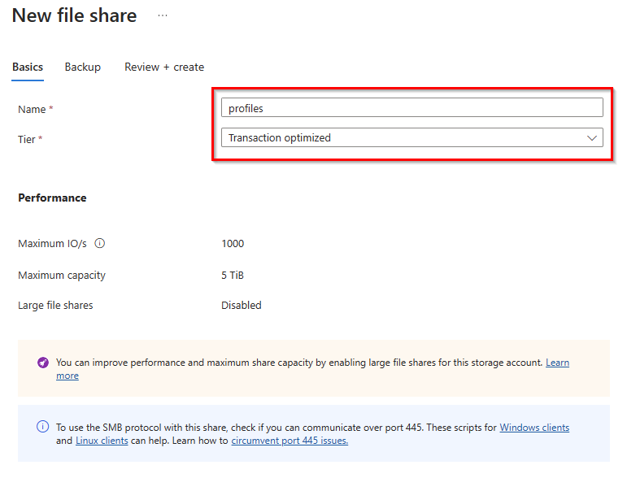

Create a file share 
- Name: **fslogixfs (or something similar)**
- Tier: **Transaction optimized**
- click **create**

> Note: To use SMB protocol with this share, you need to check if you can communicate over port 445. [Script for Windows Client](https://github.com/Azure-Samples/azure-files-samples/tree/master/AzFileDiagnostics/Windows)

When the file share is created, navigate to File shares in your Storage account. Beneath File share settings, click on **Active directory: Not configured**.
We need to enable Identity-based access for the file share in this storage account.

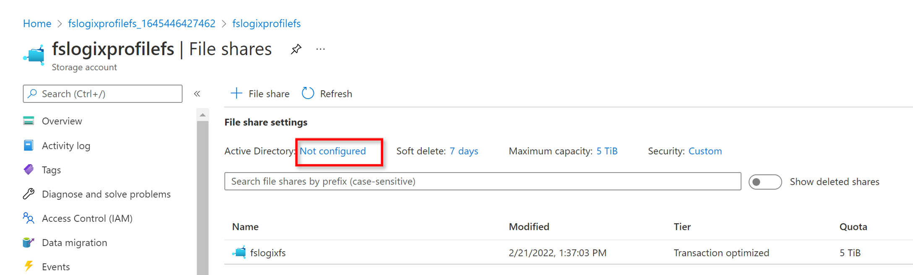

As we are using Azure Active Directory Kerberos in this Microhack, click on **Azure Active Directory Kerberos**.

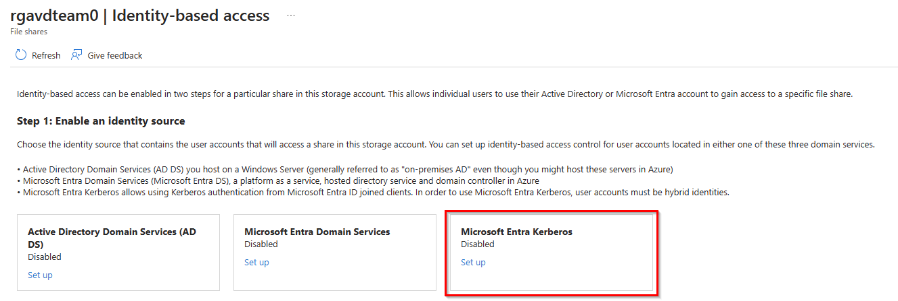

**Click on the check-box** to enable Azure Active Directory Kerberos for this file share. 
To configure directory and file level permissions through Windows File explorer, you also need to specify domain name and domain GUID for your on-premises AD. 
You can get this information from your domain admin or from an on-premises AD-joined client. If you prefer to configure using icacls, this step is not required. 

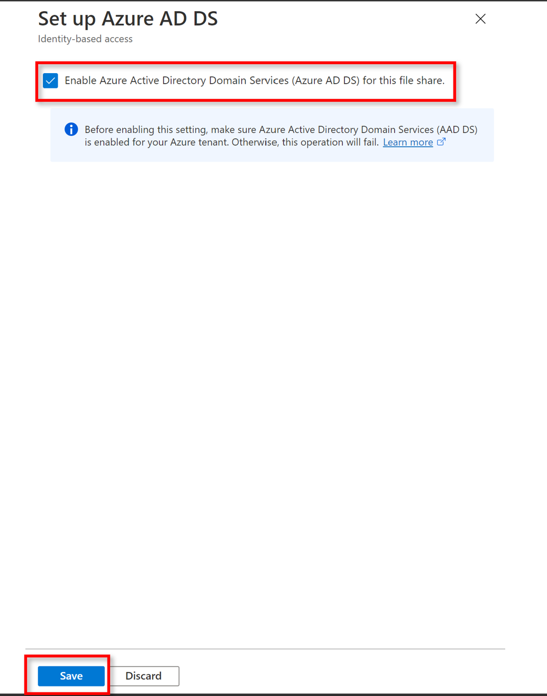

Now comes a very important step for which you need at least the **Cloud Application Administrator** role for your tenant. You could also ask a **Global Admin** within your organization to perform this one-time task to finish the Azure AD Kerberos setup.

Navigate to the **App Registrations** in the **Azure AD** management overview. Switch to **All Applications** and find an app registration which starts with **[Storage Account]Storageaccountname.file.core.windows.net**.

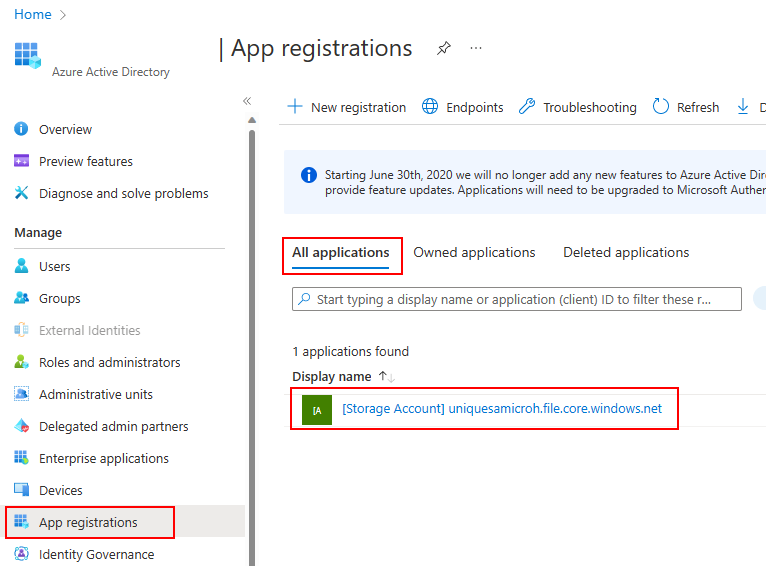

Click on **API permissions** an then on **Grant adminconsent for directoryname**. Verify that the status column changes to **Granted for directoyname**.

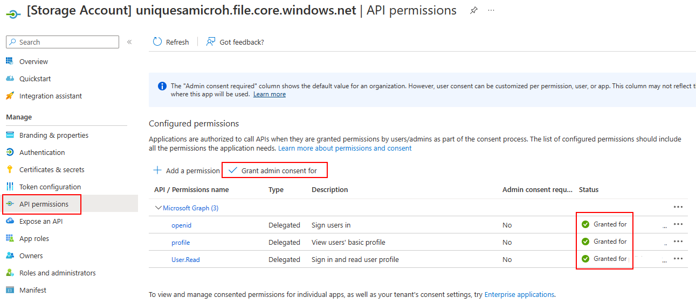

### Task 2: Assign access permissions to an identity

Other users will need access permissions to access your file share. To do this, you'll need to assign each user a role with the appropriate access permissions.

To assign users access permissions:

- From the Azure portal, **open the file share you created** in Set up an Azure Storage account
- Select **Access Control (IAM)**
- Select **Add a role assignment**

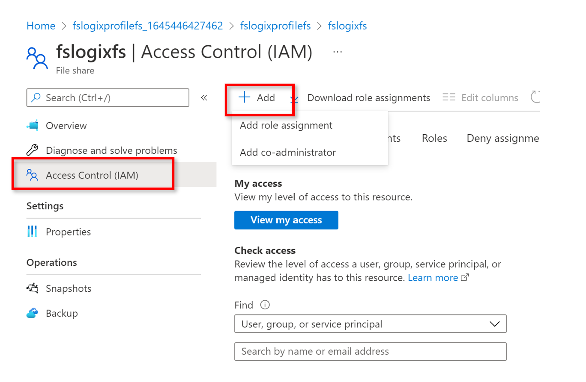

- In the Add role assignment tab, select the appropriate built-in role from the role list. 

  You'll need to at least **select Storage File Data SMB Share Contributor** for the account to get proper permissions.

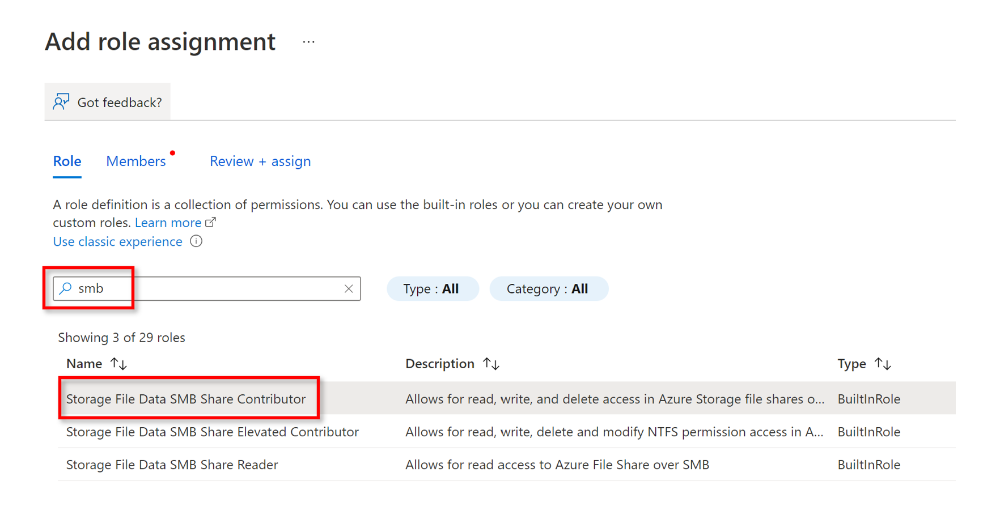

- For Assign access to, select **Azure Active Directory user, group, or service principal**.
- **Select a name or email address for the target Azure Active Directory identity**.
- Select **Save**.

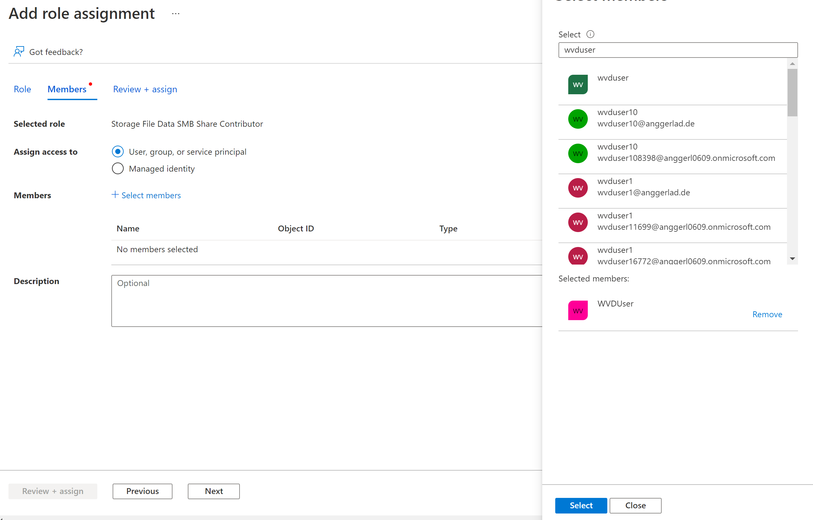

Click on **Review + assign**

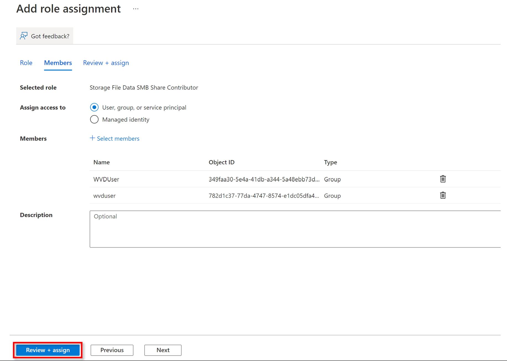

> 💡To setup FSLogix on the session Hosts, you need to upload the setupFSLogix.ps1 into a Container in your Storage Account
[Custom Script Extension Setup FSLogix](../modules/setupFSLogix.ps1)

- Navigate to **your Storage Account** 
- Select **Containers**
- Click on **+ Container**, choose a name for the Container (in our case, we selected cse for custom script extension)
- Public access level: **private**

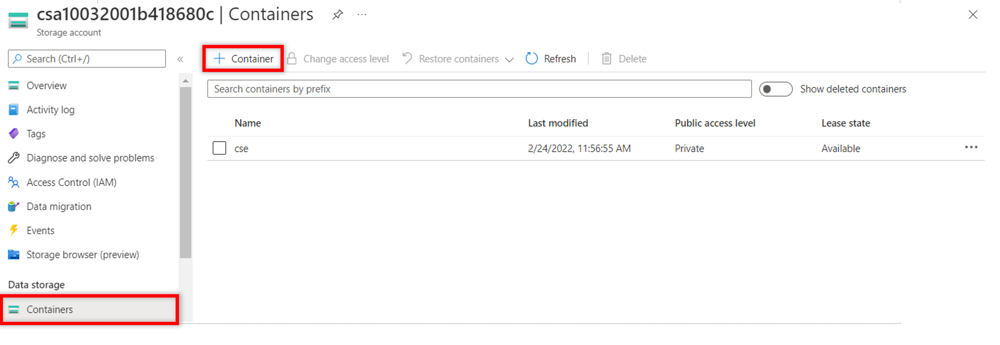

- **Select your recently created Container**
- **Upload the setupFSLogix.ps1** as shown in the screenshot above

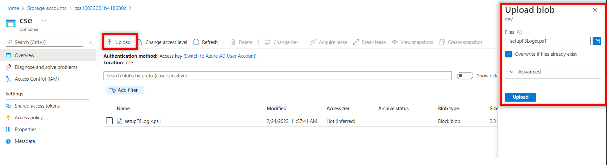

- Navigate to your Virtual machine (from your multi-session Hostpool)
- On the left side beneath **Settings**, select **Extensions + applications**
- Click on **Add**

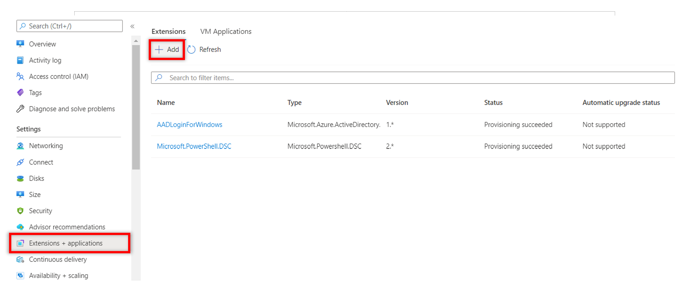

- Select **Custom Script Extension**

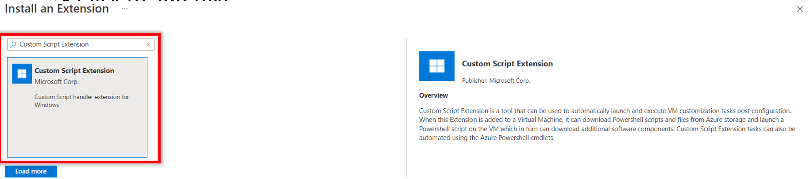

- **Script file** -> browse for the **setupFSLogix.ps1 Script**
- Arguments: type the UNC Path of your fileshare, e. g. \\uniquesamicroh.file.core.windows.net\fslogixfs
- Click on **Review + create**

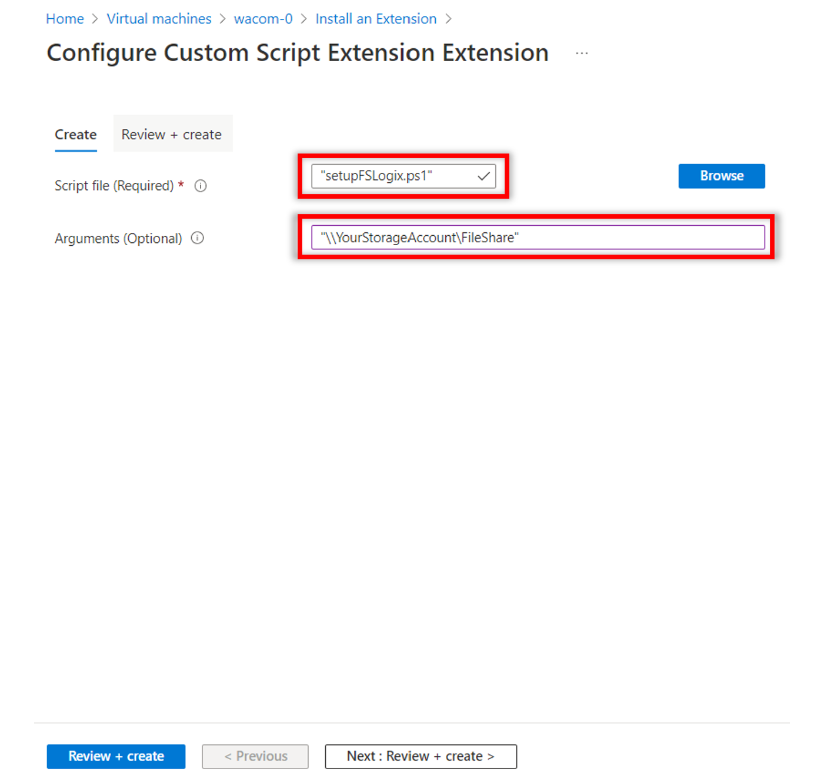

Now FSLogix will be set up using the Azure File share for user profiles. You should now be able to test with both user accounts, if the profile is created correctly on your fileshare.
