# Exercise 4: Create a host pool for multi-session desktops

Duration: 45 min

[Previous Challenge Solution](./03-start-VM-on-connect-solution.md) - **[Home](../Readme.md)** - [Next Challenge Solution](./05-Implement-FSLogix-Profile-Solution.md)

You will deploy a new pooled hostpool from the custom golden image from [Challenge 2](./02-Create-a-custom-golden-image.md) and deploy two session hosts from it. After that you will be able to logon to the host pool with multiple people from your organization. To test the RemoteApp capabilities in AVD you will also create a remote application group and assign it as well to users from your organization.

In a pooled configuration we will be hosting multiple non-persistent sessions, with no user profile information stored locally. This is where FSLogix Profile Containers provide the users profile to the host dynamically. This provides the ability for an organization to fully utilize the compute resources on a single host and lower the total overhead, cost, and number of remote workstations. Have a look at [Challenge 5](05-Implement-FSLogix-Profile-Solution.md) if you want to implement a persistent user-experience in a non-persistent pooled desktop scenario

**Additional Resources**
|              |            |  
|----------|:-------------|
| Description | Links |
| Create Azure Virtual Desktop Hostpool | https://learn.microsoft.com/en-us/azure/virtual-desktop/create-host-pools-azure-marketplace?tabs=azure-portal |
| Manage app groups for Azure Virtual Desktop portal |  https://learn.microsoft.com/en-us/azure/virtual-desktop/manage-app-groups   | 

## Task 1: Create a new Pooled Host Pool and Workspace

1.  Sign in to the [Azure Portal](https://portal.azure.com/).

2.  Search for **Azure Virtual Desktop** and select it from the list.

3.  Under Manage, select **Host pools** and select **+ Create**.
   
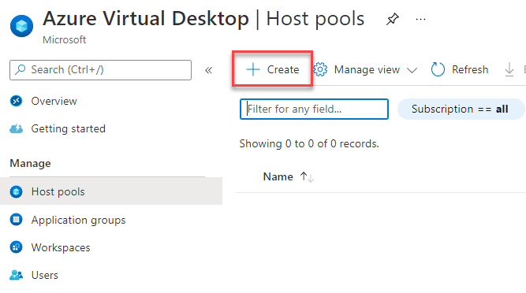

4.  On the Basics page, refer to the following screenshot to fill in the required fields. Select your Subscription, Resource Group and define a Hostpool name. As Location choose **West Europe**. 

> **Info:** This will only effect metadata. The Datacenter location for virtual machines will follow. 

Change **Validation environment** to **Yes**.
Once complete, select **Next: Virtual Machines**.

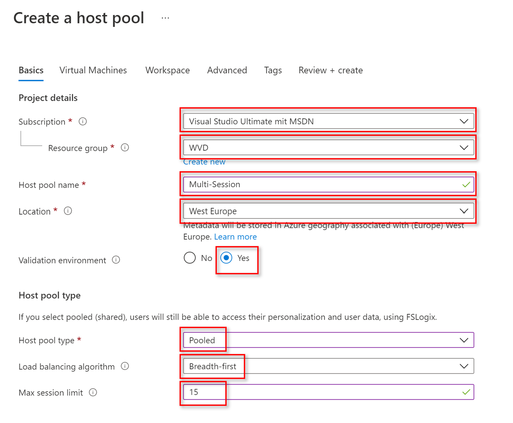

5. Navigate to **Virtual Machines** at the top and select **Show All Images** to find your recently created image. 

6. Next, go to **My Items** then select **Shared Images** and click on your recently created image.

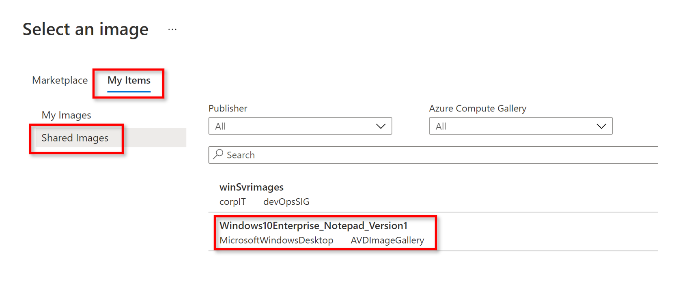

7. Now your recently created image should be displayed as an image parameter. Click **Next: Workspace**.

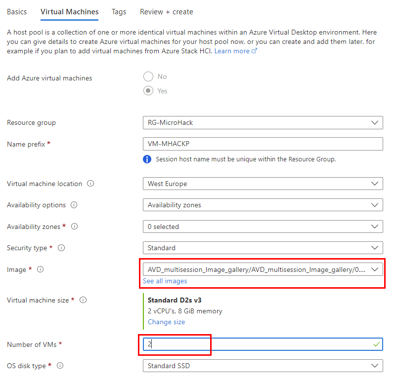
     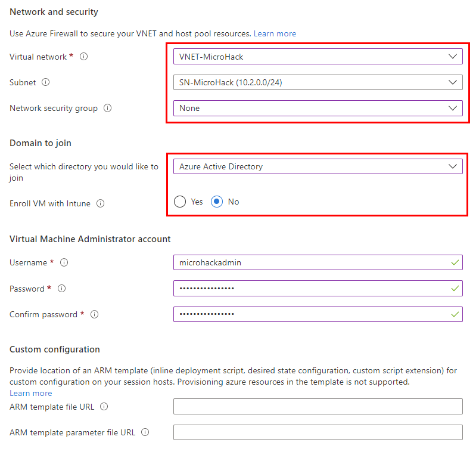
 
8.  On the Workspace page, select **Yes** to register a new desktop app group. Select **Create new** and provide a **Workspace name**. Select **OK** and **Review + create**.

   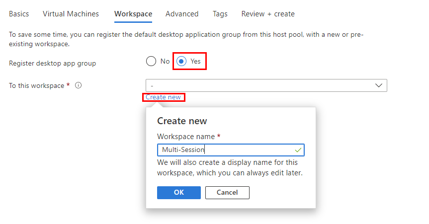

9.  On the Create a host pool page, select **Create**.

> **Note**: If you are trying to access your virtual desktop from Windows devices or other devices that are not connected to Azure AD, add **targetisaadjoined:i:1** as a custom RDP property to the host pool. [More information here](https://learn.microsoft.com/en-us/azure/virtual-desktop/deploy-azure-ad-joined-vm#access-azure-ad-joined-vms)

## Task2: Assign user access to host pool

After you've created your host pool, you must assign users access to the desktop application group. We recommend that you use user groups instead of individual users wherever possible. As you already assigned the Virtual Machine User Login or Virtual Machine Administrator Login permissions in Challenge 1 on the resource group level, this task is not necessary here anymore. If you didn´t do it yet, or if you use another resource group, go ahead and assign these roles to the users who should be able to login to the pooled desktops.

1. Assign your users or groups to the **HP-PooledVMs-DAG** desktop application group.

2. **optional** Assign your users the Virtual Machine User Login role so they can sign in to the VMs.

3. **optional** Assign administrators who need local administrative privileges the Virtual Machine Administrator Login role.
To grant users access to Azure AD-joined VMs, you must [configure role assignments for the VM](https://docs.microsoft.com/en-us/azure/active-directory/devices/howto-vm-sign-in-azure-ad-windows#configure-role-assignments-for-the-vm). 

## Task 3: Create Remote Apps

To make only a single application available to the user, instead of the full desktop, so that only the application is rendered on your host device from which you are currently working from, you need to create a remote application group. Follow the guidance:

1. Navigate to the Azure Virtual Desktop and select **Application Groups** and click **Create**.

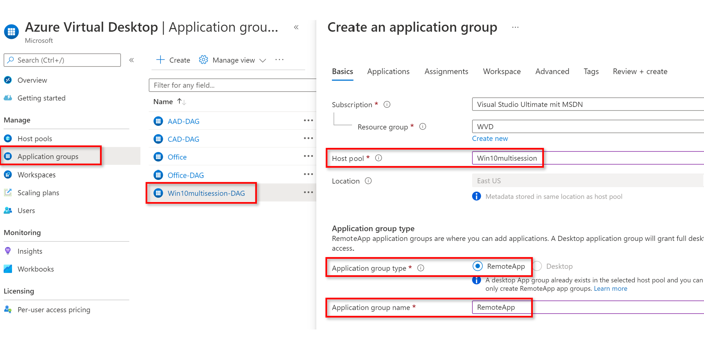

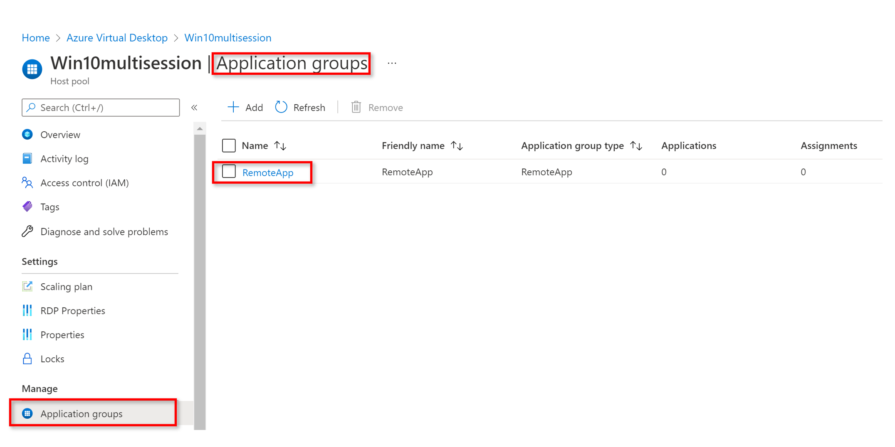

Create a new Application group
- **Select your Resource group**
- **Select your multi-session AVD Host pool**
- Application group type: **Remote App (RAIL)**
- Application group name: **HP-PooledVMs-RAG**
- click **Next: Applications**

2. Click on **Add applications**

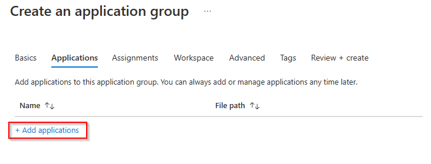

Select:
- Application source: **Start Menu**
- Application: **Visual Studio Code**

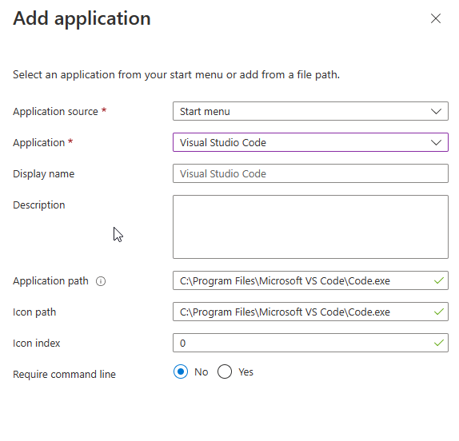

- Click on **Save** and add another application.

Select:
- Application source: **Filepath**

> **Note**: The reason why you can´t use the start menu as **Application Source** this time is because the "++" is interpreted by the AVD agent and the application is therefore not found. But if we use the **File path** option it works.

- Application path: **C:\Program Files\Notepad++\notepad++.exe**
- Application name: **NotepadPP** 
- Icon Path: **C:\Program Files\Notepad++\notepad++.exe**
- Icon Index: 0

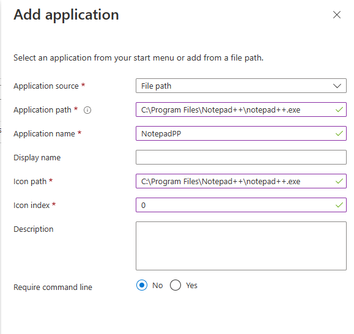

- Click on **Save** and **Next: Assignments**

3. Assign the AVDUsers group to the Application group which should have access to the Notepad++ RemoteApp.

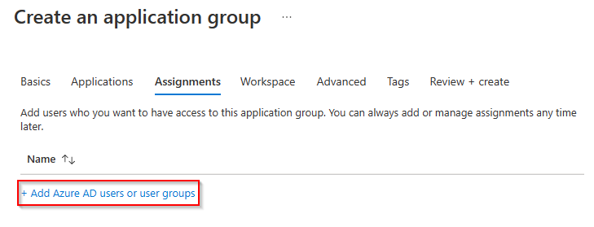

Click **Next: Workspace**

4. Toggle **Register Application Group** to yes and click **Review + create**.

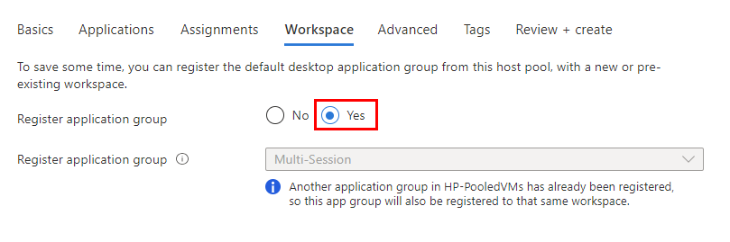

> If another application group in the AVD host pool has already been registered then this app group will also be registered to that same workspace.

Next, start your Remote Desktop Client App, refresh the AVD Workspace and launch the Notepad++ application.

> **Note**: If you are trying to access your virtual desktop from Windows devices or other devices that are not connected to Azure AD, add **targetisaadjoined:i:1** as a custom RDP property to the host pool. [More information here](https://learn.microsoft.com/en-us/azure/virtual-desktop/deploy-azure-ad-joined-vm#access-azure-ad-joined-vms)
