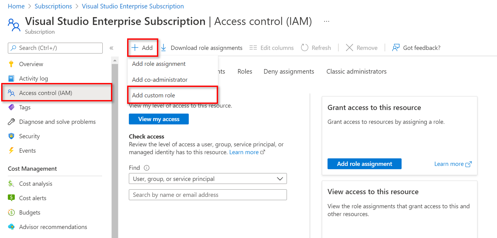
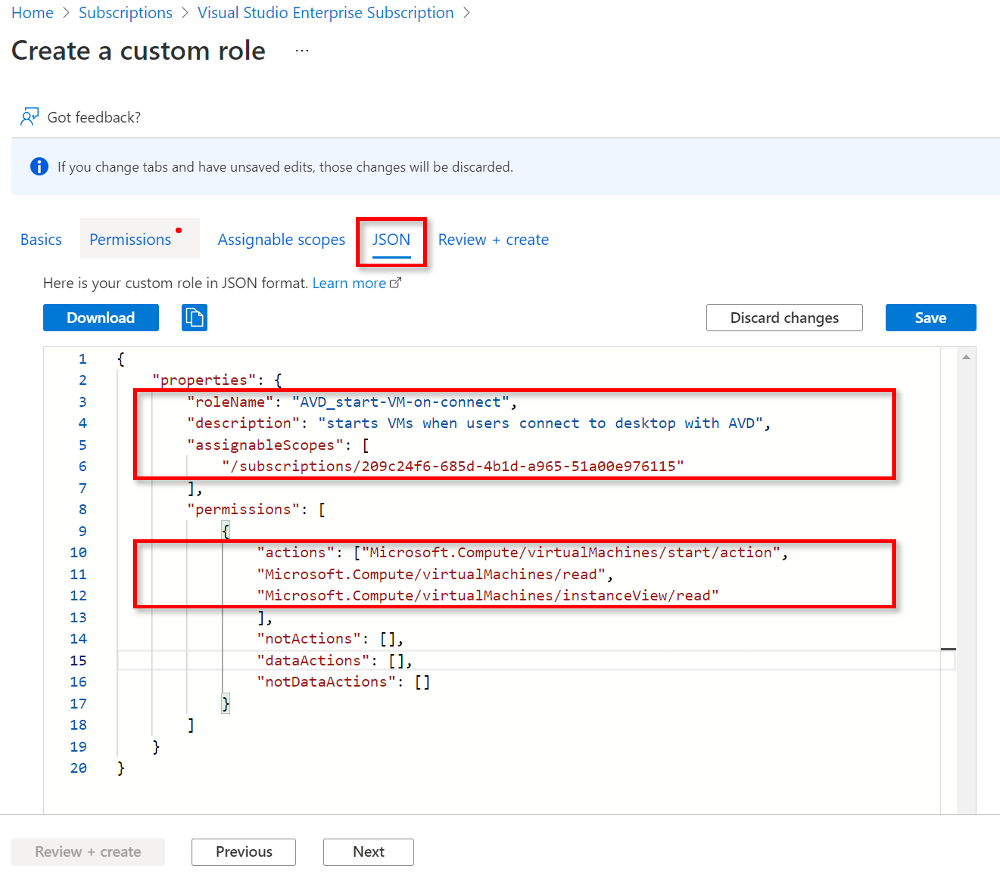
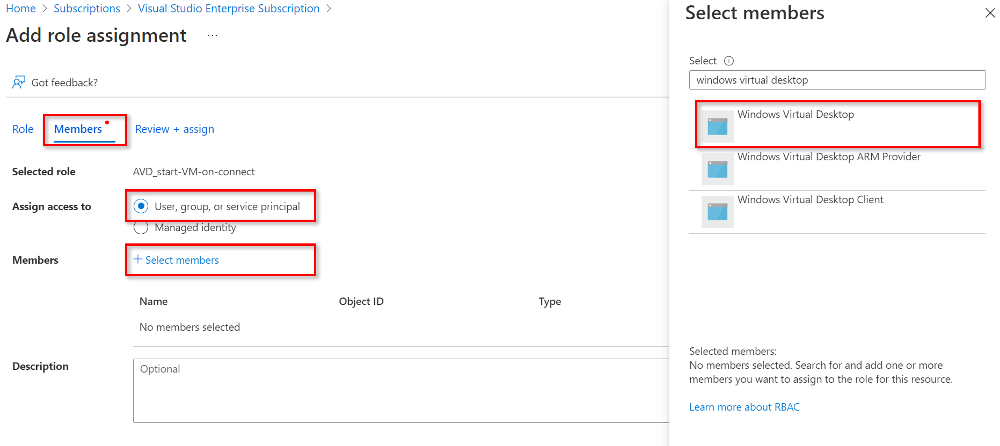

# Exercise 4: Implement Start VM on connect Feature

## Task1:

### Create custom role:

- Navigate to *access control (IAM)* in the Subscription where the VMs are located
- On the top left choose *Add* and then click on *Add custom role* 
- The window to create a custom role opens
- Give a name to the role like *AVD-Start VM on connect*
- Now you have two options to continue: either giving the permissions by choosing them manually or by entering them in the JSON format (see below for both options)

#### Option 1: Add permissions for custom role by choosing manually:

-	In this case you go to the *Permissions* tab in the window to create a custom role
-	Here you add the permissions that are required for the custom role, manually from a list. The required permissions are as follows: 
  - Microsoft.Compute/virtualMachines/start/action
  - Microsoft.Compute/virtualMachines/read
  - Microsoft.Compute/virtualMachines/instanceView/read
-	Save the choice and continue to assignable scopes to go sure the subscription where the VMs are located is chosen
-	Afterwards, continue to *Review and Create* to create the custom role

#### Option 2: Add permissions for custom role in JSON template:

-	With this option you can jump directly to the JSON tab of the custom role creation window and enter the subscription ID in the template for *assignable scopes* 
-	Afterwards, enter the following lines within the brackets behind *permissions* (compare Image below): 

´´´
"Microsoft.Compute/virtualMachines/start/action"
"Microsoft.Compute/virtualMachines/read"
"Microsoft.Compute/virtualMachines/instanceView/read"
´´´

-	Save the process and continue to *Review and Create* to create the custom role

### Assign custom role:

 
## Task2:

### Enable the start VM on connect feature: 

