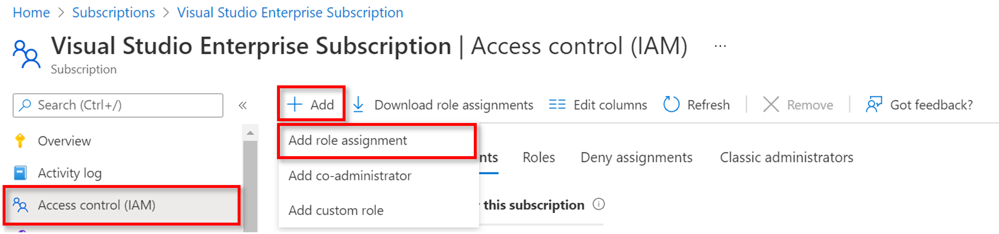
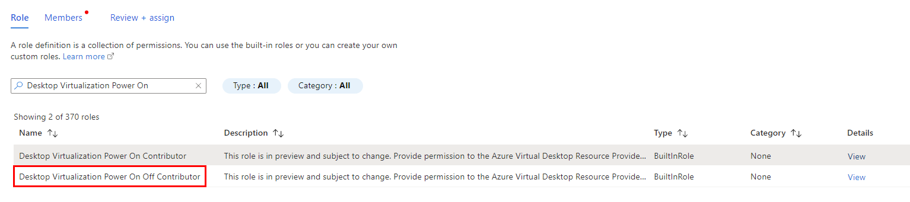
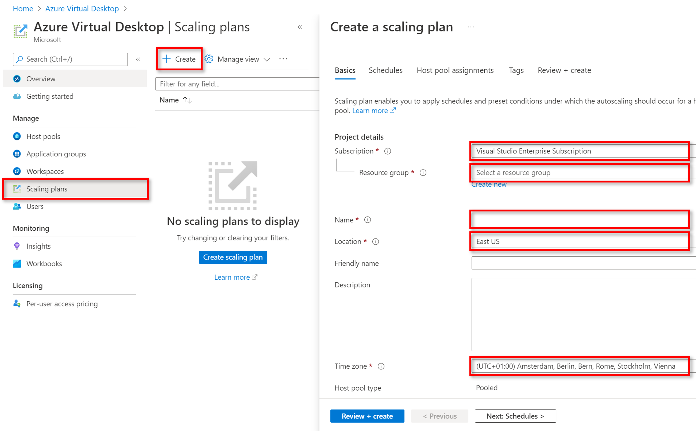
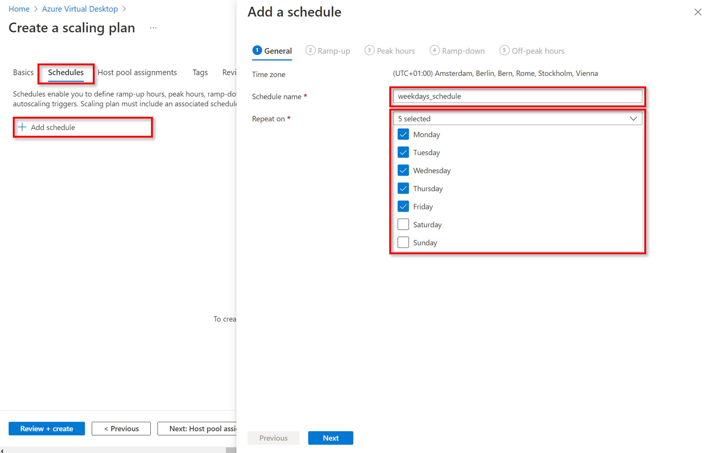
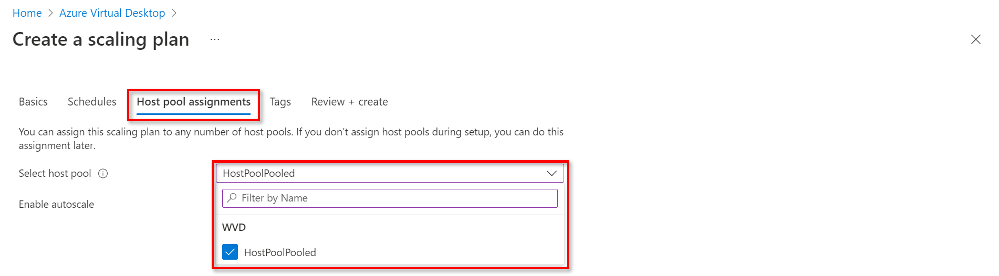

# Exercise 6: Set up a scaling plan

Duration:

[Previous Challenge Solution](./05-Implement-FSLogix-Profile-Solution.md) - **[Home](../Readme.md)** - [Next Challenge Solution](./07-RDP-properties-solution.md)

**Additional Resources**

  |              |            |  
|----------|:-------------:|
| Description | Links |
|Set up scaling plans for AVD  |  https://docs.microsoft.com/en-us/azure/virtual-desktop/autoscale-scaling-plan#create-a-scaling-plan   | 
| Grant a user access to Azure resources using the Azure portal | https://learn.microsoft.com/en-us/azure/role-based-access-control/quickstart-assign-role-user-portal |
  |              |            | 

## Task 1:

In this first part of the challenge  we have to assign an Azure builtin role **Desktop Virtualization Power On Off Contributor**, which enables Azure Virtual Desktop to turn on, shut down and manage VMs. This builtin role is required to make the scaling plan work, which is created in a second step of the challenge. 

### Assign custom role:

- Make sure you are still working in the subscription where you AVD virtual machines are stored.
- Navigate again to Access Control (IAM) on the left side menu and click on Add on the top left and then Add Role Assignment (compare image below)

- Under the Role tab select the role **Desktop Virtualization Power On Off Contributor**

- Navigate to the Members tab:
  - Here you select the first option **user, group or service principal** 
  - Click on **Select Members**, search for **Windows Virtual Desktop** and select the option
- Navigate to **Review and Assign** to create the role assignment (by doing so you give Azure Virtual Desktop the permission to turn on VMs) 

 
## Task 2:

In a second step we want to create the scaling plan and assign it to the multi session host-pool, which we created earlier.

### Create the scaling plan:

- Within the same subscription, which we used for the previous steps already, navigate to **Azure Virtual Desktop** (by entering it in the search bar)
- Select **Scaling plans** on the left side menu
- Click on **Create** on the top left of the scaling plan window
- The window to create a scaling plan opens as visible on the screenshot below
  - select the used subscription 
  - choose a Resource Group, ideally the one where the multi session host-pool is created 
  - give a name to the scaling plan
  - choose a location, ideally the one where the multi session host-pool is located 
  - select a time zone - 
  
> **Important note:** The time zone of the host-pool and the scaling plan have to be the same

- Afterwards, we can move to the **schedules** tab 
- Click on **add schedule** to create a new schedule, which defines the pattern to ramp down and up VMs in the host pool
- In the following, we will perform this step twice: first to create the schedule for weekdays and second to create the schedule for weekends

### Weekdays schedule:

Move through the five tabs on top of the schedule window to create the schedule: 
- **General:** give a name to the schedule and select the days from Monday to Friday from the drop down of Repeat on
- **Ramp-up:** starts at 8 AM, Load balancing algorithm = depth-first, Min. percentage of hosts = 50%, Capacity threshold = 75%
- **Peak hours:** starts at 9 AM, depth-first, capacity threshold (default) = 75%
- **Ramp-down:** starts at 5 PM, Min. capacity = 25%, Capacity threshold = 100%, Force logoff users = No, Stop VMs only when VMs have no active or disconnected sessions
- **Off-peak hours:** starts at 6 PM, Load balancing algorithm = depth-first, Capacity threshold (default) = 100%

 ### Weekend schedule:

Move through the five tabs on top of the schedule window to create the schedule: 
- **General:** give a name to the schedule and select the days Saturday and Sunday only from the drop down of Repeat on
- **Ramp-up:** starts at 8 AM, Load balancing algorithm = depth-first, Min. percentage of hosts = 25%, Capacity threshold = 100%
- **Peak hours:** starts at 9 AM, depth-first, capacity threshold (default) = 100%
- **Ramp-down:** starts at 5 PM, Min. capacity = 25%, Capacity threshold = 100%, Force logoff users = No, Stop VMs only when VMs have no active or disconnected sessions
- **Off-peak hours:** starts at 6 PM, Load balancing algorithm = depth-first, Capacity threshold (default) = 100%

### Assign the scaling plan to the host-pool: 

Now we created the schedules for the scaling plan. But we are not done yet. 

In the final step, we want to **assign the scaling plan so that the host-pool**, which it is getting assigned on, is automatically ramped up and down by following the schedules for weekdays and weekends, which we defined before.

- In the window to create a scaling plan go to the tab **Host pool assignments** 
- Here we select the multi session host-pool, which we created earlier
- Check that **Enable autoscale** is set to Yes
- Go to **Review and Create** to finally create and assign the scaling plan

