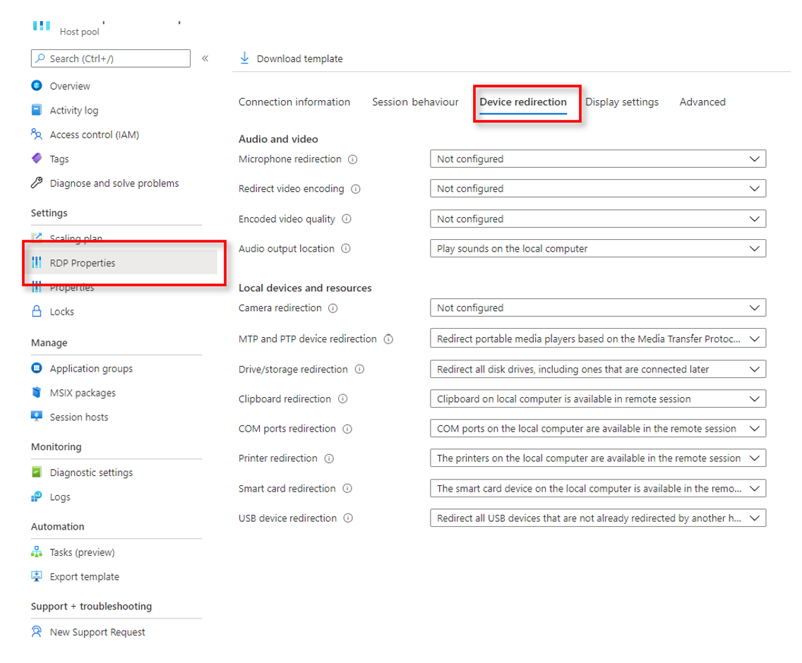
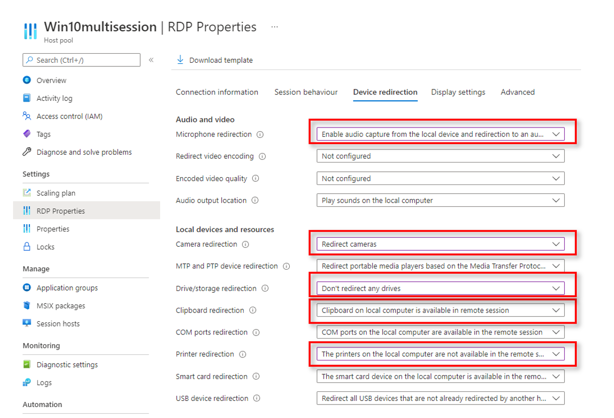
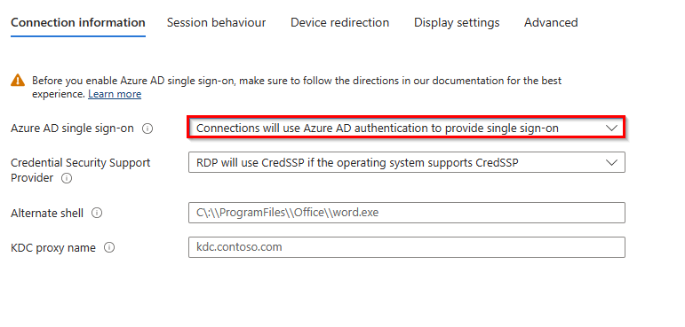
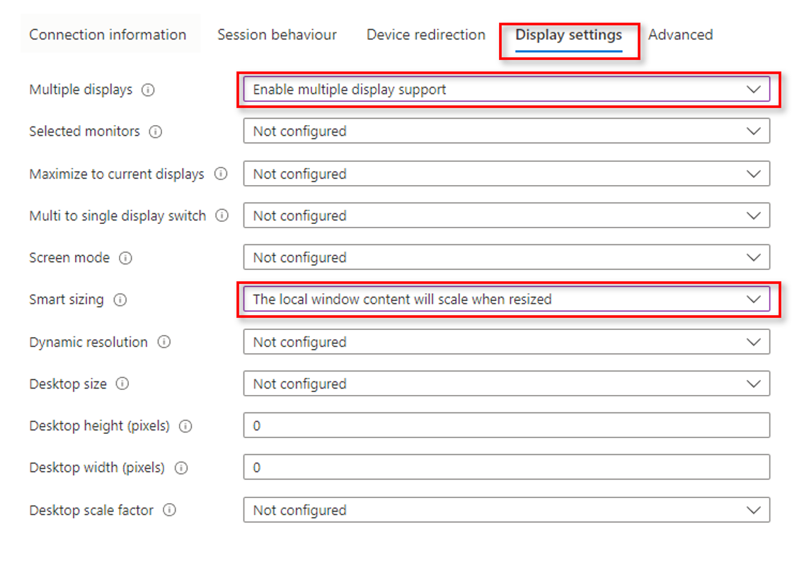
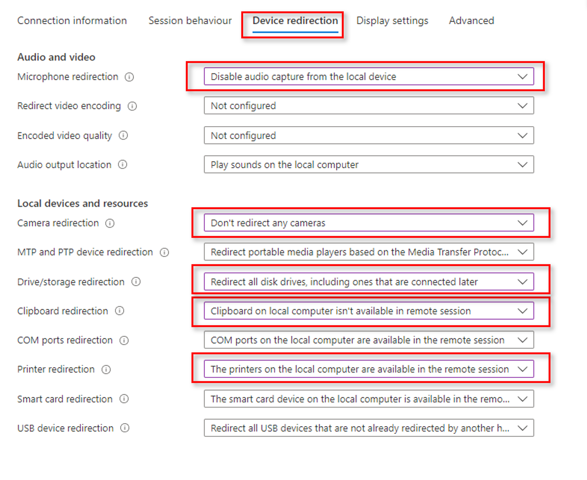

# Exercise 7: Customize RDP Properties

Duration: 15mins


[Previous Challenge Solution](./06-scaling-plan-solution.md) - **[Home](../Readme.md)** - [Next Challenge Solution](08-Configure-MFA.md)

In this challenge, you will configure optimal user experience by customizing RDP Properties.

Azure Virtual Desktop enables you to configure and customize Remote Desktop Protocol (RDP) properties for a host pool. 

Customizing a host pool's Remote Desktop Protocol (RDP) properties, such as multi-monitor experience and audio redirection, lets you deliver an optimal experience for your users based on their needs. 

If you'd like to change the default RDP file properties, you can customize RDP properties in Azure Virtual Desktop by either using the Azure portal or by using the -CustomRdpProperty parameter in the Update-AzWvdHostPool cmdlet.


**Additional Resources**

  |              |            |  
|----------|:-------------:|
| Description | Links |
| Customize RDP Properties | https://learn.microsoft.com/en-us/azure/virtual-desktop/customize-rdp-properties |
| Supported RDP Properties | https://learn.microsoft.com/en-us/windows-server/remote/remote-desktop-services/clients/rdp-files |
| Configure single sign-on for Azure Virtual Desktop using Azure AD Authentication | https://learn.microsoft.com/en-us/azure/virtual-desktop/configure-single-sign-on |
  |              |            | 

## Task 1- Personal AVD Host Pool
-	Deny Storage, networkdrive and printers redirection
-	Allow Camera, Microphone and Copy&Paste
- Configure single sign-on using Azure AD Authentication

In your Personal Hostpool, navigate to **RDP Properties**



 ### Configure the following settings:

- Microphone redirection: **Enable audio capture from the local device and redirection to an audio application in the remote session** 
- camera redirection: **Redirect cameras**
- Drive/storage redirection: **Don’t redirect any drives** 
- Clipboard redirection: **Clipboard on local computer are available in the remote session**
- Printer Redirection: **The printers on the local computer are not available in the remote session**



#### Connection information

- Azure AD single sign-on: **Connections will use Azure AD authentication to provide single sign-on** 


 
### Add or edit multiple custom RDP properties with Powershell
To add or edit multiple custom RDP properties, run the following PowerShell cmdlets by providing the custom RDP properties as a semicolon-separated string:

```
$properties="audiocapturemode:i:1; camerastoredirect:s:*; drivestoredirect:s:; redirectclipboard:i:1;redirectprinters:i:0;enablerdsaadauth:i:1"

Update-AzWvdHostPool -ResourceGroupName <resourcegroupname> -Name <hostpoolname> -CustomRdpProperty $properties
```
You can check to make sure the RDP property was added by running the following cmdlet:

```
Get-AzWvdHostPool -ResourceGroupName <resourcegroupname> -Name <hostpoolname> | format-list Name, CustomRdpProperty
```
**Task 1 has been completed** 

## Task 2 - Pooled AVD Host Pool (Remote Apps)

- Allow Multiple Displays
- Smart Sizing should be enabled
- Deny Camera, Microphone and Copy&Paste.
- Allow Storage and networkdrive and printer redirection.
- Configure single sign-on using Azure AD Authentication

 In your Remote App Host pool, navigate to **RDP Properties**


 
### Configure the following settings:

#### Session behaviour
- Multiple displays: **Enable multiple display support**
- Smart sizing: **The local window content will scale when resized**



#### Device redirection
- Microphone redirection: **Disable audio capture from the local device** 
- camera redirection: **Don't redirect any cameras**
- Drive/storage redirection: **Redirect all drives, including ones that are connected later** 
- Clipboard redirection: **Clipboard on local computer isn't available in the remote session**
- Printer Redirection: **The printers on the local computer are available in the remote session**



#### Connection information

- Azure AD single sign-on: **Connections will use Azure AD authentication to provide single sign-on** 


 
### Add or edit multiple custom RDP properties with Powershell
To add or edit multiple custom RDP properties, run the following PowerShell cmdlets by providing the custom RDP properties as a semicolon-separated string:

```
$properties="audiocapturemode:i:0; camerastoredirect:s:0; drivestoredirect:s:; redirectclipboard:i:1;redirectprinters:i:1;enablerdsaadauth:i:1"

Update-AzWvdHostPool -ResourceGroupName <resourcegroupname> -Name <hostpoolname> -CustomRdpProperty $properties
```

You can check to make sure the RDP property was added by running the following cmdlet:
```
Get-AzWvdHostPool -ResourceGroupName <resourcegroupname> -Name <hostpoolname> | format-list Name, CustomRdpProperty
```
**Task 2 has been completed** 