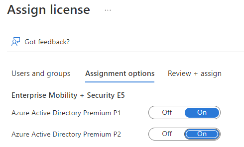
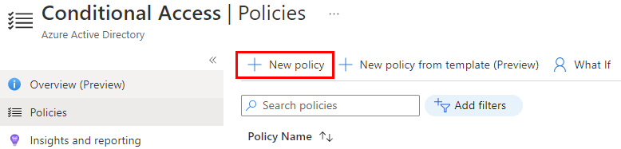
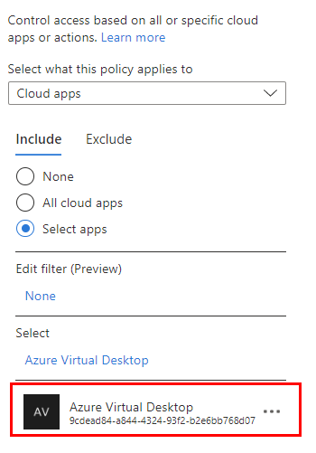
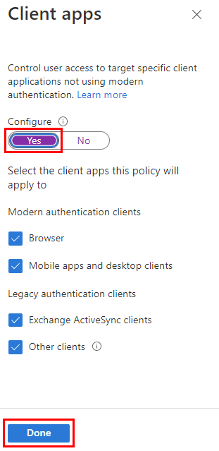
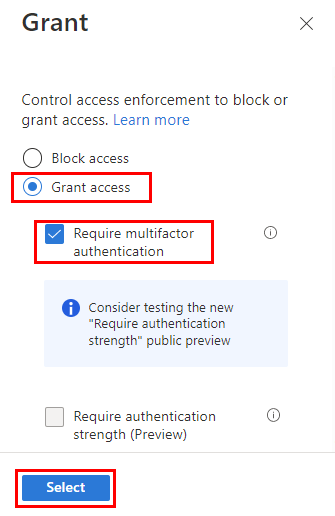

# Exercise 8: Configure MFA

Duration:

[Previous Challenge Solution](./07-RDP-properties-solution.md) - **[Home](../Readme.md)**

In this challenge, you will configure enable Azure multifactor authentication for Azure Virtual Desktop and configure MFA.

**Additional Resources**

  |              |            |  
|----------|:-------------:|
| Description | Links |
| Multi-Factor Authentication deployment | https://learn.microsoft.com/en-us/azure/active-directory/authentication/howto-mfa-getstarted |
| Create a Conditional Access policy | https://learn.microsoft.com/en-us/azure/virtual-desktop/set-up-mfa#create-a-conditional-access-policy |
  |              |            | 

## Task1:
Assign your users an Microsoft Entra ID P1 or P2 license that enables the MFA feature with Conditional Access.

Open your AAD tenant and select **Licenses**. If you do not have Enterprise Mobility + Security licenses available, you can activate the time-limited trial. 

Next, select **All Products** and your Enterprise Mobility + Security license, and then click **Assign**. Select the users or your AAD group to whom you want to assign this license, and then activate **Azure Active Directoy Premium P1 or P2**.

## Task2: 
In this task we will create an Conditional Access policy.

You need to be signed in as a **global administrator, security administrator, or conditional access administrator**.

In Microsoft Entra ID **create a group and add your AVD users** to that group.

Now browse to Security within the Microsoft Entra ID and then to **Security > Conditional Access** within the Azure Portal and create a **new policy**.

**Assign the policy to the group** you created before and click **Done**.

Under **cloud apps or actions** choose **include** and then select **apps**. 
Choose the following app: **Azure Virtual Desktop (App ID 9cdead84-a844-4324-93f2-b2e6bb768d07)**

Go to Conditions and then to the configure section in **client apps** and choose **yes** where you want to apply the policy (browser and/or mobile apps and desktop clients).

Under Access controls select **Grant access**, **Require multi-factor authentication**, and then **Select**.

Under Access controls go to sessions and select **Sign-in frequency**, set the value to the time you want between prompts (For example, setting the value to 1 and the unit to Hours, will require multifactor authentication if a connection is launched an hour after the last one).

Confirm your settings and turn on **enable policy** before clicking on create.
