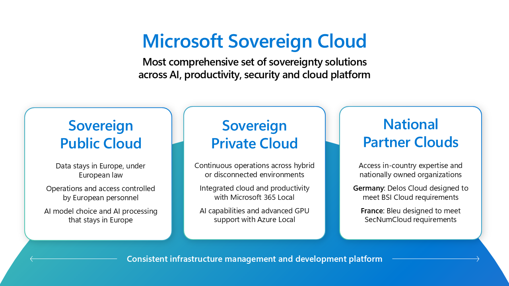

# **MicroHack Microsoft Sovereign Cloud**

- [**MicroHack introduction**](#MicroHack-introduction)
- [**MicroHack context**](#microhack-context)
- [**Objectives**](#objectives)
- [**MicroHack Challenges**](#microhack-challenges)
- [**Contributors**](#contributors)

# MicroHack introduction

This Microsoft Sovereign Cloud MicroHack introduces engineers and architects to the core concepts, technical controls, and hands-on deployment models of Microsoft Sovereign Cloud offerings — across both Microsoft Sovereign Public Cloud and Microsoft Sovereign Private Cloud environments.

Participants will explore how to design and operate cloud workloads that meet sovereignty, regulatory, and compliance requirements, leveraging Azure native capabilities such as Policy, RBAC, encryption, confidential compute, and hybrid enablement through Azure Arc and Azure Local.

## MicroHack context

This MicroHack scenario walks through the use of Microsoft Sovereign Cloud technologies with a focus on the best practices and the design principles and some interesting challenges for real world scenarios. Specifically, this builds up to include working with different solutions around the Microsoft Sovereign Public Cloud and the Microsoft Sovereign Private Cloud,

- [Microsoft Sovereign Cloud](https://www.microsoft.com/ai/sovereign-cloud?msockid=35d465bce58561e42620737ce487605e)
- [Microsoft Sovereign Cloud documentation](https://learn.microsoft.com/industry/sovereign-cloud/)
- [What is Sovereign Public Cloud?](https://learn.microsoft.com/industry/sovereign-cloud/sovereign-public-cloud/overview-sovereign-public-cloud)
- [Sovereign Private CLoud](https://learn.microsoft.com/industry/sovereign-cloud/sovereign-private-cloud/overview-sovereign-private-cloud)
- [Digital sovereignty](https://learn.microsoft.com/industry/sovereign-cloud/overview/digital-sovereignty)
- [Sovereign Landing Zone (SLZ)](https://learn.microsoft.com/industry/sovereign-cloud/sovereign-public-cloud/sovereign-landing-zone/overview-slz?tabs=hubspoke)
- [Azure Policy](https://learn.microsoft.com/azure/governance/policy/overview)
- [Azure encryption overview](https://learn.microsoft.com/azure/security/fundamentals/encryption-overview)
- [Azure Confidential Computing Overview](https://learn.microsoft.com/azure/confidential-computing/overview)
- [Azure Local](https://learn.microsoft.com/azure/azure-local/)
- [Azure Arc](https://learn.microsoft.com/azure/azure-arc/)

## Objectives

After completing this MicroHack you will:

- Enforce sovereign cloud controls in Azure using native platform capabilities (Policy, RBAC, region restrictions).
- Protect data through encryption at rest, in transit, and in use (CMK, TLS, ACC).
- Operate a sovereign hybrid cloud environment by connecting local infrastructure using Azure Arc and Azure Local.

## MicroHack challenges

| Challenge | Topic    | Maker     | Status    |
|:---------:|----------|-----------|-----------|
| 1         | [Using Azure native platform controls (e.g. Policy, RBAC etc) to enforce sovereign controls in the public cloud](walkthrough/challenge-01/solution-01.md)  | Jan Egil Ring | ✅ |
| 2         | [Encryption at rest with Customer Managed Keys in Azure Key Vault](walkthrough/challenge-02/solution-02.md) | Ye Zhang | ✅ |
| 3         | [Encryption in transit - enforcing TLS](walkthrough/challenge-03/solution-03.md) | Ye Zhang | ✅ |
| 4         | [Encryption in use with Azure Confidential Compute - VM](walkthrough/challenge-04/solution-04.md) | Murali Rao Yelamanchili | ✅ |
| 5         | [Encryption in use with Azure Confidential Compute - Containers/Applications](walkthrough/challenge-05/solution-05.md) | Murali Rao Yelamanchili | ✅ |
| 6         | [Operating Sovereign in a hybrid environment with Azure Local and Azure Arc](walkthrough/challenge-06/solution-06.md) | Jan Egil Ring / Thomas Maurer | ✅ |

### General prerequisites

This MicroHack has a few but important prerequisites

In order to use the MicroHack time most effectively, the following tasks should be completed prior to starting the session.

> [!NOTE]
> Prerequisites 1 - 3 are handled by the organizers for events hosted by Microsoft.

1. Your own Azure subscription with Owner RBAC rights at the subscription level
2. Contributor or Owner permissions on your subscription or resource group
3. Optional: Access to Azure Arc Jumpstart ArcBox & LocalBox for hybrid challenges
4. [Azure CLI](https://learn.microsoft.com/cli/azure/install-azure-cli). **Hint:** Make sure to use the latest version available.

## Contributors

- Thomas Maurer [GitHub](https://github.com/thomasmaurer); [LinkedIn](https://www.linkedin.com/in/thomasmaurer2/)
- Jan Egil Ring [GitHub](https://github.com/janegilring); [LinkedIn](https://www.linkedin.com/in/janegilring/)
- Murali Rao Yelamanchili [GitHub](https://github.com/yelamanchili-murali); [LinkedIn](https://www.linkedin.com/in/muraliyelamanchili/)
- Ye Zhang [GitHub](https://github.com/zhangyems); [LinkedIn](https://www.linkedin.com/in/ye-zhang-497b96a7/)
