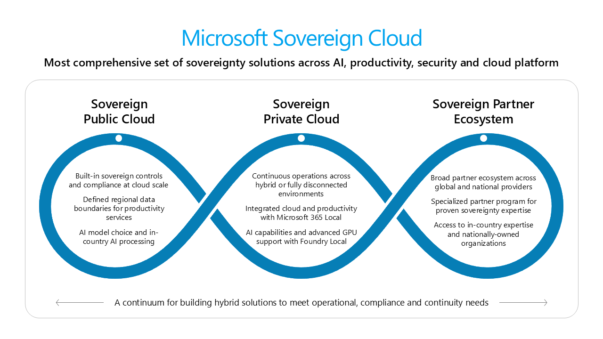

# **MicroHack Microsoft Sovereign Cloud**

- [**MicroHack introduction**](#MicroHack-introduction)
- [**MicroHack context**](#microhack-context)
- [**Objectives**](#objectives)
- [**MicroHack Challenges**](#microhack-challenges)
- [**Contributors**](#contributors)

# MicroHack introduction

This Microsoft Sovereign Cloud MicroHack introduces engineers and architects to the core concepts, technical controls, and hands-on deployment models of Microsoft Sovereign Cloud offerings — across both Microsoft Sovereign Public Cloud and Microsoft Sovereign Private Cloud environments.

Participants will explore how to design and operate cloud workloads that meet sovereignty, regulatory, and compliance requirements, leveraging Azure native capabilities such as Policy, RBAC, encryption, confidential compute, and hybrid enablement through Azure Arc and Azure Local.

## MicroHack context

This MicroHack scenario walks through the use of Microsoft Sovereign Cloud technologies with a focus on the best practices and the design principles and some interesting challenges for real world scenarios. Specifically, this builds up to include working with different solutions around the Microsoft Sovereign Public Cloud and the Microsoft Sovereign Private Cloud,

- [Microsoft Sovereign Cloud](https://www.microsoft.com/ai/sovereign-cloud?msockid=35d465bce58561e42620737ce487605e)
- [Microsoft Sovereign Cloud documentation](https://learn.microsoft.com/industry/sovereign-cloud/)
- [What is Sovereign Public Cloud?](https://learn.microsoft.com/industry/sovereign-cloud/sovereign-public-cloud/overview-sovereign-public-cloud)
- [Sovereign Private Cloud](https://learn.microsoft.com/industry/sovereign-cloud/sovereign-private-cloud/overview-sovereign-private-cloud)
- [Digital sovereignty](https://learn.microsoft.com/industry/sovereign-cloud/overview/digital-sovereignty)
- [Sovereign Landing Zone (SLZ)](https://learn.microsoft.com/industry/sovereign-cloud/sovereign-public-cloud/sovereign-landing-zone/overview-slz?tabs=hubspoke)
- [Azure Policy](https://learn.microsoft.com/azure/governance/policy/overview)
- [Azure encryption overview](https://learn.microsoft.com/azure/security/fundamentals/encryption-overview)
- [Azure Confidential Computing Overview](https://learn.microsoft.com/azure/confidential-computing/overview)
- [Azure Local](https://learn.microsoft.com/azure/azure-local/)
- [Azure Arc](https://learn.microsoft.com/azure/azure-arc/)

## Objectives

After completing this MicroHack you will:

- Enforce sovereign cloud controls in Azure using native platform capabilities (Policy, RBAC, region restrictions).
- Protect data through encryption at rest, in transit, and in use (CMK, TLS, ACC).
- Operate a sovereign hybrid cloud environment by connecting local infrastructure using Azure Arc and Azure Local.
- Deploy one adaptive application model across Azure-managed and self-managed Kubernetes environments using federated Radius control planes.

## MicroHack challenges

| Challenge | Topic    | Challenge | Solution | Duration  | Maker     |
|:---------:|----------|-----------|----------|-----------|-----------|
| 1         | Using Azure native platform controls (e.g. Policy, RBAC etc) to enforce sovereign controls in the public cloud | [Challenge](./challenges/challenge-01.md) | [Solution](./walkthrough/challenge-01/solution-01.md) | 45 min | Jan Egil Ring |
| 2         | Encryption at rest with Customer Managed Keys in Azure Key Vault | [Challenge](./challenges/challenge-02.md) | [Solution](./walkthrough/challenge-02/solution-02.md) | 30 min | Ye Zhang |
| 3         | Encryption in transit - enforcing TLS | [Challenge](./challenges/challenge-03.md) | [Solution](./walkthrough/challenge-03/solution-03.md) | 30 min | Ye Zhang |
| 4         | Encryption in use with Azure Confidential Compute - VM | [Challenge](./challenges/challenge-04.md) | [Solution](./walkthrough/challenge-04/solution-04.md) | 90-120 min | Murali Rao Yelamanchili |
| 5         | Encryption in use with Confidential VMs/Node Pools in Azure Kubernetes Service (AKS) | [Challenge](./challenges/challenge-05.md) | [Solution](./walkthrough/challenge-05/solution-05.md) | 90-120 min | Murali Rao Yelamanchili |
| 6         | Operating Sovereign in a hybrid environment with Azure Local and Azure Arc | [Challenge](./challenges/challenge-06.md) | [Solution](./walkthrough/challenge-06/solution-06.md) | 60-90 min | Jan Egil Ring / Thomas Maurer |
| 7         | Adaptive Apps across sovereign Azure and private-cloud environments with Radius | [Challenge](./challenges/challenge-07.md) | [Solution](./walkthrough/challenge-07/solution-07.md) | 60 min | Dylan de Jong / Jan Egil Ring / Wesley Backelant |

### General prerequisites

This MicroHack has a few but important prerequisites

In order to use the MicroHack time most effectively, the following tasks should be completed prior to starting the session.

> [!NOTE]
> Prerequisites 1 - 3 are handled by the organizers for events hosted by Microsoft.

1. Your own Azure subscription with Owner RBAC rights at the subscription level
2. Contributor or Owner permissions on your subscription or resource group
3. Optional: Access to Azure Arc Jumpstart ArcBox & LocalBox for hybrid challenges
4. [Azure CLI](https://learn.microsoft.com/cli/azure/install-azure-cli). **Hint:** Make sure to use the latest version available.
5. Challenge 7: `kubectl`, `jq`, OpenSSL, the [Radius CLI](https://docs.radapp.io/getting-started/install/), and the Azure CLI `bastion` extension

### Cost estimates

The main cost driver for this MicroHack is virtual machines:

- **ArcBox for ITPro** cost is approximately 7 USD per day. We recommend setting it up the week before the event, so for example 5 days before the event would result in a cost between 30-40 USD.
- **LocalBox** cost is approximately 100-110 USD per day. We recommend setting it up the week before the event, so for example 5 days before the event would result in a cost between 5-600 USD.
- **Challenges 4, 5, and 7** share one pre-provisioned participant platform: a two-node AKS system pool, one Confidential VM AKS node, one standalone Confidential VM, one K3s VM, Azure Bastion Standard, and a NAT Gateway. Budget approximately 45-55 USD per participant per day, depending on region and data transfer. The platform starts during lab deployment so participants can focus on validation rather than waiting for capacity-sensitive resources.
- Plan subscription quotas for at least 12 general-purpose vCPUs and 4 DCasv5-family confidential vCPUs per participant. The default automation places no more than two participants in each subscription; validate regional quota before increasing that value.

For a 50-participant event, the shared participant platforms cost approximately 2,250-2,750 USD per day while deployed, in addition to the optional ArcBox and LocalBox environments.
There will also be smaller costs for services such as Key Vault, storage, and monitoring.
An Azure Pricing Calculator estimate is available [here](https://azure.com/e/1a7aec76a3e049cba57cda6742025373).
This estimate can be adjusted for fewer/more students, running the VMs shorter/longer and adding additional services if desired.

If you plan to run this MicroHack in your own subscription on a limited budget, skip the optional Challenge 6 environments and remove the participant resource group immediately after finishing the event.

## Contributors

- Thomas Maurer [GitHub](https://github.com/thomasmaurer); [LinkedIn](https://www.linkedin.com/in/thomasmaurer2/)
- Jan Egil Ring [GitHub](https://github.com/janegilring); [LinkedIn](https://www.linkedin.com/in/janegilring/)
- Murali Rao Yelamanchili [GitHub](https://github.com/yelamanchili-murali); [LinkedIn](https://www.linkedin.com/in/muraliyelamanchili/)
- Ye Zhang [GitHub](https://github.com/zhangyems); [LinkedIn](https://www.linkedin.com/in/ye-zhang-497b96a7/)
