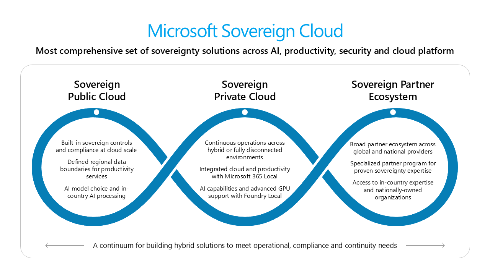
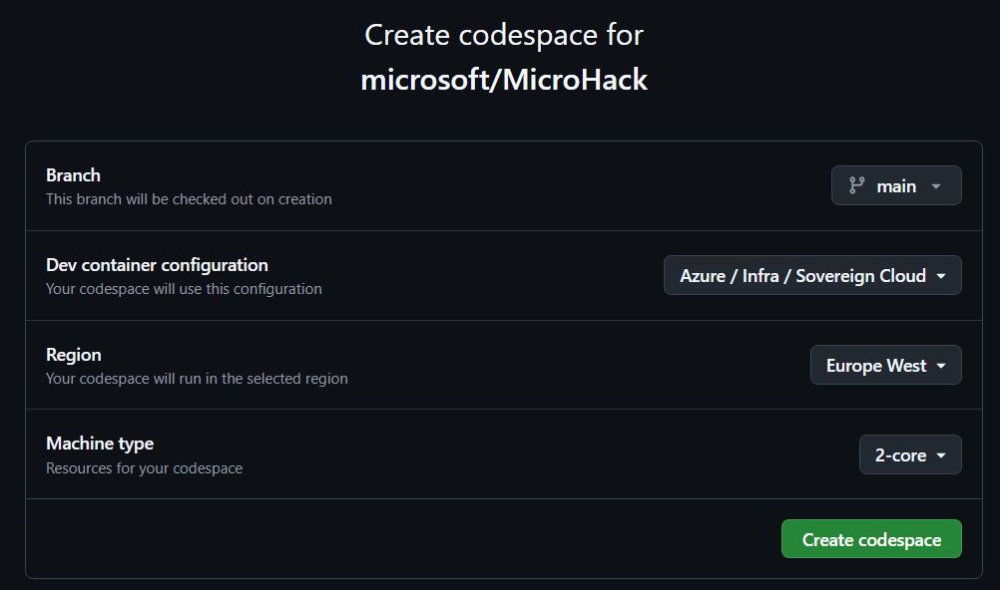

# **Microsoft Sovereign Cloud Hackathon**

- [**Hackathon introduction**](#hackathon-introduction)
- [**Hackathon context**](#hackathon-context)
- [**Objectives**](#objectives)
- [**Recommended environment: GitHub Codespaces**](#recommended-environment-github-codespaces)
- [**Hackathon Challenges**](#hackathon-challenges)
- [**Contributors**](#contributors)

# Hackathon introduction

This Microsoft Sovereign Cloud Hackathon introduces engineers and architects to the core concepts, technical controls, and hands-on deployment models of Microsoft Sovereign Cloud offerings — across both Microsoft Sovereign Public Cloud and Microsoft Sovereign Private Cloud environments.



Participants will explore how to design and operate cloud workloads that meet sovereignty, regulatory, and compliance requirements, leveraging Azure native capabilities such as Policy, RBAC, encryption, confidential compute, and hybrid enablement through Azure Arc and Azure Local.

## Hackathon context

This Hackathon scenario walks through the use of Microsoft Sovereign Cloud technologies with a focus on the best practices and the design principles and some interesting challenges for real world scenarios. Specifically, this builds up to include working with different solutions around the Microsoft Sovereign Public Cloud and the Microsoft Sovereign Private Cloud,

- [Microsoft Sovereign Cloud](https://www.microsoft.com/ai/sovereign-cloud?msockid=35d465bce58561e42620737ce487605e)
- [Cloud Adoption Framework - Digital sovereignty adoption](https://learn.microsoft.com/en-us/azure/cloud-adoption-framework/sovereignty/executive-strategy?tabs=overview)
- [Microsoft Sovereign Cloud documentation](https://learn.microsoft.com/industry/sovereign-cloud/)
- [What is Sovereign Public Cloud?](https://learn.microsoft.com/azure/azure-sovereign-clouds/public/overview-sovereign-public-cloud)
- [Sovereign Private Cloud](https://learn.microsoft.com/industry/sovereign-cloud/sovereign-private-cloud/overview-sovereign-private-cloud)
- [Digital sovereignty](https://learn.microsoft.com/industry/sovereign-cloud/overview/digital-sovereignty)
- [Sovereign Landing Zone (SLZ)](https://learn.microsoft.com/industry/sovereign-cloud/sovereign-public-cloud/sovereign-landing-zone/overview-slz?tabs=hubspoke)
- [Azure Policy](https://learn.microsoft.com/azure/governance/policy/overview)
- [Azure encryption overview](https://learn.microsoft.com/azure/security/fundamentals/encryption-overview)
- [Azure Confidential Computing Overview](https://learn.microsoft.com/azure/confidential-computing/overview)
- [Azure Local](https://learn.microsoft.com/azure/azure-local/)
- [Azure Arc](https://learn.microsoft.com/azure/azure-arc/)
- [Designing for cloud sovereignty with Radius and Dapr](https://techcommunity.microsoft.com/blog/linuxandopensourceblog/designing-for-cloud-sovereignty-with-radius-and-dapr/4535067)

## Objectives

After completing this Hackathon you will:

- Enforce sovereign cloud controls in Azure using native platform capabilities (Policy, RBAC, region restrictions).
- Protect data through encryption at rest, in transit, and in use (CMK, TLS, ACC).
- Operate a sovereign hybrid cloud environment by connecting local infrastructure using Azure Arc and Azure Local.
- Deploy one adaptive application model across Azure-managed and self-managed Kubernetes environments using federated Radius control planes.

## Recommended environment: GitHub Codespaces

Use **GitHub Codespaces with the Azure / Infra / Sovereign Cloud devcontainer** throughout all seven challenges. It provides VS Code in your browser with Azure CLI, PowerShell, Docker, `kubectl`, Radius CLI and the other lab tools, without requiring Windows or local installations. Continue to use the Azure portal for portal-based tasks.

### Set up before Challenge 1

1. Sign in with a **personal GitHub account**. Optionally set **Settings > Codespaces > Default idle timeout** at [github.com/settings/codespaces](https://github.com/settings/codespaces) **before creating the Codespace**. The default is 30 minutes; you can choose 5-240 minutes, subject to organization policy. The setting applies to new Codespaces.
2. Open [microsoft/MicroHack](https://github.com/microsoft/MicroHack), then select **Code > Codespaces > ... > New with options**.
3. Select **Azure / Infra / Sovereign Cloud** and **2-core**, then **Create codespace**. Wait for setup to finish before using the terminal.

   

4. In **Terminal > New Terminal**, sign in to Azure using the tenant and subscription shown in the Hackathon Console:

   ```bash
   az login --use-device-code --tenant "<Tenant ID>"
   az account set --subscription "<Subscription ID>"
   az account show --query "{Account:user.name,Subscription:name,Tenant:tenantId}" --output table
   ```

   Open the device-login URL printed by Azure CLI and enter its **device code**. Sign in with your **hacker account**, using the **Temporary Access Pass (TAP)** from the Console when prompted. The TAP and device code are different; never put either in files or commands. Use a private browser window if necessary to avoid signing in with your normal work account. For bring-your-own-subscription labs, use your own Azure identity instead.
5. Use this same Codespace for all challenges. The Explorer opens at the Sovereign Cloud folder, with the repository already cloned. Use **Bash** for Challenges 1-3 and 7; for Challenges 4-5, open a terminal and run `pwsh` to enter **PowerShell 7**. Challenge 6 is primarily portal-based.

### Terminals, breaks and saved work

- **Multiple terminals:** use **Terminal > New Terminal** or the terminal panel's **+** button. In Challenge 7, leave the Bastion tunnel running in one Bash terminal and work in another. They share files and networking, **not shell variables**; initialize the required variables in each terminal as directed.
- **After a restart:** saved files persist when a Codespace stops, but running processes, tunnels and shell variables do not. Save non-secret variable assignments in a file (for example `~/challenge-07-env.sh`), then reload them with `source ~/challenge-07-env.sh` in each new Bash terminal. For PowerShell, use a `.ps1` file and dot-source it. Recheck Azure sign-in and restart tunnels. Do not save TAPs, tokens or passwords in these files or commit credentials.
- **Finish for the day:** use the Command Palette's **Codespaces: Stop Codespace**, or stop it at [github.com/codespaces](https://github.com/codespaces). Closing the browser tab alone does not stop it immediately. When the event is over, download any work you want to keep and delete the Codespace; stopped Codespaces still consume storage and are subject to automatic deletion after their retention period.

**Included usage:** GitHub Free personal accounts include **120 core-hours per month**, equivalent to **60 hours (3,600 minutes) on a 2-core machine**, plus **15 GB-months of storage**. Larger machines consume compute allowance faster. Check your remaining allowance before the event: custom container images and Docker data also consume storage, and a longer idle timeout uses more compute. Azure resource costs are separate; stopping the Codespace does not stop Azure resources.

Sources: [Codespaces timeout](https://docs.github.com/en/codespaces/setting-your-user-preferences/setting-your-timeout-period-for-github-codespaces) · [Included usage and billing](https://docs.github.com/en/billing/concepts/product-billing/github-codespaces) · [Devcontainer configuration](https://github.com/microsoft/MicroHack/blob/main/.devcontainer/03-azure-01-03-infrastructure-01-sovereign-cloud/devcontainer.json).

**Alternatives:** a local workstation with the required tools remains supported. Azure Cloud Shell (Bash) can be used for individual CLI tasks, but is not the recommended end-to-end environment: [idle sessions end after 20 minutes](https://learn.microsoft.com/azure/cloud-shell/faq-troubleshooting), losing shell variables and running tunnels, and [no Docker daemon is available](https://learn.microsoft.com/azure/container-registry/container-registry-authentication#use-az-acr-login-without-docker-daemon) for Challenge 4's policy generation.

## Hackathon challenges

| Challenge | Topic    | Challenge | Solution | Duration  | Maker     |
|:---------:|----------|-----------|----------|-----------|-----------|
| 1         | Using Azure native platform controls (e.g. Policy, RBAC etc) to enforce sovereign controls in the public cloud | [Challenge](https://github.com/microsoft/MicroHack/blob/main/03-Azure/01-03-Infrastructure/01_Sovereign_Cloud/challenges/challenge-01.md) | [Solution](https://github.com/microsoft/MicroHack/blob/main/03-Azure/01-03-Infrastructure/01_Sovereign_Cloud/walkthrough/challenge-01/solution-01.md) | 45 min | Jan Egil Ring |
| 2         | Encryption at rest with Customer Managed Keys in Azure Key Vault | [Challenge](https://github.com/microsoft/MicroHack/blob/main/03-Azure/01-03-Infrastructure/01_Sovereign_Cloud/challenges/challenge-02.md) | [Solution](https://github.com/microsoft/MicroHack/blob/main/03-Azure/01-03-Infrastructure/01_Sovereign_Cloud/walkthrough/challenge-02/solution-02.md) | 30 min | Ye Zhang |
| 3         | Encryption in transit - enforcing TLS | [Challenge](https://github.com/microsoft/MicroHack/blob/main/03-Azure/01-03-Infrastructure/01_Sovereign_Cloud/challenges/challenge-03.md) | [Solution](https://github.com/microsoft/MicroHack/blob/main/03-Azure/01-03-Infrastructure/01_Sovereign_Cloud/walkthrough/challenge-03/solution-03.md) | 30 min | Ye Zhang |
| 4         | Runtime attestation with Confidential and Standard ACI | [Challenge](https://github.com/microsoft/MicroHack/blob/main/03-Azure/01-03-Infrastructure/01_Sovereign_Cloud/challenges/challenge-04.md) | [Solution](https://github.com/microsoft/MicroHack/blob/main/03-Azure/01-03-Infrastructure/01_Sovereign_Cloud/walkthrough/challenge-04/solution-04.md) | 30-45 min | Murali Rao Yelamanchili / Ye Zhang |
| 5         | Encryption in use with Confidential VMs/Node Pools in Azure Kubernetes Service (AKS) | [Challenge](https://github.com/microsoft/MicroHack/blob/main/03-Azure/01-03-Infrastructure/01_Sovereign_Cloud/challenges/challenge-05.md) | [Solution](https://github.com/microsoft/MicroHack/blob/main/03-Azure/01-03-Infrastructure/01_Sovereign_Cloud/walkthrough/challenge-05/solution-05.md) | 30 min | Murali Rao Yelamanchili / Ye Zhang |
| 6         | Operating Sovereign in a hybrid environment with Azure Local and Azure Arc | [Challenge](https://github.com/microsoft/MicroHack/blob/main/03-Azure/01-03-Infrastructure/01_Sovereign_Cloud/challenges/challenge-06.md) | [Solution](https://github.com/microsoft/MicroHack/blob/main/03-Azure/01-03-Infrastructure/01_Sovereign_Cloud/walkthrough/challenge-06/solution-06.md) | 60-90 min | Jan Egil Ring / Thomas Maurer |
| 7         | Adaptive Apps across sovereign Azure and private-cloud environments with Radius | [Challenge](https://github.com/microsoft/MicroHack/blob/main/03-Azure/01-03-Infrastructure/01_Sovereign_Cloud/challenges/challenge-07.md) | [Solution](https://github.com/microsoft/MicroHack/blob/main/03-Azure/01-03-Infrastructure/01_Sovereign_Cloud/walkthrough/challenge-07/solution-07.md) | 60 min | Dylan de Jong / Jan Egil Ring / Wesley Backelant |

### General prerequisites

This Hackathon has a few but important prerequisites

In order to use the Hackathon time most effectively, the following tasks should be completed prior to starting the session.

> [!NOTE]
> For eligible Microsoft-hosted events, use the [Hacks Console runbook](https://github.com/microsoft/MicroHack/blob/main/03-Azure/01-03-Infrastructure/01_Sovereign_Cloud/resources/hosted-events/readme.md). Outside those events, use [manual infrastructure setup](https://github.com/microsoft/MicroHack/blob/main/03-Azure/01-03-Infrastructure/01_Sovereign_Cloud/resources/manual-setup/readme.md). Both paths require LocalBox preparation and health validation before participants begin.

1. For hosted events, the hacker account and assigned Azure subscription/resource group from the Hackathon Console; otherwise, your own Azure subscription with Owner RBAC rights at the subscription level
2. The resource, policy and role-assignment permissions specified by each challenge in your assigned scope
3. Access to Azure Arc Jumpstart LocalBox if completing Challenge 6, including the [guest-management and Defender readiness checks](https://github.com/microsoft/MicroHack/blob/main/03-Azure/01-03-Infrastructure/01_Sovereign_Cloud/resources/demo-vm-creator/README.md#step-6-test-the-environment)
4. The [recommended Codespaces environment](#recommended-environment-github-codespaces), or a local workstation with [Azure CLI](https://learn.microsoft.com/cli/azure/install-azure-cli) and the tools listed in each walkthrough
5. Challenge 7: `kubectl`, `jq`, OpenSSL, the [Radius CLI](https://docs.radapp.io/getting-started/install/), and the Azure CLI `bastion` extension (included in the Sovereign Cloud devcontainer)

The shared Challenge 5/7 AKS platform requires **4 AMD SEV-SNP confidential-family vCPUs per participant** for two Ubuntu nodes, plus **12 DSv5 vCPUs** for two system nodes and one K3s VM: **16 regional vCPUs** in total. There is no standalone Confidential VM. Automation evaluates `Standard_DC2as_v5` and `Standard_DC2as_v6` across the configured regions. With two labs per subscription, allow 8 confidential-family, 24 DSv5 and 32 regional vCPUs before deployment. These are steady-state requirements; also reserve upgrade surge headroom (for example one additional node per pool: 2 confidential plus 4 DSv5 vCPUs per concurrent cluster upgrade).

The default candidate order is Sweden Central/v5, Spain Central/v5, Sweden Central/v6, then Spain Central/v6. Shared preparation persists the first candidate with supported VM sizes and sufficient confidential-family, DSv5-family, and regional quota so every participant deployment in that subscription uses the same selection.

On 2026-09-21, read-only `az vm list-skus --all` checks in the validation subscription returned `Standard_DC2as_v6` in **both Sweden Central and Spain Central**, with no restrictions; `Standard_DC2as_v5` was not listed in either. This is a dated subscription-specific observation, not a capacity guarantee or proof of AKS deployment success. Recheck SKUs, quota and AKS support for each event. Ubuntu CVM pools are supported as described in [AKS confidential VM guidance](https://learn.microsoft.com/azure/aks/use-cvm).

Challenge 4 independently deploys ACI/ACR in **North Europe**, the walkthrough's validated Confidential ACI region. It does not use VM-family quota, the old standalone CVM, or a custom attestation provider. Confirm Confidential ACI quota/capacity separately; VM availability in Sweden/Spain does not establish Confidential ACI availability there. Shared automation registers `Microsoft.ContainerInstance` and `Microsoft.ContainerRegistry`. Challenge 5 uses the actual Console AKS region, not Challenge 4's `LOCATION` value.

```powershell
./resources/manual-setup/subscription-preparations/2-vcpu-quotas.ps1 -Region swedencentral -NumberOfLabUsers 2 -ConfidentialVmGeneration v5 -SubmitQuotaRequests
```

Run the check for `spaincentral` as well if it should remain available for fallback. If v5 is restricted for the subscription, repeat the checks with `-ConfidentialVmGeneration v6`.

Organizers can optionally use [Azure Quick Review (AZQR)](https://github.com/Azure/azqr) 4.0 or later to compare the curated candidate regions and export SKU, quota, and capacity-reservation inventory:

```bash
azqr region-selection \
	--subscription-id <subscription-id> \
	--target-regions swedencentral,spaincentral \
	--json \
	--output-name sovereign-region-assessment
```

Use the AZQR report for planning and preferred-region ordering, not as the deployment gate. Region Selection derives required SKUs from existing resources, so a greenfield subscription might not include the planned confidential SKU in its score. Capacity Reservation Group inventory also does not guarantee on-demand capacity. Shared preparation therefore checks the v5/v6 candidate matrix, family quota, standard-family quota, and regional quota directly, then persists the selected region and SKU for participant deployments.

### Cost estimates

The main cost driver for this Hackathon is virtual machines:

- **LocalBox** cost is approximately 100-110 USD per subscription per day. Console's shared-deployment estimate is USD 110/day per subscription, separate from participant costs. For hosted events, schedule provisioning at least 24 hours ahead and budget for preparation time; avoid leaving it running for a week by default. Follow the [hosted-event budget guidance](https://github.com/microsoft/MicroHack/blob/main/03-Azure/01-03-Infrastructure/01_Sovereign_Cloud/resources/hosted-events/readme.md).
- **Challenges 5 and 7** share one pre-provisioned cluster: two `Standard_D4s_v5` system nodes and two Ubuntu `Standard_DC2as_v5/v6` confidential nodes, plus a `Standard_D4s_v5` K3s VM, Bastion Standard and NAT Gateway. The removed standalone CVM is replaced by the second confidential node, so baseline confidential compute remains four vCPUs; sharing also avoids a second AKS system pool.
- Example Linux PAYG compute in Spain Central from the [Azure Retail Prices API](https://prices.azure.com/api/retail/prices), checked 2026-09-21: three D4s v5 at USD 0.214/hour plus two DC2as v6 at USD 0.117/hour equals **USD 21.02/day** for compute alone. Disks, Bastion, NAT, public IPs, LoadBalancers, storage and traffic are additional.
- Use **USD 35-45 per participant per day** as a planning range including a modest allowance for those services and Challenge 4's two 1-vCPU/2-GiB ACI groups, Basic ACR and image build. The Console estimate is USD 45/day, not a pricing quote. ACI duration, confidential pricing, builds and egress can change the total; validate a regional Pricing Calculator estimate before approval.
- Plan subscription quotas for at least 12 general-purpose vCPUs and 4 confidential vCPUs per participant, plus upgrade headroom. Keep two participants per subscription unless larger aggregate increases have been approved. Challenge 5 application cleanup does not release node quota because Challenge 7 still uses the cluster.

For a 50-participant event, this planning range is USD 1,750-2,250 per day, plus LocalBox for each participating subscription if Challenge 6 is enabled.
There will also be smaller costs for services such as Key Vault, storage, and monitoring. Budget separately for the approved Defender for Servers plan used in Challenge 6.
An Azure Pricing Calculator estimate is available [here](https://azure.com/e/1a7aec76a3e049cba57cda6742025373).
This estimate can be adjusted for fewer/more students, running the VMs shorter/longer and adding additional services if desired.

If you plan to run this Hackathon in your own subscription on a limited budget, skip the optional Challenge 6 environment and remove the participant resource group immediately after finishing the event.

### Existing event migration

The revised template is intended for fresh provisioning. Existing AzureLinux confidential pools are not automatically converted to Ubuntu. Removing the old VM, NIC/subnet or attestation declarations does not delete deployed resources or stored Console credentials; an incremental redeployment can also fail if the removed subnet is still in use. Use a fresh event or have the organizer plan workload-safe pool replacement and obsolete-resource/credential cleanup explicitly. Do not rerun the region-fallback deployment on an active lab as a migration shortcut: it may recycle the resource group. No automatic teardown is added by these changes.

## Contributors

- Thomas Maurer [GitHub](https://github.com/thomasmaurer); [LinkedIn](https://www.linkedin.com/in/thomasmaurer2/)
- Jan Egil Ring [GitHub](https://github.com/janegilring); [LinkedIn](https://www.linkedin.com/in/janegilring/)
- Murali Rao Yelamanchili [GitHub](https://github.com/yelamanchili-murali); [LinkedIn](https://www.linkedin.com/in/muraliyelamanchili/)
- Ye Zhang [GitHub](https://github.com/zhangyems); [LinkedIn](https://www.linkedin.com/in/ye-zhang-497b96a7/)
