# Deploy Azure Arc Jumpstart Lab Environments

This folder contains scripts to deploy lab environments for the Sovereign Cloud MicroHack using Azure Arc Jumpstart.

## Overview

For Challenge 6 (Operating a Sovereign Hybrid Cloud with Azure Arc & Azure Local), we leverage the official Azure Arc Jumpstart environments rather than creating custom templates. This ensures:

- **Maintained templates** - Arc Jumpstart is actively maintained by Microsoft
- **Latest features** - Always uses the newest Azure Arc and Azure Local capabilities
- **Validated configurations** - Tested and proven deployment patterns
- **Comprehensive documentation** - Extensive guides available

## Available Environments

### 1. ArcBox for IT Pros
A pre-packaged Azure Arc sandbox environment with nested VMs onboarded to Azure Arc.

**Features:**
- Multiple Arc-enabled servers (Windows and Linux)
- Pre-configured Azure Arc extensions
- Log Analytics workspace integration
- Azure Policy integration

**Requirements:**
- 8 vCPUs
- ~30 minutes deployment time

**Deployment:**
```powershell
.\deploy-arcbox.ps1 -ResourceGroupName "rg-arcbox-shared" -Location "swedencentral"
```

**Cost**

ArcBox for ITPro cost is approximately 7 USD per day. We recommend setting it up the week before the event, so for example 5 days before the event would result in a cost between 30-40 USD.

### 2. LocalBox
Azure Local environment simulating an on-premises private cloud.

**Features:**
- Virtualized Azure Local cluster
- Arc Resource Bridge integration
- VM deployment capabilities via Azure Portal
- AKS on Azure Local support

**Requirements:**
- 32 vCPUs (Standard_E32s_v6 recommended)
- ~4-6 hours deployment time

**Deployment:**
```powershell
.\deploy-localbox.ps1 -ResourceGroupName "rg-localbox-shared" -Location "swedencentral"
```

**Cost**

LocalBox cost is approximately 100-110 USD per day. We recommend setting it up the week before the event, so for example 5 days before the event would result in a cost between 5-600 USD.

## Arc Jumpstart Resources

- **ArcBox Documentation**: https://jumpstart.azure.com/azure_jumpstart_arcbox
- **LocalBox Documentation**: https://jumpstart.azure.com/azure_jumpstart_localbox
- **GitHub Repository**: https://github.com/microsoft/azure_arc

## Usage Instructions

### Step 1: Verify Prerequisites
Before deploying, ensure you have:
1. Sufficient vCPU quotas (run `../subscription-preparations/2-vcpu-quotas.ps1`)
2. Required resource providers registered (run `../subscription-preparations/1-resource-providers.ps1`)
3. Azure CLI and Az PowerShell modules installed

### Step 2: Deploy Environment
Choose the appropriate deployment script:

```powershell
# For Arc-enabled servers challenge
.\deploy-arcbox.ps1 -ResourceGroupName "rg-arcbox-shared" -Location "swedencentral"

# For Azure Local challenge
.\deploy-localbox.ps1 -ResourceGroupName "rg-localbox-shared" -Location "swedencentral"
```

### Step 3: Wait for Deployment
Deployments can take 2-6 hours depending on the environment. Monitor progress in:
- Azure Portal > Resource Groups > Deployments

### Step 4: Expand UserStorage Volumes

> [!IMPORTANT]
> LocalBox VM creation may fail for some attendees if the UserStorage volumes do not have enough free space. The default volume sizes (~679 GB each) can be too small when multiple attendees create VMs simultaneously. To fix this, add a 1 TB data disk to each Azure Local node and expand the storage pool before the event.

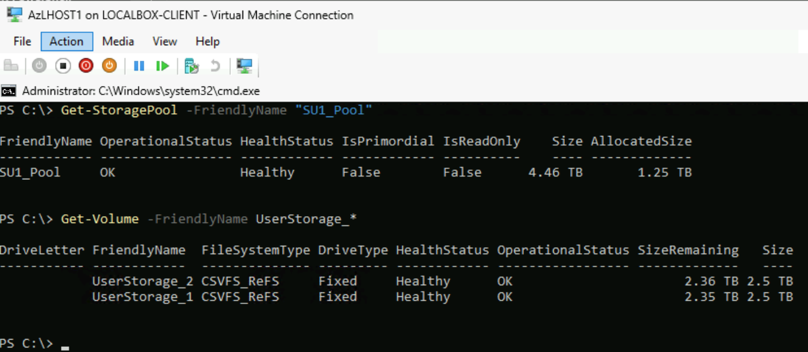

This is a two-part process: first add disks from the **host VM**, then expand volumes from a **cluster node**.

#### Part A: Add data disks to each node (run on the host VM)

Connect to the LocalBox host VM (`LOCALBOX-CLIENT`) via Azure Bastion or Remote Desktop, open a PowerShell session as Administrator, and run:

```powershell
# Create and attach a 1 TB dynamic VHDX to each Azure Local node
foreach ($node in @("AzLHOST1", "AzLHOST2")) {
    $vhdxPath = "V:\VMs\${node}-S2D_Disk7.vhdx"
    Write-Host "Creating $vhdxPath (1 TB dynamic)..."
    New-VHD -Path $vhdxPath -SizeBytes 1TB -Dynamic
    Add-VMHardDiskDrive -VMName $node -Path $vhdxPath
    Write-Host "Attached $vhdxPath to $node"
}
```

#### Part B: Expand the storage pool and volumes (run on a cluster node)

Open **Hyper-V Manager** on the host VM, connect to one of the Azure Local nodes (e.g., `AzLHOST1`), and open a PowerShell session as Administrator on the node:

**1. Expand the UserStorage virtual disks and partitions:**

```powershell
# Get the updated pool
$pool = Get-StoragePool -FriendlyName "SU1_Pool"

# Calculate available space and split evenly between the two UserStorage volumes
$freeSpace = ($pool.Size - $pool.AllocatedSize)
$expandPerDisk = [math]::Floor($freeSpace / 2)

# Expand each UserStorage_1 virtual disk
foreach ($diskName in @("UserStorage_1")) {
    $vdisk = Get-VirtualDisk -FriendlyName $diskName
    $currentSize = $vdisk.Size
    $newSize = $currentSize + $expandPerDisk
    Write-Host "Expanding $diskName from $([math]::Round($currentSize/1GB)) GB to $([math]::Round($newSize/1GB)) GB..."
    Resize-VirtualDisk -FriendlyName $diskName -Size $newSize
}

# Expand the partition to use the new virtual disk space
foreach ($diskName in @("UserStorage_1")) {
    $volume = Get-Volume -FriendlyName $diskName
    $partition = $volume | Get-Partition
    $maxSize = ($partition | Get-PartitionSupportedSize).SizeMax
    Resize-Partition -InputObject $partition -Size $maxSize
    Write-Host "$diskName partition resized to $([math]::Round($maxSize/1GB)) GB"
}

# Remove the UserStorage_2 virtual disk as we will only use UserStorage_1 for the labs
Remove-VirtualDisk -FriendlyName UserStorage_2
```

**2. Verify the new sizes:**

```powershell
Get-StoragePool -FriendlyName "SU1_Pool"
```

```powershell
Get-Volume -FriendlyName UserStorage_*
```


You should also see updated values in the Azure Portal:

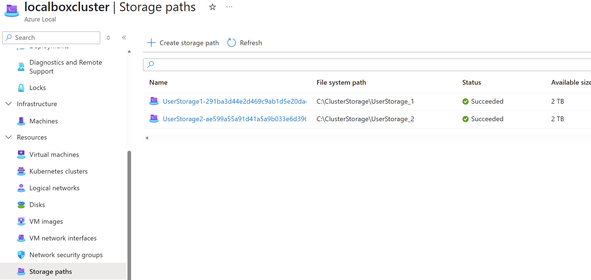

### Step 5: Configure the Environment

#### VM image and storage paths

1. In the Azure Portal, navigate to your **Azure Local** instance
2. Select **VM images** in the left menu
3. Click **+ Add VM Image -> From Azure Marketplace** to start the VM image creation wizard
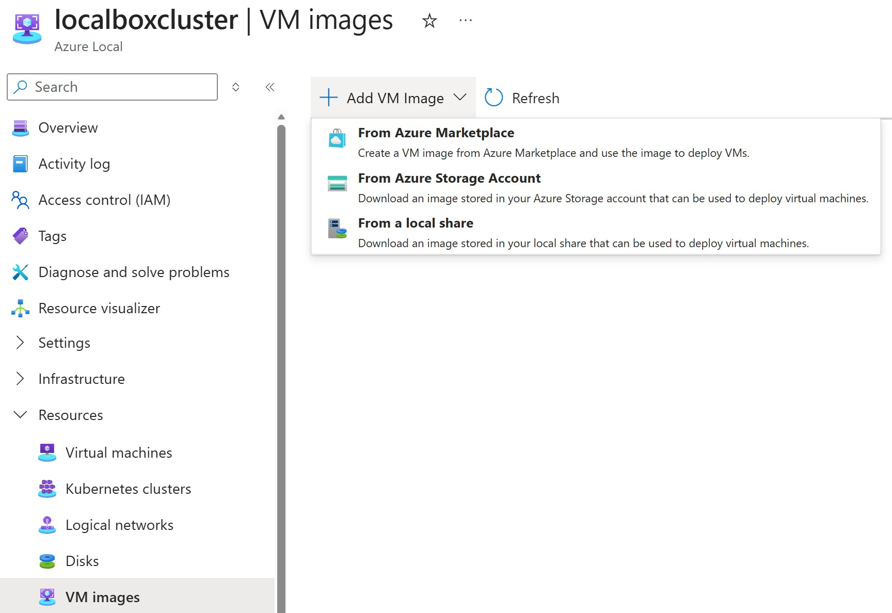
4. For the **Image to download** parameter, select **[smalldisk] Windows Server 2025: Azure edition - Gen2**
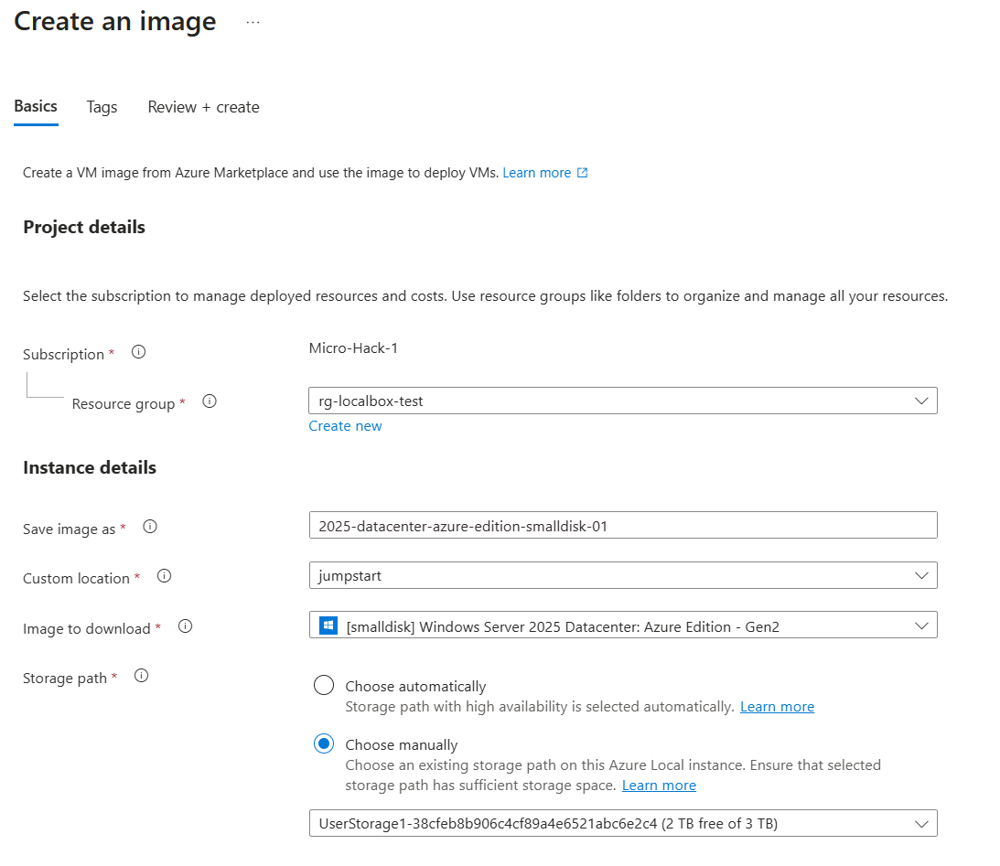
5. For the **Storage path** parameter, select **Choose manually** and the **UserStorage1** storage path.
6. Select **Review + create** and wait for the deployment to finish (on LocalBox, this takes approximately 2,5 hours due to use of nested VMs and a virtual router VM).
7. To avoid an issue with image file copies when many VMs are created in parallel, delete the storage path **UserStorage2**
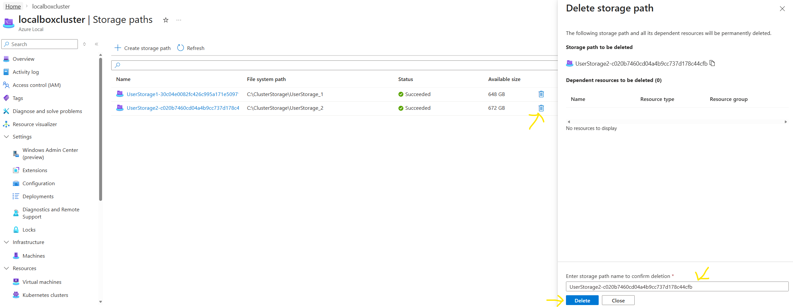

#### Logical network

1. In the Azure Portal, navigate to your **Azure Local** instance
2. Select **Logical network** in the left menu
3. Click **+ Create logical network** to start the creation wizard
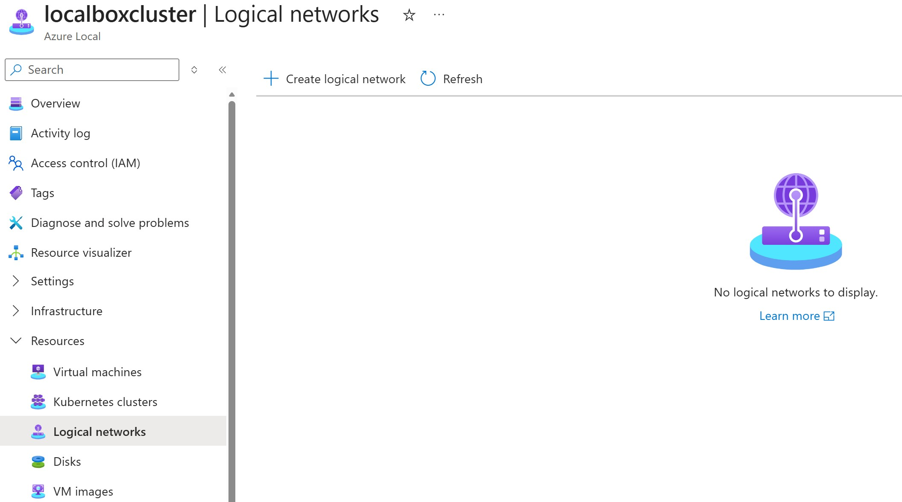
4. For the **Logical network name** parameter, enter **localbox-vm-lnet-vlan200** and click **Next: Network Configuration**:
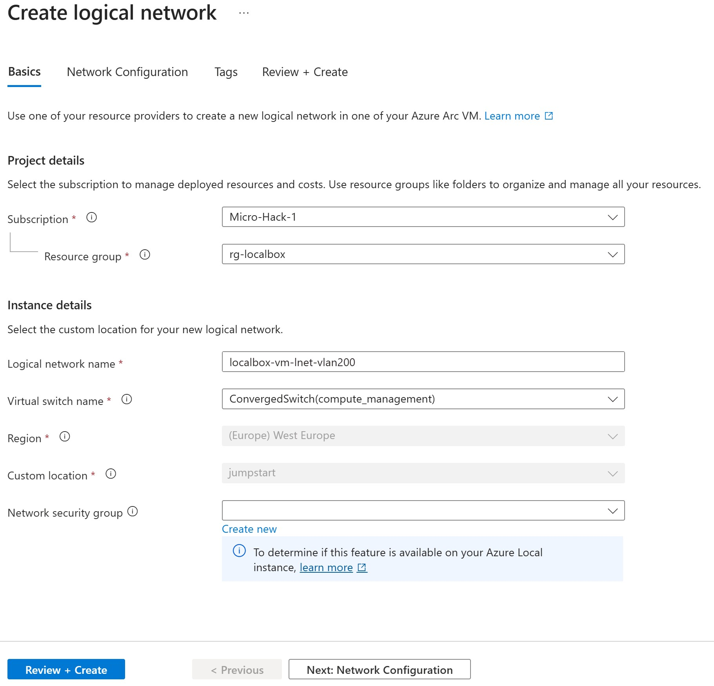
5. Enter the following parameter values:
- **IPv4 address space**: 192.168.200.0 /24 (256 addresses)
- **IP Pools**: 192.168.200.0 - 192.168.200.255
- **Default gateway**: 192.168.200.1
- **DNS Servers**: 192.168.1.254
- **VLAN ID**: 200
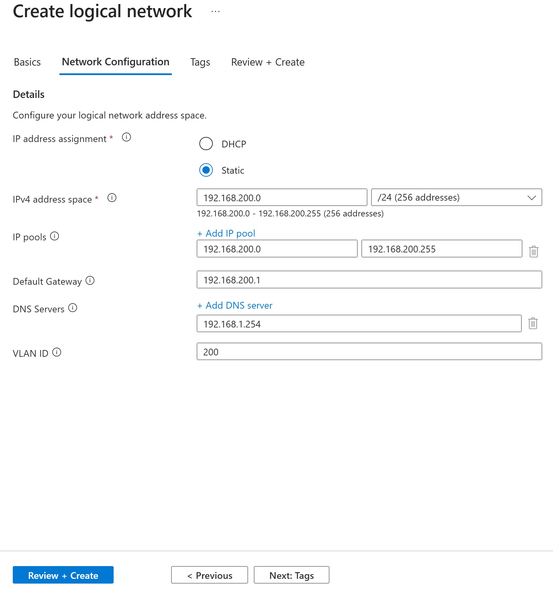
6. Select **Review + create** and wait for the deployment to finish

Role assignments:
1. In the Azure Portal, navigate to your resource group where LocalBox is deployed (e.g. rg-localbox)
2. Select **Access control (IAM)** in the left menu
3. Click **+ Add -> Add role assignment** to start the role assignment wizard
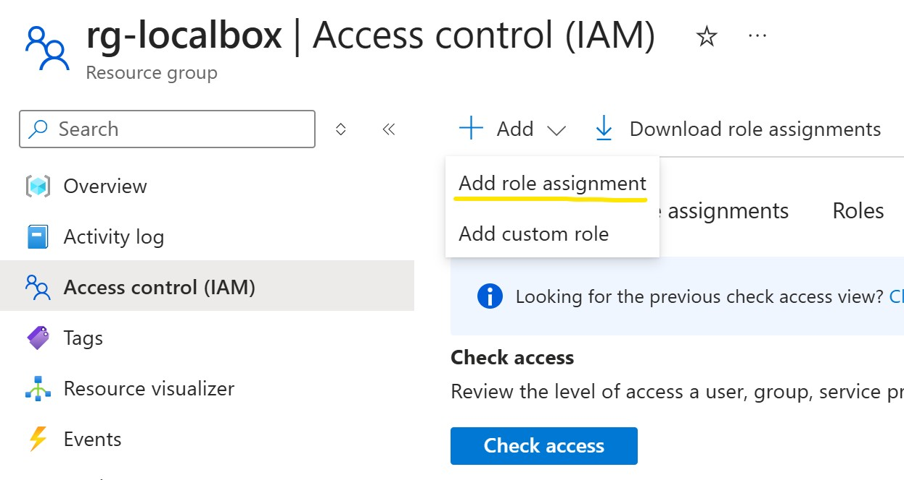
4. Select the **Reader** role and click **Next**
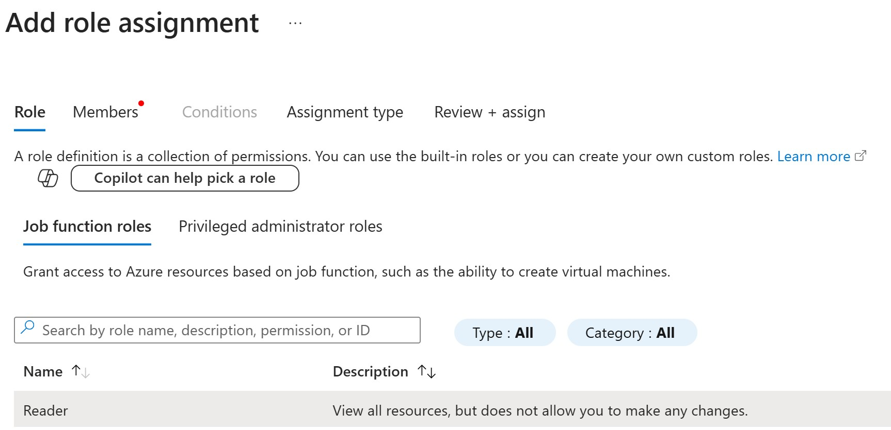
5. Click **+ Select members** to add the **LabUsers** Entra ID group
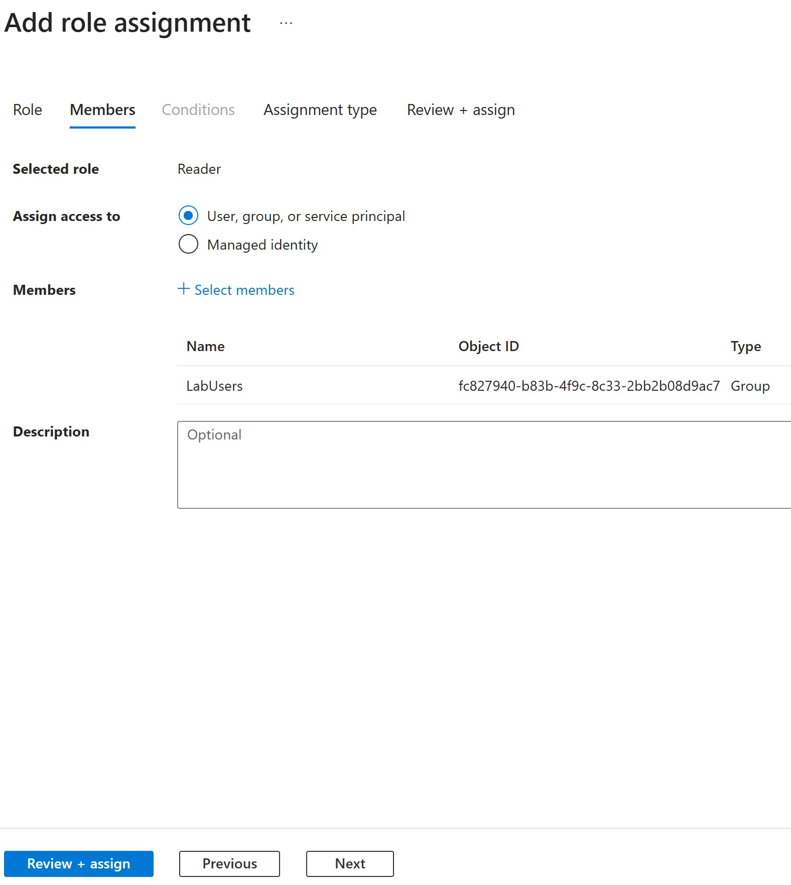
6. Click **Next**
7. For **Assignment type**, select **Active** and click **Review + assign**
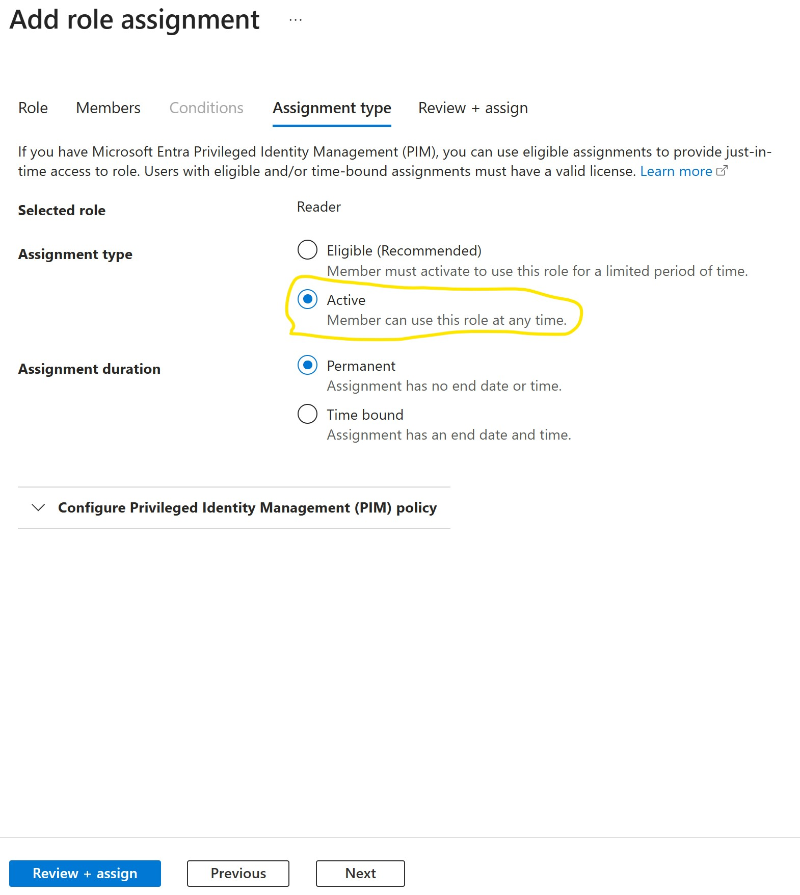
8. Repeat steps 1-7 to add a role assignment for the **Azure Stack HCI VM Contributor** role
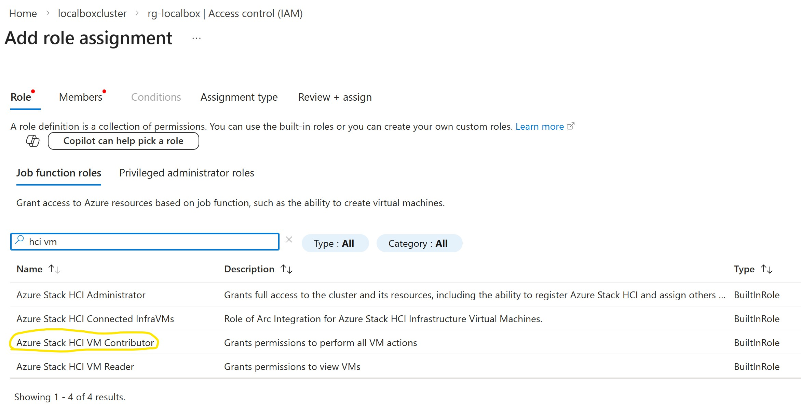
8. Repeat steps 1-7 to add a role assignment for the **Reader** role and **User Access Administrator** role for the resource group where **ArcBox** is deployed (e.g. rg-arcbox)
- For the **User Access Administrator** role, select **Allow user to assign all roles except privileged administrator roles Owner, UAA, RBAC (Recommended)** on the **Conditions** tab:
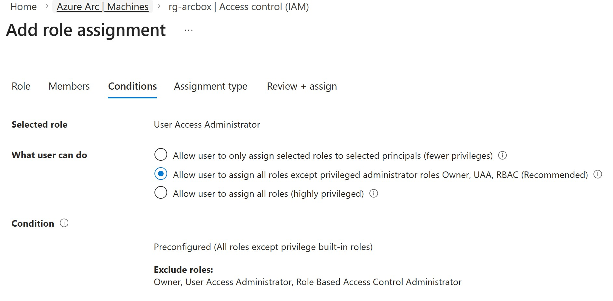

### Step 6: Test the Environment
Once deployed:
- Follow Challenge 6 walkthrough for lab exercises verification

## Notes

- **Shared Environment**: For MicroHack events, typically one ArcBox and one LocalBox instance is shared among participants
- **Resource Costs**: These environments consume significant Azure resources; clean up after the event
- **Deployment Time**: Plan for deployment time when scheduling your MicroHack
