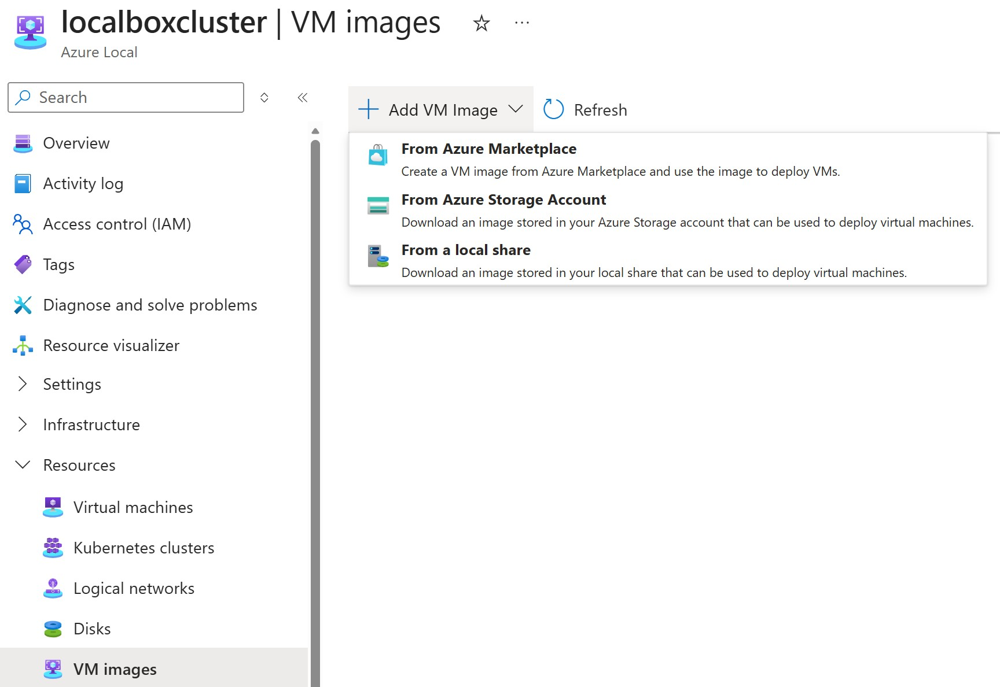
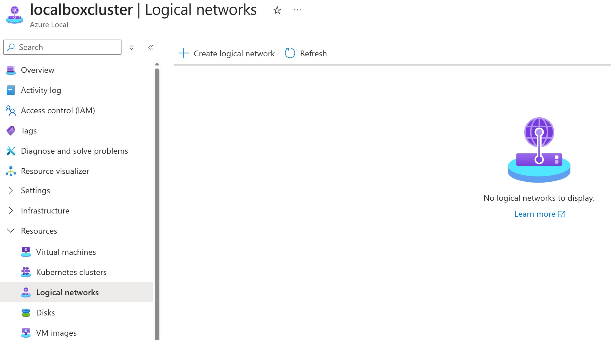
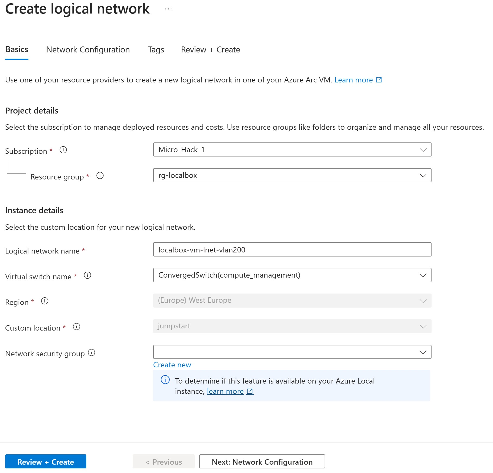
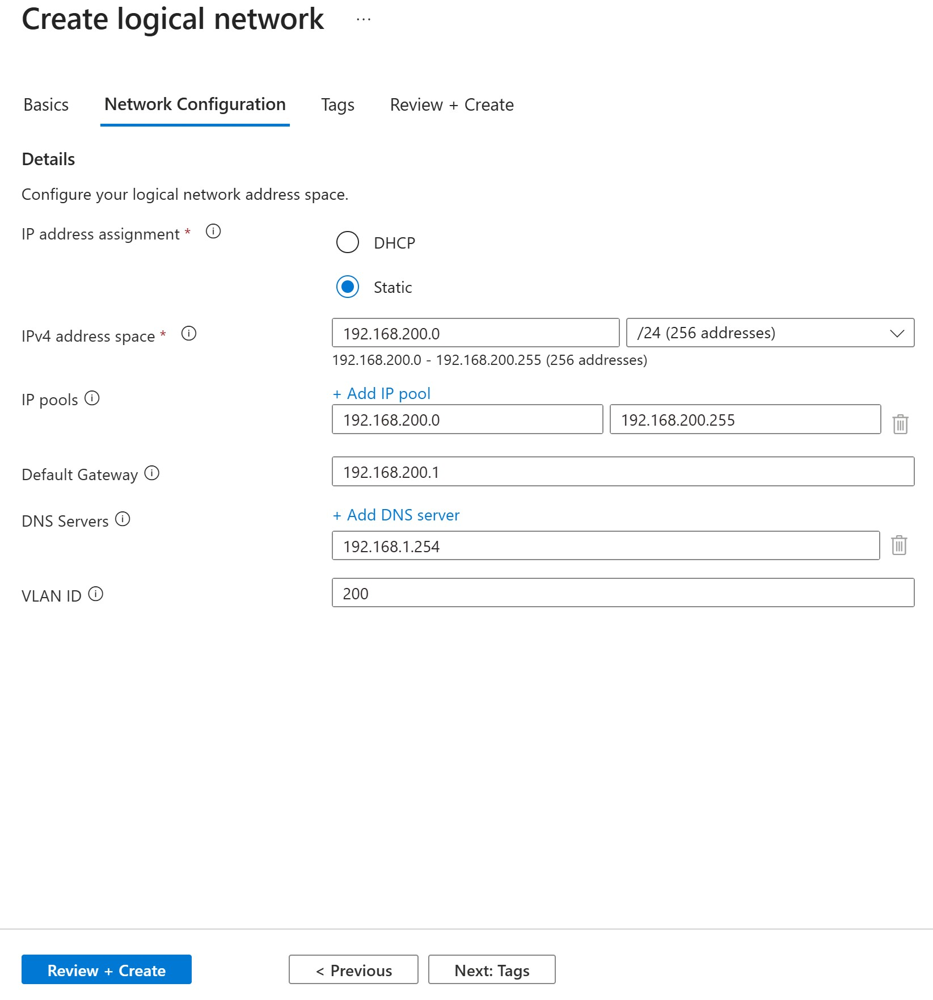
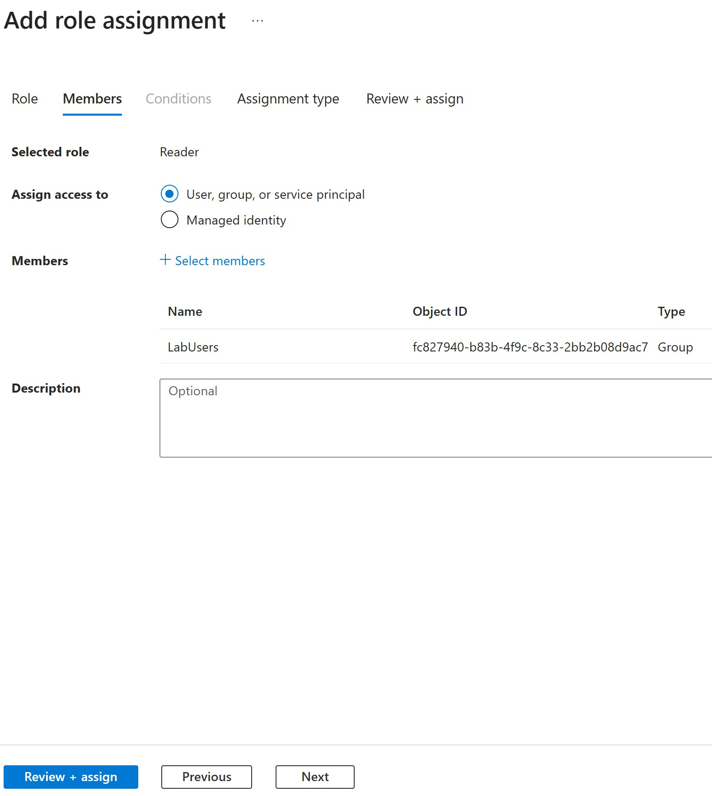

# LocalBox manual preparation and participant validation

Start with [shared preparation](readme.md). This reference retains portal screenshots and the participant smoke test for troubleshooting or manually prepared environments. Deployment instructions are in [manual setup](../manual-setup/readme.md); Console timing, permissions and policy recovery are in [hosted events](../hosted-events/readme.md).

Do not run manual provisioning alongside the preparation script. Inspect existing state before modifying any resource, and never remove shared storage containing workloads.

### Step 4: Expand UserStorage Volumes

> [!IMPORTANT]
> LocalBox VM creation may fail for some attendees if the UserStorage volumes do not have enough free space. The default volume sizes (~679 GB each) can be too small when multiple attendees create VMs simultaneously. To fix this, add a 1 TB data disk to each Azure Local node and expand the storage pool before the event.


Prefer the guarded storage phase in [prepare-localbox.ps1](../prepare-localbox.ps1). It adds stable-named disks, checks capacity and grows to a fixed target. Nested Windows credentials are required separately from Azure authentication. If it refuses a resize or consolidation, ask an Azure Local administrator to review the capacity, resiliency and workload placement before proceeding.

From an elevated session on a nested cluster node, inspect storage without modifying it:

```powershell
Get-StoragePool -FriendlyName "SU1_Pool"
```

```powershell
Get-Volume | Where-Object FileSystemLabel -Like 'UserStorage_*'
```


You should also see updated values in the Azure Portal:


### Step 5: Configure the Environment

#### VM image and storage paths

1. In the Azure Portal, navigate to your **Azure Local** instance
2. Select **VM images** in the left menu
3. Click **+ Add VM Image -> From Azure Marketplace** to start the VM image creation wizard

4. For the **Image to download** parameter, select **[smalldisk] Windows Server 2025: Azure edition - Gen2**

5. For the **Storage path** parameter, select **Choose manually** and the **UserStorage1** storage path.
6. Select **Review + create** and wait for the deployment to finish (on LocalBox, this takes approximately 2,5 hours due to use of nested VMs and a virtual router VM).
7. To avoid image-placement issues in parallel VM creation, review whether **UserStorage2** can be removed while the environment is still empty. Do not delete a storage path or virtual disk that contains workloads; use the script's explicit consolidation checks before importing the image.


#### Logical network

1. In the Azure Portal, navigate to your **Azure Local** instance
2. Select **Logical network** in the left menu
3. Click **+ Create logical network** to start the creation wizard

4. For the **Logical network name** parameter, enter **localbox-vm-lnet-vlan200** and click **Next: Network Configuration**:

5. Enter the following parameter values:
- **IPv4 address space**: 192.168.200.0 /24 (256 addresses)
- **IP Pools**: 192.168.200.10 - 192.168.200.199, only after verifying DHCP exclusions and infrastructure reservations; never include the network, broadcast or gateway addresses
- **Default gateway**: 192.168.200.1
- **DNS Servers**: 192.168.1.254
- **VLAN ID**: 200

6. Select **Review + create** and wait for the deployment to finish

For the separate AKS network and workload cluster, use [shared preparation](readme.md) and the [Jumpstart AKS guide](https://jumpstart.azure.com/azure_jumpstart_localbox/AKS). Do not place AKS nodes in the VM network or reuse its address pool.

Role assignments:
1. In the Azure Portal, navigate to your resource group where LocalBox is deployed (e.g. `rg-localbox-shared`)
2. Select **Access control (IAM)** in the left menu
3. Click **+ Add -> Add role assignment** to start the role assignment wizard

4. Select the **Reader** role and click **Next**

5. Click **+ Select members** to add the **LabUsers** Entra ID group

6. Click **Next**
7. For **Assignment type**, select **Active** and click **Review + assign**

8. Repeat steps 1-7 to add a role assignment for the **Azure Stack HCI VM Contributor** role


Hosted lab automation grants participants access to shared LocalBox resources, **Owner** on their own resource group, and subscription-level **Security Reader** for Defender visibility. For manual setups, verify equivalent scoped permissions before testing. Students must be able to create their own VM, manage its extensions, and assess updates without managing other participants' VMs. Do not grant subscription-level Owner or User Access Administrator to perform these exercises.

#### Defender for Servers readiness (organizer)

1. Confirm the Defender for Servers plan approved for the event, including its subscription scope and charges
2. As an authorized subscription administrator, open **Microsoft Defender for Cloud -> Environment settings** and select the lab subscription
3. Under **Defender plans**, enable **Servers** with the approved plan if it is not already enabled, and save the changes
4. Verify that the [Defender for Endpoint integration](https://learn.microsoft.com/azure/defender-for-cloud/enable-defender-for-endpoint) is enabled and that required onboarding settings and extensions can apply to the participant VMs
5. Verify that participants have **Security Reader** access to review coverage and recommendations. Students verify protection on their own VM; subscription-level plan changes remain an organizer responsibility

### Step 6: Test the Environment

Before participants begin, follow the [Challenge 6 walkthrough](../../walkthrough/challenge-06/solution-06.md) using a normal participant identity:

1. Create a Windows Server 2025 VM in that participant's assigned resource group on the prepared LocalBox logical network, with **Enable guest management** selected
2. Verify that the VM has a valid IP address, working DNS, and outbound access to the required Azure Arc, Defender, and configured Windows update-source endpoints. Confirm **Guest management: Enabled (Connected)** on the VM's **Overview -> Properties -> Configuration** page; see [Enable guest management](https://learn.microsoft.com/azure/azure-local/manage/manage-arc-virtual-machines#enable-guest-management) if onboarding fails
3. Confirm that the same VM appears in Defender for Cloud **Inventory**, verify Defender for Servers coverage and onboarding, and review its assessment status. Allow time for recommendations to populate; an empty list is not proof of completed assessment
4. Locate that VM in Azure Update Manager **Resources -> Machines**, run **Check for updates**, and verify a successful assessment and its timestamp. Zero pending updates is a valid result; a pending or failed assessment is not
5. Confirm that neither exercise requires selecting shared cluster nodes, the LocalBox host, Arc Resource Bridge, or another participant's VM, or changing subscription-level settings

Resolve connectivity, extension provisioning, or permission failures before the event. Keep any permission changes limited to the operation and resource scope actually required. Do not install patches or restart shared resources during this readiness test.

## Notes

- **Shared Environment**: For MicroHack events, typically one LocalBox instance per subscription is shared among participants; each participant creates a VM in their assigned resource group
- **Resource Costs**: LocalBox and the enabled security services consume Azure resources; clean up lab resources after the event and review lab-specific paid plans with the subscription owner
- **Deployment Time**: Plan for deployment time when scheduling your MicroHack
