# Walkthrough Challenge 1 - Enforce Sovereign Controls with Azure Policy and RBAC

**Estimated Duration:** 45 minutes

> 💡 **Objective:** Learn how to enforce sovereign cloud governance controls using Azure native platform capabilities. You will restrict resource deployments to sovereign regions, enforce compliance through tagging and network policies, implement least-privilege access with RBAC, and remediate non-compliant resources.

## Prerequisites

Please ensure that you successfully verified the [General prerequisites](../../Readme.md#general-prerequisites) before continuing with this challenge.

- Permissions to create resources and policy assignments in your assigned resource group, plus role-assignment permissions (for example, Owner at that scope). User Access Administrator alone does not grant resource or policy creation permissions.
- Subscription-level policy-definition permissions for the bonus initiative and custom remediation policy, and Microsoft Entra permissions to create security groups. Ask your organizer if these operations are unavailable; do not broaden the assignment scope.
- Azure CLI >= 2.54 or access to Azure Portal
- Basic understanding of Azure Resource Manager and resource groups

## Scenario Context

You are a cloud architect at a European organization that must comply with data sovereignty requirements. Your workloads contain sensitive data that must remain within EU sovereign regions. Additionally, regulatory requirements mandate:

- **Geographic restrictions**: All resources must be deployed only in approved sovereign regions (Norway East, Germany North, North Europe)
- **Data classification**: All resources must be tagged with appropriate data classification labels
- **Network isolation**: Sensitive resources must not expose public IP addresses
- **Access control**: Only authorized teams should have access, following least-privilege principles
- **Compliance monitoring**: Non-compliant resources must be identified and remediated

In this challenge, you'll implement these controls using Azure Policy and RBAC.

### Choose a learning path

Each hands-on task includes portal and CLI instructions. Choose one creation method per object, rather than creating duplicate assignments or groups. Portal users can use the example names directly without running Bash; CLI users must initialize the variables in Task 2.

The portal's **Assignment name** field sets the friendly display name; its underlying assignment resource name can be generated automatically. Later CLI update commands assume the resource names from the CLI creation steps. If you created an assignment in the portal, use the portal update instructions too, or obtain its actual resource name from **Policy > Assignments > your assignment > Assignment ID** (the final path segment).

---

## Task 1: Understand Azure Policy and Governance Fundamentals

💡 **Before implementing policies, it's important to understand the governance capabilities available in Azure.**

### Key Concepts

- 🔑 **Azure Policy**: A service that enables you to create, assign, and manage policies that enforce different rules and effects over your resources to ensure they stay compliant with corporate standards and service level agreements.

- 🔑 **Policy Definitions**: Define the conditions and effects that apply when those conditions are met. Azure provides many built-in policy definitions, and you can also create custom policies.

- 🔑 **Policy Assignments**: The act of applying a policy definition to a specific scope (management group, subscription, or resource group).

- 🔑 **Policy Initiatives** (also called Policy Sets): A collection of policy definitions grouped together to simplify management. For example, a "Sovereign Cloud Security Baseline" initiative might include location restrictions, tagging requirements, and network controls.

- 🔑 **Compliance State**: Azure Policy evaluates resources and marks them as compliant or non-compliant based on assigned policies. This doesn't prevent non-compliant resources that already exist, but it can prevent new non-compliant deployments.

- 🔑 **Remediation**: The process of bringing non-compliant resources into compliance, either through manual changes or automated remediation tasks.

### Learning Resources

- [Azure Policy overview](https://learn.microsoft.com/azure/governance/policy/overview)
- [Understand Policy effects](https://learn.microsoft.com/azure/governance/policy/concepts/effects)
- [Azure Policy definition structure](https://learn.microsoft.com/azure/governance/policy/concepts/definition-structure)

---

## Task 2: Restrict Deployments to Sovereign Regions

💡 **The first step in enforcing sovereignty is ensuring resources can only be deployed in approved geographic locations.**

### Step 1: Configure Environment Variables

Open Azure Cloud Shell:

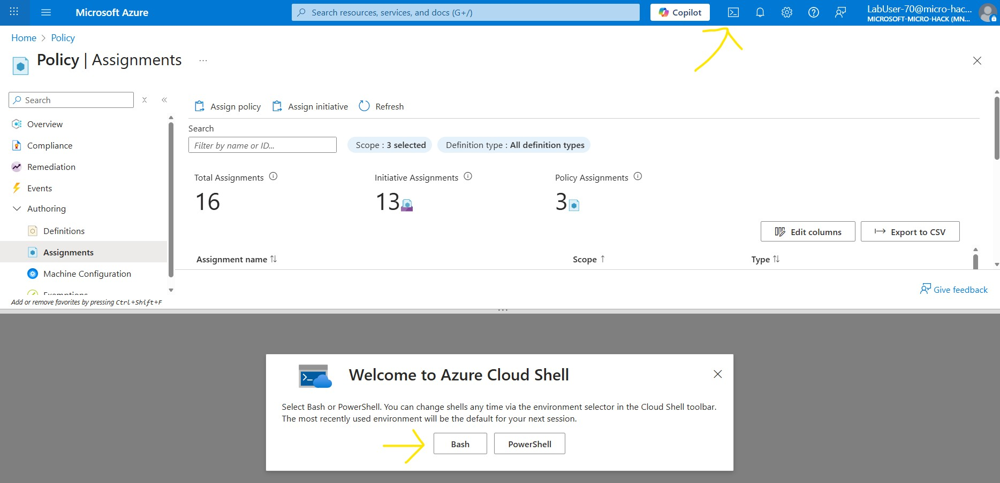

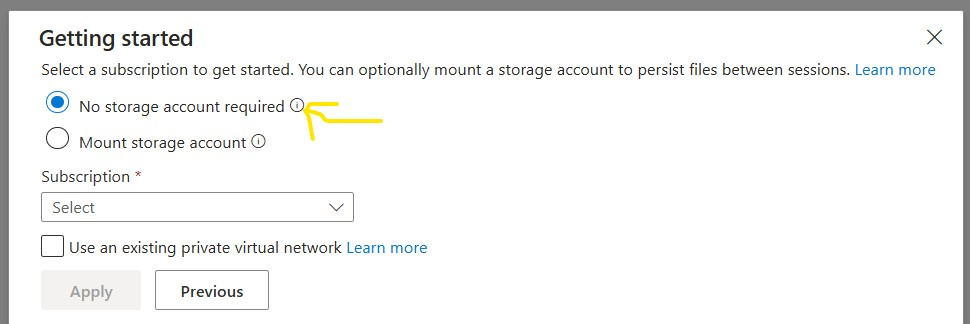

Set up the variables that will be used throughout this challenge:

**Using Azure Portal:** Open your assigned resource group and copy its exact name and subscription ID from **Overview**. For `rg-labuser-0024` (or `labuser-0024`), use attendee ID `labuser-0024`, display prefix `Lab User-0024`, and group prefix `Lab-User-0024`. Keep the original resource-group name for every scope selector. These are naming conventions, not new resource groups.

**Using Azure CLI:**

> [!IMPORTANT]
> The Azure CLI commands in this walkthrough use **bash** syntax and will not work directly in PowerShell. Use **Azure Cloud Shell (Bash)** for the best experience. If running locally on Windows, use **WSL2** (Windows Subsystem for Linux) to run a bash shell. You can install the Azure CLI inside WSL with:
>
> ```bash
> curl -sL https://aka.ms/InstallAzureCLIDeb | sudo bash
> ```

```bash
# Set common variables
# Customize RESOURCE_GROUP for each participant
RESOURCE_GROUP="rg-labuser-0024"  # Replace with your exact assigned resource-group name

ATTENDEE_ID="${RESOURCE_GROUP#rg-}"  # "rg-labuser-0024" and "labuser-0024" both become "labuser-0024"
SUBSCRIPTION_ID="xxxxxx-xxxx-xxxx-xxxx-xxxxxxxxxx"  # Replace with your subscription ID
LOCATION="norwayeast" #If attending a MicroHack event, change to the location provided by your local MicroHack organizers

# Generate friendly display names with attendee ID
DISPLAY_PREFIX="Lab User-${ATTENDEE_ID#labuser-}"  # "Lab User-0024"
GROUP_PREFIX="Lab-User-${ATTENDEE_ID#labuser-}"    # "Lab-User-0024"

az account set --subscription "$SUBSCRIPTION_ID"
az group show --name "$RESOURCE_GROUP" --query '{Name:name,Location:location}' -o table
printf 'Attendee: %s\nDisplay prefix: %s\nGroup prefix: %s\n' "$ATTENDEE_ID" "$DISPLAY_PREFIX" "$GROUP_PREFIX"
```

For `rg-labuser-0024`, the resulting group name is `Lab-User-0024-Compliance-Officers`, not `Lab-User-rg-labuser-0024-Compliance-Officers`. If your organizer uses a different naming scheme, set `ATTENDEE_ID`, `DISPLAY_PREFIX`, and `GROUP_PREFIX` explicitly. Do not change `RESOURCE_GROUP` to fix a display name.

🔑 **Best Practice**: Setting variables once at the beginning ensures consistency across all commands and reduces the chance of errors from manual editing.

> [!WARNING]
> If your Azure Cloud Shell session times out (e.g. during a break), the variables defined above will be lost and must be re-defined before continuing. We recommend saving them in a local text file on your machine so you can quickly copy and paste them back into a new session.

### Step 2: Identify the Built-in Policy

The **"Allowed locations"** built-in policy restricts which locations users can specify when deploying resources.

**Using Azure Portal:** Go to **Policy > Authoring > Definitions**, set **Definition type** to **Policy** and **Type** to **Built-in**, then search for **Allowed locations**. Open the definition to inspect its description, parameters, and JSON.

The **policy definition ID** uniquely identifies the policy, independently of its display name. The GUID at the end is its resource name; CLI examples can use that GUID for built-in definitions. It is not your subscription ID or the ID of a policy assignment.

**Policy Definition ID:**
```
/providers/Microsoft.Authorization/policyDefinitions/e56962a6-4747-49cd-b67b-bf8b01975c4c
```

**Using Azure CLI:**

```bash
az policy definition show --name e56962a6-4747-49cd-b67b-bf8b01975c4c \
  --query '{Name:displayName,Id:id,Parameters:parameters}' -o json
```

### Before assigning any policy: scope and enforcement

> [!IMPORTANT]
> Assign every policy in this challenge to **your own resource group**, never the shared subscription. For Tasks 2-5, select **Policy enforcement: Do not enforce** in the portal (`--enforcement-mode DoNotEnforce` in CLI). Compliance is still evaluated, but a `Deny` effect will not block requests. This does not change the policy's effect to `Audit`.
>
> Task 9 temporarily changes only three assignments in your resource group to **Default** to demonstrate denied deployments, then restores **Do not enforce**. Until that step, the negative tests are not expected to be blocked by these assignments. Do not select **Enroll** for this exercise.

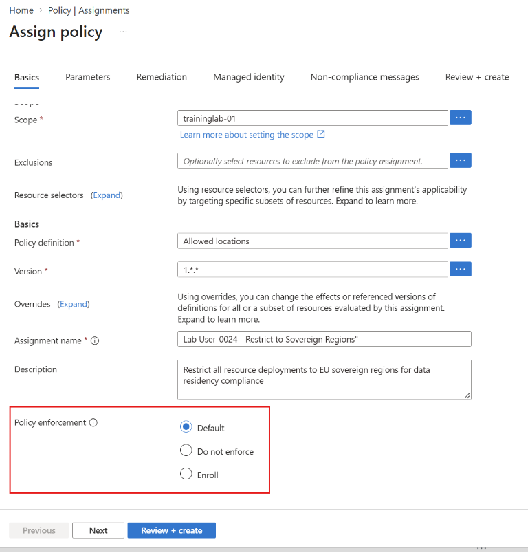

*UI reference supplied during testing. The screenshot shows subscription scope and **Default** selected, not the required lab configuration. Select your own resource group and **Do not enforce** before saving. Older portal versions may show an Enabled/Disabled toggle instead.*

### Step 3 - option A: Assign the Policy Using Azure Portal

💥 **Navigate to Azure Policy and create a location restriction:**

1. In the Azure Portal, navigate to **Policy**
2. Click **Assignments** in the left menu
3. Click **Assign policy**
4. Configure the assignment:
   - **Scope**: Select your resource group (e.g., `rg-labuser-0024`). **Do NOT select the subscription** — assigning at subscription scope will affect all other participants.
   - **Exclusions**: Leave empty
   - **Policy definition**: Search for "Allowed locations"
   - **Assignment name**: Use the format "Lab User-{YourAttendeeNumber} - Restrict to Sovereign Regions" (e.g., "Lab User-0024 - Restrict to Sovereign Regions")
   - **Description**: "Restrict all resource deployments to EU sovereign regions for data residency compliance"
   - **Policy enforcement**: **Do not enforce**

5. Click **Next** to go to **Parameters**
6. Under **Allowed locations**, select:
   - Norway East
   - Germany North
   - North Europe
7. Click **Review + create** and then **Create**

### Step 3 - option B: Assign the Policy Using Azure CLI

Alternatively, use Azure CLI for automation:

```bash
# Use the variables defined in Step 1
POLICY_NAME="${ATTENDEE_ID}-restrict-to-sovereign-regions"
POLICY_DISPLAY_NAME="${DISPLAY_PREFIX} - Restrict to Sovereign Regions"
POLICY_DEFINITION_ID="e56962a6-4747-49cd-b67b-bf8b01975c4c"

# Create policy assignment
az policy assignment create \
  --subscription "$SUBSCRIPTION_ID" \
  --name "$POLICY_NAME" \
  --display-name "$POLICY_DISPLAY_NAME" \
  --scope "/subscriptions/$SUBSCRIPTION_ID/resourceGroups/$RESOURCE_GROUP" \
  --policy "$POLICY_DEFINITION_ID" \
  --enforcement-mode DoNotEnforce \
  --params '{"listOfAllowedLocations":{"value":["norwayeast","germanynorth", "northeurope"]}}'
```

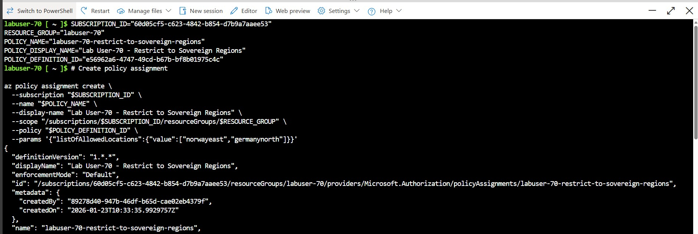

### Step 4: Also Restrict Resource Group Locations

⚠️ **Important**: The "Allowed locations" policy applies to resources, but resource groups have their own location metadata. The separate **"Allowed locations for resource groups"** policy evaluates that metadata. At your resource-group scope, this is a compliance demonstration for your existing group; it does not restrict the creation of other resource groups. Subscription-wide enforcement belongs to the organizer, not participants.

**Using Azure Portal:** In **Policy > Assignments > Assign policy**, choose **Allowed locations for resource groups** (definition ID ending `e765b5de-1225-4ba3-bd56-1ac6695af988`). Set scope to your resource group, assignment name to `Lab User-0024 - Restrict Resource Groups to Sovereign Regions` (use your number), and enforcement to **Do not enforce**. Under **Parameters**, select Norway East, Germany North, and North Europe, then **Review + create > Create**.

**Using Azure CLI:**

```bash
RG_POLICY_DEFINITION_ID="e765b5de-1225-4ba3-bd56-1ac6695af988"

az policy assignment create \
  --name "${ATTENDEE_ID}-restrict-rg-to-sovereign-regions" \
  --display-name "${DISPLAY_PREFIX} - Restrict Resource Groups to Sovereign Regions" \
  --scope "/subscriptions/$SUBSCRIPTION_ID/resourceGroups/$RESOURCE_GROUP" \
  --policy "$RG_POLICY_DEFINITION_ID" \
  --params '{
    "listOfAllowedLocations": {
      "value": ["norwayeast", "germanynorth", "northeurope"]
    }
  }' \
  --enforcement-mode DoNotEnforce
```

🔑 **Best Practice**: In production, use the appropriate parent scope for resource-group location restrictions. An existing group's metadata location can differ from the locations of the resources it contains.

---

## Task 3: Enforce Resource Tagging for Data Classification

💡 **Tags are essential for governance, cost management, and compliance tracking. In sovereign scenarios, data classification tags help identify sensitive workloads.**

### Step 1: Assign the "Require a tag and its value" Policy

This policy requires that resources have a specific tag with a specific value.

**Policy Definition ID:**

```
/providers/Microsoft.Authorization/policyDefinitions/1e30110a-5ceb-460c-a204-c1c3969c6d62
```

### Using Azure Portal:

1. Navigate to **Policy** > **Assignments**
2. Click **Assign policy**
3. Search for "Require a tag and its value on resources"
4. Configure:
   - **Scope**: Your resource group
   - **Assignment name**: "Lab User-0024 - Require Data Classification Tag" (replace 0024 with your attendee number)
   - **Policy enforcement**: **Do not enforce**
   - **Parameters**:
     - **Tag name**: `DataClassification`
     - **Tag value**: `Sovereign`
5. Click **Review + create** and **Create**

### Using Azure CLI:

```bash
TAG_POLICY_DEFINITION_ID="1e30110a-5ceb-460c-a204-c1c3969c6d62"
POLICY_NAME="${ATTENDEE_ID}-require-data-classification-tag"
POLICY_DISPLAY_NAME="${DISPLAY_PREFIX} - Require Data Classification Tag"

az policy assignment create \
  --name "$POLICY_NAME" \
  --display-name "$POLICY_DISPLAY_NAME" \
  --scope "/subscriptions/$SUBSCRIPTION_ID/resourceGroups/$RESOURCE_GROUP" \
  --policy "$TAG_POLICY_DEFINITION_ID" \
  --enforcement-mode DoNotEnforce \
  --params '{
    "tagName": {
      "value": "DataClassification"
    },
    "tagValue": {
      "value": "Sovereign"
    }
  }'
```

### Alternative: Use "Require a tag on resources" for Flexibility

If you want to require the tag but allow different values (e.g., "Sovereign", "Public", "Confidential"), use this policy instead. The main Task 9 tests assume the specific-value policy above, so do not replace it when following the main path.

**Using Azure Portal:** Follow the same assignment workflow, choosing **Require a tag on resources** (ID ending `871b6d14-10aa-478d-b590-94f262ecfa99`), name `Lab User-0024 - Require Data Classification Tag (Any Value)`, **Do not enforce**, and parameter **Tag name** = `DataClassification`.

**Using Azure CLI:**

```bash
FLEXIBLE_TAG_POLICY="871b6d14-10aa-478d-b590-94f262ecfa99"
POLICY_NAME="${ATTENDEE_ID}-require-data-classification-tag-flexible"
POLICY_DISPLAY_NAME="${DISPLAY_PREFIX} - Require Data Classification Tag (Any Value)"

az policy assignment create \
  --name "$POLICY_NAME" \
  --display-name "$POLICY_DISPLAY_NAME" \
  --scope "/subscriptions/$SUBSCRIPTION_ID/resourceGroups/$RESOURCE_GROUP" \
  --policy "$FLEXIBLE_TAG_POLICY" \
  --enforcement-mode DoNotEnforce \
  --params '{
    "tagName": {
      "value": "DataClassification"
    }
  }'
```

🔑 **Best Practice**: In production, consider using tag inheritance from resource groups to reduce administrative overhead. Use the **"Inherit a tag from the resource group if missing"** policy with a remediation task.

---

## Task 4: Control Public IP and Storage Network Exposure

💡 **Sovereign workloads often require network isolation. Blocking public IP resources and disabling service public network access are distinct controls. Neither creates a private endpoint automatically.**

### Understanding Public IP Restrictions

Azure provides several policies to control public network access:

1. **Deny public IP creation** - Prevents creating public IP address resources
2. **Service-specific policies** - Block public access to specific services (Storage, Key Vault, SQL, etc.)
3. **Require private endpoints** - Mandate private endpoint usage for supported services

### Step 1: Deny Public IP Address Creation

Use the built-in **Not allowed resource types** policy, with `Microsoft.Network/publicIPAddresses` as its parameter.

**Policy Definition ID:**
```
/providers/Microsoft.Authorization/policyDefinitions/6c112d4e-5bc7-47ae-a041-ea2d9dccd749
```

### Using Azure Portal:

1. Navigate to **Policy** > **Assignments**
2. Click **Assign policy**
3. Search for "Not allowed resource types"
4. Configure:
   - **Scope**: Your resource group (e.g., `rg-labuser-0024`). **Do NOT select the subscription.**
   - **Assignment name**: "Lab User-0024 - Block Public IP Addresses" (replace 0024 with your attendee number)
   - **Policy enforcement**: **Do not enforce**
   - **Parameters**:
     - **Not allowed resource types**: Select `Microsoft.Network/publicIPAddresses`
5. Click **Review + create** and **Create**

### Using Azure CLI:

```bash
DENY_RESOURCE_TYPE_POLICY="6c112d4e-5bc7-47ae-a041-ea2d9dccd749"
POLICY_NAME="${ATTENDEE_ID}-block-public-ip-addresses"
POLICY_DISPLAY_NAME="${DISPLAY_PREFIX} - Block Public IP Addresses"

az policy assignment create \
  --name "$POLICY_NAME" \
  --display-name "$POLICY_DISPLAY_NAME" \
  --scope "/subscriptions/$SUBSCRIPTION_ID/resourceGroups/$RESOURCE_GROUP" \
  --policy "$DENY_RESOURCE_TYPE_POLICY" \
  --enforcement-mode DoNotEnforce \
  --params '{
    "listOfResourceTypesNotAllowed": {
      "value": ["Microsoft.Network/publicIPAddresses"]
    }
  }'
```

### Step 2: Disable Public Network Access for Storage Accounts

Use **Storage accounts should disable public network access**, definition ID ending `b2982f36-99f2-4db5-8eff-283140c09693`. This checks the storage account's public-network-access setting, not whether a private endpoint exists. Access through a private endpoint also requires endpoint and DNS configuration, covered in later challenges.

**Using Azure Portal:**

1. Go to **Policy > Authoring > Definitions** and search for the exact policy name above. Open it and confirm the definition ID.
2. Select **Assign**, scope it to your resource group, and use the assignment name `Lab User-0024 - Storage accounts should disable public network access` (use your number).
3. Set **Policy enforcement** to **Do not enforce**.
4. On **Parameters**, clear **Only show parameters that need input or review** if needed and select **Effect: Deny**. The built-in default is **Audit**; `Deny` will only block requests if enforcement is later enabled. Keep this assignment non-enforcing throughout Task 9 so it cannot mask the location/tag test results.
5. Select **Review + create > Create**.

**Using Azure CLI:**

```bash
# Search for storage account public access policies
az policy definition list --query "[?displayName && contains(displayName, 'Storage') && contains(displayName, 'public')].{Name:displayName, ID:name}" -o table
```

From the table, take the **ID** from the row whose **Name** is exactly **Storage accounts should disable public network access**. Do not select **Storage accounts should restrict network access** (`34c877ad-507e-4c82-993e-3452a6e0ad3c`), which checks a different networking configuration, or the policy for anonymous blob access.

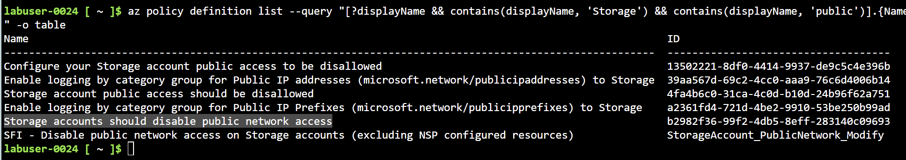

*Example output from the test environment. Additional definitions can vary by tenant; select the exact built-in name and matching ID, not a similarly named custom policy.*

```bash
STORAGE_PUBLIC_ACCESS_POLICY="b2982f36-99f2-4db5-8eff-283140c09693"
POLICY_NAME="${ATTENDEE_ID}-storage-disable-public-access"
POLICY_DISPLAY_NAME="${DISPLAY_PREFIX} - Storage accounts should disable public network access"

az policy assignment create \
  --name "$POLICY_NAME" \
  --display-name "$POLICY_DISPLAY_NAME" \
  --scope "/subscriptions/$SUBSCRIPTION_ID/resourceGroups/$RESOURCE_GROUP" \
  --policy "$STORAGE_PUBLIC_ACCESS_POLICY" \
  --params '{"effect":{"value":"Deny"}}' \
  --enforcement-mode DoNotEnforce
```

🔑 **Best Practice**: Apply network isolation policies at the service level (Storage, Key Vault, SQL Database, etc.) rather than just blocking public IPs. This provides defense in depth.

---

## Task 5: Create a Policy Initiative (Bonus)

💡 **Policy initiatives group multiple policy definitions together for easier management and assignment.**

### Step 1: Create a Custom Initiative Definition

**Using Azure Portal (complete Steps 1-2 here):**

1. Open **Policy > Authoring > Definitions > + Initiative definition**.
2. On **Basics**, select your subscription as **Initiative location** (where the definition is stored, not where it is enforced). Set **Name** to `Lab User-0024 - Sovereign Cloud Security Baseline`, using your number, and **Category** to `Sovereign Cloud`.
3. On **Policies**, select **Add policy definition(s)** and add the four built-ins in the table below. Do not add the storage policy for this initiative.
4. Leave **Groups** and **Initiative parameters** empty for this exercise. On **Policy parameters**, choose **Set value** for each parameter and enter the values below.
5. Select **Review + create > Create**, then proceed to Step 3 to assign it.

| Policy shown on the Policies tab | Values on the Policy parameters tab |
|---|---|
| Allowed locations | Norway East, Germany North, North Europe |
| Allowed locations for resource groups | Norway East, Germany North, North Europe |
| Require a tag and its value on resources | Tag name: `DataClassification`; Tag value: `Sovereign` |
| Not allowed resource types | `Microsoft.Network/publicIPAddresses` |

**Portal visual references:** Microsoft's illustrated guide shows the [initiative wizard](https://learn.microsoft.com/azure/governance/policy/media/create-and-manage/initiative-definition.png), [selected policies](https://learn.microsoft.com/azure/governance/policy/media/create-and-manage/initiative-definition-2.png), and [policy parameter controls](https://learn.microsoft.com/azure/governance/policy/media/create-and-manage/initiative-definition-3.png). Those screenshots use a different sample initiative; use the four policies and values in the table above, not the sample values.

**Using Azure CLI:** Create a JSON file named `sovereign-cloud-initiative.json`:

```json
[
  {
    "policyDefinitionId": "/providers/Microsoft.Authorization/policyDefinitions/e56962a6-4747-49cd-b67b-bf8b01975c4c",
    "parameters": {
      "listOfAllowedLocations": {
        "value": [
          "norwayeast",
          "germanynorth",
          "northeurope"
        ]
      }
    }
  },
  {
    "policyDefinitionId": "/providers/Microsoft.Authorization/policyDefinitions/e765b5de-1225-4ba3-bd56-1ac6695af988",
    "parameters": {
      "listOfAllowedLocations": {
        "value": [
          "norwayeast",
          "germanynorth",
          "northeurope"
        ]
      }
    }
  },
  {
    "policyDefinitionId": "/providers/Microsoft.Authorization/policyDefinitions/1e30110a-5ceb-460c-a204-c1c3969c6d62",
    "parameters": {
      "tagName": {
        "value": "DataClassification"
      },
      "tagValue": {
        "value": "Sovereign"
      }
    }
  },
  {
    "policyDefinitionId": "/providers/Microsoft.Authorization/policyDefinitions/6c112d4e-5bc7-47ae-a041-ea2d9dccd749",
    "parameters": {
      "listOfResourceTypesNotAllowed": {
        "value": [
          "Microsoft.Network/publicIPAddresses"
        ]
      }
    }
  }
]
```

> [!TIP]
> When using Cloud Shell instead of a local terminal to run Azure CLI commands, create the files locally in a text editor (Notepad or similar). Then you can upload the files to Cloud Shell by using the **Manage files -> Upload** feature before running the command in the following step:

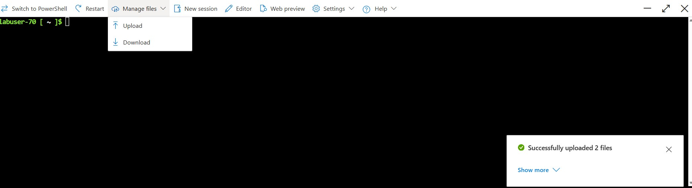

### Step 2: Create the Initiative Using Azure CLI

```bash
az policy set-definition create \
  --name "${ATTENDEE_ID}-sovereign-cloud-baseline" \
  --display-name "${DISPLAY_PREFIX} - Sovereign Cloud Security Baseline" \
  --description "Enforce location, tagging, and network controls for sovereign workloads" \
  --definitions sovereign-cloud-initiative.json \
  --subscription "$SUBSCRIPTION_ID"
```

### Step 3: Assign the Initiative

**Using Azure Portal:** Open your initiative under **Policy > Definitions**, select **Assign**, and change **Scope** from the default subscription to **your resource group**. Use `Lab User-0024 - Sovereign Cloud Security Baseline` as the assignment name and select **Do not enforce**. The parameter values are already set in the definition. No managed identity is needed for these four deny policies. Select **Review + create > Create**.

**Using Azure CLI:**

```bash
INITIATIVE_ID="/subscriptions/$SUBSCRIPTION_ID/providers/Microsoft.Authorization/policySetDefinitions/${ATTENDEE_ID}-sovereign-cloud-baseline"

az policy assignment create \
  --name "${ATTENDEE_ID}-sovereign-baseline-assignment" \
  --display-name "${DISPLAY_PREFIX} - Sovereign Cloud Security Baseline" \
  --scope "/subscriptions/$SUBSCRIPTION_ID/resourceGroups/$RESOURCE_GROUP" \
  --policy-set-definition "$INITIATIVE_ID" \
  --enforcement-mode DoNotEnforce
```

> **Note:** The initiative is scoped to your **resource group** so it does not affect other participants. The individual assignments in Tasks 2-4 already cover that group, so this initiative demonstrates grouping. Leave it in **DoNotEnforce** throughout Task 9 to avoid duplicate deny results. Open **Policy > Compliance**, filter to your group, select the initiative, and inspect the compliance state of each of its four policies.

🔑 **Best Practice**: Use initiatives to bundle related policies together. This simplifies governance and ensures consistent application of multiple controls.

---

## Task 6: Implement RBAC for SovereignOps Team

💡 **Role-Based Access Control (RBAC) ensures that only authorized personnel can access and manage sovereign cloud resources.**

### Understanding Azure RBAC

- **Security Principal**: User, group, service principal, or managed identity
- **Role Definition**: Collection of permissions (actions and data actions)
- **Scope**: The level at which access applies (management group, subscription, resource group, or resource)
- **Role Assignment**: Binding a security principal to a role at a specific scope

### Step 1: Create a Security Group for SovereignOps Team

**Using Azure Portal:** Open **Microsoft Entra ID > Groups > All groups > New group**. Choose **Security**, name it `Lab-User-0024-SovereignOps-Team` (use your number), leave membership type **Assigned**, and select **Create**. Only add lab-approved members; a role assignment to an empty group grants no user access.

**Using Azure CLI:**

```bash
# This requires Microsoft Graph permissions
# Alternative: Create the group in Azure Portal > Microsoft Entra > Groups

az ad group create \
  --display-name "${GROUP_PREFIX}-SovereignOps-Team" \
  --mail-nickname "${GROUP_PREFIX}-SovereignOps"

# Wait for eventual consistency
sleep 20
```

### Step 2: Assign Built-in Roles to the SovereignOps Team

For operational teams managing sovereign workloads, use the **Contributor** role at the resource group scope:

**Using Azure Portal:** Open **Resource groups > your group > Access control (IAM) > Add > Add role assignment**. Select **Contributor**, then **Members > User, group, or service principal > Select members** and choose your SovereignOps group. Select **Review + assign**. Verify the role and group on the **Role assignments** tab.

**Using Azure CLI:**

```bash
# Get the group's object ID
GROUP_OBJECT_ID=$(az ad group show --group "${GROUP_PREFIX}-SovereignOps-Team" --query id -o tsv)

# Assign Contributor role at resource group scope
az role assignment create \
  --assignee "$GROUP_OBJECT_ID" \
  --role "Contributor" \
  --scope "/subscriptions/$SUBSCRIPTION_ID/resourceGroups/$RESOURCE_GROUP"
```

### Alternative: Assign More Specific Roles

For better least-privilege access, consider specific roles:

**Using Azure Portal:** Use the same IAM workflow, selecting **Virtual Machine Contributor** and/or **Storage Account Contributor** instead. These are alternatives to Contributor; adding them alongside Contributor does not reduce the group's existing access. If changing the exercise to narrower roles, remove only the Contributor assignment you just created for this group.

**Using Azure CLI (use instead of the Contributor assignment):**

```bash
# Virtual Machine Contributor (can manage VMs but not network or storage)
az role assignment create \
  --assignee "$GROUP_OBJECT_ID" \
  --role "Virtual Machine Contributor" \
  --scope "/subscriptions/$SUBSCRIPTION_ID/resourceGroups/$RESOURCE_GROUP"

# Storage Account Contributor
az role assignment create \
  --assignee "$GROUP_OBJECT_ID" \
  --role "Storage Account Contributor" \
  --scope "/subscriptions/$SUBSCRIPTION_ID/resourceGroups/$RESOURCE_GROUP"
```

🔑 **Best Practice**: Always use the most specific role that provides necessary permissions. Avoid using Owner or Contributor roles when more granular roles are available.

---

## Task 7: Create a Custom RBAC Role for Compliance Officers

💡 **Custom roles allow you to create fine-grained permissions tailored to specific job functions.**

### Scenario

Compliance officers need to:

- View all resources and their configurations
- Read Azure Policy compliance data
- Read cost and billing information
- **NOT** create, modify, or delete resources

### Step 1: Create the Custom Role Definition

**Using Azure Portal (alternative to the CLI file workflow in Steps 1-3):**

1. Open **Resource groups > your group > Access control (IAM) > Add > Add custom role**.
2. Choose **Start from scratch**. Set **Custom role name** to `Lab User-0024 - Sovereign Compliance Auditor`, using your number, and use the description below.
3. On **JSON > Edit**, retain the portal's `properties` structure. Set `permissions[0].actions` to the entries in the `Actions` array below. Keep `notActions`, `dataActions`, and `notDataActions` empty. Do not paste the entire CLI-format file below: the portal uses a different JSON structure.
4. Under **Assignable scopes**, keep only your resource group's full resource ID. Check the name, permissions, and scope on **Review + create**, then select **Create**. Continue to Step 4.

**Using Azure CLI:** Create a file named `compliance-auditor-role.json`:

```json
{
  "Name": "{{DISPLAY_NAME}} - Sovereign Compliance Auditor",
  "IsCustom": true,
  "Description": "Can view resources and compliance status but cannot make changes. Designed for sovereign cloud compliance officers.",
  "Actions": [
    "*/read",
    "Microsoft.PolicyInsights/policyStates/queryResults/action",
    "Microsoft.PolicyInsights/policyEvents/queryResults/action",
    "Microsoft.PolicyInsights/policyTrackedResources/queryResults/read",
    "Microsoft.Consumption/*/read",
    "Microsoft.CostManagement/*/read",
    "Microsoft.Security/*/read"
  ],
  "NotActions": [],
  "DataActions": [],
  "NotDataActions": [],
  "AssignableScopes": [
    "/subscriptions/{{SUBSCRIPTION_ID}}/resourceGroups/{{RESOURCE_GROUP}}"
  ]
}
```

### Step 2: Replace Placeholders

```bash
# Replace placeholders with actual values
sed -i "s/{{SUBSCRIPTION_ID}}/$SUBSCRIPTION_ID/g" compliance-auditor-role.json
sed -i "s/{{RESOURCE_GROUP}}/$RESOURCE_GROUP/g" compliance-auditor-role.json
sed -i "s/{{DISPLAY_NAME}}/$DISPLAY_PREFIX/g" compliance-auditor-role.json
```

Or manually edit the file to replace `{{SUBSCRIPTION_ID}}` with your subscription ID, `{{RESOURCE_GROUP}}` with your resource group name, and `{{DISPLAY_NAME}}` with your display prefix (e.g., "Lab User-0024").

### Step 3: Create the Custom Role

```bash
az role definition create --role-definition compliance-auditor-role.json
```

### Step 4: Assign the Custom Role

**Using Azure Portal:** Create a **Security** group named `Lab-User-0024-Compliance-Officers` in **Microsoft Entra ID > Groups**, using the Task 6 workflow and your number. In your resource group's **Access control (IAM) > Add role assignment**, select `Lab User-0024 - Sovereign Compliance Auditor`, select that group under **Members**, and **Review + assign**.

**Using Azure CLI:**

```bash
# Create a group for compliance officers
az ad group create \
  --display-name "${GROUP_PREFIX}-Compliance-Officers" \
  --mail-nickname "${GROUP_PREFIX}-ComplianceOfficers"

# Wait for eventual consistency
sleep 20

# Get the group's object ID
COMPLIANCE_GROUP_ID=$(az ad group show --group "${GROUP_PREFIX}-Compliance-Officers" --query id -o tsv)

# Assign the custom role at resource group scope
az role assignment create \
  --assignee "$COMPLIANCE_GROUP_ID" \
  --role "${DISPLAY_PREFIX} - Sovereign Compliance Auditor" \
  --scope "/subscriptions/$SUBSCRIPTION_ID/resourceGroups/$RESOURCE_GROUP"
```

### Step 5: Verify the Custom Role

**Using Azure Portal:** Under your resource group's **Access control (IAM) > Roles**, search for your custom role and open **View > Permissions**. Confirm it has the read/query permissions specified above, not resource write/delete permissions. Check **Role assignments** to verify the compliance group has that role at this group scope.

**Using Azure CLI:**

```bash
# List custom roles
az role definition list -g $RESOURCE_GROUP --custom-role-only true --query "[].{Name:roleName, Type:roleType}" -o table

# View detailed permissions
az role definition list --name "${DISPLAY_PREFIX} - Sovereign Compliance Auditor" -o json
```

🔑 **Best Practice**: Document custom roles and their intended use cases. Review and update custom role permissions regularly as Azure services evolve.

---

## Task 8: Review the Azure Policy Compliance Dashboard

💡 **The Azure Policy Compliance Dashboard provides visibility into which resources comply with assigned policies.**

### Step 1: Navigate to the Compliance Dashboard

1. In the Azure Portal, go to **Policy**
2. Click **Compliance** in the left menu
3. Set **Scope** to your subscription and **your resource group**, then review the compliance percentage
4. Click on individual policy assignments to see detailed compliance data

**Using Azure CLI:** Run `az policy state summarize --subscription "$SUBSCRIPTION_ID" --resource-group "$RESOURCE_GROUP" -o json` to see the equivalent summary. Both views depend on completed evaluations.

### Step 2: Understand Compliance States

- ✅ **Compliant**: Resource meets all policy requirements
- ❌ **Non-compliant**: Resource violates one or more assigned policies
- ⚠️ **Conflicting**: Multiple policies with conflicting requirements
- ⏸️ **Not started**: Policy evaluation hasn't completed yet
- 🔒 **Exempt**: Resource has been granted an exemption

### Step 3: Filter and Export Compliance Data

**Using Azure Portal:** In **Policy > Compliance**, keep your resource-group scope selected and filter **Compliance state** to **Non-compliant**. Open an assignment, then its **Resource compliance** tab, to inspect resources and their compliance details. Use the CLI below with `-o json > compliance-results.json` if you need a local export.

**Using Azure CLI:**

```bash
# Query compliance state for a specific policy
az policy state list -g $RESOURCE_GROUP \
  --filter "policyDefinitionName eq 'e56962a6-4747-49cd-b67b-bf8b01975c4c'" \
  --query "[].{Resource:resourceId, State:complianceState, PolicyAssignmentName:policyAssignmentName}" \
  -o table

# Get summary of non-compliant resources
az policy state summarize -g $RESOURCE_GROUP \
  --filter "complianceState eq 'NonCompliant'" \
  -o json
```

### Step 4: Identify Non-Compliant Resources

**Using Azure Portal:** Open a non-compliant resource on an assignment's **Resource compliance** tab and select **Compliance details** to compare the current and expected values. An empty list is possible before evaluation finishes or before resources are created; hosted groups may already contain resources.

**Using Azure CLI:**

```bash
# List non-compliant resources after evaluation has completed
az policy state list -g $RESOURCE_GROUP \
  --filter "complianceState eq 'NonCompliant'" \
  --query "[].{Resource:resourceId, PolicyAssignmentName:policyAssignmentName, State:complianceState}" \
  -o table
```

### Step 5: Request an On-Demand Compliance Evaluation

There is no portal **Trigger compliance evaluation** button required by this walkthrough. From the portal, open **Cloud Shell** using the terminal icon in the top toolbar, choose **Bash**, initialize the Task 2 variables if necessary, and run:

```bash
az policy state trigger-scan \
  --subscription "$SUBSCRIPTION_ID" \
  --resource-group "$RESOURCE_GROUP"
```

The same command works in a local Azure CLI session. It waits by default for the asynchronous scan to finish; add `--no-wait` only if you want to return before completion. Then return to **Policy > Compliance**, refresh the view, and inspect your assignments.

🔑 **Insight**: A scan does **not** provide immediate results, enforce a non-enforcing assignment, or accelerate assignment propagation. New assignments take time to apply, compliance results can lag, and the standard reevaluation cycle runs about every 24 hours. See [evaluation triggers and on-demand scans](https://learn.microsoft.com/azure/governance/policy/how-to/get-compliance-data#evaluation-triggers).

---

## Task 9: Create Test Resources to Verify Policy Enforcement

💡 **Let's create test resources to verify that our policies are working correctly.**

### Before Testing: Temporarily Enable Three Assignments

> [!WARNING]
> Use only your own resource group and do not run other challenge deployments during this test. Only enable **Restrict to Sovereign Regions**, **Require Data Classification Tag**, and **Block Public IP Addresses**. Leave the resource-group-location policy, storage networking policy, and bonus initiative in **DoNotEnforce**. Restore the three assignments after testing, even if a test fails or you stop early.

**Using Azure Portal:** Go to **Policy > Assignments**, filter to your resource group, and open each of those three assignments with your `Lab User-0024` prefix. Select **Edit assignment > Basics > Policy enforcement: Default > Review + save > Save**. Confirm the scope still ends in your resource-group name.

**Using Azure CLI (for assignments created with the CLI steps):**

```bash
for suffix in restrict-to-sovereign-regions require-data-classification-tag block-public-ip-addresses; do
  az policy assignment update \
    --name "${ATTENDEE_ID}-${suffix}" \
    --scope "/subscriptions/$SUBSCRIPTION_ID/resourceGroups/$RESOURCE_GROUP" \
    --enforcement-mode Default || {
      echo "Assignment update failed. Stop testing and restore DoNotEnforce using the steps below." >&2
      break
    }
done
```

Allow time for assignment changes to propagate. For a negative test, verify that the error is **RequestDisallowedByPolicy** and names the intended assignment in your resource group. A permission, quota, name-availability, or inherited-policy error does not prove your policy works. If a negative test unexpectedly creates a resource, record its name, stop, check enforcement and propagation, and delete only that test resource before retrying.

### Portal Test Settings

For Tests 1-3, open **Storage accounts > Create**. Select your subscription and existing resource group; use a unique lowercase alphanumeric account name, **Standard** performance, and **Locally-redundant storage (LRS)**. On **Networking**, disable public network access; no private endpoint or data access is needed for these empty control-plane tests. On **Tags**, use the values below. Select **Review + create**, then **Create** if validation permits, and inspect any policy error details.

| Test | Region | Tags | Expected result while the three assignments enforce |
|---|---|---|---|
| 1: Location restriction | West US | `DataClassification=Sovereign` | Denied by Restrict to Sovereign Regions |
| 2: Compliant deployment | Norway East | `DataClassification=Sovereign` | Created; record the name for optional Task 11 |
| 3: Missing classification | Norway East | No `DataClassification` tag | Denied by Require Data Classification Tag |

For Test 4, use **Public IP addresses > Create**, select your resource group, Norway East, **Standard** SKU, name `test-public-ip`, and tag `DataClassification=Sovereign`. Expect a denial by **Block Public IP Addresses**.

The following CLI tests are alternatives to the portal tests, not additional deployments.

### Test 1: Attempt to Deploy to a Non-Sovereign Region (Should Fail)

```bash
# Try to create a storage account in West US (should be denied)
WEST_STORAGE_NAME="testwest$RANDOM$RANDOM"
az storage account create \
  --name "$WEST_STORAGE_NAME" \
  --resource-group "$RESOURCE_GROUP" \
  --location "westus" \
  --sku Standard_LRS \
  --public-network-access Disabled \
  --tags DataClassification=Sovereign
```

Expected result: ❌ **Error** - Location 'westus' is not allowed

### Test 2: Deploy to a Sovereign Region (Should Succeed)

```bash
# Create a storage account in Norway East (should succeed)
STORAGE_NAME="sovereignstore$RANDOM"

az storage account create \
  --name "$STORAGE_NAME" \
  --resource-group "$RESOURCE_GROUP" \
  --location "norwayeast" \
  --sku Standard_LRS \
  --public-network-access Disabled \
  --tags DataClassification=Sovereign
```

Expected result: ✅ **Success**

### Test 3: Attempt Deployment Without Required Tag (Should Fail)

```bash
# Try to create a resource without the DataClassification tag
UNTAGGED_STORAGE_NAME="testuntagged$RANDOM"
az storage account create \
  --name "$UNTAGGED_STORAGE_NAME" \
  --resource-group "$RESOURCE_GROUP" \
  --location "norwayeast" \
  --sku Standard_LRS \
  --public-network-access Disabled
```

Expected result: ❌ **Error** - Required tag 'DataClassification' with value 'Sovereign' is missing

### Test 4: Attempt to Create Public IP (Should Fail)

```bash
# Try to create a public IP address (should be denied)
az network public-ip create \
  --name "test-public-ip" \
  --resource-group "$RESOURCE_GROUP" \
  --location "norwayeast" \
  --sku Standard \
  --tags DataClassification=Sovereign
```

Expected result: ❌ **Error** - Resource type 'Microsoft.Network/publicIPAddresses' is not allowed

You may also try to create the resource using the Azure portal to see how the experience looks like. Search for "Public IP" in the center search bar at the top and fill out the required information:

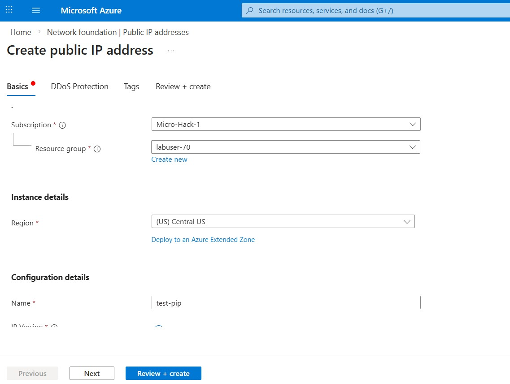

Then press **Review + create**:

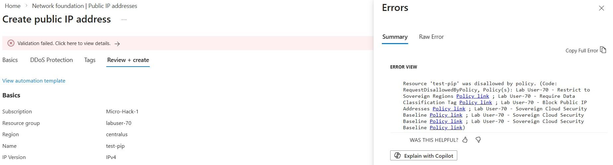

🔑 **Testing Best Practice**: Always test both positive (should succeed) and negative (should fail) cases to ensure policies work as expected.

### After Testing: Restore Non-Enforcing Mode

**Using Azure Portal:** Edit the same three assignments and set **Policy enforcement: Do not enforce**, then **Review + save > Save**. Leave the bonus initiative and the other assignments non-enforcing too.

**Using Azure CLI:**

```bash
for suffix in restrict-to-sovereign-regions require-data-classification-tag block-public-ip-addresses; do
  az policy assignment update \
    --name "${ATTENDEE_ID}-${suffix}" \
    --scope "/subscriptions/$SUBSCRIPTION_ID/resourceGroups/$RESOURCE_GROUP" \
    --enforcement-mode DoNotEnforce || {
      echo "Could not restore ${ATTENDEE_ID}-${suffix}. Stop and correct this assignment before continuing." >&2
      break
    }
done

az policy assignment list \
  --scope "/subscriptions/$SUBSCRIPTION_ID/resourceGroups/$RESOURCE_GROUP" \
  --query "[].{Name:displayName,Mode:enforcementMode}" \
  -o table
```

Verify all your Tasks 2-5 assignments show `DoNotEnforce`, and allow propagation before continuing to Task 10. A denied deployment leaves no resource to remediate; Task 10 deliberately creates an untagged test resource after enforcement is disabled.

---

## Task 10: Remediate Non-Compliant Resources

💡 **Remediation tasks allow you to automatically fix non-compliant resources, such as adding missing tags or changing configurations.**

### Understanding Remediation

- **DeployIfNotExists (DINE)**: Deploys a template if a condition is not met
- **Modify**: Changes resource properties (e.g., adds tags)
- **Remediation Task**: A job that applies DINE or Modify effects to existing resources
- **Managed Identity**: Required for remediation tasks to have permissions to modify resources

### Before Remediation: Create an Untagged Test Resource

Verify Task 9's three assignments are back in **DoNotEnforce**. Before creating the modify assignment below, create one empty storage account without `DataClassification`, using the Test 3 portal settings and a new unique name. This time it should be created. Alternatively:

```bash
REMEDIATION_STORAGE_NAME="remediatestore$RANDOM"
az storage account create \
  --name "$REMEDIATION_STORAGE_NAME" \
  --resource-group "$RESOURCE_GROUP" \
  --location "norwayeast" \
  --sku Standard_LRS \
  --public-network-access Disabled
```

Confirm the account's **Tags** blade has no `DataClassification` entry (CLI: `az storage account show --name "$REMEDIATION_STORAGE_NAME" --resource-group "$RESOURCE_GROUP" --query tags`). If an existing modify policy already adds that tag, ask your organizer for a suitable test scope; do not remove or disable inherited policies. The tag remediation below applies to all applicable resources in your group, so review that scope before starting.

### Step 1: Create a Policy with Modify Effect for Tag Remediation

First, let's create a custom policy that adds the DataClassification tag if it's missing:

Create a file named `add-tag-policy-rule.json`:

```json
{
  "if": {
    "field": "[concat('tags[', parameters('tagName'), ']')]",
    "exists": "false"
  },
  "then": {
    "effect": "modify",
    "details": {
      "roleDefinitionIds": [
        "/providers/microsoft.authorization/roleDefinitions/b24988ac-6180-42a0-ab88-20f7382dd24c"
      ],
      "operations": [
        {
          "operation": "add",
          "field": "[concat('tags[', parameters('tagName'), ']')]",
          "value": "[parameters('tagValue')]"
        }
      ]
    }
  }
}
```

Create a file named `add-tag-policy-params.json`:

```json
{
  "tagName": {
    "type": "String",
    "metadata": {
      "displayName": "Tag Name",
      "description": "Name of the tag to add"
    },
    "defaultValue": "DataClassification"
  },
  "tagValue": {
    "type": "String",
    "metadata": {
      "displayName": "Tag Value",
      "description": "Value of the tag to add"
    },
    "defaultValue": "Sovereign"
  }
}
```

### Step 2: Create the Custom Policy Definition

**Using Azure Portal:** Go to **Policy > Authoring > Definitions > + Policy definition**, choose your subscription as **Definition location**, and name it `Lab User-0024 - Add DataClassification Tag`. In the **Policy rule** editor, use the outer structure `{"mode":"Indexed","parameters":{},"policyRule":{}}`: put the parameter JSON from Step 1 inside `parameters`, and the rule JSON inside `policyRule`. Keep any editor-provided outer metadata and save the definition. The two CLI input files are fragments, not a complete portal policy definition.

**Using Azure CLI:**

```bash
az policy definition create \
  --name "${ATTENDEE_ID}-add-dataclassification-tag" \
  --display-name "${DISPLAY_PREFIX} - Add DataClassification Tag" \
  --description "Adds DataClassification=Sovereign tag if missing" \
  --rules add-tag-policy-rule.json \
  --params add-tag-policy-params.json \
  --mode Indexed \
  --subscription "$SUBSCRIPTION_ID"
```

### Step 3: Assign the Policy with Managed Identity

For remediation to work, the policy assignment needs a managed identity:

**Using Azure Portal:** Open your custom definition, select **Assign**, choose your resource-group scope, and name it `Lab User-0024 - Add DataClassification Tag with Remediation`. Unlike Tasks 2-5, use **Policy enforcement: Default** here to exercise the modify effect. Keep the default tag parameters. On **Managed identity** (or **Remediation** in older portal versions), create a **system-assigned managed identity** in Norway East. Review its required Contributor permissions and create the assignment. The portal can grant the definition's required role when you have role-assignment permission; verify it under your resource group's **Access control (IAM)** before starting remediation.

**Using Azure CLI:**

```bash
POLICY_DEF_ID="/subscriptions/$SUBSCRIPTION_ID/providers/Microsoft.Authorization/policyDefinitions/${ATTENDEE_ID}-add-dataclassification-tag"

az policy assignment create \
  --name "${ATTENDEE_ID}-add-tag-with-remediation" \
  --display-name "${DISPLAY_PREFIX} - Add DataClassification Tag with Remediation" \
  --scope "/subscriptions/$SUBSCRIPTION_ID/resourceGroups/$RESOURCE_GROUP" \
  --policy "$POLICY_DEF_ID" \
  --location "norwayeast" \
  --assign-identity \
  --identity-scope "/subscriptions/$SUBSCRIPTION_ID/resourceGroups/$RESOURCE_GROUP" \
  --role "Contributor"
```

### Step 4: Create a Remediation Task

**Using Azure Portal:** After the assignment is evaluated, open **Policy > Remediation**, filter to your resource group, and select your **Add DataClassification Tag with Remediation** assignment. Select **Remediate**, review the target resources, and create the remediation task. If no resources appear, use Task 8's scan command, wait for completion, and refresh. Do not create an unrelated remediation task for the hosted control-tag initiative.

**Using Azure CLI:**

```bash
# Create remediation task for the policy assignment
az policy remediation create \
  --name "${ATTENDEE_ID}-remediate-missing-tags" \
  --policy-assignment "${ATTENDEE_ID}-add-tag-with-remediation" \
  --resource-discovery-mode ReEvaluateCompliance \
  --resource-group "$RESOURCE_GROUP"
```

### Step 5: Monitor Remediation Progress

**Using Azure Portal:** Open **Policy > Remediation > Remediation tasks**, select your task, and inspect its status and deployments. When it succeeds, open your test account's **Tags** blade and verify `DataClassification=Sovereign`. A task with zero remediated resources does not prove the tag was added; read the resource tags.

**Using Azure CLI:**

```bash
# Check remediation status
az policy remediation show \
  --name "${ATTENDEE_ID}-remediate-missing-tags" \
  --resource-group "$RESOURCE_GROUP"

# List all remediation tasks
az policy remediation list --resource-group "$RESOURCE_GROUP" -o table

az storage account show --name "$REMEDIATION_STORAGE_NAME" \
  --resource-group "$RESOURCE_GROUP" --query tags -o json
```

### Alternative: Use Built-in Tag Inheritance Policy

Azure provides a built-in policy for tag inheritance from resource groups. Treat this as an alternative, not an additional assignment for the same test.

**Using Azure Portal:** First set `DataClassification=Sovereign` on **your resource group > Tags > Save**. Assign **Inherit a tag from the resource group if missing** (ID ending `cd3aa116-8754-49c9-a813-ad46512ece54`) to that group, with name `Lab User-0024 - Inherit DataClassification Tag from RG`, tag-name parameter `DataClassification`, **Default** enforcement, and a system-assigned identity. Review the required role, then create and monitor remediation using Steps 4-5.

**Using Azure CLI:** Set the source tag without replacing the group's other tags, then assign the policy:

```bash
az tag update \
  --resource-id "/subscriptions/$SUBSCRIPTION_ID/resourceGroups/$RESOURCE_GROUP" \
  --operation Merge --tags DataClassification=Sovereign

TAG_INHERIT_POLICY="cd3aa116-8754-49c9-a813-ad46512ece54"

az policy assignment create \
  --name "${ATTENDEE_ID}-inherit-dataclassification-tag" \
  --display-name "${DISPLAY_PREFIX} - Inherit DataClassification Tag from RG" \
  --scope "/subscriptions/$SUBSCRIPTION_ID/resourceGroups/$RESOURCE_GROUP" \
  --policy "$TAG_INHERIT_POLICY" \
  --params '{
    "tagName": {
      "value": "DataClassification"
    }
  }' \
  --location "norwayeast" \
  --assign-identity \
  --identity-scope "/subscriptions/$SUBSCRIPTION_ID/resourceGroups/$RESOURCE_GROUP" \
  --role "Contributor"

# Create remediation task
az policy remediation create \
  --name "${ATTENDEE_ID}-remediate-tag-inheritance" \
  --policy-assignment "${ATTENDEE_ID}-inherit-dataclassification-tag" \
  --resource-group "$RESOURCE_GROUP"
```

🔑 **Best Practice**: Use remediation tasks for existing resources and "deny" or "modify" effects for new deployments. This ensures both existing and new resources comply with policies.

---

You can also find the same information in the Azure portal by navigating to **your resource group -> Settings -> Policies**:

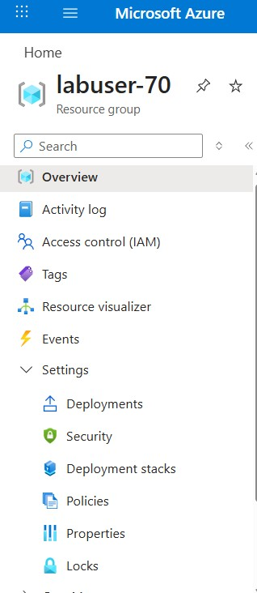

Here you should see the policy assignments you have created along with their compliance state:

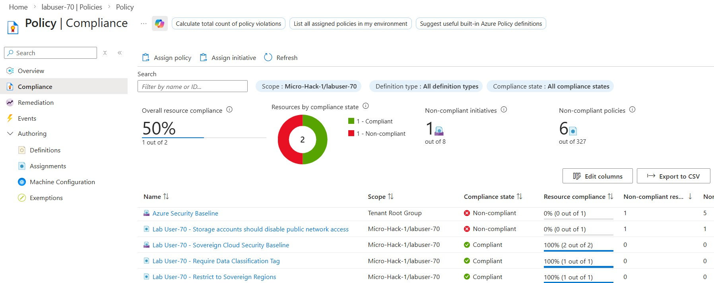

You can also navigate to the **Remediation** blade to see the remediation task you triggered previously:

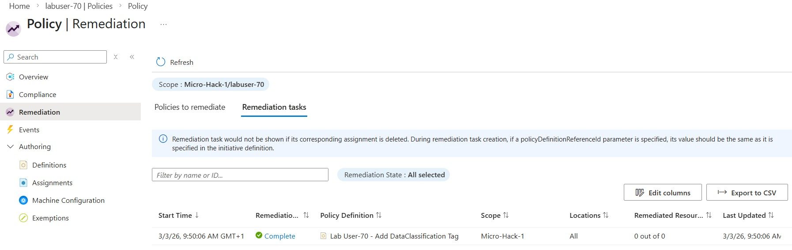

## Task 11: Create Policy Exemptions (Optional)

💡 **Sometimes you need to exempt specific resources from policies due to legitimate business reasons.**

### Step 1: Create a Policy Exemption

**Using Azure Portal:** In **Policy > Compliance**, select your `Lab User-0024 - Restrict to Sovereign Regions` assignment, open **Resource compliance**, and select the successfully created storage account from Task 9 Test 2. Choose **Create exemption**, use name `Lab User-0024 - Test Resource Exemption`, category **Waiver**, a testing justification, and an expiry seven days from today. Verify the exemption scope is that storage account, not the whole group, then create it. This demonstrates an exemption; the location assignment remains non-enforcing after Task 9.

**Using Azure CLI:** Use `STORAGE_NAME` from Test 2 (or set it to the exact account name if you used the portal). The assignment resource name below assumes CLI creation.

```bash
# Exemption for a test resource
EXEMPTION_EXPIRES=$(date -u -d '+7 days' '+%Y-%m-%dT%H:%M:%SZ')
az policy exemption create \
  --name "${ATTENDEE_ID}-test-exemption" \
  --display-name "${DISPLAY_PREFIX} - Test Resource Exemption" \
  --description "Temporary exemption for testing purposes" \
  --policy-assignment "/subscriptions/$SUBSCRIPTION_ID/resourceGroups/$RESOURCE_GROUP/providers/microsoft.authorization/policyAssignments/${ATTENDEE_ID}-restrict-to-sovereign-regions" \
  --exemption-category "Waiver" \
  --expires "$EXEMPTION_EXPIRES" \
  --scope "/subscriptions/$SUBSCRIPTION_ID/resourceGroups/$RESOURCE_GROUP/providers/Microsoft.Storage/storageAccounts/$STORAGE_NAME"
```

### Exemption Categories

- **Waiver**: Resource is exempt due to business justification
- **Mitigated**: Compliance requirement is met through alternative means

### Step 2: List and Review Exemptions

**Using Azure Portal:** Open **Policy > Authoring > Exemptions**, filter to your resource group, and inspect the exemption's scope, assignment, category, and expiry. Delete only this test exemption after reviewing it if you no longer need it.

**Using Azure CLI:**

```bash
az policy exemption list \
  --scope "/subscriptions/$SUBSCRIPTION_ID/resourceGroups/$RESOURCE_GROUP/providers/Microsoft.Storage/storageAccounts/$STORAGE_NAME" \
  --query "[].{Name:name, Category:exemptionCategory, Expires:expiresOn}" -o table
```

Exemption can also be managed via the Azure portal:

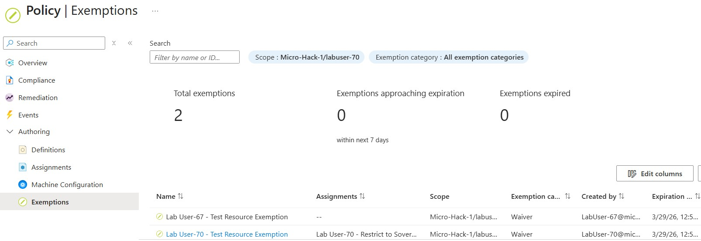

⚠️ **Warning**: Use exemptions sparingly and always document the business justification. Set expiration dates and review exemptions regularly.

---

## Validation

To verify you've successfully completed this challenge, confirm the following:

### ✅ Policy Validation

Use the results recorded during Task 9's temporary enforcement window; after restoring `DoNotEnforce`, these assignments should no longer deny requests.

1. **Location Restrictions**: Attempt to create a resource in a non-sovereign region (should fail)
2. **Tagging Requirements**: Attempt to create a resource without required tags (should fail)
3. **Public IP Block**: Attempt to create a public IP address (should fail)
4. **Compliant Deployment**: Successfully create a resource in Norway East with proper tags

### ✅ RBAC Validation

In the portal, use **your resource group > Access control (IAM) > Role assignments** to confirm the groups, roles, and scope, and **Roles > your custom role > View > Permissions** to check its definition. CLI equivalents:

```bash
# List role assignments for your resource group
az role assignment list --resource-group "$RESOURCE_GROUP" --query "[].{Principal:principalName, Role:roleDefinitionName}" -o table
```

```bash
# Verify custom role exists
az role definition list --name "${DISPLAY_PREFIX} - Sovereign Compliance Auditor" --query "[].roleName" -o tsv
```

### ✅ Compliance Dashboard Validation

1. Navigate to **Policy** > **Compliance** in Azure Portal
2. Verify you can see compliance status for all assigned policies
3. Check that successfully created resources appear after evaluation. Denied deployments create no resource to list here; inspect their policy error details and the resource group's **Activity log** instead.

### ✅ Remediation Validation

In the portal, verify both the remediation task status and `DataClassification=Sovereign` on the test storage account. CLI equivalents:

```bash
# Check remediation task status
az policy remediation list --resource-group "$RESOURCE_GROUP" -o table

# Verify resources now have required tags
az resource list --resource-group "$RESOURCE_GROUP" --query "[].{Name:name, Tags:tags}" -o json
```

---

## Preparing for Next Challenges

> [!IMPORTANT]
> Before leaving, confirm that **all your Tasks 2-5 assignments** are in **DoNotEnforce**, including the location restriction and any bonus initiative. Otherwise later challenges can be blocked. Do not change organizer-managed or inherited assignments.

**Using Azure Portal:** Go to **Policy > Assignments**, filter to your resource group, and inspect each assignment with your display prefix. Use **Edit assignment > Basics > Policy enforcement: Do not enforce > Review + save > Save** wherever needed.

**Using Azure CLI:** Repeat Task 9's restore commands if necessary, then check the modes:

```bash
az policy assignment list \
  --scope "/subscriptions/$SUBSCRIPTION_ID/resourceGroups/$RESOURCE_GROUP" \
  --query "[].{Name:displayName,Mode:enforcementMode}" \
  -o table
```

The policies still appear in **Compliance**, but no longer block deployments. `DoNotEnforce` is an assignment setting, not a change to the definition's effect.

> [!NOTE]
> If you enabled the **Bonus** Task 5 initiative contrary to the main path, restore it too (or use the portal instructions above if it was portal-created):
>
> ```bash
> az policy assignment update \
>   --name "${ATTENDEE_ID}-sovereign-baseline-assignment" \
>   --scope "/subscriptions/$SUBSCRIPTION_ID/resourceGroups/$RESOURCE_GROUP" \
>   --enforcement-mode DoNotEnforce
> ```

After Task 10 completes, also switch the **Add DataClassification Tag with Remediation** assignment (or the alternative inheritance assignment you created) to **DoNotEnforce** to prevent it automatically classifying later resources. Completed remediation tags stay in place; disabling enforcement is not an undo operation.

```bash
# Main Task 10 path; use the actual assignment name if created in the portal
az policy assignment update \
  --name "${ATTENDEE_ID}-add-tag-with-remediation" \
  --scope "/subscriptions/$SUBSCRIPTION_ID/resourceGroups/$RESOURCE_GROUP" \
  --enforcement-mode DoNotEnforce
```

For the inheritance alternative, use `${ATTENDEE_ID}-inherit-dataclassification-tag` instead. Delete only your empty test storage accounts and any unexpectedly created public IP after finishing optional Task 11; never delete the shared/assigned resource group or pre-provisioned lab resources. In the portal, open each test resource and select **Delete**. CLI users can use `az storage account delete --resource-group "$RESOURCE_GROUP" --name "<exact-test-account-name>" --yes` for each recorded test account.

## Key Takeaways

🔑 **Azure Policy** provides powerful declarative controls for enforcing compliance and governance at scale without requiring code changes or manual processes.

🔑 **Policy Initiatives** simplify management by grouping related policies into logical sets that can be assigned together.

🔑 **RBAC** implements least-privilege access control, ensuring only authorized personnel can access sovereign resources.

🔑 **Custom Roles** enable fine-grained permission models tailored to specific job functions like compliance auditing.

🔑 **Remediation Tasks** automatically bring existing resources into compliance, closing the gap between current state and desired state.

🔑 **Sovereign Cloud Controls** require a defense-in-depth approach combining location restrictions, tagging, network isolation, and access control.

---

## Next Steps

In **Challenge 2**, you'll implement encryption at rest using Customer-Managed Keys (CMK) in Azure Key Vault, adding another layer of security and control to your sovereign cloud environment.

**Optional Advanced Tasks:**

- Explore Azure Policy compliance reporting with Azure Monitor Logs
- Implement policy-as-code using Terraform or Bicep
- Create Azure Policy definitions using Azure Resource Graph queries
- Set up automated compliance notifications using Azure Logic Apps or Azure Functions

---

## Additional Resources

- [Sovereign Landing Zone (SLZ)](https://learn.microsoft.com/en-us/industry/sovereign-cloud/sovereign-public-cloud/sovereign-landing-zone/overview-slz?tabs=hubspoke)
- [Azure Policy samples repository](https://github.com/Azure/azure-policy)
- [Create and manage policies and initiatives in the portal (illustrated tutorial)](https://learn.microsoft.com/azure/governance/policy/tutorials/create-and-manage)
- [Policy compliance evaluation and on-demand scans](https://learn.microsoft.com/azure/governance/policy/how-to/get-compliance-data)
- [Azure Policy GitHub community](https://github.com/Azure/Community-Policy)
- [Azure RBAC built-in roles](https://learn.microsoft.com/azure/role-based-access-control/built-in-roles)
- [Azure Governance documentation](https://learn.microsoft.com/azure/governance/)
- [Well-Architected Framework - Security](https://learn.microsoft.com/azure/architecture/framework/security/)
