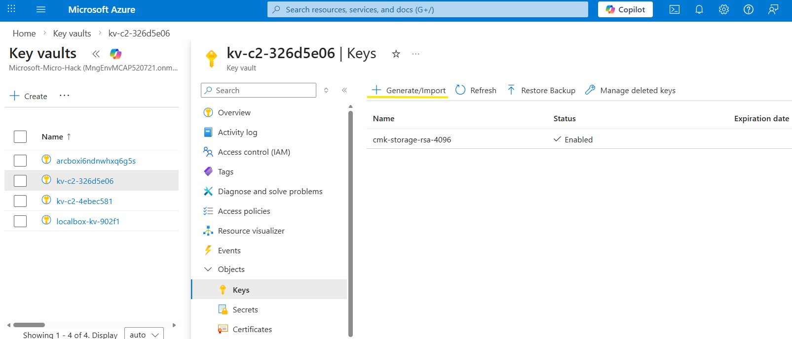
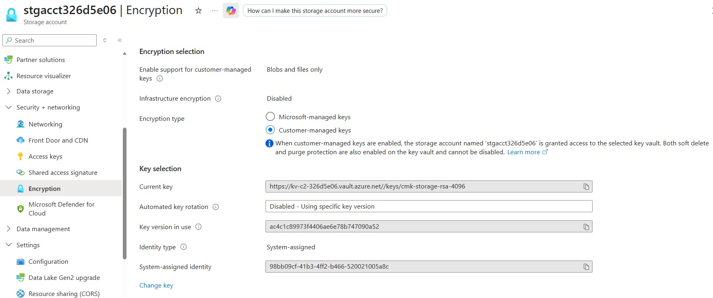
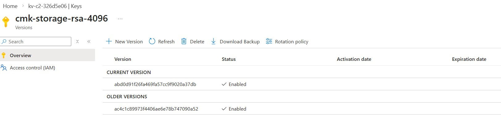

# Walkthrough Challenge 2 - Encryption at Rest with Customer-Managed Keys (CMKs) in Azure Key Vault

[Previous Challenge Solution](../challenge-01/solution-01.md) - **[Home](../../Readme.md)** - [Next Challenge Solution](../challenge-03/solution-03.md)

**Estimated Duration:** 30 minutes

> 💡 **Objective:** Understand Customer-Managed Keys in Azure Key Vault. Configure an Azure Storage account to use a customer-managed key stored in Azure Key Vault (or Azure Managed HSM) for encryption at rest. Validate the configuration and understand operational considerations for sovereign scenarios.

## Prerequisites

Please ensure that you successfully verified the [General prerequisites](../../Readme.md#general-prerequisites) before continuing with this challenge.

- Azure subscription with Contributor permissions on your resource group
- Azure CLI >= 2.54 or access to Azure Portal
- Basic understanding of Azure Key Vault and Storage encryption concepts

## Task 1: Understand Azure Key Management Options

- 🔑 **Azure platform-managed encryption**: Default data-at-rest protection delivered by Microsoft-managed keys; simplest option when regulatory posture allows provider-controlled key lifecycle and satisfies baseline compliance requirements.
- 🔑**Customer-managed keys (CMK)**: Lets you supply and rotate the encryption keys stored in Key Vault or Managed HSM, providing greater control, auditability, and separation of duties for sovereign workloads.
- 🔑**Azure Key Vault (Standard tier)**: Multi-tenant HSM-backed service offering FIPS 140-2 Level 2 compliance with SLA-backed availability, fit for most CMK scenarios that do not require dedicated hardware isolation.
- 🔑**Azure Key Vault (Premium tier)**: Adds support for HSM-protected keys with higher transaction limits, advanced features such as multi-region redundancy, and suitability for workloads demanding FIPS 140-2 Level 3 validated hardware.
- 🔑**Azure Key Vault Managed HSM**: Single-tenant, fully managed HSM cluster under customer control, enabling dedicated security domains, granular admin separation, and enhanced compliance for highly regulated environments.

---

## Task 2: Understand Customer-Managed Keys (CMK) in Azure Key Vault

- **CMK fundamentals:** Azure services encrypt data with service-managed keys, but when CMK is enabled the service wraps data encryption keys using a customer-supplied key stored in Key Vault or Managed HSM, giving you control over enable/disable, rotation, and auditing. See [Microsoft Learn — Customer-managed keys for account encryption](https://learn.microsoft.com/azure/storage/common/customer-managed-keys-overview).
- **Azure Storage coverage:** StorageV2 accounts can apply CMK at the account level or via encryption scopes for container-level isolation across Blob and Data Lake Storage Gen2 workloads. Ensure the storage account identity has `get`, `wrapKey`, and `unwrapKey` permissions on the chosen key.
- **Other CMK-enabled services:** Many Azure platforms support CMK including Azure Disk Storage, Azure SQL Database, Azure Cosmos DB, Synapse Analytics, and Azure Kubernetes Service secrets store integrations. Always validate availability in sovereign regions via the [Microsoft Learn — Services that support CMKs with Key Vault & Managed HSM](https://learn.microsoft.com/azure/key-vault/general/key-vault-integrate-sdks) catalogue.
- **Operational practices:** Plan key rotation cadence, monitor access logs for wrap/unwrap operations, and enforce least-privilege RBAC or access policies so only trusted identities can use or manage the CMK. Document recovery procedures for key disablement to avoid service outages.

---

## Task 3: CMK for Azure Storage - Implementation Steps
💡Let's use CMK for Azure Storage as an example to show how CMK works. The following implement CMK for an Azure Storage account using Azure CLI. The steps below outline the process to create a Key Vault, generate/import a key, create a storage account, and configure it to use the CMK.

- **Data at rest** in Azure Storage (Blob/Files/Tables/Queues) is encrypted by default. With **CMK**, you replace the platform-managed key with your **own key** stored in **Key Vault** (or **Managed HSM**) which you control for lifecycle, rotation, and revocation.
- **Key Vault** supplies FIPS-compliant key storage, RBAC/access policies, logging, soft-delete, and purge protection. Managed HSM can be used when hardware isolation or FIPS 140-2 Level 3 compliance is required. See [Microsoft Learn — Azure Key and Certificate Management](https://learn.microsoft.com/azure/key-vault/general/overview).
- **Sovereignty considerations:** keep keys and data in the **same sovereign region**, enforce regional scope with Azure Policy, restrict exposure using **private endpoints**, and maintain **role separation** between key custodians and storage operators. Validate the service’s CMK support list via [Microsoft Learn — Services that support CMKs in Key Vault & Managed HSM](https://learn.microsoft.com/azure/key-vault/general/key-vault-integrate-sdks).


### Step-by-Step Walkthrough (Azure CLI)

> [!IMPORTANT]
> **Prerequisite — Challenge 1 policy adjustment:** Before proceeding, make sure you completed the **"Preparing for Next Challenges"** section at the end of Challenge 1's walkthrough. The tag-requirement and public-IP-block policies must be switched to **DoNotEnforce** mode, otherwise the resource creation commands below will fail.

> [!IMPORTANT]
> The Azure CLI commands in this walkthrough use **bash** syntax and will not work directly in PowerShell. Use **Azure Cloud Shell (Bash)** for the best experience. If running locally on Windows, use **WSL2** (Windows Subsystem for Linux) to run a bash shell. You can install the Azure CLI inside WSL with:
>
> ```bash
> curl -sL https://aka.ms/InstallAzureCLIDeb | sudo bash
> ```

Set up the common variables that will be used throughout this challenge:

```bash
# Set common variables
# Customize RESOURCE_GROUP for each participant
RESOURCE_GROUP="labuser-xx"  # Change this for each participant (e.g., labuser-01, labuser-02, ...)
SUBSCRIPTION_ID="xxxxxx-xxxx-xxxx-xxxx-xxxxxxxxxx"  # Replace with your subscription ID
LOCATION="norwayeast"  # If attending a MicroHack event, change to the location provided by your local MicroHack organizers
```

> [!WARNING]
> If your Azure Cloud Shell session times out (e.g. during a break), the variables defined above will be lost and must be re-defined before continuing. We recommend saving them in a local text file on your machine so you can quickly copy and paste them back into a new session.

#### 1) Create Resource Group (only if needed, for Microsoft-hosted events this is pre-provisioned)

```bash
az group create -n $RESOURCE_GROUP -l $LOCATION
```

#### Generate a short hash from RESOURCE_GROUP with random component for uniqueness
```bash
HASH_SUFFIX=$(echo -n "${RESOURCE_GROUP}-${RANDOM}-${RANDOM}" | md5sum | cut -c1-8)
```

#### 2) Create a Key Vault with Soft-Delete & Purge Protection

```bash
KEYVAULT_NAME="kv-c2-${HASH_SUFFIX}"

az keyvault create \
  -n $KEYVAULT_NAME \
  -g $RESOURCE_GROUP \
  -l $LOCATION \
  --enable-purge-protection true \
  --sku standard

```

> **Note:** Soft-delete is enabled by default. Purge protection prevents hard deletion even by administrators, supporting regulatory retention requirements. Ensure the vault resides in-region with the storage account.

#### 3) Generate or Import a Key

* **Option A: Generate RSA key in Key Vault**

> **RBAC model:** Make sure you have RBAC role setup as "Key Vault Administrator" or "Key Vault Crypto Officer"

```bash
CURRENT_USER_ID=$(az ad signed-in-user show --query id -o tsv)

# Assign Key Vault Secrets Officer role to current user
az role assignment create \
  --role "Key Vault Crypto Officer" \
  --assignee $CURRENT_USER_ID \
  --scope $(az keyvault show --name $KEYVAULT_NAME --resource-group $RESOURCE_GROUP --query id -o tsv)
```

```bash
az keyvault key create \
  --vault-name $KEYVAULT_NAME \
  --name cmk-storage-rsa-4096 \
  --kty RSA \
  --size 4096
```

* **Option B: Import an existing key (PEM/JWK)**

```bash
az keyvault key import \
  --vault-name $KEYVAULT_NAME \
  --name cmk-storage-imported \
  --file /path/to/key.pem
```

> **Portal alternative:** Key Vaults -> your key vault > Keys > Generate/Import.



#### 4) Create Storage Account

```bash
STORAGEACCOUNT_NAME="stgacct${HASH_SUFFIX}"

# Create storage account
az storage account create \
  -n $STORAGEACCOUNT_NAME \
  -g $RESOURCE_GROUP \
  -l $LOCATION \
  --sku Standard_GRS \
  --kind StorageV2 \
  --https-only true
```

> **Tip:** Use `--allow-blob-public-access false` and private endpoints when locality and data exfiltration policies apply.

#### 5) Grant Storage Service access to the Key (Key Permissions)

> **RBAC model:** The storage account must have `get`, `wrapKey`, and `unwrapKey` permissions on the key. You may use Key Vault access policies or RBAC; both are shown with CLI.

```bash
# Enable system-assigned managed identity (required to authenticate to Key Vault)
az storage account update -n $STORAGEACCOUNT_NAME -g $RESOURCE_GROUP --assign-identity
```

Wait at least 20 seconds before running the next command to wait for eventual consistency in the backend (required for the managed identity principal ID to become available)

```bash
# Capture the managed identity principal ID (Bash syntax)
STORAGEACCOUNT_PRINCIPAL_ID=$(az storage account show -n $STORAGEACCOUNT_NAME -g $RESOURCE_GROUP --query "identity.principalId"  -o tsv)

# Set the correct Scope
KV_SCOPE="/subscriptions/$SUBSCRIPTION_ID/resourceGroups/$RESOURCE_GROUP/providers/Microsoft.KeyVault/vaults/$KEYVAULT_NAME"

# Apply Key Vault role assignment for key operations
az role assignment create \
  --assignee $STORAGEACCOUNT_PRINCIPAL_ID \
  --role "Key Vault Crypto Service Encryption User" \
  --scope "${KV_SCOPE}"
```

#### 6) Configure Storage to Use the CMK

```bash
KEY_ID=$(az keyvault key show --vault-name $KEYVAULT_NAME --name cmk-storage-rsa-4096 --query "key.kid" -o tsv)
KEY_NAME=$(basename "$(dirname "$KEY_ID")")
KEY_VERSION=$(basename "$KEY_ID")
```

```bash
az storage account update \
  -n $STORAGEACCOUNT_NAME \
  -g $RESOURCE_GROUP \
  --encryption-key-source Microsoft.Keyvault \
  --encryption-key-name $KEY_NAME \
  --encryption-key-version $KEY_VERSION \
  --encryption-key-vault https://$KEYVAULT_NAME.vault.azure.net/
```

> **Rotation tip:** Omit `--encryption-key-version` to always use the latest key version, reducing manual steps during key rotation.
>
> **Portal alternative:** Storage accounts -> your storrage account > Security + networking > Encryption > Customer-managed keys > Select Key Vault key.



---

### Validation

#### A) Verify Encryption Settings (CLI)

```bash
az storage account show -n $STORAGEACCOUNT_NAME -g $RESOURCE_GROUP --query "encryption"
```

Expected values:
- `keySource` equals `Microsoft.Keyvault`.
- `keyVaultProperties` contains `keyName`, `keyVersion`, and the vault URI.

#### B) Portal Check

- Navigate to **Storage account** > **Encryption**.
- Confirm **Customer-managed key** is selected, referencing your Key Vault key.
- Review **Encryption scopes** if granular encryption is used for multiple keys.

#### C) Audit Key Usage

- In **Key Vault** > **Monitoring** > **Diagnostic settings**, send logs to Log Analytics or Event Hub to track wrap/unwrap operations.
- Use `az monitor activity-log list --status Succeeded --caller $STORAGEACCOUNT_PRINCIPAL_ID` to cross-check control-plane events.

---

### Key Rotation

```bash
az keyvault key rotate --vault-name $KEYVAULT_NAME --name cmk-storage-rsa-4096
```

- When a new key version is created, the storage account automatically uses it if no explicit `keyVersion` is set.
- If a fixed version is configured, rerun Step 6 with the new version value.
- Document rotation cadence and approvals for sovereign compliance.

If you navigate to the key inside your Key Vault, you should now see a new version:



---

### Troubleshooting

- **403 Forbidden when wrapping key:** Confirm the storage account managed identity has `get`, `wrapKey`, `unwrapKey` permissions and the key state is `enabled`.
- **Key not found or disabled:** Verify `keyVaultUri`, `keyName`, and version. Check key attributes in Key Vault > Keys.
- **Network access denied:** Review Key Vault networking restrictions; allow trusted services or configure private endpoints/VNet integration.
- **Rotation failures:** If you specified a key version, update the storage encryption settings after rotation; otherwise the service continues referencing the old version.
- **RBAC latency:** Newly granted roles can take several minutes to propagate—wait or reauthenticate before retrying operations.

---

### Clean-Up (Safe)

```bash
# Optional: revert to platform-managed key before deletion
az storage account update \
  -n $STORAGEACCOUNT_NAME \
  -g $RESOURCE_GROUP \
  --encryption-key-source Microsoft.Storage

# Delete storage account (data becomes unrecoverable after retention window)
az storage account delete -n $STORAGEACCOUNT_NAME -g $RESOURCE_GROUP --yes

# Delete Key Vault (remains recoverable due to soft-delete/purge protection)
az keyvault delete -n $KEYVAULT_NAME -g $RESOURCE_GROUP

# Optional purge (only if policy allows; requires purge protection disabled)
# az keyvault purge --name $KEYVAULT_NAME
```

> **Note:** Evaluate legal hold, retention, and audit requirements before purging keys. With purge protection enabled, the vault persists in a recoverable state for the configured retention period.

---

## Task 4: Sovereignty & Compliance Notes

- **Regional co-location:** Place Key Vault/Managed HSM and Storage in the **same sovereign region** to meet residency mandates and reduce latency.
- **Soft-delete & purge protection:** Required to ensure keys cannot be permanently removed without oversight; verify per policy on vault creation.
- **Role separation:** Use Azure RBAC to separate key custodians (Key Vault Administrator) from storage data operators (Storage Account Contributor).
- **Connectivity:** Enforce **private endpoints**, network rules, and Azure Firewall to keep traffic within trusted boundaries.
- **Service scope:** Confirm dependent services (Azure Data Lake Storage Gen2, Synapse, etc.) support CMKs in the target region using the Microsoft Learn compatibility list.

---

## References

- [Azure Key & Certificate Management — Microsoft Learn](https://learn.microsoft.com/azure/key-vault/general/overview)
- [Services that support CMKs with Key Vault & Managed HSM — Microsoft Learn](https://learn.microsoft.com/azure/key-vault/general/key-vault-integrate-sdks)
- [Customer-managed keys for account encryption — Azure Storage — Microsoft Learn](https://learn.microsoft.com/azure/storage/common/customer-managed-keys-overview)

---

You successfully completed challenge 2! 🚀🚀🚀

 **[Home](../../Readme.md)** - [Next Challenge Solution](../challenge-03/solution-03.md)
