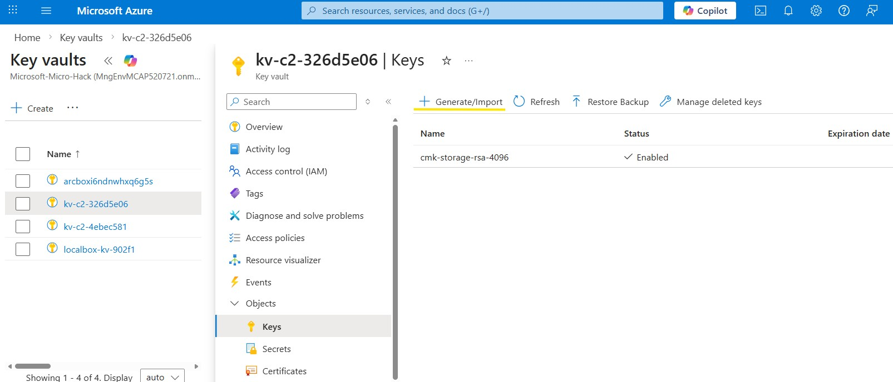
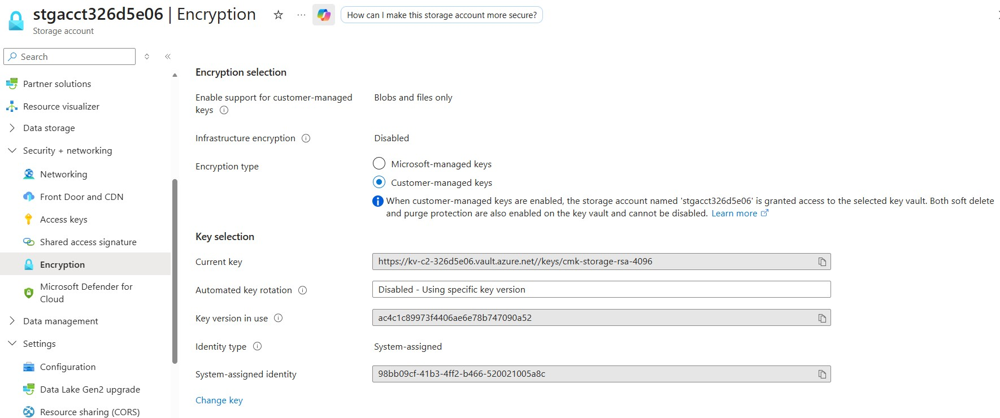
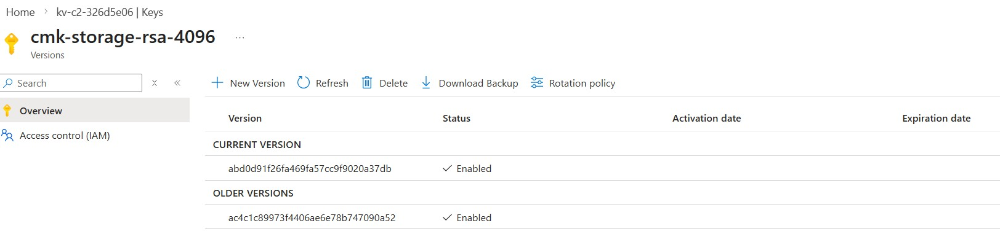

# Walkthrough Challenge 2 - Encryption at Rest with Customer-Managed Keys (CMKs) in Azure Key Vault

**Estimated Duration:** 30 minutes

> 💡 **Objective:** Understand Customer-Managed Keys in Azure Key Vault. Configure an Azure Storage account to use a customer-managed key stored in Azure Key Vault (or Azure Managed HSM) for encryption at rest. Validate the configuration and understand operational considerations for sovereign scenarios.

## Prerequisites

Please ensure that you successfully verified the [General prerequisites](../../Readme.md#general-prerequisites) before continuing with this challenge.

- Azure subscription with Contributor permissions on your resource group
- Permission to assign the Key Vault roles used below (for example, Owner or User Access Administrator at the relevant scope), or organizer assistance. Contributor alone cannot grant those roles.
- Azure CLI >= 2.54 or access to Azure Portal
- Basic understanding of Azure Key Vault and Storage encryption concepts
- For **Audit Key Usage**, an existing Log Analytics workspace or permission to create one and configure diagnostic settings. The audit section below includes workspace setup; it can be reused in Challenge 3.

## Task 1: Understand Azure Key Management Options

- 🔑 **Azure platform-managed encryption**: Default data-at-rest protection delivered by Microsoft-managed keys; simplest option when regulatory posture allows provider-controlled key lifecycle and satisfies baseline compliance requirements.
- 🔑**Customer-managed keys (CMK)**: Lets you supply and rotate the encryption keys stored in Key Vault or Managed HSM, providing greater control, auditability, and separation of duties for sovereign workloads.
- 🔑**Azure Key Vault (Standard tier)**: Multi-tenant HSM-backed service offering FIPS 140-2 Level 2 compliance with SLA-backed availability, fit for most CMK scenarios that do not require dedicated hardware isolation.
- 🔑**Azure Key Vault (Premium tier)**: Adds support for HSM-protected keys with higher transaction limits, advanced features such as multi-region redundancy, and suitability for workloads demanding FIPS 140-2 Level 3 validated hardware.
- 🔑**Azure Key Vault Managed HSM**: Single-tenant, fully managed HSM cluster under customer control, enabling dedicated security domains, granular admin separation, and enhanced compliance for highly regulated environments.

---

## Task 2: Understand Customer-Managed Keys (CMK) in Azure Key Vault

- **CMK fundamentals:** Azure services encrypt data with service-managed keys, but when CMK is enabled the service wraps data encryption keys using a customer-supplied key stored in Key Vault or Managed HSM, giving you control over enable/disable, rotation, and auditing. See [Microsoft Learn — Customer-managed keys for account encryption](https://learn.microsoft.com/azure/storage/common/customer-managed-keys-overview).
- **Azure Storage coverage:** StorageV2 accounts can apply CMK at the account level or via encryption scopes for container-level isolation across Blob and Data Lake Storage Gen2 workloads. Ensure the storage account identity has `get`, `wrapKey`, and `unwrapKey` permissions on the chosen key.
- **Other CMK-enabled services:** Many Azure platforms support CMK including Azure Disk Storage, Azure SQL Database, Azure Cosmos DB, Synapse Analytics, and Azure Kubernetes Service secrets store integrations. Always validate availability in sovereign regions via the [Microsoft Learn — Services that support CMKs with Key Vault & Managed HSM](https://learn.microsoft.com/azure/security/fundamentals/encryption-customer-managed-keys-support) catalogue.
- **Operational practices:** Plan key rotation cadence, monitor access logs for wrap/unwrap operations, and enforce least-privilege RBAC or access policies so only trusted identities can use or manage the CMK. Document recovery procedures for key disablement to avoid service outages.

---

## Task 3: CMK for Azure Storage - Implementation Steps
💡Let's use CMK for Azure Storage as an example to show how CMK works. The following implement CMK for an Azure Storage account using Azure CLI. The steps below outline the process to create a Key Vault, generate/import a key, create a storage account, and configure it to use the CMK.

- **Data at rest** in Azure Storage (Blob/Files/Tables/Queues) is encrypted by default. With **CMK**, you replace the platform-managed key with your **own key** stored in **Key Vault** (or **Managed HSM**) which you control for lifecycle, rotation, and revocation.
- **Key Vault** supplies FIPS-compliant key storage, RBAC/access policies, logging, soft-delete, and purge protection. Managed HSM can be used when hardware isolation or FIPS 140-2 Level 3 compliance is required. See [Microsoft Learn — Azure Key and Certificate Management](https://learn.microsoft.com/azure/key-vault/general/overview).
- **Sovereignty considerations:** keep keys and data in the **same sovereign region**, enforce regional scope with Azure Policy, restrict exposure using **private endpoints**, and maintain **role separation** between key custodians and storage operators. Validate the service's CMK support list via [Microsoft Learn — Services that support CMKs in Key Vault & Managed HSM](https://learn.microsoft.com/azure/security/fundamentals/encryption-customer-managed-keys-support).


### Step-by-Step Walkthrough (Azure CLI)

> [!IMPORTANT]
> **Prerequisite — Challenge 1 policy adjustment:** Complete [Preparing for Next Challenges](../challenge-01/solution-01.md#preparing-for-next-challenges). All your Challenge 1 governance assignments, including the storage public-network-access restriction and bonus initiative, must be in **DoNotEnforce**. Do not disable organizer-managed or inherited policies.

> [!IMPORTANT]
> Use a **Bash terminal in your [Sovereign Cloud Codespace](../../Readme.md#recommended-environment-github-codespaces)**. These commands use Bash syntax, not PowerShell. Azure Cloud Shell (Bash) or a local Bash terminal with Azure CLI is an alternative for this challenge.

Set up the common variables that will be used throughout this challenge:

```bash
# Set common variables
# Customize RESOURCE_GROUP for each participant
RESOURCE_GROUP="rg-labuser-0024"  # Replace with your exact assigned resource-group name
SUBSCRIPTION_ID="xxxxxx-xxxx-xxxx-xxxx-xxxxxxxxxx"  # Replace with your subscription ID
LOCATION="norwayeast"  # If attending a MicroHack event, change to the location provided by your local MicroHack organizers
az account set --subscription "$SUBSCRIPTION_ID"
```

> [!WARNING]
> Reinitialize your variables in a new terminal or after restarting your environment. Save the actual generated resource names too, so you can reuse them instead of generating new names. See [saving and restoring your work](../../Readme.md#terminals-breaks-and-saved-work).

#### 1) Create Resource Group (only if needed, for Microsoft-hosted events this is pre-provisioned)

```bash
az group create -n $RESOURCE_GROUP -l $LOCATION
```

#### Generate a short hash from RESOURCE_GROUP with random component for uniqueness
```bash
HASH_SUFFIX=$(echo -n "${RESOURCE_GROUP}-${RANDOM}-${RANDOM}" | md5sum | cut -c1-8)
```

#### 2) Create a Key Vault with Soft-Delete & Purge Protection

```bash
KEYVAULT_NAME="kv-c2-${HASH_SUFFIX}"

az keyvault create \
  -n $KEYVAULT_NAME \
  -g $RESOURCE_GROUP \
  -l $LOCATION \
  --enable-rbac-authorization true \
  --enable-purge-protection true \
  --sku standard

```

> **Soft-delete explained:** Deleting a vault or a key does not immediately destroy it permanently. It becomes unavailable for normal use but remains **recoverable during the retention period**. New vaults default to 90 days; a retention period of 7-90 days can be chosen at creation and cannot be changed later. **Purge protection** prevents permanent deletion before that period expires, even by administrators, and cannot be disabled once enabled. Deleted vault names remain reserved until the vault is purged. Do not delete the CMK to test this: Azure Storage depends on access to it. See [Key Vault soft-delete](https://learn.microsoft.com/azure/key-vault/general/soft-delete-overview).

#### 2a) Configure Key Vault Connectivity

For this lab, allow public access from all networks so the portal and Codespaces can reach the vault without client-IP rules.

**Azure Portal:** Open **Key Vault > Networking > Firewalls and virtual networks**, select **Allow public access from all networks**, and **Save**.

**CLI equivalent:**

```bash
az keyvault update --name "$KEYVAULT_NAME" --resource-group "$RESOURCE_GROUP" \
  --public-network-access Enabled --default-action Allow
```

> **Lab-only simplification:** Public network access does not grant access to keys; Microsoft Entra authentication and the Key Vault roles below are still required. Use private endpoints or restricted networks for production workloads.

#### 3) Generate or Import a Key

* **Option A: Generate RSA key in Key Vault**

> **RBAC model:** Make sure you have RBAC role setup as "Key Vault Administrator" or "Key Vault Crypto Officer"

```bash
CURRENT_USER_ID=$(az ad signed-in-user show --query id -o tsv)

# Assign Key Vault Crypto Officer role to current user
az role assignment create \
  --role "Key Vault Crypto Officer" \
  --assignee $CURRENT_USER_ID \
  --scope $(az keyvault show --name $KEYVAULT_NAME --resource-group $RESOURCE_GROUP --query id -o tsv)
```

```bash
az keyvault key create \
  --vault-name $KEYVAULT_NAME \
  --name cmk-storage-rsa-4096 \
  --kty RSA \
  --size 4096
```

* **Option B: Import an existing key (PEM/JWK)**

```bash
az keyvault key import \
  --vault-name $KEYVAULT_NAME \
  --name cmk-storage-imported \
  --file /path/to/key.pem
```

> **Portal alternative:** Key Vaults -> your key vault > Keys > Generate/Import.



#### 4) Create Storage Account

```bash
STORAGEACCOUNT_NAME="stgacct${HASH_SUFFIX}"

# Create storage account
az storage account create \
  -n $STORAGEACCOUNT_NAME \
  -g $RESOURCE_GROUP \
  -l $LOCATION \
  --sku Standard_GRS \
  --kind StorageV2 \
  --https-only true
```

> **Tip:** Use `--allow-blob-public-access false` and private endpoints when locality and data exfiltration policies apply.

#### 5) Grant Storage Service access to the Key (Key Permissions)

> **RBAC model:** The storage account must have `get`, `wrapKey`, and `unwrapKey` permissions on the key. You may use Key Vault access policies or RBAC; both are shown with CLI.

```bash
# Enable system-assigned managed identity (required to authenticate to Key Vault)
az storage account update -n $STORAGEACCOUNT_NAME -g $RESOURCE_GROUP --assign-identity
```

Wait at least 20 seconds before running the next command to wait for eventual consistency in the backend (required for the managed identity principal ID to become available)

```bash
# Capture the managed identity principal ID (Bash syntax)
STORAGEACCOUNT_PRINCIPAL_ID=$(az storage account show -n $STORAGEACCOUNT_NAME -g $RESOURCE_GROUP --query "identity.principalId"  -o tsv)

# Set the correct Scope
KV_SCOPE="/subscriptions/$SUBSCRIPTION_ID/resourceGroups/$RESOURCE_GROUP/providers/Microsoft.KeyVault/vaults/$KEYVAULT_NAME"

# Apply Key Vault role assignment for key operations
az role assignment create \
  --assignee $STORAGEACCOUNT_PRINCIPAL_ID \
  --role "Key Vault Crypto Service Encryption User" \
  --scope "${KV_SCOPE}"
```

#### 6) Configure Storage to Use the CMK

```bash
KEY_ID=$(az keyvault key show --vault-name $KEYVAULT_NAME --name cmk-storage-rsa-4096 --query "key.kid" -o tsv)
KEY_NAME=$(basename "$(dirname "$KEY_ID")")
KEY_VERSION=$(basename "$KEY_ID")
```

```bash
az storage account update \
  -n $STORAGEACCOUNT_NAME \
  -g $RESOURCE_GROUP \
  --encryption-key-source Microsoft.Keyvault \
  --encryption-key-name $KEY_NAME \
  --encryption-key-version $KEY_VERSION \
  --encryption-key-vault https://$KEYVAULT_NAME.vault.azure.net/
```

> **Rotation tip:** Omit `--encryption-key-version` to always use the latest key version, reducing manual steps during key rotation.
>
> **Portal alternative:** Storage accounts -> your storrage account > Security + networking > Encryption > Customer-managed keys > Select Key Vault key.



---

### Validation

#### A) Verify Encryption Settings (CLI)

```bash
az storage account show -n $STORAGEACCOUNT_NAME -g $RESOURCE_GROUP --query "encryption"
```

Expected values:
- `keySource` equals `Microsoft.Keyvault`.
- `keyVaultProperties` contains `keyName`, `keyVersion`, and the vault URI.

#### B) Portal Check

- Navigate to **Storage account** > **Encryption**.
- Confirm **Customer-managed key** is selected, referencing your Key Vault key.
- Review **Encryption scopes** if granular encryption is used for multiple keys.

#### C) Audit Key Usage

Key Vault resource logs are not collected automatically. A **Log Analytics workspace (LAW) must exist before you select it as a diagnostic destination**. Reuse your assigned workspace, or create one in your own resource group and approved region. Log ingestion can incur charges.

**Using Azure Portal:**

1. Search for **Log Analytics workspaces > Create**. Select your subscription, existing resource group, approved region, and a name such as `law-rg-labuser-0024`. Select **Review + create > Create**. Skip creation if you already have a workspace.
2. Open **Key Vault > Monitoring > Diagnostic settings > Add diagnostic setting**.
3. Name it `keyvault-audit`, select the **AuditEvent** log category (or the **audit** category group), and choose **Send to Log Analytics workspace**.
4. Select your subscription and workspace. If a destination-table choice is shown, choose **Azure diagnostics** to match the query below, then **Save**.

**Using Azure CLI:**

```bash
LOG_ANALYTICS_WORKSPACE="law-$RESOURCE_GROUP"  # Or the name of your existing workspace

# Run only if you need a new workspace
az monitor log-analytics workspace create \
  --resource-group "$RESOURCE_GROUP" --workspace-name "$LOG_ANALYTICS_WORKSPACE" \
  --location "$LOCATION"
```

```bash
LOG_ANALYTICS_WORKSPACE_ID=$(az monitor log-analytics workspace show \
  --resource-group "$RESOURCE_GROUP" --workspace-name "$LOG_ANALYTICS_WORKSPACE" \
  --query id -o tsv)
KEYVAULT_ID=$(az keyvault show --name "$KEYVAULT_NAME" --resource-group "$RESOURCE_GROUP" \
  --query id -o tsv)

az monitor diagnostic-settings create --name keyvault-audit \
  --resource "$KEYVAULT_ID" --workspace "$LOG_ANALYTICS_WORKSPACE_ID" \
  --export-to-resource-specific false \
  --logs '[{"category":"AuditEvent","enabled":true}]'

# Generate a read event after enabling diagnostics; this does not rotate or export the private key
az keyvault key show --vault-name "$KEYVAULT_NAME" --name cmk-storage-rsa-4096 \
  --query key.kid -o tsv
```

In the workspace's **Logs** pane, switch to **KQL mode** and run the following, replacing the vault-name placeholder:

```kusto
AzureDiagnostics
| where TimeGenerated > ago(1h)
| where ResourceProvider == "MICROSOFT.KEYVAULT" and Category == "AuditEvent"
| where Resource =~ "<your-key-vault-name>"
| project TimeGenerated, OperationName, ResultType, Resource
| order by TimeGenerated desc
```

Wait for ingestion before retrying; earlier operations are not backfilled. The read above should produce a key-read event. Wrap/unwrap events depend on Azure Storage actually accessing the key, so they may not appear immediately because of caching. Empty results (or a table not yet created) are not proof that audit logging works. Verify the workspace, diagnostic category, and newly generated activity. Azure **Activity Log** covers control-plane operations and is not a substitute for these key-operation logs. Keep the workspace name for Challenge 3. See [Enable Key Vault logging](https://learn.microsoft.com/azure/key-vault/general/howto-logging).

---

### Key Rotation

```bash
az keyvault key rotate --vault-name $KEYVAULT_NAME --name cmk-storage-rsa-4096
```

- When a new key version is created, the storage account automatically uses it if no explicit `keyVersion` is set.
- If a fixed version is configured, rerun Step 6 with the new version value.
- Document rotation cadence and approvals for sovereign compliance.

If you navigate to the key inside your Key Vault, you should now see a new version:



---

### Troubleshooting

- **403 Forbidden when wrapping key:** Confirm the storage account managed identity has `get`, `wrapKey`, `unwrapKey` permissions and the key state is `enabled`.
- **Key not found or disabled:** Verify `keyVaultUri`, `keyName`, and version. Check key attributes in Key Vault > Keys.
- **Network access denied / ForbiddenByFirewall:** Confirm public access from all networks is enabled as in Step 2a. If an inherited policy blocks the change, contact the organizer rather than disabling the policy.
- **Rotation failures:** If you specified a key version, update the storage encryption settings after rotation; otherwise the service continues referencing the old version.
- **RBAC latency:** Newly granted roles can take several minutes to propagate—wait or reauthenticate before retrying operations.

---

## Task 4: Sovereignty & Compliance Notes

- **Regional co-location:** Place Key Vault/Managed HSM and Storage in the **same sovereign region** to meet residency mandates and reduce latency.
- **Soft-delete & purge protection:** Required to ensure keys cannot be permanently removed without oversight; verify per policy on vault creation.
- **Role separation:** Use Azure RBAC to separate key custodians (Key Vault Administrator) from storage data operators (Storage Account Contributor).
- **Production connectivity:** Use **private endpoints**, network rules, and Azure Firewall to keep traffic within trusted boundaries; this lab uses public endpoints for simplicity.
- **Service scope:** Confirm dependent services (Azure Data Lake Storage Gen2, Synapse, etc.) support CMKs in the target region using the Microsoft Learn compatibility list.

---

## References

- [Azure Key & Certificate Management — Microsoft Learn](https://learn.microsoft.com/azure/key-vault/general/overview)
- [Services that support CMKs with Key Vault & Managed HSM — Microsoft Learn](https://learn.microsoft.com/azure/security/fundamentals/encryption-customer-managed-keys-support)
- [Customer-managed keys for account encryption — Azure Storage — Microsoft Learn](https://learn.microsoft.com/azure/storage/common/customer-managed-keys-overview)
- [Key Vault soft-delete and purge protection](https://learn.microsoft.com/azure/key-vault/general/soft-delete-overview)
- [Key Vault network security](https://learn.microsoft.com/azure/key-vault/general/network-security)
- [Enable Key Vault logging](https://learn.microsoft.com/azure/key-vault/general/howto-logging)

---

You successfully completed challenge 2! 🚀🚀🚀
