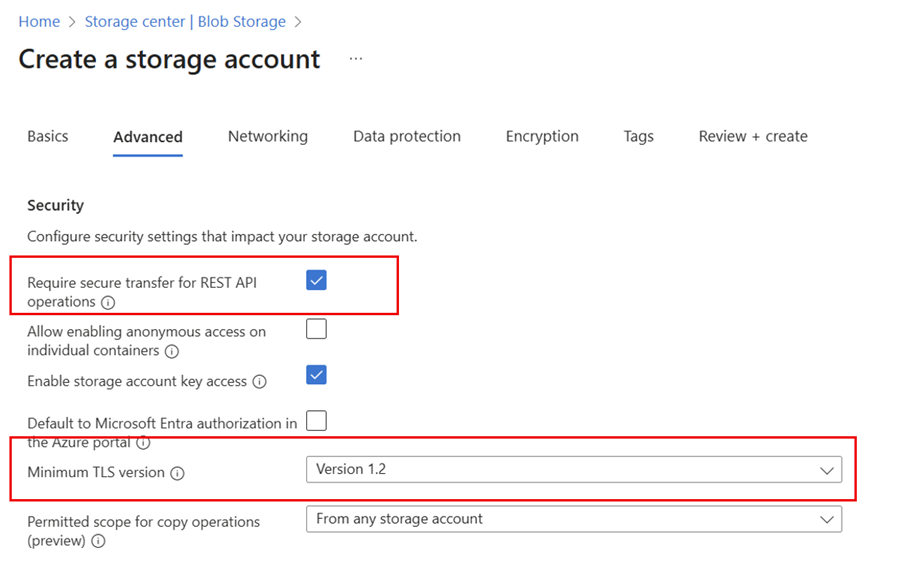
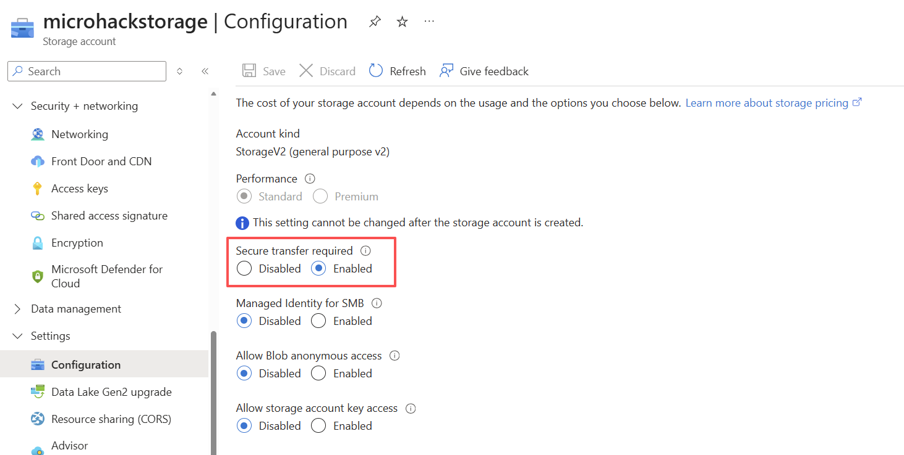
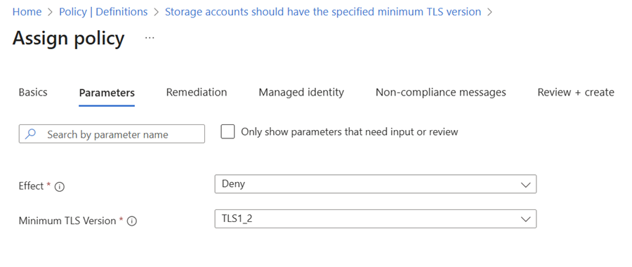
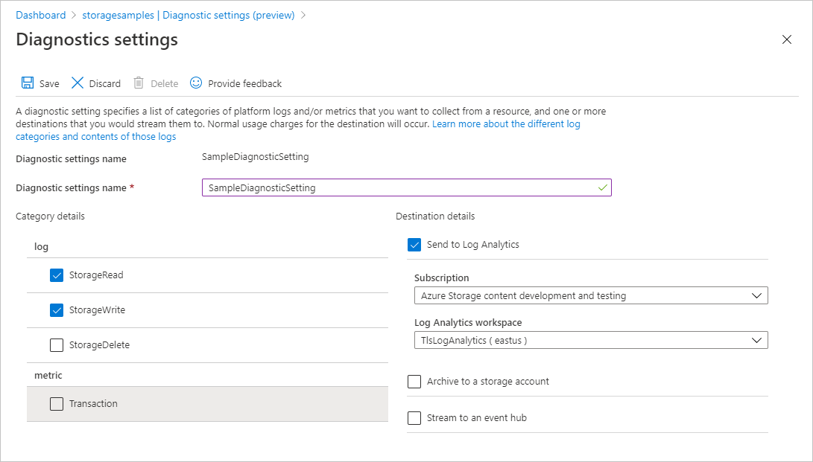
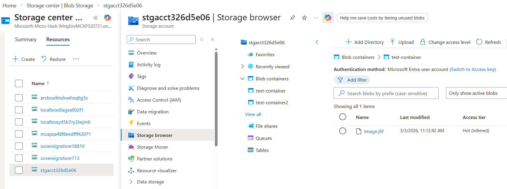
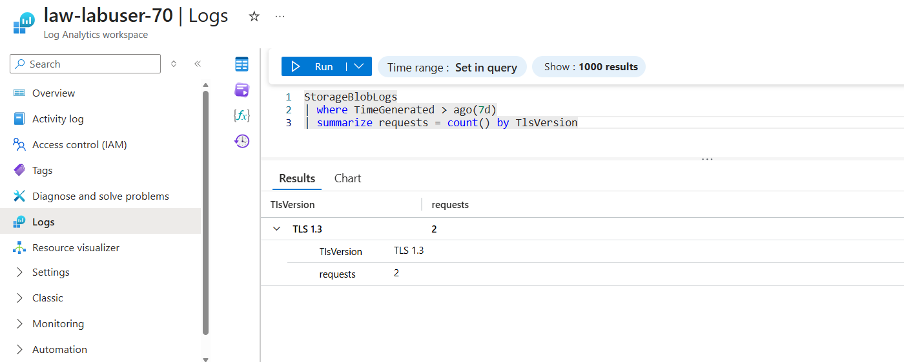
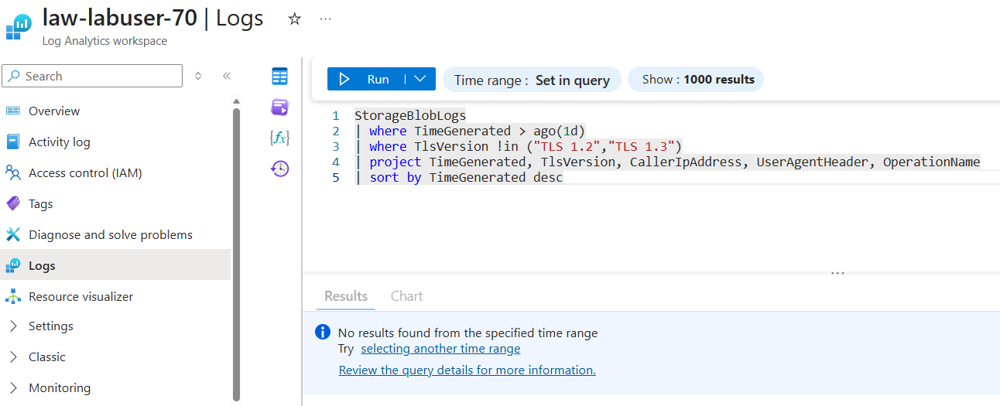

# Walkthrough Challenge 3 - Encryption in transit: enforcing TLS

[Previous Challenge Solution](../challenge-02/solution-02.md) - **[Home](../../Readme.md)** - [Next Challenge Solution](../challenge-04/solution-04.md)

**Estimated Duration:** 30 minutes

> 💡 **Objective:** Understand encryption in transit considerations for sovereign scenarios. Verify that Azure Storage accounts require secure transfer (HTTPS only), confirm the TLS 1.2+ baseline, apply Azure Policy for governance, and monitor client protocol usage through Log Analytics.

## Prerequisites

Please ensure that you successfully verified the [General prerequisites](../../Readme.md#general-prerequisites) before continuing with this challenge.

- Azure subscription with Contributor permissions on your resource group
- Azure CLI >= 2.54 or access to Azure Portal
- Existing StorageV2 account with Blob service enabled (created in Challenge 2)
- Log Analytics workspace (or permissions to create one) for collecting Storage diagnostic logs

> [!IMPORTANT]
> The Azure CLI commands in this walkthrough use **bash** syntax and will not work directly in PowerShell. Use **Azure Cloud Shell (Bash)** for the best experience. If running locally on Windows, use **WSL2** (Windows Subsystem for Linux) to run a bash shell. You can install the Azure CLI inside WSL with:
>
> ```bash
> curl -sL https://aka.ms/InstallAzureCLIDeb | sudo bash
> ```

Set up the common variables that will be used in the CLI alternatives throughout this challenge:

```bash
# Set common variables
# Customize RESOURCE_GROUP for each participant
RESOURCE_GROUP="labuser-xx"  # Change this for each participant (e.g., labuser-01, labuser-02, ...)

ATTENDEE_ID="${RESOURCE_GROUP}"
SUBSCRIPTION_ID="xxxxxx-xxxx-xxxx-xxxx-xxxxxxxxxx"  # Replace with your subscription ID
LOCATION="norwayeast"  # If attending a MicroHack event, change to the location provided by your local MicroHack organizers
# Generate friendly display names with attendee ID
DISPLAY_PREFIX="Lab User-${ATTENDEE_ID#labuser-}"  # Converts "labuser-01" to "Lab User-01"
GROUP_PREFIX="Lab-User-${ATTENDEE_ID#labuser-}"    # Converts "labuser-01" to "Lab-User-01"

STORAGEACCOUNT_NAME="yourStorageAccountName"  # Replace with the name of your storage account from Challenge 2
```

> [!WARNING]
> If your Azure Cloud Shell session times out (e.g. during a break), the variables defined above will be lost and must be re-defined before continuing. We recommend saving them in a local text file on your machine so you can quickly copy and paste them back into a new session.

## Task 1: Understand Encryption in transit

💡Encryption in transit protects data as it travels between clients and Azure services, ensuring confidentiality, integrity, and mutual authentication. Transport Layer Security (TLS) establishes a cryptographic handshake that negotiates protocol versions, cipher suites, and validates certificates before any payload flows. In Azure, enforcing TLS aligns with service-specific capabilities (e.g., Storage, Key Vault, App Service) and underpins sovereign cloud controls by preventing downgrade attacks and plaintext exposures. Azure's encryption guidance emphasizes pairing secure transport with encryption at rest to meet regulatory requirements and Zero Trust principles.

## Task 2: Understand TLS versions and current Azure Storage defaults

| TLS version | Azure Storage public HTTPS endpoint support | Recommendation |
|-------------|----------------------------------------------|----------------|
| TLS 1.0     | Retired for Azure Blob Storage as of February 3, 2026 | Do not use; update legacy clients |
| TLS 1.1     | Retired for Azure Blob Storage as of February 3, 2026 | Do not use; update legacy clients |
| TLS 1.2     | Supported | **Required minimum baseline** for Azure Storage |
| TLS 1.3     | Supported on public endpoints but cannot be enforced as the account minimum | Use when available; clients can negotiate TLS 1.3 automatically |

When you create a storage account in the Azure Portal, the minimum TLS version is set to **TLS 1.2** by default. The Portal no longer provides a useful hands-on exercise for configuring TLS 1.0 or TLS 1.1 on new storage accounts. In this challenge, you will verify the TLS setting, keep secure transfer enabled, and use Azure Policy to govern any storage accounts created through CLI, templates, automation, or older deployments where the setting may not be explicit ([learn.microsoft.com](https://learn.microsoft.com/azure/storage/common/transport-layer-security-configure-minimum-version)). Azure Resource Manager requires TLS 1.2 or later, so modernize SDKs, runtimes, and appliances that still pin older protocols ([learn.microsoft.com](https://learn.microsoft.com/azure/azure-resource-manager/management/tls-support)).

## Task 3: Hands-on: Azure Blob Storage - require secure transfer (HTTPS only) in Azure Portal

### Task prerequisites
- StorageV2 account with Blob service enabled in the target subscription (created in Challenge 2).
- Contributor permissions on the resource group hosting the account.

### Azure Portal steps
#### Require secure transfer for a new storage account
1. In the top center search bar in the Azure portal, search for **Storage accounts**
1. Click on **Create**
1. Select your own resource group, provide a unique name for the **Storage account name** and select "**Azure Blob Storage or Azure Data Lake Storage Gen2** for the **Preferred storage type** parameter
1. Click next and in the **Advanced** page, select the **Require secure transfer for REST API operations** checkbox if not already enabled.
1. Leave the rest of the parameters as-is and click **Review + create**



#### Require secure transfer for an existing storage account
1. Select an existing storage account in the Azure portal.
2. In the storage account menu pane, under **Settings**, select **Configuration**.
3. Under **Secure transfer required**, select **Enabled**.



### CLI alternative
```bash
az storage account update -g $RESOURCE_GROUP -n $STORAGEACCOUNT_NAME --https-only true
```
> **Warning:** Enabling secure transfer immediately rejects HTTP (non-TLS) requests to the Storage REST endpoints, including legacy tools or scripts. Update integrations that still rely on `http://` URIs to avoid connectivity failures ([learn.microsoft.com](https://learn.microsoft.com/en-us/azure/storage/common/storage-require-secure-transfer)).

> **Tip:** Combine secure transfer with private endpoints so client traffic stays on Microsoft's backbone while still enforcing TLS at the service boundary.

## Task 4: Hands-on: Verify and govern minimum TLS version with Azure Policy

Goal: verify the storage account uses **Minimum TLS Version = TLS 1.2** and apply policy governance so future deployments cannot drift to weaker settings.

### Verify the storage account in the Azure Portal

1. In the Azure Portal, open the storage account created in Challenge 2.
2. In the storage account menu pane, under **Settings**, select **Configuration**.
3. Confirm **Minimum TLS version** is set to **Version 1.2**.
4. If you are reviewing an older or automation-created storage account that does not show TLS 1.2, update it to **Version 1.2** and select **Save**.

### Assign Azure Policy for governance

1. In the Azure Portal, navigate to **Policy**
2. Select **Definitions**, search for **"Storage accounts should have the specified minimum TLS version"** (Policy ID `fe83a0eb-a853-422d-aac2-1bffd182c5d0`).
3. Choose **Assign**.
4. Set **Scope** to your **Labuser-xxx** resource group. **Do NOT select the subscription** — assigning at subscription scope will affect all other participants.
5. Uncheck the box: **Only show parameters that need input or review**
6. Under **Parameters**, set **Minimum TLS version** to `TLS 1.2` and (optionally) effect to `Deny`.
7. Complete **Review + Create**, then select **Create**.



### CLI alternative

Verify the current TLS configuration:

```bash
az storage account show \
  --resource-group $RESOURCE_GROUP \
  --name $STORAGEACCOUNT_NAME \
  --query "{name:name, minimumTlsVersion:minimumTlsVersion, enableHttpsTrafficOnly:enableHttpsTrafficOnly}" \
  --output table
```

If an older or automation-created storage account is not explicitly set to TLS 1.2, remediate it:

```bash
az storage account update \
  --resource-group $RESOURCE_GROUP \
  --name $STORAGEACCOUNT_NAME \
  --min-tls-version TLS1_2
```

Assign the policy to govern future changes in your lab resource group:

```bash
az policy assignment create \
  --name "${ATTENDEE_ID}-enforce-storage-min-tls12" \
  --display-name "${DISPLAY_PREFIX} - Enforce storage min TLS 1.2" \
  --policy fe83a0eb-a853-422d-aac2-1bffd182c5d0 \
  --scope /subscriptions/$SUBSCRIPTION_ID/resourceGroups/$RESOURCE_GROUP \
  --params '{ "effect": { "value": "Deny" }, "minimumTlsVersion": { "value": "TLS1_2" } }'
```

> **Note:** Use the policy's `effect = Audit` when you need discovery before enforcement. Switching to `Deny` blocks new or updated storage accounts that attempt to set weaker TLS versions through supported deployment paths ([learn.microsoft.com](https://learn.microsoft.com/azure/storage/common/transport-layer-security-configure-minimum-version); [azadvertizer.net](https://www.azadvertizer.net/azpolicyadvertizer/fe83a0eb-a853-422d-aac2-1bffd182c5d0.html)).

## Task 5: Validation: detect TLS versions used by clients (Log Analytics/KQL)

> **Tip:** You can upload or download files from your storage account, to generate traffic for Task 5. For guidance on how to upload or download files: https://learn.microsoft.com/en-us/azure/storage/blobs/storage-quickstart-blobs-portal

### Create Log Analytics workspace and Diagnostic settings to capture logs

### CLI

```bash
# Create Log Analytics workspace
LOG_ANALYTICS_WORKSPACE=law-$RESOURCE_GROUP
az monitor log-analytics workspace create --resource-group $RESOURCE_GROUP \
       --workspace-name $LOG_ANALYTICS_WORKSPACE
```

```bash
# Get the storage account resource ID
STORAGE_ACCOUNT_ID=$(az storage account show \
  --name $STORAGEACCOUNT_NAME \
  --resource-group $RESOURCE_GROUP \
  --query id --output tsv)
```

```bash
# Get the Log Analytics workspace resource ID
LOG_ANALYTICS_WORKSPACE_ID=$(az monitor log-analytics workspace show \
  --resource-group $RESOURCE_GROUP \
  --workspace-name $LOG_ANALYTICS_WORKSPACE \
  --query id --output tsv)
```

```bash
# Create diagnostic setting for blob service with StorageRead and StorageWrite categories
az monitor diagnostic-settings create \
  --name blob-tls-insights \
  --resource ${STORAGE_ACCOUNT_ID}/blobServices/default \
  --workspace $LOG_ANALYTICS_WORKSPACE_ID \
  --logs '[
    {
      "category": "StorageRead",
      "enabled": true
    },
    {
      "category": "StorageWrite",
      "enabled": true
    }
  ]'
```

### Azure Portal steps

1. Open the storage account and go to **Monitoring > Diagnostic settings**.
2. Select **+ Add diagnostic setting**.
3. Name the setting (e.g., `blob-tls-insights`).
4. Check **Blob** under **Logs**.
5. Choose **Send to Log Analytics workspace** and select an existing workspace (or create one beforehand).
6. Save the diagnostic setting.



### Create a Container and perform a blob upload and download

#### Grant access to the current user id to the Blob storage service

```bash
# Get your current user's object ID
CURRENT_USER_ID=$(az ad signed-in-user show --query id --output tsv)

# Assign the "Storage Blob Data Contributor" role to your user
az role assignment create \
  --role "Storage Blob Data Contributor" \
  --assignee $CURRENT_USER_ID \
  --scope /subscriptions/$SUBSCRIPTION_ID/resourceGroups/$RESOURCE_GROUP/providers/Microsoft.Storage/storageAccounts/$STORAGEACCOUNT_NAME

```

#### Create a Container

Use the Azure Portal to create a new container or use CLI below

```bash
# Create a blob storage container
# Create a container named "test-container"
az storage container create \
  --name test-container \
  --account-name $STORAGEACCOUNT_NAME \
  --auth-mode login
```

- In the Azure portal, search for **Storage accounts** in the top center search bar and navigate to the storage account which resides in your resource group.
- Click on the menu blade **Storage browser**, navigate to **Blob containers** -> **test-container** and click the **Upload**-button to upload a sample file (e.g. an image or text-file) from your local computer to generate some traffic/logs



- In the Azure portal, search for **Log Analytics workspaces** in the top center search bar and navigate to the workspace which resides in your resource group.
- Click on **Logs**, close any welcome/introduction-notifications, select **KQL mode** and run the following queries:

```kusto
StorageBlobLogs
| where TimeGenerated > ago(1d)
| summarize requests = count() by TlsVersion
```



```kusto
StorageBlobLogs
| where TimeGenerated > ago(1d)
| where TlsVersion !in ("TLS 1.2","TLS 1.3")
| project TimeGenerated, TlsVersion, CallerIpAddress, UserAgentHeader, OperationName
| sort by TimeGenerated desc
```



Confirm that requests use TLS 1.2 or TLS 1.3.

> **Tip:** If older TLS usage appears in historical logs, upgrade client frameworks (e.g., .NET, Java, Python SDKs), avoid hardcoded protocol versions, and rely on OS defaults that negotiate TLS 1.2+ ([learn.microsoft.com](https://learn.microsoft.com/azure/storage/common/transport-layer-security-configure-minimum-version)).

## Results & acceptance criteria

- ✅ Storage accounts reject HTTP requests and enforce HTTPS (secure transfer required) ([learn.microsoft.com](https://learn.microsoft.com/en-us/azure/storage/common/storage-require-secure-transfer)).
- ✅ Policy compliance shows all storage accounts governed with **Minimum TLS Version = TLS 1.2** ([learn.microsoft.com](https://learn.microsoft.com/azure/storage/common/transport-layer-security-configure-minimum-version?toc=%2Fazure%2Fstorage%2Fblobs%2Ftoc.json&tabs=portal#use-azure-policy-to-audit-for-compliance)).
- ✅ Log Analytics reports only TLS 1.2 or TLS 1.3 requests in the past 7 days ([learn.microsoft.com](https://learn.microsoft.com/azure/storage/common/transport-layer-security-configure-minimum-version?toc=%2Fazure%2Fstorage%2Fblobs%2Ftoc.json&tabs=portal#detect-the-tls-version-used-by-client-applications)).

## References

- [Azure encryption overview](https://learn.microsoft.com/en-us/azure/security/fundamentals/encryption-overview)
- [Require secure transfer (HTTPS only) for Storage](https://learn.microsoft.com/en-us/azure/storage/common/storage-require-secure-transfer)
- [Enforce a minimum required TLS version for Storage](https://learn.microsoft.com/en-us/azure/storage/common/transport-layer-security-configure-minimum-version)
- [Azure Resource Manager TLS support](https://learn.microsoft.com/en-us/azure/azure-resource-manager/management/tls-support)
- [Policy: Storage accounts should have the specified minimum TLS version](https://learn.microsoft.com/en-us/azure/storage/common/transport-layer-security-configure-minimum-version?toc=%2Fazure%2Fstorage%2Fblobs%2Ftoc.json&tabs=portal#detect-the-tls-version-used-by-client-applications)

---

You successfully completed challenge 3! 🚀🚀🚀

 **[Home](../../Readme.md)** - [Next Challenge Solution](../challenge-04/solution-04.md)
