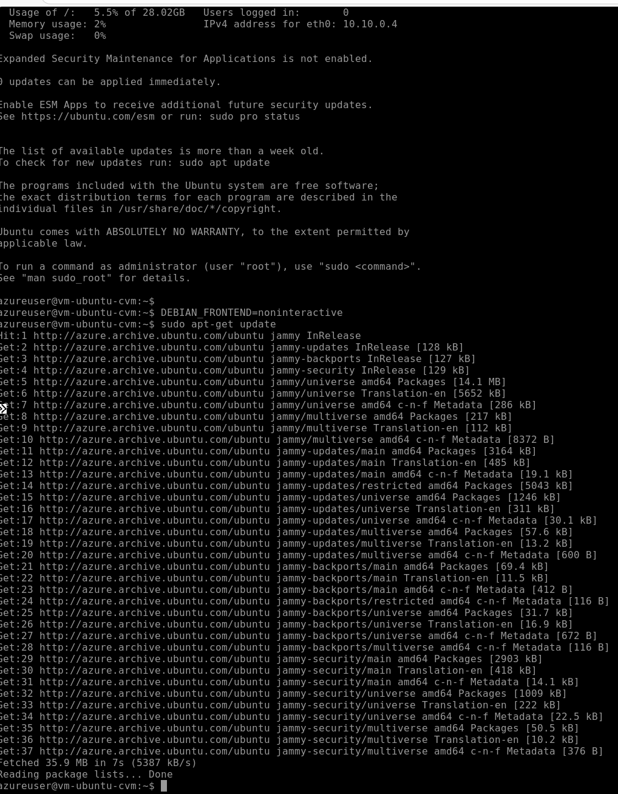
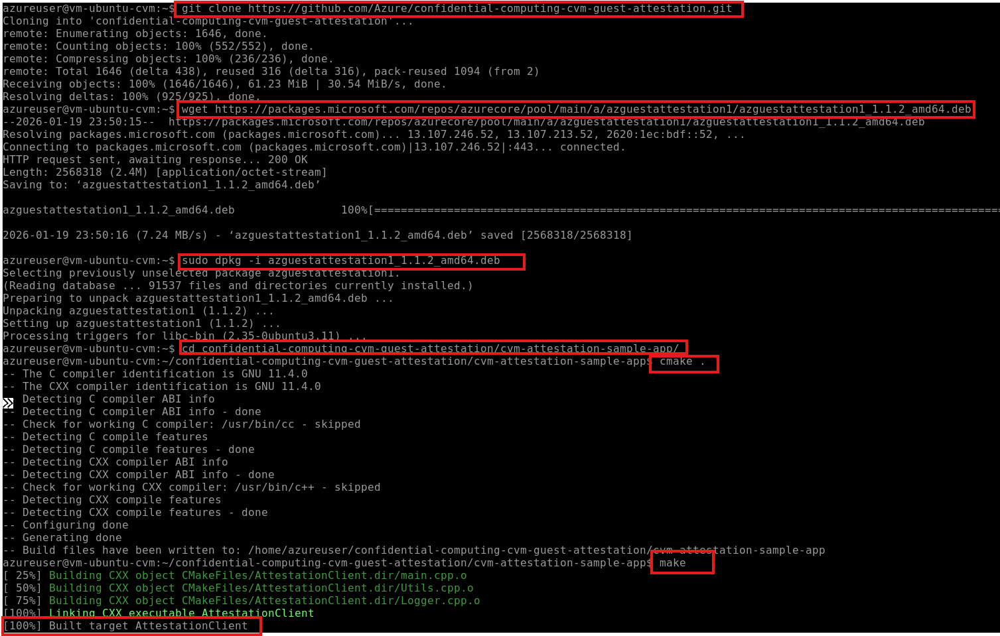

# Walkthrough Challenge 4 - Encryption in use with Azure Confidential Compute – VM
# Azure Portal Guide

**Estimated Duration:** 45-60 minutes

> 💡 **Objective:** Validate guest attestation on a pre-provisioned Azure Confidential VM using the Azure Portal to confirm that workloads execute only in trusted, hardware-backed confidential computing environments. You will inspect the VM's security configuration through the portal, connect through Azure Bastion using username/password credentials, build and run attestation client applications, and verify cryptographic proof of VM integrity using your dedicated Microsoft Azure Attestation (MAA) provider.

## Prerequisites

Please ensure that you successfully verified the [General prerequisites](../../Readme.md#general-prerequisites) before continuing with this challenge.

- Azure Portal access (https://portal.azure.com)
- Lab dashboard credentials (Resource Group Name, Confidential VM, Confidential VM Admin Username, Confidential VM Admin Password, Attestation Provider, Sovereign Lab Bastion)
- Access to Azure Cloud Shell
- Basic understanding of Azure Virtual Machines and confidential computing concepts

## Scenario Context

You are a security architect at a European financial services organization that processes highly sensitive customer data and must comply with strict data sovereignty and protection requirements. Your organization has determined that traditional encryption at rest and in transit is insufficient for protecting high-value workloads.

Your mandate includes:

- **Encryption in Use**: Data must be protected even while being processed, not just when stored or transmitted
- **Hardware-Based Trust**: Security guarantees must be rooted in hardware, not just software configurations
- **Attestation Requirements**: Workloads must verify they are running in a genuine confidential environment before processing sensitive data
- **Zero Trust Architecture**: Never assume trust; always verify the execution environment cryptographically
- **Regulatory Compliance**: Meet stringent requirements for data protection in financial services

In this challenge, you'll implement Azure Confidential Computing using AMD SEV-SNP technology to create a hardware-based Trusted Execution Environment (TEE). You'll configure guest attestation to provide cryptographic proof that your workload is running in a protected environment before it processes any sensitive operations.

### Understanding Guest Attestation

Guest attestation helps you confirm that your confidential VM environment is secured by a genuine hardware-backed Trusted Execution Environment (TEE) with security features enabled for isolation and integrity.

**You can use guest attestation to:**

- **Verify hardware platform** - Confirm the confidential VM runs on expected AMD SEV-SNP hardware
- **Validate secure boot** - Verify secure boot is enabled, protecting firmware, bootloader, and kernel from malware
- **Provide cryptographic evidence** - Obtain JWT tokens proving the VM runs on confidential hardware
- **Prevent data exposure** - Ensure workloads refuse to start in untrusted environments

### Attestation Workflow Pattern

### Attestation Workflow Pattern


In this challenge, you will implement a common pattern where **attestation requests are made from inside the workload** at program startup. The workload verifies that it's running on the correct hardware platform before executing any sensitive business logic.

**How it works:**

1. Your workload starts on the Confidential VM
2. Before processing any sensitive data, the workload calls the attestation library
3. The attestation library contacts Microsoft Azure Attestation (MAA) to verify the TEE environment
4. The workload parses the attestation response (JWT token) to confirm:
   - The VM runs on genuine AMD SEV-SNP confidential hardware
   - Secure boot is enabled and validated
   - The VM guest state is protected
5. Only after successful verification does the workload proceed with sensitive operations

**Why this matters:**

This pattern ensures your application never processes sensitive data in an untrusted environment. If attestation fails (e.g., the code is running on a standard VM or a compromised environment), the workload can refuse to start or handle data differently.

### Learning Resources

- [Azure Confidential Computing overview](https://learn.microsoft.com/azure/confidential-computing/overview)
- [Confidential VM concepts](https://learn.microsoft.com/azure/confidential-computing/confidential-vm-overview)
- [Guest attestation for confidential VMs](https://learn.microsoft.com/azure/confidential-computing/guest-attestation-confidential-vms)
- [Microsoft Azure Attestation](https://learn.microsoft.com/azure/attestation/overview)

### Original Source Materials

This challenge is based on the **Confidential VM Guest Attestation Sample Application** from the Microsoft Azure Confidential Computing repository:

- **Main Repository**: [Azure Confidential Computing CVM Guest Attestation](https://github.com/Azure/confidential-computing-cvm-guest-attestation)
- **Source Module**: [CVM Attestation Sample App](https://github.com/Azure/confidential-computing-cvm-guest-attestation/tree/main/cvm-attestation-sample-app)

The sample application and deployment patterns have been adapted for this MicroHack challenge to provide a guided learning experience with Azure Confidential VMs using the Azure Portal.

---

## Task 1: Locate Pre-Provisioned Resources

💡 **The platform has pre-provisioned a private Ubuntu Confidential VM, a shared Standard Azure Bastion, and a custom Attestation Provider in your resource group. No resource creation is needed — your focus is on validating the environment and running guest attestation.**

### Pre-Provisioned Resources

Locate the following values on your lab dashboard before proceeding:

| Dashboard Field | Description |
|---|---|
| **Resource Group Name** | Your dedicated resource group containing all lab resources |
| **Sovereign Lab Region** | Azure region where the CVM and Attestation Provider are deployed |
| **Confidential VM** | Name of the pre-provisioned private Ubuntu 22.04 Confidential VM |
| **Confidential VM Admin Username** | Username for Bastion login |
| **Confidential VM Admin Password** | Password for Bastion login |
| **Attestation Provider** | Name of the custom MAA provider (note field contains the full Attest URI) |
| **Sovereign Lab Bastion** | Name of the shared Standard Azure Bastion for private VNet access |

> [!IMPORTANT]
> Copy the **Attestation Provider** Attest URI from the dashboard note field — you will need it in Task 3 when running the attestation client inside the VM.

### Security Architecture

This environment uses a zero-trust security model:

- **No Public IPs on VMs** - Confidential VM is not directly accessible from the internet
- **Azure Bastion (Standard SKU)** - Provides secure RDP/SSH access through the Azure Portal
- **Hardware-Based Encryption** - AMD SEV-SNP encrypts VM memory at the hardware level
- **Secure Boot** - Protects boot chain integrity from firmware through kernel
- **Regional Fallback** - The Attestation Provider is deployed with regional fallback for sovereign Azure region availability

🔑 **Security Best Practice**: This architecture ensures VM access is authenticated through Azure AD, encrypted with TLS, and never exposes SSH directly to the internet.

---

## Task 2: Inspect Confidential VM Security Settings in the Portal

💡 **Before connecting, verify that the pre-provisioned Confidential VM is configured with the required security features.**

| Step | Action | Screenshot |
|------|--------|------------|
| 1. In the search bar, type **"Resource groups"** and select it<br>2. Click on your resource group (**Resource Group Name** from your dashboard) | | |
| 3. In the resource list, click on the Confidential VM (**Confidential VM** from your dashboard) | | |
| 4. On the **Overview** blade, confirm:<br>   - **Security type**: `Confidential virtual machines` | | |
| 5. In the left menu under **Settings**, click **Security**:<br>   - **Secure Boot**: Enabled ✅<br>   - **vTPM**: Enabled ✅ | | |
| 6. In the left menu, click **Networking**:<br>   - Confirm there is **no public IP address** assigned to the VM | | |

> **Why these settings matter:**
> - `Confidential virtual machines` security type activates AMD SEV-SNP hardware memory encryption
> - Secure Boot prevents unauthorized firmware or bootloaders from running
> - vTPM is required for cryptographic attestation
> - No public IP enforces network isolation; all access routes through Azure Bastion

---

## Task 3: Connect to VM, Build, and Run Attestation Client

💡 **Connect to the pre-provisioned Confidential VM through Azure Bastion using credentials from your lab dashboard, install dependencies, build the attestation client, and verify cryptographic proof of the VM's trusted state.**

| Step | Action | Screenshot |
|------|--------|-----------|
| 1. In your resource group, click on the Confidential VM (**Confidential VM** from your dashboard)<br>2. Click **Connect** > **Connect via Bastion** | |  |
| 3. Fill in the Bastion connection form:<br>   - **Authentication Type**: `Password`<br>   - **Username**: value of **Confidential VM Admin Username** from your dashboard<br>   - **Password**: value of **Confidential VM Admin Password** from your dashboard | | |
| 4. Click **Connect**<br>5. A new browser tab will open with a terminal connection | | |

### Install Dependencies and Run Attestation

| Step | Action | Screenshot |
|------|--------|------------|
| 6. In the terminal, run the following commands:<br><br>**NOTE**: if you encounter any prompts to restart services, just hit \<Enter\> to confirm and continue to the next command.<br><br><pre><br># Install system dependencies<br>export DEBIAN_FRONTEND=noninteractive<br>export NEEDRESTART_MODE=a<br>export APT_LISTCHANGES_FRONTEND=none<br><br>sudo -E apt-get update -y<br>sudo -E apt-get upgrade -y<br><br>sudo -E apt-get install -y build-essential libcurl4-openssl-dev libjsoncpp-dev libboost-all-dev nlohmann-json3-dev cmake wget git jq<br><br># Clone the attestation repository<br>git clone https://github.com/Azure/confidential-computing-cvm-guest-attestation.git<br><br># Download the attestation package<br>wget https://packages.microsoft.com/repos/azurecore/pool/main/a/azguestattestation1/azguestattestation1_1.1.2_amd64.deb<br><br># Install the attestation package<br>sudo dpkg -i azguestattestation1_1.1.2_amd64.deb<br><br># Build the attestation client<br>cd confidential-computing-cvm-guest-attestation/cvm-attestation-sample-app/<br>cmake .<br>make<br></pre> | | <br> |

| Step | Action | Screenshot |
|------|--------|------------|
| 7. Use the **Attestation Provider** URI from your lab dashboard note field (e.g., `https://<name>.<region>.attest.azure.net`) | | |
| 8. Back in the Bastion terminal, run the attestation client with your custom provider URI:<br><br><pre># Set the Attestation URI from your dashboard note field<br>ATTESTATION_URI="<Attestation Provider URI from dashboard note>"<br>sudo ./AttestationClient -a $ATTESTATION_URI -o token \| jq -R 'split(".") \| .[0],.[1] \| @base64d \| fromjson'</pre><br><br>🔑 **Why Use a Custom Attestation Provider?**:<br>- **Custom Policies**: Define organization-specific attestation policies<br>- **Audit Control**: Maintain your own attestation logs and policies<br>- **Compliance**: Meet regulatory requirements for attestation service ownership<br>- **Isolation**: Separate attestation infrastructure from shared services | |  |

---

## Task 4: Understanding Attestation Results and Production Use

💡 **Understanding what the attestation token proves and how to use it in production workloads.**

### What the Attestation Token Proves

The JWT token you generated contains multiple claims that cryptographically prove the VM's security posture:

**Key Claims to Review**:

- `x-ms-isolation-tee.x-ms-attestation-type` - Should show `sevsnpvm` (AMD SEV-SNP)
- `x-ms-isolation-tee.x-ms-compliance-status` - Should show `azure-compliant-cvm`
- `x-ms-isolation-tee.x-ms-sevsnpvm-is-debuggable` - Should be `false` (debugging disabled for security)
- `x-ms-policy-hash` - Hash of the attestation policy used
- `secureboot` - Should be `true`
- `x-ms-ver` - Attestation service version

🔑 **Security Insight**: This JWT token is signed by Microsoft Azure Attestation. Any relying party can verify the signature to confirm the claims are authentic and the VM is running in a genuine confidential environment.

### Production Implementation Pattern

In a production scenario, your application would implement attestation checks before processing sensitive data:

```python
# Pseudocode - Production attestation pattern
def process_sensitive_data(customer_data):
    # Step 1: Perform attestation
    attestation_token = get_attestation_token()

    # Step 2: Validate token with relying party
    if not validate_attestation(attestation_token):
        log_error("Attestation failed - not running in confidential environment")
        raise SecurityException("Execution environment not trusted")

    # Step 3: Verify specific claims
    claims = parse_jwt_claims(attestation_token)
    if claims['x-ms-isolation-tee.x-ms-attestation-type'] != 'sevsnpvm':
        raise SecurityException("Not running on AMD SEV-SNP hardware")

    if claims['x-ms-isolation-tee.x-ms-sevsnpvm-is-debuggable'] == 'true':
        raise SecurityException("VM debugging is enabled - security risk")

    # Step 4: Only now proceed with sensitive operations
    encrypted_results = process_pii_data(customer_data)
    return encrypted_results
```

🔑 **Best Practice**: Attestation should be performed at application startup and periodically during long-running workloads to detect runtime tampering.

---

## Troubleshooting

### Cannot Connect via Bastion

- **Check**: VM is running (Status: Running) in the Azure Portal
- **Check**: You are using the correct username and password from your dashboard
- **Wait**: 2-3 minutes after the lab starts before connecting

### Attestation Client Build Fails

- **Check**: All dependencies were installed successfully
- **Try**: Re-run the apt-get commands
- **Check**: VM has internet connectivity (`curl -I https://packages.microsoft.com`)

### Attestation Client Fails to Connect to MAA

- **Check**: The Attestation URI is correct (copy from dashboard note field, not the provider name)
- **Check**: The URI includes the `https://` scheme (e.g., `https://<name>.<region>.attest.azure.net`)
- **Verify**: The VM has outbound internet access

---

## Key Takeaways

In this challenge, you validated Azure Confidential Computing with guest attestation on a pre-provisioned Confidential VM using the Azure Portal. Here are the key concepts and best practices:

### Confidential Computing Fundamentals

✅ **Hardware-Based Trust** - AMD SEV-SNP provides hardware-level memory encryption that protects data in use, not just at rest or in transit

✅ **Trusted Execution Environments (TEEs)** - Confidential VMs create isolated environments where even the cloud operator cannot access your data

✅ **Virtual TPM (vTPM)** - Enables cryptographic attestation and secure boot validation

### Attestation and Verification

✅ **Guest Attestation** - Cryptographically proves that workloads run in genuine confidential computing environments before processing sensitive data

✅ **Microsoft Azure Attestation (MAA)** - Provides centralized attestation services that validate TEE integrity and issue signed JWT tokens

✅ **Zero Trust Validation** - Applications should verify execution environment before processing sensitive operations

### Security Architecture

✅ **Defense in Depth** - Combining multiple security layers (no public IPs, Azure Bastion, hardware encryption, attestation)

✅ **Custom Attestation Provider** - A dedicated MAA provider enables organization-specific policies, audit logs, and compliance requirements separate from shared services

✅ **Network Isolation** - Confidential VM has no public IP; all access routes through Azure Bastion with lab-scoped credentials

### Production Best Practices

✅ **Attestation at Startup** - Perform attestation checks before processing any sensitive data

✅ **Periodic Re-attestation** - Long-running workloads should re-attest periodically to detect runtime tampering

✅ **JWT Token Validation** - Verify attestation tokens are signed by trusted authorities and contain expected claims

✅ **Fail Securely** - Applications should refuse to start or handle data differently if attestation fails

### Compliance and Governance

✅ **Data Sovereignty** - Confidential computing ensures data remains encrypted even from cloud operators

✅ **Regulatory Requirements** - Meets stringent requirements for financial services, healthcare, and government workloads

✅ **Audit Trail** - Attestation tokens provide cryptographic proof for compliance auditing

---

## Next Steps

### Explore Advanced Confidential Computing Scenarios

- **[Azure Confidential Containers](https://learn.microsoft.com/azure/confidential-computing/confidential-containers)** - Deploy containerized workloads with hardware-based confidential computing
- **[Confidential VMs with Customer-Managed Keys](https://learn.microsoft.com/azure/confidential-computing/confidential-vm-overview#encryption-at-host-with-customer-managed-keys)** - Use your own encryption keys for additional control
- **[Confidential Computing on Azure Kubernetes Service](https://learn.microsoft.com/azure/aks/confidential-computing-azure)** - Orchestrate confidential containers at scale

### Implement Application-Level Confidential Computing

- **[Enclave Applications](https://learn.microsoft.com/azure/confidential-computing/application-development)** - Build applications that use Intel SGX or AMD SEV-SNP enclaves
- **[Confidential Inferencing](https://learn.microsoft.com/azure/machine-learning/how-to-machine-learning-confidential-containers)** - Protect ML models and data during inference
- **[Always Encrypted](https://learn.microsoft.com/sql/relational-databases/security/encryption/always-encrypted-database-engine)** - Combine confidential computing with SQL Server encryption

### Learn More About Azure Security

- **[Azure Security Benchmark for Confidential Computing](https://learn.microsoft.com/security/benchmark/azure/baselines/confidential-computing-security-baseline)** - Follow Microsoft's security recommendations
- **[Azure Confidential Ledger](https://learn.microsoft.com/azure/confidential-ledger/overview)** - Tamper-proof, immutable ledger for audit logs
- **[Microsoft Azure Attestation Documentation](https://learn.microsoft.com/azure/attestation/overview)** - Deep dive into attestation concepts and policies

### Practice Confidential Computing Patterns

- **Multi-Party Computation** - Build scenarios where multiple organizations jointly process data without exposing it to each other
- **Confidential AI** - Implement ML training and inference in confidential environments
- **Secure Enclaves** - Explore Intel SGX for process-level isolation within VMs

---

## Additional Resources

- [Azure Confidential Computing overview](https://learn.microsoft.com/azure/confidential-computing/overview)
- [Confidential VM concepts](https://learn.microsoft.com/azure/confidential-computing/confidential-vm-overview)
- [Guest attestation for confidential VMs](https://learn.microsoft.com/azure/confidential-computing/guest-attestation-confidential-vms)
- [Microsoft Azure Attestation](https://learn.microsoft.com/azure/attestation/overview)
- [AMD SEV-SNP Technology](https://www.amd.com/en/developer/sev.html)
- [Azure Bastion Documentation](https://learn.microsoft.com/azure/bastion/bastion-overview)

---

## Technical Notes

1. **Security**: No public IPs are used; all VM access is through Azure Bastion
2. **Regions**: The platform uses sovereign-eligible regions with Confidential Compute availability and regional fallback for the Attestation Provider
3. **Attestation**: The attestation token provides cryptographic proof of VM integrity
4. **Credentials**: Use username/password from your lab dashboard for Bastion login
