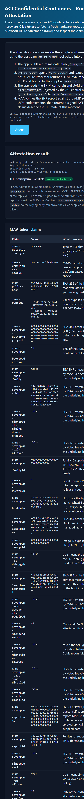
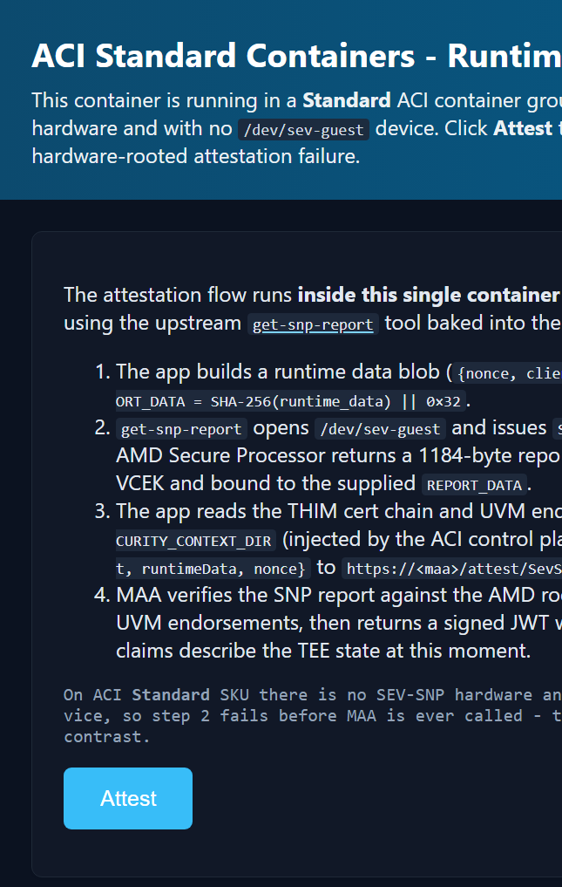
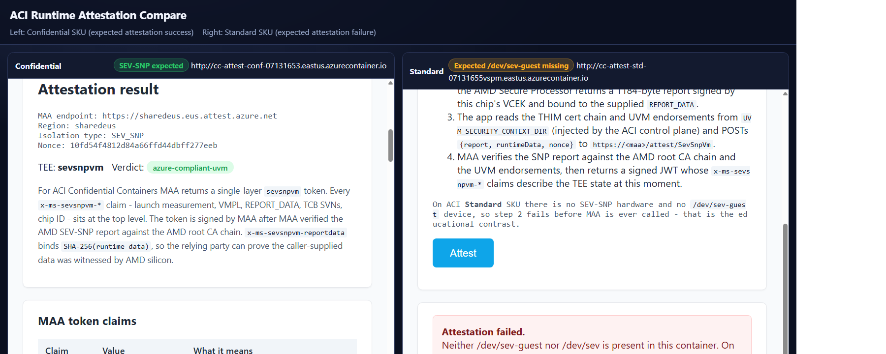

# Visual Attestation Demo v2 on Azure Container Instances

A self-contained ACI port of the AKS confidential-node attestation web UI from
`aks-samples/azure-voting-app/attestation/`. This is the **v2** of the original
[`visual-attestation-demo`](../visual-attestation-demo/) - same goal, simpler
footprint, and adds a one-shot `-Compare` mode that deploys both Confidential
and Standard SKUs side-by-side.

It demonstrates **runtime guest attestation** of an AMD SEV-SNP TEE via
Microsoft Azure Attestation (MAA), and shows how the **same image fails to
attest** when run on a non-confidential ACI SKU - the educational point of the
sample.

The container image is built **server-side in Azure Container Registry** via
`az acr build`, so you do **not** need a local Docker daemon to ship the image.
You only need Docker for the Confidential SKU deploy, where the
`az confcom acipolicygen` extension uses Docker to compute the CCE policy hash.

## How attestation works in this sample

There is **no SKR sidecar**. The Flask app fetches the SNP report itself, then
talks directly to MAA:

1. The app builds a small JSON `runtimeData = {nonce, client}` and sets
   `REPORT_DATA = SHA-256(runtimeData) || 0x00...` (64 bytes total).
2. It runs `get-snp-report <REPORT_DATA-hex>` (the upstream tool from
   [microsoft/confidential-sidecar-containers](https://github.com/microsoft/confidential-sidecar-containers/tree/main/tools/get-snp-report),
   baked into the image), which opens `/dev/sev-guest` and issues
   `SNP_GUEST_REQUEST`. The AMD Secure Processor returns the 1184-byte
   attestation report signed by the chip's VCEK.
3. It loads the THIM cert chain (`host-amd-cert-base64`) and UVM endorsements
   (`reference-info-base64`) from the `UVM_SECURITY_CONTEXT_DIR` directory the
   ACI control plane mounts into Confidential container groups.
4. It POSTs `{report, runtimeData, nonce}` to
   `https://<maa>/attest/SevSnpVm?api-version=2022-08-01`. MAA verifies the
   SNP report against the AMD root CA chain and the UVM endorsements, then
   returns a signed JWT whose `x-ms-sevsnpvm-*` claims describe the TEE state
   at this instant.
5. The app decodes the JWT and renders every claim with a human-readable
   explanation.

On ACI **Standard** SKU there is no `/dev/sev-guest` - step 2 fails before
MAA is ever called, which is the deterministic, hardware-rooted failure the
demo is built to show.

## What's in here

| File | Purpose |
|------|---------|
| [Dockerfile](Dockerfile) | Multi-stage build. Stage 1 compiles `get-snp-report` from microsoft/confidential-sidecar-containers; stage 2 is `python:3.11-slim` with Flask + the static binary. |
| [app.py](app.py) | Flask app - runs `get-snp-report` against `/dev/sev-guest`, posts the report + UVM evidence to MAA, and renders the returned JWT. |
| [templates/index.html](templates/index.html) | UI with dark mode, claim explanations, single-layer `sevsnpvm` token rendering. |
| [requirements.txt](requirements.txt) | `flask` + `requests`. |
| [deployment-template-confidential.json](deployment-template-confidential.json) | Single-container ACI template (`cc-attest`), `sku=Confidential`, `ccePolicy` filled by `confcom` at deploy time. |
| [deployment-template-standard.json](deployment-template-standard.json) | Single-container ACI template, `sku=Standard` (attestation fails by design). |
| [Deploy-VisualAttestationV2.ps1](Deploy-VisualAttestationV2.ps1) | One script for `-Build`, `-Deploy`, `-Compare`, `-Cleanup`. |

## Architecture

```
                     Azure subscription
                +---------------------------+
                | <prefix>-<acr>-rg          |
                |                            |
                |  +----------------------+  |
+-----------+   |  | Azure Container      |  |
|           |   |  | Registry (Basic,     |  |
| az acr    +---+->| admin enabled)       |  |
| build .   |   |  |  cc-attest:1.0       |  |
|           |   |  +----------+-----------+  |
+-----------+   |             |              |
                |             v              |
                |  +----------+-----------+  |          MAA
                |  | ACI Confidential SKU |--+--HTTPS-->/attest/SevSnpVm
                |  | (AMD SEV-SNP)        |  |       (sharedeus.eus...)
                |  | /dev/sev-guest       |  |
                |  +----------------------+  |
                |  +----------------------+  |
                |  | ACI Standard SKU     |  | <- no /dev/sev-guest, fails
                |  | (no TEE)             |  |
                |  +----------------------+  |
                +---------------------------+
```

## Prerequisites

- Azure CLI logged in: `az login`
- Subscription with quota for **Confidential ACI** (AMD SEV-SNP) in your
  region. `eastus` is the default; `northeurope`, `westeurope`,
  `southcentralus`, `eastus2` also work.
- For confidential deploys only: **Docker Desktop** running locally, plus the
  `confcom` Azure CLI extension. The script auto-installs `confcom` for you.

The sample does **not** require any role assignments
(`Microsoft.Authorization/*`) - ACR pulls happen via admin user credentials
embedded in `imageRegistryCredentials`.

## Quick start

### 1. Build the image (server-side, ~5 minutes)

```powershell
./Deploy-VisualAttestationV2.ps1 -Build
```

This creates a resource group, an ACR, runs `az acr build` on the Dockerfile
in this directory, and persists the image coordinates to `acr-config.json`.

### 2. Deploy on Confidential SKU (attestation will succeed)

```powershell
./Deploy-VisualAttestationV2.ps1 -Deploy
```

Requires Docker running locally so `confcom` can compute the CCE policy.
Opens the UI in your browser - click **Attest** and you'll get a fully
populated MAA token with `x-ms-attestation-type=sevsnpvm` and
`x-ms-compliance-status=azure-compliant-uvm`.

### 3. Deploy on Standard SKU (attestation will fail)

```powershell
./Deploy-VisualAttestationV2.ps1 -Deploy -NoAcc
```

No Docker required. The same image runs unmodified, but with no SEV-SNP
hardware `/dev/sev-guest` is absent and `get-snp-report` fails before MAA is
ever called. The `/api/attest` endpoint returns that error and the script
prints the last 25 lines of container logs for inspection.

### 4. Side-by-side comparison

```powershell
./Deploy-VisualAttestationV2.ps1 -Compare
```

Deploys both flavors in the same resource group and opens a generated
`side-by-side-compare.html` page that embeds both live endpoints in one view.
Same image, same code path, opposite result - the cleanest way to demo why
attestation matters.

### 5. Cleanup

```powershell
./Deploy-VisualAttestationV2.ps1 -Cleanup
```

Confirms by re-typing the resource group name, then deletes everything
(`--no-wait`).

## Demo screenshots

The screenshots below were captured against a live `-Compare` deployment
(`cc-attest-conf-*` and `cc-attest-std-*` running side-by-side in the same
resource group, same image digest) by clicking **Attest** on each instance.

### Confidential SKU - attestation succeeds

`get-snp-report` reads the AMD SEV-SNP report from `/dev/sev-guest`, the app
posts it with the THIM cert chain and UVM endorsements to MAA, and the page
renders the decoded JWT. Notice `x-ms-attestation-type = sevsnpvm` and
`x-ms-compliance-status = azure-compliant-uvm`, plus the per-chip
`x-ms-sevsnpvm-chipid`, launch measurement, and TCB version - all rooted in
silicon.



### Standard SKU - attestation fails (by design)

Same image, no SEV-SNP hardware, no `/dev/sev-guest`. `get-snp-report` errors
out before MAA is ever called. That deterministic failure is the educational
contrast - it proves the success case really did need confidential hardware.



### Side-by-side compare view

The compare page below is generated automatically by
`Deploy-VisualAttestationV2.ps1 -Compare` and opens both live deployments in
one browser window.



## Why two SKUs?

The point of this sample is **falsifiability**. A demo that only ever shows
attestation succeeding doesn't prove much - the same JSON response could be
mocked by any web server. By running the *exact same image* on a non-TEE host
and watching it fail in a specific, hardware-rooted way (no `/dev/sev-guest`,
no SEV-SNP guest report), you demonstrate that:

1. The success case on Confidential SKU really did come from AMD silicon.
2. A relying party that pins `x-ms-attestation-type=sevsnpvm` and a specific
   `x-ms-policy-hash` cannot be spoofed by a Standard-SKU deployment.

## Differences vs. the AKS sample

| Aspect | AKS sample | This sample |
|--------|------------|-------------|
| Bootstrap | ConfigMap mounts source at pod start | Source baked into image at build time |
| Attestation path | App opens `/dev/tpmrm0` directly via `cvm-attestation-tools` | App runs `get-snp-report` against `/dev/sev-guest`, then POSTs SNP report + THIM cert chain + UVM endorsements directly to MAA `/attest/SevSnpVm` (no SKR sidecar; ACI CC UVM does not expose a vTPM to the workload) |
| Token shape | Nested - outer with `x-ms-isolation-tee.x-ms-runtime` | Single-layer `sevsnpvm` token (claims at top level) |
| Privileges | `privileged: true`, `/dev/tpmrm0` host mount | None - `/dev/sev-guest` is auto-exposed in ACI Confidential SKU |
| Build | `az acr build` | `az acr build` |
| TEE | Per-node SEV-SNP (`Standard_DC2as_v5`) | Per-container-group SEV-SNP (Confidential ACI) |
| Failure demo | Add a non-CC nodepool | `-NoAcc` switch -> Standard SKU (no `/dev/sev-guest`, no TEE) |

## Troubleshooting

**`az confcom acipolicygen` complains Docker isn't running**
Start Docker Desktop, or use `-NoAcc` to skip confidential mode.

**Container is `CrashLoopBackOff` on Confidential SKU**
View logs: `az container logs -g <rg> -n <name> --container-name cc-attest`.
Two common causes: (a) `get-snp-report` failed because `/dev/sev-guest` is
not yet accessible (race with container start - retry once); (b) the THIM
cert chain at `UVM_SECURITY_CONTEXT_DIR/host-amd-cert-base64` was missing,
which means the ACI control plane did not provision it - confirm the
container group really came up as `sku=Confidential` and that
`confidentialComputeProperties.ccePolicy` was supplied.

**MAA returns HTTP 400 / `Failed validation`**
The CCE policy hash MAA computed from `host-amd-cert-base64` and the report's
`HOST_DATA` did not match the `ccePolicy` stamped into the container group.
Re-run `Deploy-VisualAttestationV2.ps1 -Compare` so `confcom acipolicygen`
regenerates the policy for the current image.

**HTTP timeout waiting for the container**
First-time pulls of the image can take 2-3 minutes on a cold ACI host.
Re-open the URL after a minute.
