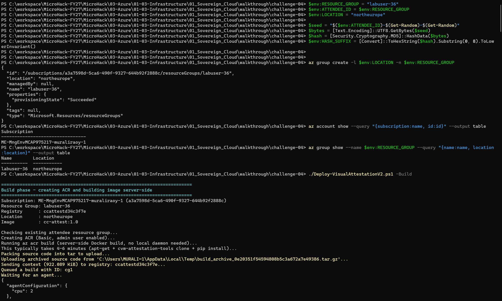
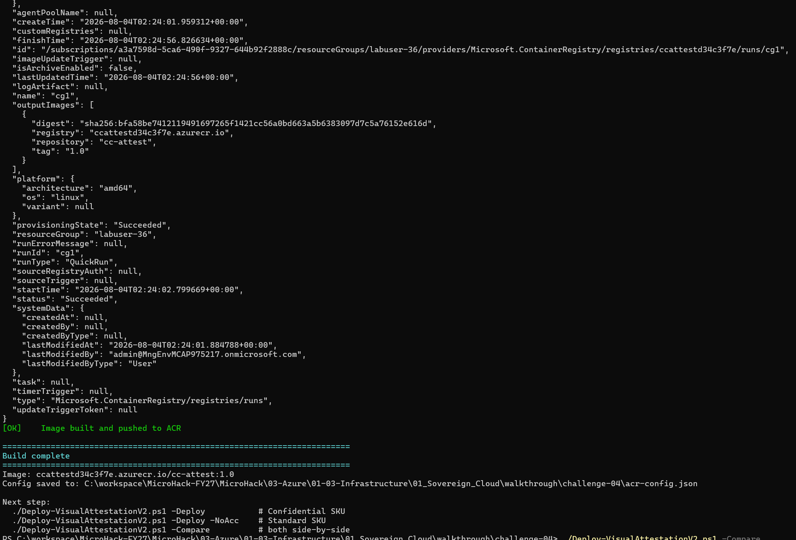
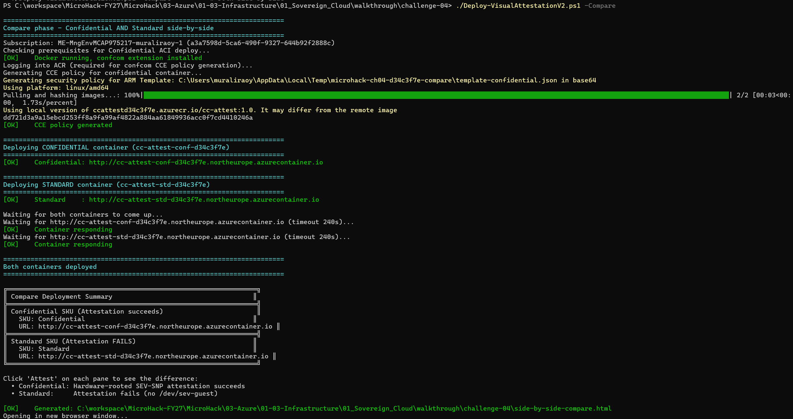
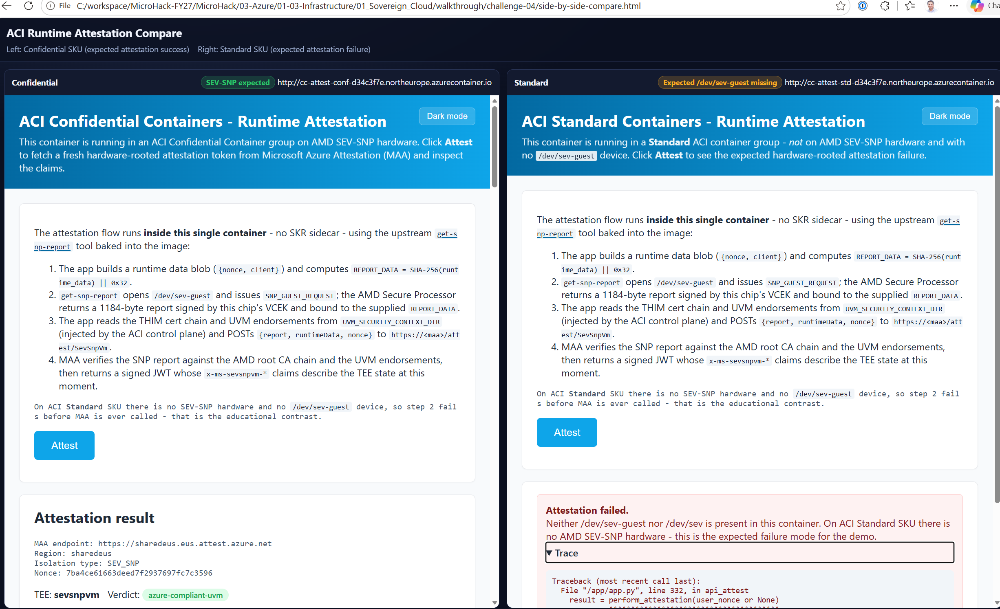

# Walkthrough Challenge 4 - Runtime attestation with Confidential ACI

[Previous Challenge Solution](../challenge-03/solution-03.md) - **[Home](../../Readme.md)** - [Challenge](../../challenges/challenge-04.md) - [Next Challenge Solution](../challenge-05/solution-05.md)

**Estimated duration:** 30-45 minutes

## Objective

Deploy the newer Visual Attestation Demo v2 to both Confidential and Standard
ACI. The automation builds one image, generates its confidential-computing
enforcement policy, and deploys both variants for a falsifiable comparison.

> [!IMPORTANT]
> **Execution environment changes in this challenge.**
> Challenges 1-3 are completed in **Azure Cloud Shell (Bash)**. From Challenge 4
> onward you must switch to a **local PowerShell 7+ session on your own machine**
> (Windows is the validated platform).
>
> Azure Cloud Shell **cannot** complete this challenge: it does not provide a
> local Docker engine, and `az confcom acipolicygen` requires one to inspect the
> image layers when generating the CCE policy. See
> [why Challenge 4 requires `confcom` and Docker](CONFCOM-AND-CCE-POLICY.md).

## Prerequisites

- The [general MicroHack prerequisites](../../Readme.md#general-prerequisites).
- PowerShell 7 or later, running locally (not Cloud Shell).
- Azure CLI signed in to the target subscription.
- Docker Desktop installed **and running**. The `confcom` extension uses it to
  calculate the CCE policy.
- Contributor access to the attendee resource group.
- Confidential ACI capacity in the selected region. This walkthrough uses
  `northeurope`, which is validated for Confidential ACI. Confidential ACI is
  available in fewer regions than standard ACI - if you change the region,
  confirm support first in
  [Confidential containers on ACI](https://learn.microsoft.com/azure/container-instances/container-instances-confidential-overview).

### Verify your environment before you start

Run this block and confirm every line succeeds:

```powershell
# 1. PowerShell must be 7.0 or later
$PSVersionTable.PSVersion

# 2. Azure CLI present and signed in (run 'az login' if this fails)
az version
az account show --output table

# 3. Docker Desktop must be running (this fails if the daemon is stopped)
docker info --format '{{.ServerVersion}}'

# 4. Register the resource providers used by this challenge (safe to re-run)
az provider register --namespace Microsoft.ContainerInstance
az provider register --namespace Microsoft.ContainerRegistry
```

> [!NOTE]
> Provider registration is asynchronous and can take a few minutes on a new
> subscription. Check progress with:
> `az provider show --namespace Microsoft.ContainerInstance --query registrationState -o tsv`

> [!IMPORTANT]
> The automation creates resources in the existing attendee resource group. It
> does not create or delete the resource group.

## Task 0: Get the challenge files

The deployment script is **not standalone**. It resolves the application source,
`Dockerfile`, and ARM templates from `resources/visual-attestation-demo-v2`
relative to its own location, so it must be run from inside a full clone of the
repository.

```powershell
git clone https://github.com/yelamanchili-murali/MicroHack.git
cd MicroHack/03-Azure/01-03-Infrastructure/01_Sovereign_Cloud/walkthrough/challenge-04

# Confirm both the script and its resources directory are present
Get-ChildItem
```

You should see `Deploy-VisualAttestationV2.ps1` and a `resources` directory.
Running the script from any other location (for example your home directory)
fails with `The term './Deploy-VisualAttestationV2.ps1' is not recognized...`.

If PowerShell blocks the script with an `UnauthorizedAccess` or "running scripts
is disabled on this system" error, allow it for the current session only:

```powershell
Set-ExecutionPolicy -Scope Process -ExecutionPolicy Bypass

# If you downloaded the file instead of cloning, also clear the internet mark:
Unblock-File ./Deploy-VisualAttestationV2.ps1
```

## Task 1: Configure the MicroHack environment

> [!WARNING]
> **The variable syntax differs from Challenges 1-3.** Those challenges use Bash
> variables (`RESOURCE_GROUP="labuser-xx"`). PowerShell requires the `$env:`
> prefix shown below. Copying the Bash form into PowerShell fails silently and
> the script will not see your values.

Use the same variable names as the other challenges. If these variables are
already present in your PowerShell session, do not generate a new suffix.

```powershell
$env:RESOURCE_GROUP = "labuser-xx"
$env:ATTENDEE_ID = $env:RESOURCE_GROUP
$env:LOCATION = "northeurope"

$seed = "$($env:ATTENDEE_ID)-$(Get-Random)-$(Get-Random)"
$bytes = [Text.Encoding]::UTF8.GetBytes($seed)
$hash = [Security.Cryptography.MD5]::HashData($bytes)
$env:HASH_SUFFIX = [Convert]::ToHexString($hash).Substring(0, 8).ToLowerInvariant()
```

Confirm the target resource group and subscription:

```powershell
az account show --query "{subscription:name, id:id}" --output table
az group show --name $env:RESOURCE_GROUP --query "{name:name, location:location}" --output table
```

## Task 2: Build and deploy the comparison

> [!IMPORTANT]
> **If you have run Challenge 4 before with the same environment values -
> including a run that failed part-way - run `./Deploy-VisualAttestationV2.ps1 -Cleanup`
> first.** The script uses a clean build/deploy/cleanup lifecycle and does not
> update an existing run.

From this walkthrough directory, run:

```powershell
./Deploy-VisualAttestationV2.ps1 -Build
./Deploy-VisualAttestationV2.ps1 -Compare
```

`-Build` creates the registry and image. `-Compare` is the deployment step for
this walkthrough: it deploys both the Confidential and Standard container
groups. You do not need to run `-Deploy` before `-Compare`.

The build phase confirms your environment variables, the target subscription and
resource group, then creates the ACR and starts the server-side image build:



The build finishes with the pushed image digest and tag, and the script prints
the next available commands:



> [!NOTE]
> **Expect several minutes of quiet output.** `az acr build` runs the image build
> server-side, and `az confcom acipolicygen` hashes every image layer locally.
> Both steps can each take a few minutes with little or no progress on screen.
> This is normal - do not interrupt the script.

`-Compare` verifies the prerequisites, generates the CCE policy, deploys both
container groups, waits for each to respond, and prints a deployment summary
with both URLs:



The script performs the time-consuming setup:

1. Creates a Basic ACR in the existing resource group.
2. Runs `az acr build`; a local Docker build is not required.
3. Installs the `confcom` Azure CLI extension when needed.
4. Generates a CCE policy for the confidential deployment.
5. Deploys Confidential and Standard ACI from the same image.

### What the automation is doing

The container image is the packaged application. Building it in Azure
Container Registry (ACR) produces a specific set of read-only image layers.
Those layers, together with the container command, environment variables,
mounts, and other runtime settings, describe exactly what ACI is expected to
run.

`confcom` is the Azure CLI extension for confidential container tooling. The
script runs `az confcom acipolicygen` to turn that expected container
configuration into a **confidential-computing enforcement (CCE) policy**. You
can think of this policy as an allow-list for the confidential container group:

- which image layers may be loaded;
- which command may start;
- which environment variables and mounts are allowed;
- whether elevated privileges, debugging, and standard input/output are allowed.

The policy helps prevent an operator or deployment change from silently
starting different code or changing the approved runtime configuration. If the
requested container does not match the policy, the confidential container
environment refuses to start it.

The generated policy is written in **Rego**, the policy language used by
[Open Policy Agent](https://www.openpolicyagent.org/docs/policy-language). A
Rego document expresses rules that a system can evaluate as allow or deny
decisions. In this case, the confidential container runtime evaluates those
rules before allowing container operations. Among other details, the policy
records:

- the cryptographic hashes of the permitted image layers;
- the container name, startup command, and working directory;
- allowed environment-variable patterns;
- permitted mounts, Linux capabilities, and executable processes;
- security choices such as standard I/O, elevated access, and runtime logging.

The policy is generated from the **actual image content that `confcom`
inspects**, not only from an image name such as `cc-attest:1.0`. The part after
the colon is a tag. A tag is a convenient, human-readable label, but a registry
owner can move it so that it identifies different content later.

When a container tool looks up an image tag, it obtains an image manifest and
the cryptographic digest and layer hashes for the content currently associated
with that tag. This lookup is sometimes called **resolving the image**: it maps
the friendly image name and tag to concrete, hash-identified content.
`confcom` records those immutable layer hashes in the policy. If someone later
points the same tag at different content, the new layer hashes will not match
the policy and the confidential environment will refuse to run it. The policy
therefore approves specific container content rather than trusting a mutable
name alone.

The script does not maintain a separate hand-written policy file in the
repository. It first copies the confidential ARM template into a local working
directory so the source template remains unchanged. `confcom` then generates
the policy document, Base64-encodes it, and writes it into the template's
`ccePolicy` property.

Only that local working copy is temporary. The policy itself is submitted to
Azure as part of the container-group deployment, stored with the deployed
resource, and enforced whenever its containers start. A hash of the policy is
also bound into the confidential environment's attestation evidence. This lets
a relying party check not only that SEV-SNP hardware was used, but also which
execution policy governed the workload.

Docker Desktop is used only during this policy-generation step. `confcom`
inspects and hashes the Linux image layers through the local Docker engine. The
actual image build still runs remotely through `az acr build`.

After deployment, the application asks the AMD SEV-SNP hardware for a signed
attestation report and sends that evidence to Microsoft Azure Attestation
(MAA). The report binds the running confidential environment to measurements
that include the enforcement policy. MAA verifies the evidence and returns the
signed token displayed by the application.

The Standard ACI deployment uses the exact same application image but does not
have SEV-SNP hardware or `/dev/sev-guest`. Its expected attestation failure is a
control experiment: it demonstrates that the successful token came from the
confidential hardware and not merely from application code returning a
predefined response.

The script waits for both applications to respond, prints a deployment summary,
and opens a generated `side-by-side-compare.html` page with both live endpoints.
To suppress browser launch, add `-SkipBrowser` to the `-Compare` command.

The script generates the policy from a temporary copy of the ARM template. It
clears the copy's existing policy first and approves generated
environment-variable wildcard rules, so `confcom` does not pause for workshop
input. The repository's source template remains unchanged.

## Task 3: Compare runtime attestation

1. Open the **Confidential** URL and select **Attest**.
2. Confirm `x-ms-attestation-type` is `sevsnpvm`.
3. Confirm `x-ms-compliance-status` is `azure-compliant-uvm`.
4. Review the chip ID, launch measurement, policy hash, and TCB claims.
5. Open the **Standard** URL and select **Attest**.
6. Confirm attestation fails because `/dev/sev-guest` is absent.

The generated `side-by-side-compare.html` page places both endpoints next to
each other. The Confidential pane returns a signed MAA token, while the Standard
pane fails because the SEV-SNP device is absent:



This negative control matters: identical application code cannot produce the
hardware report on a non-confidential host.

## Troubleshooting

| Message | Cause | Fix |
| --- | --- | --- |
| `The term './Deploy-VisualAttestationV2.ps1' is not recognized...` | Not in the challenge directory, or the repository was not cloned. | Complete Task 0 and `cd` into `walkthrough/challenge-04`. |
| `running scripts is disabled on this system` | PowerShell execution policy. | `Set-ExecutionPolicy -Scope Process -ExecutionPolicy Bypass` |
| `Not logged in. Run: az login` | Azure CLI has no active session. | `az login`, then confirm with `az account show`. |
| `Docker is not running. Required by 'az confcom acipolicygen'...` | Docker Desktop is not started. | Start Docker Desktop, wait for it to report *Running*, verify with `docker info`. |
| `az confcom acipolicygen failed` | Usually Docker not ready, or the ACR login used for layer inspection expired. | Confirm `docker info` works, then run `-Cleanup` and retry from `-Build`. |
| Container group name already exists / conflicting resources | A previous Challenge 4 run was not cleaned up. | `./Deploy-VisualAttestationV2.ps1 -Cleanup`, then retry. |
| Confidential SKU capacity or SKU-not-available errors | The region has no Confidential ACI capacity. | Retry later, or select a region that supports Confidential ACI. |

## Optional deployment modes

For troubleshooting or a single-SKU demonstration, deploy only one variant
after the image is built. These commands are alternatives to `-Compare`, not
prerequisites for it:

```powershell
./Deploy-VisualAttestationV2.ps1 -Deploy             # Confidential
./Deploy-VisualAttestationV2.ps1 -Deploy -NoAcc      # Standard
```

## Task 4: Clean up

```powershell
./Deploy-VisualAttestationV2.ps1 -Cleanup
```

The command removes the two named container groups, challenge ACR, generated
state, and the tagged local Docker image. The attendee resource group and
resources from other challenges are retained. Run cleanup before rebuilding
Challenge 4 with the same `HASH_SUFFIX`.

## Source alignment

The complete Visual Attestation Demo v2 source is retained as an unchanged
local snapshot under
[`resources/visual-attestation-demo-v2`](resources/visual-attestation-demo-v2/README.md).
The top-level deployment script is derived from that source with only the
MicroHack-specific changes listed in [UPSTREAM-SOURCE.md](UPSTREAM-SOURCE.md).
Use the top-level script for this walkthrough; the script inside `resources`
is retained only as the unchanged upstream reference.
