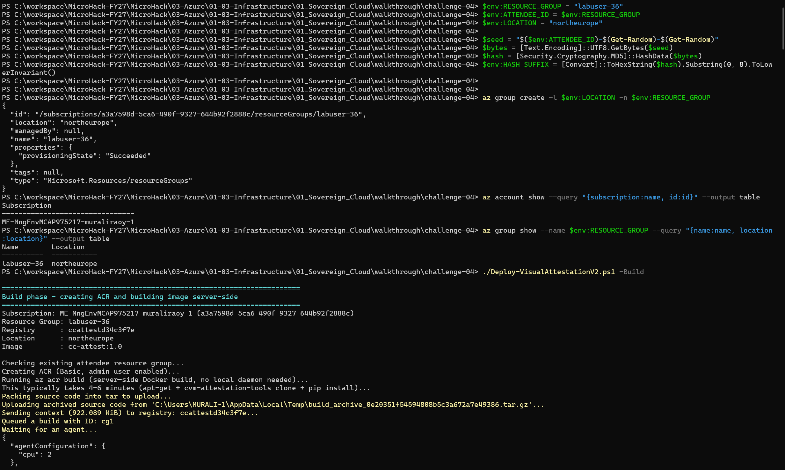
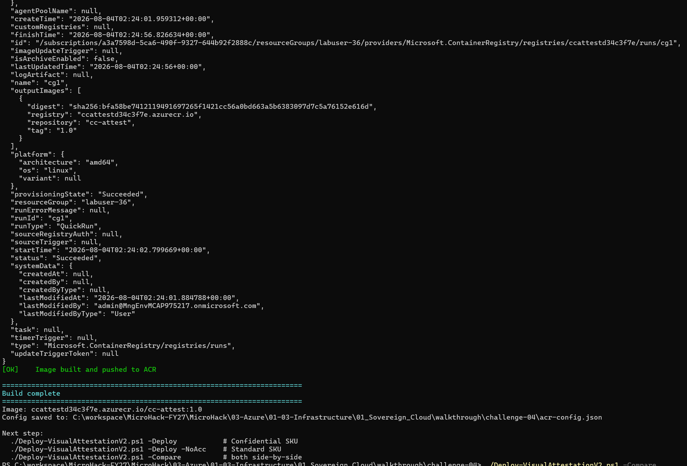
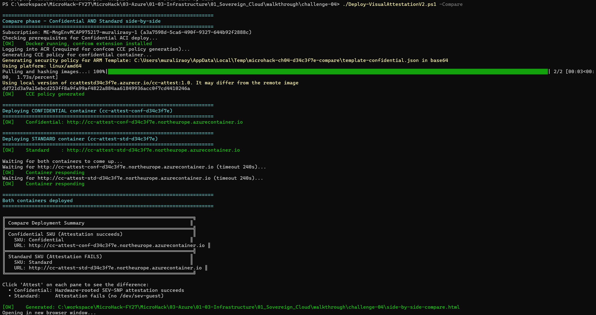
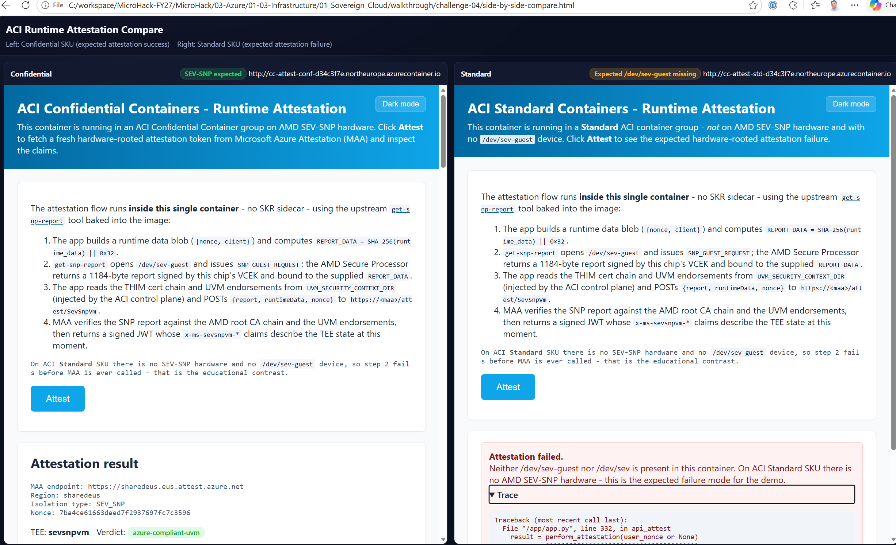

# Walkthrough Challenge 4 - Runtime attestation with Confidential ACI

**Estimated duration:** 30-45 minutes after the Codespaces devcontainer is ready.
Allow additional time for initial container setup; optional local workstation
setup can also require IT approval and reboots.

## Objective

Deploy the newer Visual Attestation Demo v2 to both Confidential and Standard
ACI. The automation builds one image, generates its confidential-computing
enforcement policy, and deploys both variants for a falsifiable comparison.

## Understand Runtime Attestation Fundamentals

**Question:** How can you distinguish an application running in a protected
environment from the same application simply claiming that it is protected?
Encryption at rest protects stored data; TLS protects data moving across a
network. Confidential computing protects data in use, and **attestation** supplies
evidence about the environment doing that processing.

This is a controlled experiment, not an exercise in writing a container app:

1. **Package once.** Build one application image in Azure Container Registry (ACR).
2. **Define the allowed workload.** Generate a confidential-computing enforcement
   (CCE) policy for its image layers and runtime configuration.
3. **Run twice.** Deploy that image to Confidential and Standard Azure Container
   Instances (ACI). The confidential runtime enforces the CCE policy.
4. **Ask for evidence.** The confidential application requests an AMD SEV-SNP
   hardware report and sends it to Microsoft Azure Attestation (MAA), which
   verifies the evidence and returns a signed token.
5. **Compare.** Confidential ACI returns the expected attestation claims;
   Standard ACI cannot obtain the hardware report because `/dev/sev-guest` is
   absent. That failure is the negative control, not a deployment problem.

**Why the extra tools?** A container image packages the app and its dependencies.
The Azure CLI `confcom` extension generates the CCE policy by inspecting the
image through a **local Docker engine**. The build itself happens remotely in
ACR, and both applications run in Azure, not in the Codespace or on your laptop.
The policy constrains the permitted workload; attestation provides evidence
about the protected environment and binds it to the policy.

**Expected learning outcome:** explain why identical application code produces
different attestation results, recognize the `sevsnpvm` and `azure-compliant-uvm`
claims, and distinguish workload policy enforcement from hardware evidence.
Reading the demo's token does not replace production validation of its signature,
issuer, freshness, and expected claims, nor does it prove regulatory compliance.
For more detail, read [why `confcom` and Docker are involved](CONFCOM-AND-CCE-POLICY.md#the-short-answer).

> [!IMPORTANT]
> **Keep using the same GitHub Codespace for all challenges.**
> Open the existing Sovereign devcontainer as described in the
> [recommended environment setup](../../Readme.md#recommended-environment-github-codespaces).
> This challenge uses **PowerShell 7+**: enter `pwsh` in the default Bash
> terminal. Docker-in-Docker supplies the Linux engine; no Windows host or
> Docker Desktop installation is required.
>
> Azure Cloud Shell **cannot** complete this challenge: it does not provide a
> local Docker engine, and `az confcom acipolicygen` requires one to inspect the
> image layers when generating the CCE policy. See
> [why Challenge 4 requires `confcom` and Docker](CONFCOM-AND-CCE-POLICY.md#the-short-answer).

## Prerequisites

- The [general MicroHack prerequisites](../../Readme.md#general-prerequisites).
- The recommended Sovereign Codespaces devcontainer, with PowerShell 7+, Git,
  Azure CLI, and a reachable Linux Docker Engine. An equivalent local environment
  is an optional alternative; Azure Cloud Shell is not sufficient.
- The existing complete MicroHack clone (Codespaces already provides it).
- Azure CLI signed in to the target subscription.
- A running Docker Engine, not just the Docker client. The `confcom` extension
  uses it to calculate the CCE policy.
- Contributor access to the attendee resource group.
- Confidential ACI capacity in the selected region. This walkthrough uses
  `northeurope`, which is validated for Confidential ACI. Confidential ACI is
  available in fewer regions than standard ACI - if you change the region,
  confirm support first in
  [Confidential containers on ACI](https://learn.microsoft.com/azure/container-instances/container-instances-confidential-overview).

### Start PowerShell in Codespaces

In the **Bash** terminal of the recommended Sovereign Codespace, run:

```bash
pwsh
```

Run the PowerShell blocks below in that session. Exported Bash variables are
inherited by `pwsh`; unexported shell variables are not. Authenticate with
`az login --use-device-code`, open the displayed Microsoft sign-in URL in your
own browser, and select the assigned subscription using
`az account set --subscription "<subscription-id>"`.
Do not paste authentication codes into chat or share them with others.

### Windows Docker Desktop setup before the workshop

**Optional local alternative only.** Skip this section when using Codespaces.

Complete these steps on your **Windows host**, not in Cloud Shell or a WSL Bash
terminal. WSL 2 supplies Docker's Linux backend; you will still run the lab from
**local PowerShell 7 (`pwsh`)**, not Windows PowerShell 5.1.

1. **Check with corporate IT first.** Confirm Docker Desktop is approved and
   appropriately licensed, and that you can enable WSL 2 and hardware
   virtualization. Windows feature/firmware changes can require administrator
   access and a reboot even when the Docker installer itself does not. Arrange
   any required proxy, registry access, or managed-device approvals in advance;
   do not bypass organizational restrictions. If you cannot install these
   prerequisites, ask the organizer for a prepared workstation.
2. **Check the machine.** Use a supported Windows version and hardware from
   [Docker's Windows system requirements](https://docs.docker.com/desktop/setup/install/windows-install/#system-requirements).
   In Task Manager → **Performance → CPU**, check that **Virtualization** is
   enabled. If disabled, ask IT to enable it in BIOS/UEFI. A Windows VM also
   needs host support/configuration for nested virtualization.
3. **Prepare WSL 2.** In host PowerShell, check `wsl --version` and `wsl --status`.
   Follow [Microsoft's WSL installation guide](https://learn.microsoft.com/windows/wsl/install)
   if WSL is missing: run `wsl --install` from an administrator terminal when
   authorized, then restart Windows and complete any first-run setup. For an
   existing installation, use `wsl --update` as needed to meet Docker's current
   WSL requirements. Recheck the version after any requested reboot. An existing
   WSL 1 distribution alone does not provide the WSL 2 backend.
4. **Install Docker Desktop.** Download the Windows installer matching your
   machine from [Docker's installation page](https://docs.docker.com/desktop/setup/install/windows-install/),
   or use your organization's software portal. Follow the installer and select
   the **WSL 2** backend when offered; complete any requested restart.
5. **Start the engine.** Open **Docker Desktop** from the Windows Start menu.
   Installation alone does not start it. Complete the approved first-run setup,
   enable **Use the WSL 2 based engine** in Settings → General if needed, and
   wait until the engine reports that it is running. This lab requires **Linux
   containers**. If Docker is in Windows-container mode, use the Docker tray
   menu's **Switch to Linux containers** option. If that option is absent, verify
   the engine type with the command below rather than assuming a problem.
6. **Open a fresh, non-administrator PowerShell 7 terminal** on the Windows host
   so installed commands are on `PATH`. Run the preflight below. Keep Docker
   Desktop running throughout deployment and cleanup.

### Verify your environment before you start

Run this block in the Codespace's `pwsh` session (or optional local PowerShell).
Confirm PowerShell is version 7+, the Azure subscription
is your assigned one, and Docker reports a server version and `linux`. If the
subscription is wrong, select your assigned subscription before continuing.
If your Codespace predates the Docker-in-Docker update and Docker is missing,
run **Codespaces: Rebuild Container** from the Command Palette, reopen `pwsh`,
and repeat this preflight.

```powershell
# 1. PowerShell must be 7.0 or later
$PSVersionTable.PSVersion

# 2. Azure CLI present and signed in (use 'az login --use-device-code' in Codespaces)
az version
az account show --output table

# 3. Git must be installed for Task 0
git --version

# 4. Query the engine, not just the installed Docker client
docker info --format 'Server={{.ServerVersion}}; OSType={{.OSType}}'
if ($LASTEXITCODE -ne 0) {
    throw "Docker Engine is not reachable. Check the Sovereign devcontainer setup (or your local Linux engine), then repeat this check."
}
$dockerOs = docker info --format '{{.OSType}}'
if ($LASTEXITCODE -ne 0 -or $dockerOs -ne "linux") {
    throw "Docker must be reachable and using Linux containers before continuing."
}
```

**Read-only provider check:** The event organizer normally registers the required
providers on the subscription before the lab. Do **not** register them as a
participant or re-register providers that are already registered.

```powershell
$providersNeedReview = $false
foreach ($namespace in @("Microsoft.ContainerInstance", "Microsoft.ContainerRegistry")) {
    $state = ""
    $readSucceeded = $false
    try {
        $state = (az provider show --namespace $namespace --query registrationState --output tsv 2>$null | Out-String).Trim()
        $readSucceeded = ($LASTEXITCODE -eq 0 -and -not [string]::IsNullOrWhiteSpace($state))
    }
    catch {
        $readSucceeded = $false
    }

    if (-not $readSucceeded) {
        $providersNeedReview = $true
        Write-Warning "$namespace : Cannot read registration status. Check sign-in/subscription; ask the organizer to verify it. This does not mean it is unregistered."
    }
    elseif ($state -eq "Registered") {
        Write-Host "$namespace : Registered - ready; no registration action needed."
    }
    else {
        $providersNeedReview = $true
        Write-Warning "$namespace : $state (not Registered). Ask the organizer to check registration in the target region; rerun this read-only check after confirmation."
    }
}
if ($providersNeedReview) {
    Write-Warning "Pause before deployment until the organizer confirms provider readiness for this subscription and region."
}
```

- **Registered:** continue without making subscription-level changes.
- **NotRegistered / Registering / other state:** ask the organizer to resolve or
  confirm readiness. Registration is asynchronous and proceeds per region;
  `Registering` does not necessarily mean the target region is unavailable.
- **Cannot read:** a resource-group-scoped participant may lack subscription
  provider-read access. Sign-in, network, or CLI errors can also cause this
  result. Do not treat it as evidence that registration is missing. If needed,
  rerun `az provider show --namespace Microsoft.ContainerInstance --query registrationState --output tsv`
  (or use `Microsoft.ContainerRegistry`) without error suppression and share the
  error with the organizer. Continue only after they confirm readiness.

**Organizer-only responsibility:** any required registration needs the resource
provider's `/register/action` permission **at subscription scope** (for example,
subscription Contributor or Owner). Contributor on the attendee resource group
does not grant that permission. A failed registration attempt is not evidence
that an already-registered provider is unusable; no participant registration
command is required here. See
[Azure resource provider registration](https://learn.microsoft.com/azure/azure-resource-manager/management/resource-providers-and-types#register-resource-provider).

> [!IMPORTANT]
> The automation creates resources in the existing attendee resource group. It
> does not create or delete the resource group.

## Task 0: Get the challenge files

The deployment script is **not standalone**. It resolves the application source,
`Dockerfile`, and ARM templates from `resources/visual-attestation-demo-v2`
relative to its own location, so it must be run from inside a full clone of the
repository.

**Codespaces already has the full clone: do not clone it again.** From anywhere
inside that checkout, in `pwsh`, run:

```powershell
$repoRoot = git rev-parse --show-toplevel
if ($LASTEXITCODE -ne 0) { throw "Open a terminal inside your MicroHack checkout." }
Set-Location (Join-Path $repoRoot "03-Azure/01-03-Infrastructure/01_Sovereign_Cloud/walkthrough/challenge-04")
Get-ChildItem
```

You should see `Deploy-VisualAttestationV2.ps1` and a `resources` directory.
Use the **walkthrough wrapper**, not the upstream snapshot's script inside
`resources/visual-attestation-demo-v2`. The wrapper respects the workshop resource
group and cleanup boundaries.

**Optional local checkout:** if you do not already have a complete clone, use a
writable folder under your user profile, not `C:\Windows\System32` on Windows.
No administrator terminal is needed:

```powershell
$workDir = Join-Path $HOME "MicroHack-Labs"
New-Item -ItemType Directory -Path $workDir -Force -ErrorAction Stop | Out-Null
Set-Location $workDir

git clone https://github.com/microsoft/MicroHack.git
if ($LASTEXITCODE -ne 0) {
    throw "Clone failed. Resolve the error or use your existing complete MicroHack clone."
}
cd MicroHack/03-Azure/01-03-Infrastructure/01_Sovereign_Cloud/walkthrough/challenge-04

# Confirm both the script and its resources directory are present
Get-ChildItem
```

If you already have a full clone, skip `git clone` and use `Set-Location` with
the path to its `walkthrough/challenge-04` directory instead.
Running the script from any other location (for example your home directory)
fails with `The term './Deploy-VisualAttestationV2.ps1' is not recognized...`.

**Windows only:** if organizational policy permits and PowerShell blocks the
script with an `UnauthorizedAccess` or "running scripts is disabled on this
system" error, allow it for the current session only. Do not run this block in
Codespaces/Linux:

```powershell
Set-ExecutionPolicy -Scope Process -ExecutionPolicy Bypass

# If you downloaded the file instead of cloning, also clear the internet mark:
Unblock-File ./Deploy-VisualAttestationV2.ps1
```

## Task 1: Configure the MicroHack environment

> [!WARNING]
> **PowerShell syntax differs from Bash.** PowerShell requires the `$env:`
> prefix below. Exported Bash variables survive starting `pwsh`, but variables
> set only in Bash without `export` do not. Do not copy Bash assignment syntax
> into PowerShell.

Use the same variable names as the other challenges. If these variables are
already present in your PowerShell session, do not generate a new suffix.

```powershell
if (-not $env:RESOURCE_GROUP) { $env:RESOURCE_GROUP = "labuser-xx" } # Your assigned group
if (-not $env:ATTENDEE_ID) { $env:ATTENDEE_ID = $env:RESOURCE_GROUP }
$env:LOCATION = "northeurope"

if (-not $env:HASH_SUFFIX) {
    $env:HASH_SUFFIX = [guid]::NewGuid().ToString("N").Substring(0, 8)
}
```

Confirm the target resource group and subscription:

`LOCATION` here selects the ACI/ACR deployment region only. Keep North Europe
for this validated exercise even if Console created the resource group and
shared AKS cluster in Sweden Central or Spain Central. A resource group's
metadata location does not force every resource into that region. In Challenge 5,
use the existing Console AKS cluster and its actual region instead.

```powershell
az account show --query "{subscription:name, id:id}" --output table
az group show --name $env:RESOURCE_GROUP --query "{name:name, location:location}" --output table
```

## Task 2: Build and deploy the comparison

> [!IMPORTANT]
> **If you have run Challenge 4 before with the same environment values -
> including a run that failed part-way - run `./Deploy-VisualAttestationV2.ps1 -Cleanup`
> first.** The script uses a clean build/deploy/cleanup lifecycle and does not
> update an existing run.

From this walkthrough directory, run:

```powershell
./Deploy-VisualAttestationV2.ps1 -Build
./Deploy-VisualAttestationV2.ps1 -Compare -SkipBrowser
```

`-Build` creates the registry and image. `-Compare` is the deployment step for
this walkthrough: it deploys both the Confidential and Standard container
groups. You do not need to run `-Deploy` before `-Compare`.
`-SkipBrowser` is required for the documented headless Codespaces workflow: it
suppresses remote browser launch, not HTML generation or deployment.
On an optional desktop workstation, omit it to open the comparison automatically.

The build phase confirms your environment variables, the target subscription and
resource group, then creates the ACR and starts the server-side image build:



The build finishes with the pushed image digest and tag, and the script prints
the next available commands:



> [!NOTE]
> **Expect several minutes of quiet output.** `az acr build` runs the image build
> server-side, and `az confcom acipolicygen` hashes every image layer locally.
> Both steps can each take a few minutes with little or no progress on screen.
> This is normal - do not interrupt the script.

`-Compare` verifies the prerequisites, generates the CCE policy, deploys both
container groups, waits for each to respond, and prints a deployment summary
with both URLs:



The script performs the time-consuming setup:

1. Creates a Basic ACR in the existing resource group.
2. Runs `az acr build`; a local Docker build is not required.
3. Installs the `confcom` Azure CLI extension when needed.
4. Generates a CCE policy for the confidential deployment.
5. Deploys Confidential and Standard ACI from the same image.

### What the automation is doing

The container image is the packaged application. Building it in Azure
Container Registry (ACR) produces a specific set of read-only image layers.
Those layers, together with the container command, environment variables,
mounts, and other runtime settings, describe exactly what ACI is expected to
run.

`confcom` is the Azure CLI extension for confidential container tooling. The
script runs `az confcom acipolicygen` to turn that expected container
configuration into a **confidential-computing enforcement (CCE) policy**. You
can think of this policy as an allow-list for the confidential container group:

- which image layers may be loaded;
- which command may start;
- which environment variables and mounts are allowed;
- whether elevated privileges, debugging, and standard input/output are allowed.

The policy helps prevent an operator or deployment change from silently
starting different code or changing the approved runtime configuration. If the
requested container does not match the policy, the confidential container
environment refuses to start it.

The generated policy is written in **Rego**, the policy language used by
[Open Policy Agent](https://www.openpolicyagent.org/docs/policy-language). A
Rego document expresses rules that a system can evaluate as allow or deny
decisions. In this case, the confidential container runtime evaluates those
rules before allowing container operations. Among other details, the policy
records:

- the cryptographic hashes of the permitted image layers;
- the container name, startup command, and working directory;
- allowed environment-variable patterns;
- permitted mounts, Linux capabilities, and executable processes;
- security choices such as standard I/O, elevated access, and runtime logging.

The policy is generated from the **actual image content that `confcom`
inspects**, not only from an image name such as `cc-attest:1.0`. The part after
the colon is a tag. A tag is a convenient, human-readable label, but a registry
owner can move it so that it identifies different content later.

When a container tool looks up an image tag, it obtains an image manifest and
the cryptographic digest and layer hashes for the content currently associated
with that tag. This lookup is sometimes called **resolving the image**: it maps
the friendly image name and tag to concrete, hash-identified content.
`confcom` records those immutable layer hashes in the policy. If someone later
points the same tag at different content, the new layer hashes will not match
the policy and the confidential environment will refuse to run it. The policy
therefore approves specific container content rather than trusting a mutable
name alone.

The script does not maintain a separate hand-written policy file in the
repository. It first copies the confidential ARM template into a local working
directory so the source template remains unchanged. `confcom` then generates
the policy document, Base64-encodes it, and writes it into the template's
`ccePolicy` property.

Only that local working copy is temporary. The policy itself is submitted to
Azure as part of the container-group deployment, stored with the deployed
resource, and enforced whenever its containers start. A hash of the policy is
also bound into the confidential environment's attestation evidence. This lets
a relying party check not only that SEV-SNP hardware was used, but also which
execution policy governed the workload.

The Docker Engine is used only during this policy-generation step. `confcom`
inspects and hashes the Linux image layers through the local Docker engine. The
actual image build still runs remotely through `az acr build`.

After deployment, the application asks the AMD SEV-SNP hardware for a signed
attestation report and sends that evidence to Microsoft Azure Attestation
(MAA). The report binds the running confidential environment to measurements
that include the enforcement policy. MAA verifies the evidence and returns the
signed token displayed by the application.

The Standard ACI deployment uses the exact same application image but does not
have SEV-SNP hardware or `/dev/sev-guest`. Its expected attestation failure is a
control experiment: it demonstrates that the successful token came from the
confidential hardware and not merely from application code returning a
predefined response.

The script waits for both applications to respond, prints a deployment summary,
and always generates `side-by-side-compare.html` with both live endpoints.
With `-SkipBrowser`, it prints viewing instructions instead of launching a
browser in the remote Codespace. Without the switch, it opens the page through
the desktop's default browser.

The script generates the policy from a temporary copy of the ARM template. It
clears the copy's existing policy first and approves generated
environment-variable wildcard rules, so `confcom` does not pause for workshop
input. The repository's source template remains unchanged.

## Task 3: Compare runtime attestation

In Codespaces, use the two **Azure URLs** printed by the script in your own
browser. For the side-by-side view, find `side-by-side-compare.html` in the
`walkthrough/challenge-04` folder in **VS Code Explorer**, right-click it,
select **Download**, and open the downloaded file locally.
No web server or Codespaces port forwarding is needed. Do not publish the
walkthrough directory: generated deployment files can contain registry credentials.
If your browser blocks the HTML's embedded HTTP pages, open the two printed URLs
in separate tabs instead; do not disable browser security.

1. Open the **Confidential** URL and select **Attest**.
2. Confirm `x-ms-attestation-type` is `sevsnpvm`.
3. Confirm `x-ms-compliance-status` is `azure-compliant-uvm`.
4. Review the chip ID, launch measurement, policy hash, and TCB claims.
5. Open the **Standard** URL and select **Attest**.
6. Confirm attestation fails because `/dev/sev-guest` is absent.

The generated `side-by-side-compare.html` page places both endpoints next to
each other. The Confidential pane returns a signed MAA token, while the Standard
pane fails because the SEV-SNP device is absent:



This negative control matters: identical application code cannot produce the
hardware report on a non-confidential host.

## Troubleshooting

| Message | Cause | Fix |
| --- | --- | --- |
| `The term './Deploy-VisualAttestationV2.ps1' is not recognized...` | Not in the challenge directory, or the repository was not cloned. | Complete Task 0 and `cd` into `walkthrough/challenge-04`. |
| `running scripts is disabled on this system` | Windows PowerShell execution policy (not applicable in Codespaces). | Use the Windows-only Task 0 instructions if organizational policy permits. |
| `Not logged in. Run: az login` | Azure CLI has no active session. | In Codespaces, use `az login --use-device-code`, then confirm the assigned subscription with `az account show`. |
| `Docker Engine is not reachable...` | The engine is not running or accessible from the terminal. | Verify the recommended Sovereign devcontainer was selected and rebuilt after configuration changes; repeat `docker info`. On an optional local host, start its Linux engine (Docker Desktop on Windows). |
| Browser launch fails, or no page opens in Codespaces | A remote terminal has no desktop browser. | Use `-SkipBrowser`; download the generated HTML in Explorer or open the printed Azure URLs directly. |
| Docker reports `OSType=windows` or cannot start its WSL backend | Wrong container mode or incomplete host prerequisites. | Complete [Windows Docker Desktop setup](#windows-docker-desktop-setup-before-the-workshop), restart if requested, and repeat the engine check in local PowerShell 7. |
| Provider check says `Cannot read` or a state other than `Registered` | Subscription readiness is not confirmed; this is not a reason to attempt participant registration. | Follow the [read-only preflight](#verify-your-environment-before-you-start) and ask the organizer to confirm both providers. |
| `az confcom acipolicygen failed` | Usually Docker not ready, or the ACR login used for layer inspection expired. | Confirm `docker info` works, then run `-Cleanup` and retry from `-Build`. |
| Container group name already exists / conflicting resources | A previous Challenge 4 run was not cleaned up. | `./Deploy-VisualAttestationV2.ps1 -Cleanup`, then retry. |
| Confidential SKU capacity or SKU-not-available errors | The region has no Confidential ACI capacity. | Retry later, or select a region that supports Confidential ACI. |

## Optional deployment modes

For troubleshooting or a single-SKU demonstration, deploy only one variant
after the image is built. These commands are alternatives to `-Compare`, not
prerequisites for it:

```powershell
./Deploy-VisualAttestationV2.ps1 -Deploy -SkipBrowser        # Confidential
./Deploy-VisualAttestationV2.ps1 -Deploy -NoAcc -SkipBrowser # Standard
```

## Task 4: Clean up

```powershell
./Deploy-VisualAttestationV2.ps1 -Cleanup
```

The command removes the two named container groups, challenge ACR, generated
state, and the tagged local Docker image. The attendee resource group and
resources from other challenges are retained. Run cleanup before rebuilding
Challenge 4 with the same `HASH_SUFFIX`.

## Source alignment

The complete Visual Attestation Demo v2 source is retained as an unchanged
local snapshot under
[`resources/visual-attestation-demo-v2`](resources/visual-attestation-demo-v2/README.md).
The top-level deployment script is derived from that source with only the
MicroHack-specific changes listed in [UPSTREAM-SOURCE.md](UPSTREAM-SOURCE.md).
Use the top-level script for this walkthrough; the script inside `resources`
is retained only as the unchanged upstream reference.
