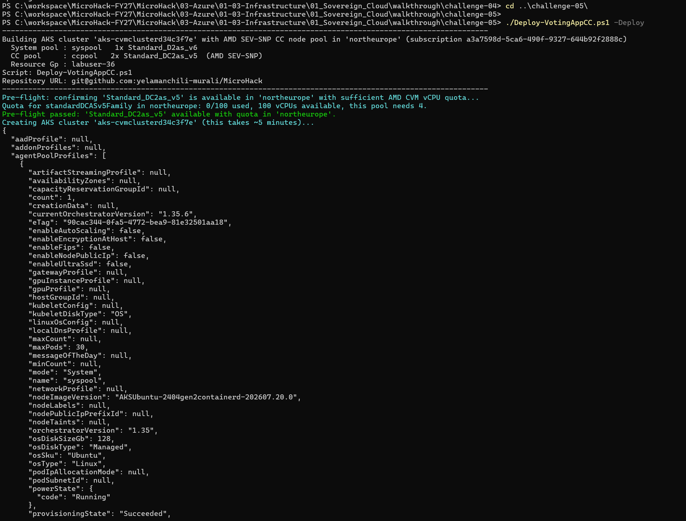
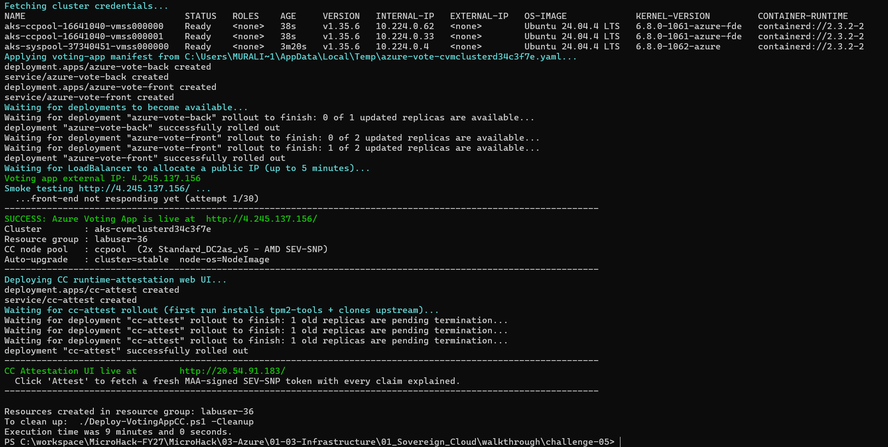
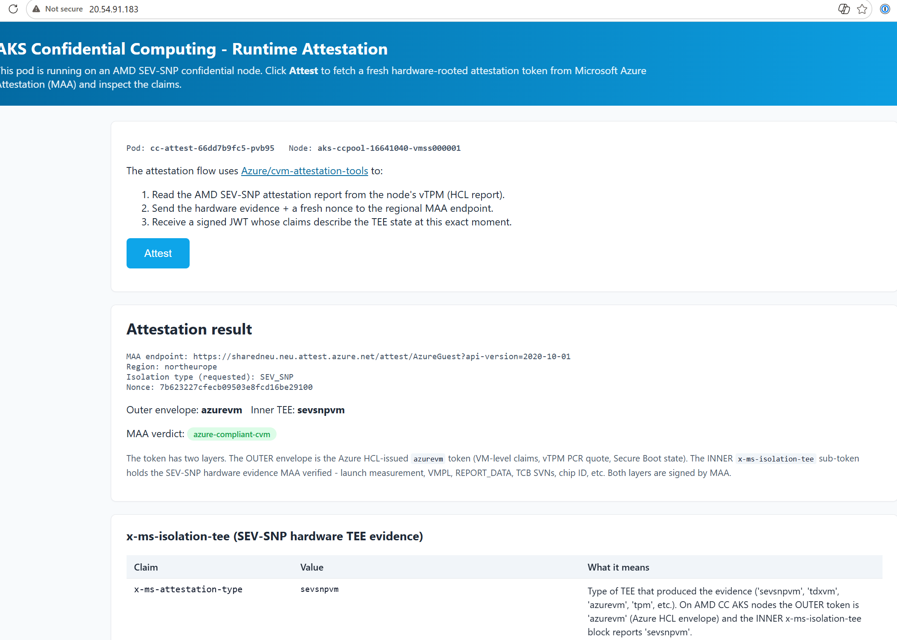

# Walkthrough Challenge 5 - Azure Voting App on confidential AKS nodes

[Previous walkthrough](../challenge-04/solution-04.md) - **[Home](../../Readme.md)** - [Challenge](../../challenges/challenge-05.md)

**Estimated duration:** 30-45 minutes

## Objective

Use the newer Azure Voting App automation to deploy an AKS cluster with an AMD
SEV-SNP node pool. The script also deploys a runtime attestation UI, allowing
you to verify the node from inside a pod before trusting the workload.

> [!IMPORTANT]
> **Execution environment.** Like Challenge 4, this challenge runs in a **local
> PowerShell 7+ session**, not in Azure Cloud Shell. It requires `kubectl` access
> and both Azure command-line tools signed in locally.

## Prerequisites

- The [general MicroHack prerequisites](../../Readme.md#general-prerequisites).
- PowerShell 7 or later, running locally.
- Azure CLI signed in to the target subscription.
- Azure PowerShell (`Az`) signed in to the same subscription.
- Contributor access to the attendee resource group.
- At least 4 available `standardDCASv5Family` vCPUs in the selected region for the default two-node pool.
- Permission to create AKS clusters and public LoadBalancer services.
- `kubectl` on PATH. The script installs it with `az aks install-cli` if missing.

The current confidential AKS capability is GA. The old `aks-preview` extension
and `AzureLinuxCVMPreview` feature registration are not used.

> [!WARNING]
> **This challenge needs two separate sign-ins.** The Azure CLI (`az`) and the
> Az PowerShell module maintain **independent** credential stores. The script
> calls `az account show` to read the subscription **and** `Set-AzContext` to set
> the PowerShell context, so `az login` on its own is not sufficient.
>
> If you completed Challenges 1-4 you are signed in to the Azure CLI only, and
> the script fails at `Set-AzContext` with
> `SharedTokenCacheCredential authentication unavailable`.

### Sign in to both tools and verify

```powershell
# 1. Install the Az PowerShell module if it is not already present
Get-Module -ListAvailable Az.Accounts, Az.Compute
Install-Module -Name Az -Scope CurrentUser -Repository PSGallery -Force

# 2. Sign in to Az PowerShell. This is separate from 'az login'.
#    Pass -TenantId when your machine has signed in to more than one tenant.
Connect-AzAccount -TenantId <your-tenant-id>

# 3. Point both tools at the same subscription
Set-AzContext -SubscriptionId <your-subscription-id>
az account set --subscription <your-subscription-id>

# 4. Confirm the subscription IDs match
Get-AzContext | Select-Object Name, Subscription, Tenant
az account show --query "{sub:name, id:id, tenant:tenantId}" --output table
```

> [!NOTE]
> The script uses `Get-AzComputeResourceSku` and `Get-AzVMUsage` for its SKU and
> quota preflight, which is why the Az module is required rather than optional.

### Check for a conflicting `aks-preview` extension

If the `aks-preview` Azure CLI extension is installed - for example from an
earlier AKS lab - it intercepts every `az aks` command. A version that predates
your current Azure CLI fails to load and stops the deployment. This challenge
does not use `aks-preview`.

```powershell
az extension list --output table

# Remove it if listed
az extension remove --name aks-preview

# Confirm 'az aks' works again (an empty list is a valid result)
az aks list --output table
```

> [!NOTE]
> Challenge 5 does not use the Confidential VM Orchestrator enterprise
> application. That identity is required by the customer-managed confidential
> OS disk path demonstrated in Challenge 5.5. See
> [when Confidential VM Orchestrator is required](CVM-ORCHESTRATOR.md).

> [!IMPORTANT]
> The automation creates the AKS cluster in the existing attendee resource
> group. Cleanup deletes the cluster, not the resource group.

## Task 1: Configure the MicroHack environment

Challenge 5 uses the same PowerShell environment variables as Challenge 4. If
the session still contains them, reuse the existing values.

```powershell
$env:RESOURCE_GROUP = "labuser-xx"
$env:ATTENDEE_ID = $env:RESOURCE_GROUP
$env:LOCATION = "northeurope"

# Run only when HASH_SUFFIX is not already set.
$seed = "$($env:ATTENDEE_ID)-$(Get-Random)-$(Get-Random)"
$bytes = [Text.Encoding]::UTF8.GetBytes($seed)
$hash = [Security.Cryptography.MD5]::HashData($bytes)
$env:HASH_SUFFIX = [Convert]::ToHexString($hash).Substring(0, 8).ToLowerInvariant()
```

> [!NOTE]
> These are PowerShell environment variables (`$env:` prefix), not the Bash
> variables used in Challenges 1-3. The script exits immediately if any of
> `RESOURCE_GROUP`, `ATTENDEE_ID`, `LOCATION`, or `HASH_SUFFIX` is missing.

## Task 2: Run the automated deployment

From this walkthrough directory, run:

```powershell
./Deploy-VotingAppCC.ps1 -Deploy
```

The script starts by confirming the cluster plan, then runs a SKU and quota
preflight before creating the AKS cluster:



The script automatically:

1. Checks that `Standard_DC2as_v5` is available in `$env:LOCATION`.
2. Creates a managed-identity AKS cluster with stable Kubernetes and node-image upgrades.
3. Adds two `Standard_DC2as_v5` nodes labelled `workload=confidential`.
4. Acquires cluster credentials and deploys the Azure Voting App.
5. Creates the attestation ConfigMap and deploys the runtime attestation UI.
6. Waits for both rollouts and LoadBalancer IP addresses.

> [!NOTE]
> **Expect roughly 10 minutes.** Cluster creation alone takes about five
> minutes, the confidential node pool adds several more, and the LoadBalancer
> can take up to five minutes to receive a public IP. The script retries the
> front-end smoke test up to 30 times, so early "not responding yet" messages
> are expected rather than a failure.

A successful run ends with both rollouts complete and both public URLs printed:



Use `-CcNodeCount 1` when the event design calls for a single confidential node
and the reduced resiliency is acceptable. The script prints both public URLs;
it does not open a browser automatically.

## Task 3: Verify workload placement

```powershell
kubectl get nodes --show-labels
kubectl get pods --output wide
kubectl get deployment azure-vote-front --output jsonpath='{.spec.template.spec.nodeSelector}'
```

Confirm that `azure-vote-front` and `cc-attest` run on nodes with the
`workload=confidential` label. The Redis back end may run on the system pool.

## Task 4: Exercise the applications

The script prints both public URLs.

1. Open the Azure Voting App and submit several votes.
2. Open the attestation UI and select **Attest**.
3. Confirm the MAA token reports `sevsnpvm` and `azure-compliant-cvm`.
4. Confirm `x-ms-sevsnpvm-is-debuggable` is `false`.
5. Review the launch measurement and policy hash as cryptographic evidence.

The attestation UI names the pod and the confidential node it runs on, then
displays the verified token:



> [!NOTE]
> The token has two layers. The **outer** `azurevm` envelope is issued by the
> Azure HCL and carries VM-level claims such as the vTPM PCR quote and Secure
> Boot state. The **inner** `x-ms-isolation-tee` sub-token carries the SEV-SNP
> hardware evidence that MAA verified. Seeing `azurevm` as the outer type is
> expected on AKS confidential nodes - check the inner block for `sevsnpvm`.

The attestation pod reads the node vTPM through `/dev/tpmrm0`, calls MAA, and
renders the signed claims. In production, a relying application should validate
the token signature, issuer, nonce, and required claims before releasing data.

## Troubleshooting

| Message | Cause | Fix |
| --- | --- | --- |
| `SharedTokenCacheCredential authentication unavailable` followed by `Failed to Set-AzContext` | Signed in to the Azure CLI only. The Az PowerShell module has no session. | `Connect-AzAccount -TenantId <tenant-id>`, then `Set-AzContext -SubscriptionId <sub-id>`. See the prerequisites above. |
| `ModuleNotFoundError: No module named 'msrestazure'` in a Python traceback during `az aks create` | A stale `aks-preview` CLI extension is intercepting `az aks` commands. This challenge does not need it. | `az extension remove --name aks-preview`, verify with `az aks list -o table`, then re-run. |
| `Azure CLI is not signed in. Run az login.` | No Azure CLI session. | `az login`, then `az account set --subscription <sub-id>`. |
| `<VARIABLE> is not set. Define the MicroHack environment variables...` | Task 1 variables missing, or set with Bash syntax instead of `$env:`. | Re-run the Task 1 block in the current PowerShell session. |
| `Resource group '<name>' was not found.` | `RESOURCE_GROUP` does not match the attendee resource group. | Confirm with `az group show --name $env:RESOURCE_GROUP`. |
| Preflight reports unavailable capacity or insufficient quota | The region has no `Standard_DC2as_v5` capacity or no AMD CVM quota. | Select a supported region, request quota, or use `-CcNodeCount 1`. |
| `az aks get-credentials failed` / `kubectl get nodes failed` | Cluster not reachable or `kubectl` missing. | `az aks install-cli`, then re-run `az aks get-credentials -g $env:RESOURCE_GROUP -n <cluster>`. |
| Rollout or LoadBalancer timeout | Image pull, scheduling, or public IP allocation is slow. | Inspect with the commands below, then re-run `-Deploy`; the script is idempotent for existing resources. |

Check rollout and bootstrap logs:

```powershell
kubectl get pods --output wide
kubectl describe deployment azure-vote-front
kubectl logs deployment/cc-attest --tail=100
```

If the preflight reports unavailable capacity, select a region that supports
`Standard_DC2as_v5` or request AMD confidential VM quota.

## Task 5: Clean up

```powershell
./Deploy-VotingAppCC.ps1 -Cleanup
```

AKS deletion is asynchronous. The attendee resource group and resources from
other challenges are retained.

> [!IMPORTANT]
> An AKS cluster with two `Standard_DC2as_v5` nodes plus two public
> LoadBalancer services is the most expensive resource in this MicroHack. Run
> cleanup as soon as you finish the challenge.

## Source alignment

The complete Azure Voting App confidential AKS source is retained as an
unchanged local snapshot under
[`resources/azure-voting-app`](resources/azure-voting-app/README.md). The
top-level deployment script is derived from that source with only the
MicroHack-specific changes listed in [UPSTREAM-SOURCE.md](UPSTREAM-SOURCE.md).
Use the top-level script for this walkthrough; the script inside `resources`
is retained only as the unchanged upstream reference.
