# Walkthrough Challenge 6 - Operating a Sovereign Hybrid Cloud with Azure Arc & Azure Local

**Estimated Duration:** 60-90 minutes

> 💡 **Objective:** Operate a sovereign hybrid cloud environment combining Azure Local and Azure Arc. You'll learn how to apply consistent governance, security, and management across on-premises sovereign infrastructure and Azure.

This challenge uses **Azure Arc Jumpstart LocalBox** to simulate an Azure Local on-premises environment. You will provision your own Windows Server VM and use that same VM for the Defender for Cloud and Azure Update Manager exercises.

---

## Prerequisites

Please ensure that you successfully verified the [General prerequisites](../../Readme.md#general-prerequisites) before continuing with this challenge.

**Additional requirements for this challenge:**

- Access to a pre-deployed LocalBox environment with Arc Resource Bridge, a VM image, storage, and a logical network ready for VM creation
- **Reader** and **Azure Stack HCI VM Contributor** role permissions on the resource group containing the shared LocalBox resources
- Your assigned resource group (for example, `labuser-XX`) with permission to create and manage your VM and its extensions and assess updates. Hosted labs grant **Owner** on your own resource group
- **Security Reader** access at subscription scope to review Defender for Cloud coverage and recommendations
- Defender for Servers enabled by the organizer on the lab subscription, using an approved plan and the required Defender for Endpoint integration
- A guest network with a valid IP address, working DNS, and outbound access to the required Azure Arc, Defender, and configured Windows update-source endpoints

> [!NOTE]
> LocalBox is typically deployed by the workshop facilitator due to resource requirements and deployment time. See the [LocalBox deployment and readiness guide](../../resources/demo-vm-creator/README.md). For a personal subscription, an authorized owner must also enable Defender for Servers before this challenge and review the plan's charges. Students in hosted labs should not change subscription-level Defender plans.

---

## Lab Environment Architecture

```text
Azure management plane
  Azure Portal / Azure Resource Manager
    |                                      Defender for Cloud
    | VM lifecycle management              Azure Update Manager
    |                                        |
    v                                        | Guest management
LocalBox (simulated on-premises environment)  |
  Azure Local cluster                        |
    Arc Resource Bridge / Custom Location    |
    Gallery images / Storage / Network       |
    |                                        |
    +--> Your VM: labuserXX-vm-01 <------------+
           Windows Server 2025
           Azure Connected Machine agent
           Azure resource in your assigned resource group
```

LocalBox runs as a nested lab environment hosted in Azure. In a production sovereign private cloud, Azure Local and the workload VMs run on-premises; Azure provides the connected management plane. Arc Resource Bridge manages VM lifecycle operations, while guest management enables services inside your VM's operating system.

---

## Task 1: Explore LocalBox Resources in Azure Portal

**Familiarize yourself with the LocalBox resources in Azure Portal to understand the hybrid architecture.**

1. Sign in to the [Azure Portal](https://portal.azure.com)
2. Navigate to the shared LocalBox resource group (e.g., `rg-localbox-shared`)
3. Locate the **Azure Local** instance resource
4. Review the following connected resources:
   - **Arc Resource Bridge** - Connects Azure Local to Azure
   - **Custom Location** - Represents the on-premises location for VM deployment
   - **Gallery Images** - VM images available for deployment

> [!IMPORTANT]
> Azure Local uses Arc Resource Bridge to enable Azure Arc VM management. This allows you to deploy and manage VMs on Azure Local directly from the Azure Portal.

---

## Task 2: Deploy a VM on Azure Local via Azure Portal

💡 **Use Azure Arc VM management to deploy a virtual machine on your Azure Local cluster directly from the Azure Portal.**

> [!IMPORTANT]
> Complete this deployment and verify connected guest management before starting Tasks 3 and 4. Both exercises use your own VM, not the LocalBox host, cluster nodes, Arc Resource Bridge, or another participant's VM. Ask the facilitator for access if LocalBox is not available.

### 2.1 Navigate to Azure Local VM Management

1. In the Azure portal, navigate to **Azure Arc** by using the search bar at the top, and then navigate to the **Azure Local** menu option under **Supported environments**. Click on **All systems**.
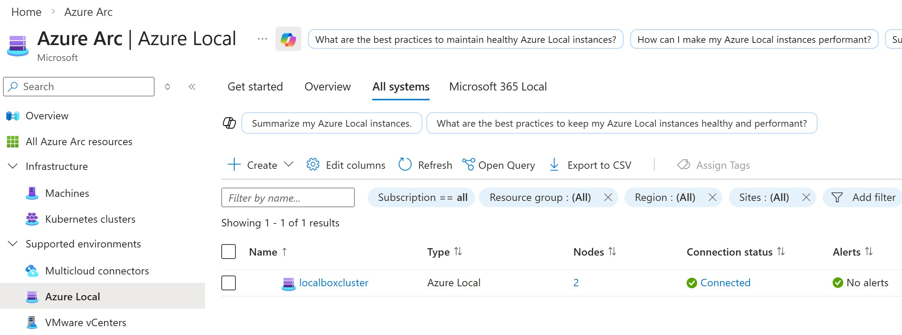
2. Click on the **localboxcluster** Azure Local instance
3. Explore the available features and services under **Resources**
4. Select **Virtual machines** option
5. Click **+ Create VM** to start the VM creation wizard

### 2.2 Configure the Virtual Machine

💥 **Basic settings:**

1. **Subscription**: Select your subscription (e.g. **Micro-Hack-1**)
2. **Resource group**: Select your assigned resource group (e.g., `labuser-XX`; use the exact name provided by the facilitator)
3. **Virtual machine name**: `labuserXX-vm-01` (replace XX with your own suffix)
4. **Security type**: Select **Standard**

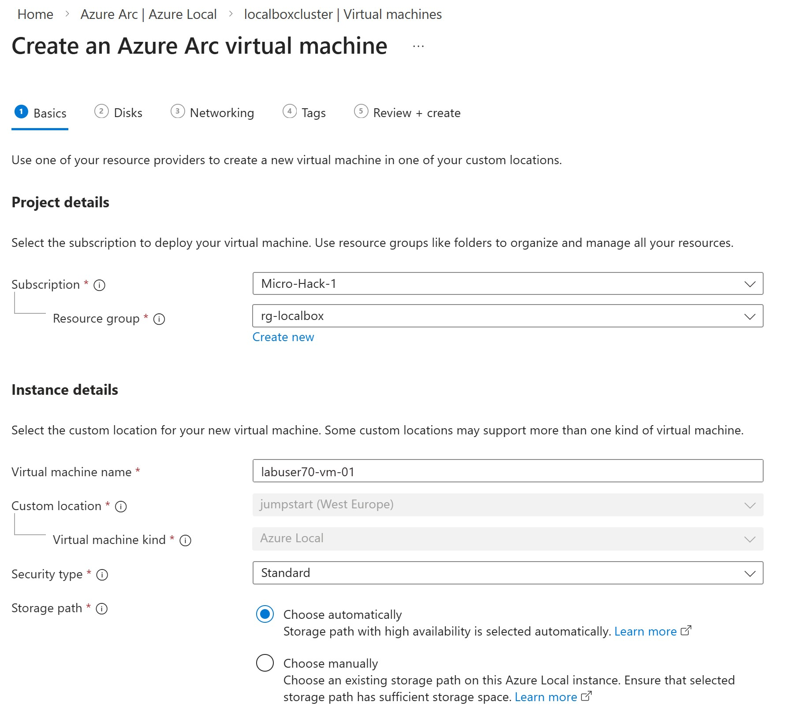

5. **Image**: Select the available gallery image **2025-datacenter-azure-edition-smalldisk-01** (Windows Server 2025)
6. **Virtual processor count**: 2
7. **Memory (MB)**: 4096

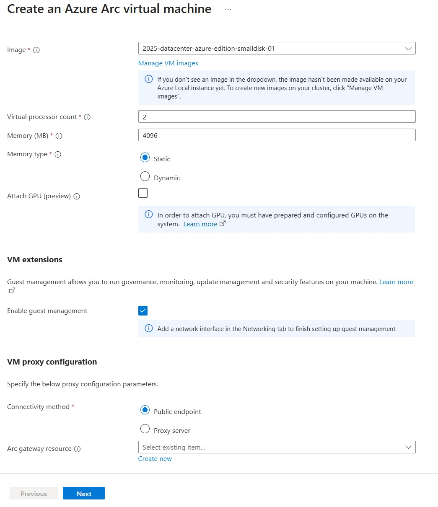

8. Under **VM extensions**, select **Enable guest management**. This installs the Azure Connected Machine agent so that Defender for Cloud and Azure Update Manager can manage the guest OS.

💥 **Administrator account:**

1. **Username**: `localadmin`
2. **Password**: Create a strong password and make a note of it

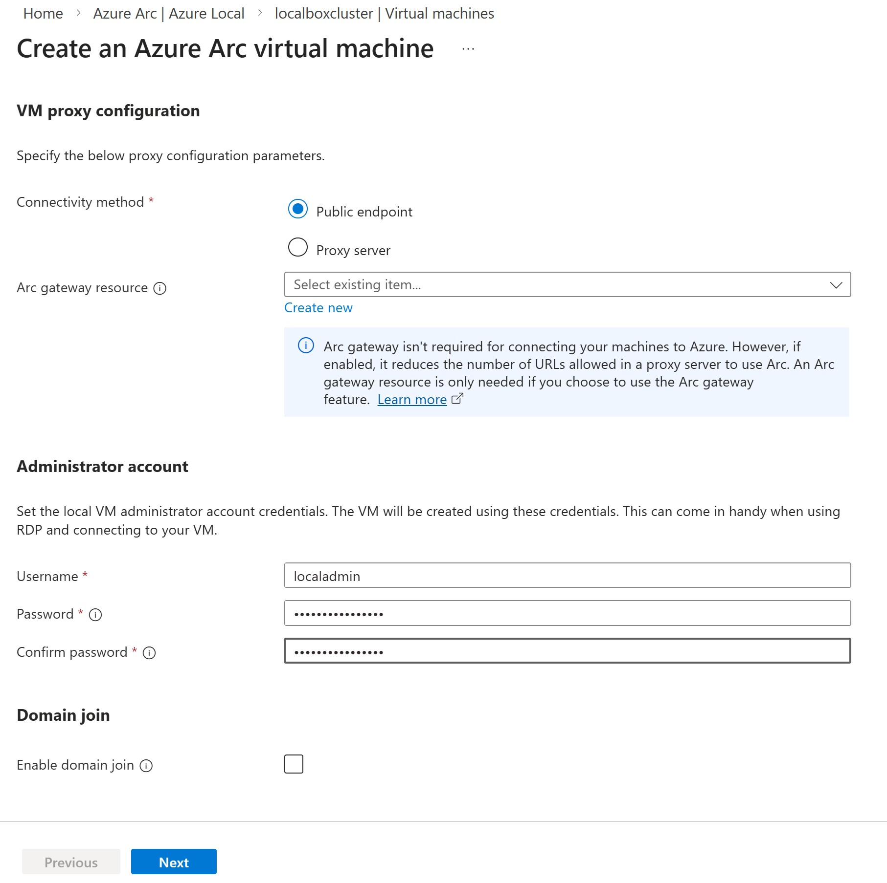

Do not opt-in for domain join at this time, and select **Next**

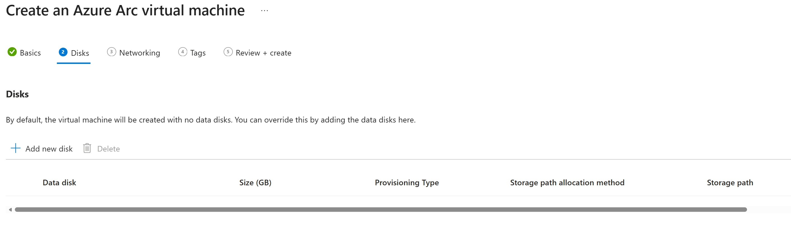

Click **Next** without creating any data disks.


💥 **Networking:**

Click **+ Add network interface**

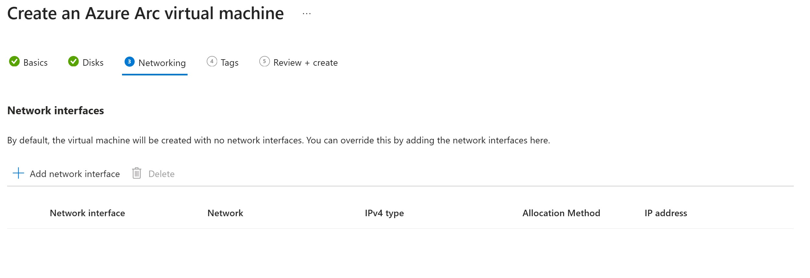

For **Name** use the same value as for **Virtual machine name**: `labuserXX-vm-01` (replace XX with your own suffix)
For **Network** choose **localbox-vm-lnet-vlan200**
Select **Add** and then **Next**

The VM needs a valid IP address, working DNS, and outbound connectivity to the required Azure Arc and Defender endpoints and its configured Windows update source. Use the logical network prepared by the facilitator; VM provisioning alone does not prove that guest connectivity works.

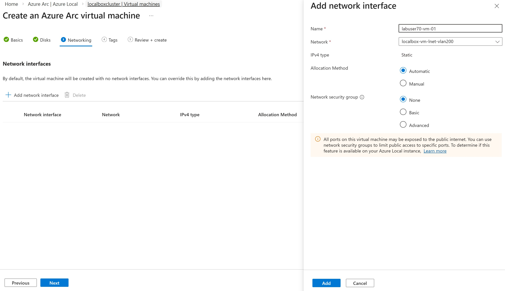

Click **Next** twice

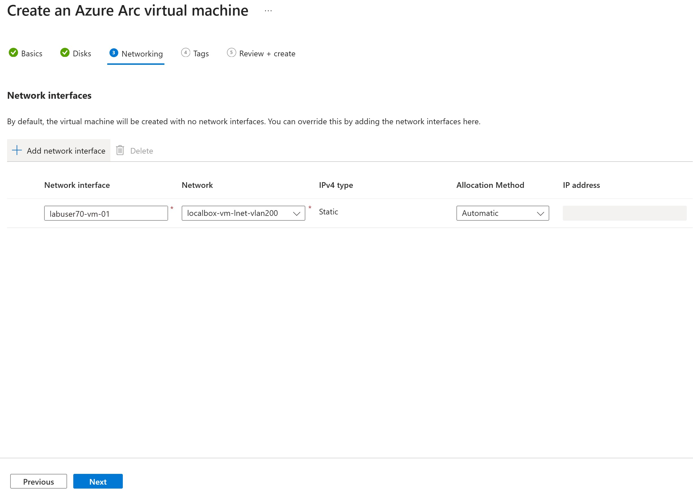

### 2.3 Review and Create

1. Review all settings
2. Click **Create** to deploy the VM

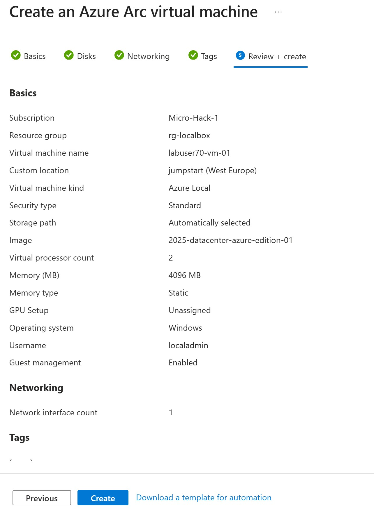

### 2.4 Validate VM Deployment and Guest Management

1. Click **Go to resource** when the deployment is finished
2. Verify the VM is running
3. Review the VM properties and available operations
4. On **Overview -> Properties -> Configuration**, verify that **Guest management** shows **Enabled (Connected)**
5. Record your VM name, subscription, resource group, and resource ID. Use this same VM in the following exercises

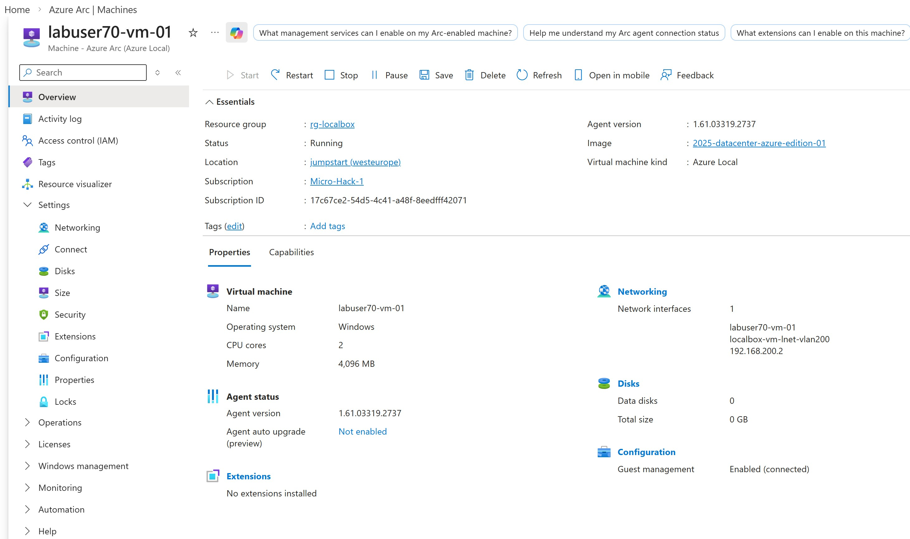

> [!IMPORTANT]
> If guest management is disabled or still connecting, resolve this before continuing. Check the guest network with the facilitator and follow [Enable guest management on an Azure Local VM](https://learn.microsoft.com/azure/azure-local/manage/manage-arc-virtual-machines#enable-guest-management). Do not separately onboard a duplicate Arc-enabled server resource for a VM whose guest management is already connected.

🔑 **Key insight:** Azure Arc VM management enables self-service VM provisioning on Azure Local using familiar Azure tools and RBAC. This allows organizations to maintain data sovereignty by keeping workloads on-premises while benefiting from Azure management capabilities.

#### **Bonus tip**

By appending **--rdp** to the Azure CLI command generated on the **Connect** blade for the VM, it is possible to connect to Windows machines running on Azure Local (and any Arc-enabled Windows machine) via Remote Desktop when running the command from Azure CLI on your local computer:

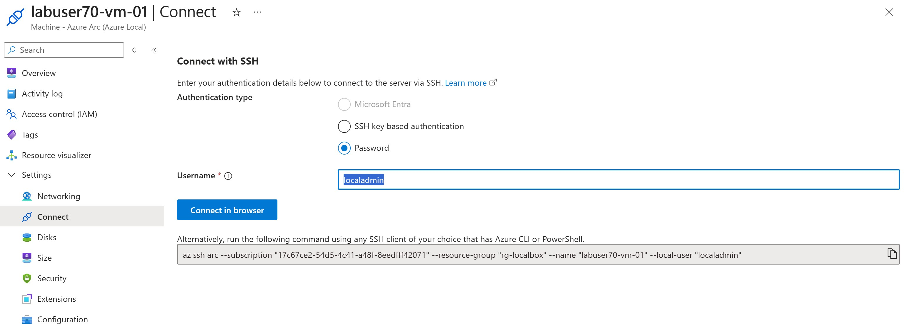

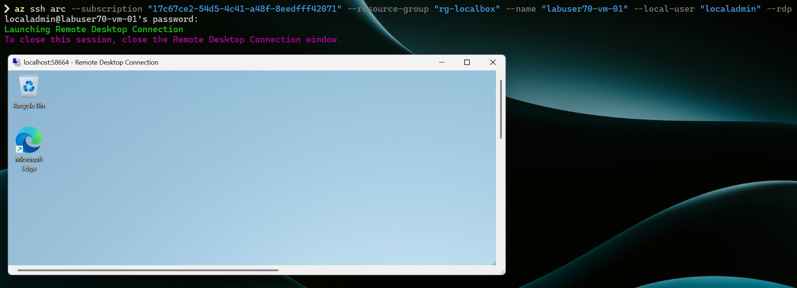

To learn more, see [SSH access to Azure Arc-enabled servers](https://learn.microsoft.com/azure/azure-arc/servers/ssh-arc-overview).

---

## Task 3: Security Monitoring with Microsoft Defender for Cloud

**Verify Defender for Servers coverage and review security recommendations for the VM you created in Task 2.**

### 3.1 Verify Coverage for Your VM

1. Navigate to **Microsoft Defender for Cloud** in the Azure Portal
2. Open **Inventory** and filter by your subscription and assigned resource group
3. Search for `labuserXX-vm-01` (using your own suffix). Match its resource ID to the VM recorded in Task 2, rather than selecting a shared machine with a similar name
4. Open the resource details and review its Defender for Servers coverage and onboarding status. The organizer should already have enabled the approved Servers plan and Defender for Endpoint integration

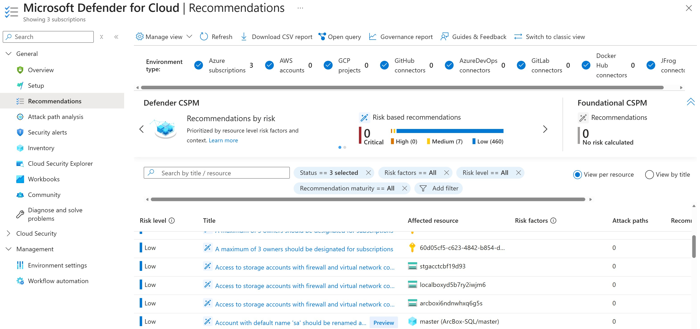

> [!NOTE]
> A newly created VM can take time to appear and complete onboarding. If it is missing, first recheck **Guest management: Enabled (Connected)** and the selected subscription/resource group, then refresh Inventory. Ask the facilitator to check plan coverage and extension onboarding if it remains missing or unprotected. An Inventory entry alone does not prove that Defender for Servers protection is active. Do not enable a paid subscription-level plan yourself in a hosted lab.

### 3.2 Review Your VM's Security Posture

1. From your VM's resource details, open its **Recommendations**
2. Review the assessment status and any recommendations for that VM. If navigating from the subscription-wide **Recommendations** view, verify the affected resource is your VM by resource ID
3. For an available recommendation, inspect its severity, reason, and remediation guidance

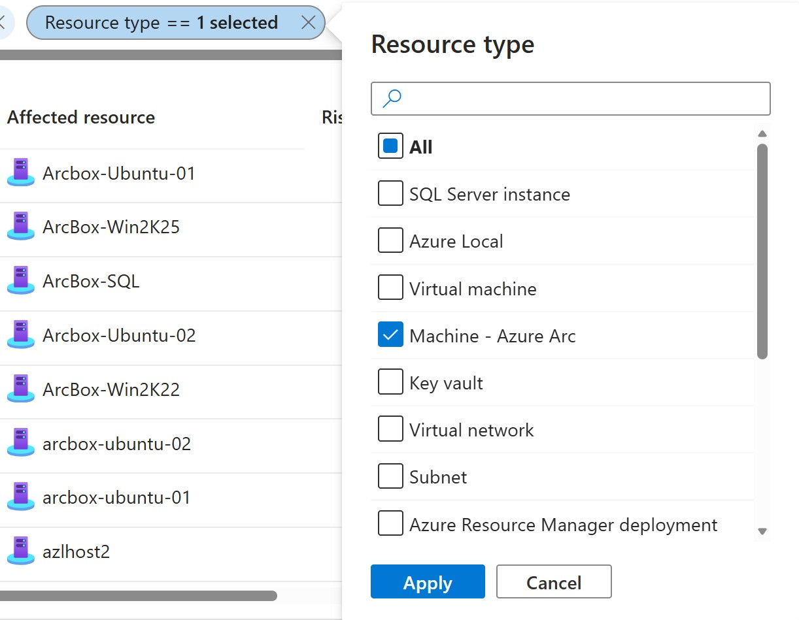

Depending on the enabled plan and completed assessments, recommendations may concern:

| Area | What to investigate |
|------|---------------------|
| System updates | Missing OS security updates |
| Endpoint protection | Defender for Endpoint onboarding or protection status |
| Vulnerabilities | Detected software vulnerabilities and remediation guidance |

Only investigate or remediate your own VM. Do not apply subscription-wide fixes or change shared LocalBox infrastructure as part of this exercise.

> [!NOTE]
> Recommendations may still be pending on a fresh VM, and an assessed VM may have no active recommendations. Record the displayed assessment status separately from the verified protection status. An empty recommendations list does not demonstrate completed assessment or compliance. You can complete Task 4 while waiting, then return to review your VM's results.

### 3.3 Review Security Alerts (if any)

1. Navigate to **Security alerts** in Defender for Cloud
2. Filter by your subscription and inspect only alerts whose affected resource matches your VM's resource ID
3. If an alert exists, review:
   - Attack description
   - Affected resources
   - Recommended actions

No alerts is an expected outcome for a new lab VM; do not generate an alert or select another participant's resources to complete this step.

🔑 **Key insight:** Microsoft Defender for Cloud provides unified security management across Azure and Arc-enabled resources. This enables consistent security posture management for sovereign hybrid deployments.

---

## Task 4: Assess Your VM with Azure Update Manager

**Use Azure Update Manager to assess OS updates on the same Windows Server VM you created in Task 2.**

### 4.1 Locate Your VM

1. In the Azure Portal, search for **Azure Update Manager**
2. Select **Resources -> Machines**
3. Filter by your subscription and assigned resource group, then search for `labuserXX-vm-01` (using your own suffix)
4. Select your VM and verify its resource ID matches the VM recorded in Task 2. Azure Local guest VMs use Azure Arc guest management; do not select the shared cluster nodes, LocalBox host, or Arc Resource Bridge

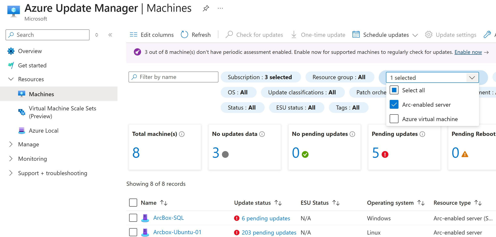

> [!IMPORTANT]
> This exercise assesses the guest operating system of your VM. It does not update the Azure Local cluster infrastructure. If your VM is not listed, recheck its running state, connected guest management, and your filters before continuing. Ask the facilitator to verify permissions and connectivity if needed.

### 4.2 Trigger an Update Assessment

1. Review the current update assessment status for your VM. A new VM may not have been assessed yet
2. Click **Check for updates** and confirm that only your VM is selected
3. Wait for the assessment to finish, then refresh the VM's update status and verify the latest assessment time and successful result

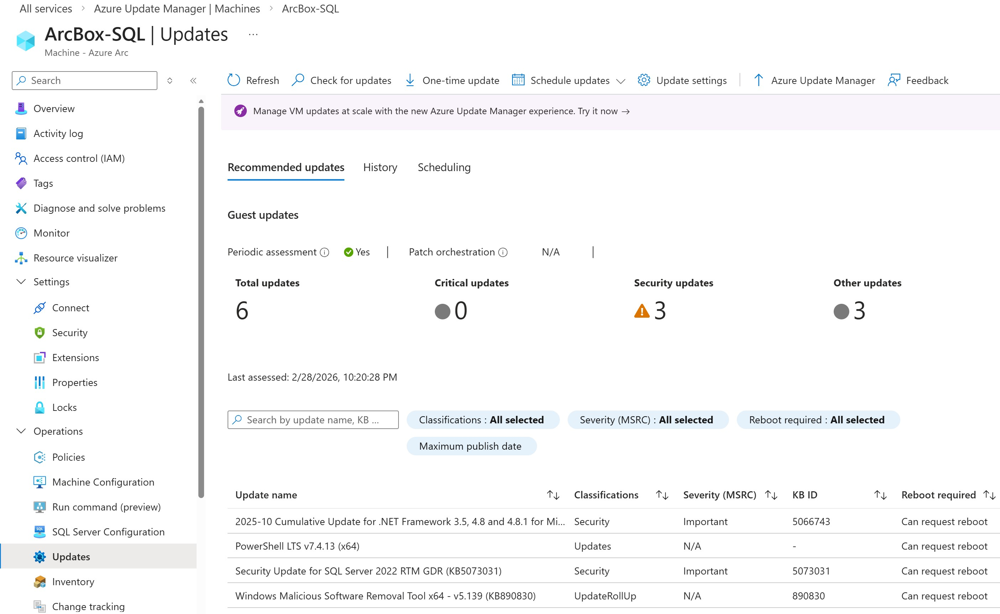

The first assessment can take additional time while the required update extension is deployed. If the assessment fails, review the error and check guest connectivity, extension provisioning, permissions, and access to the configured Windows update source with the facilitator. A pending or failed assessment is not a successful result.

### 4.3 Review Available Updates

1. Open the completed assessment results for your VM
2. Review the available update classifications, such as:
   - **Critical and security updates** - High priority
   - **Other updates** - Feature and quality updates
   - **Definition updates** - Antimalware definitions
3. Record the assessment time and pending update counts. A successful assessment with zero pending updates is also a valid outcome

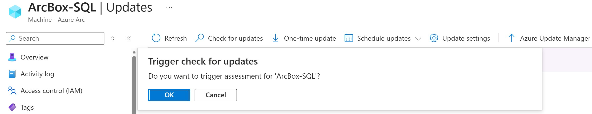

This exercise stops at assessment. Do not install updates, schedule patching, or restart shared resources.

🔑 **Key insight:** Azure Update Manager provides centralized patch management across Azure VMs and Arc-enabled servers. This is critical for maintaining security compliance in sovereign environments where you need to control when and how updates are applied.

---

## Task 5: Wrap-up and Discussion

### 5.1 Review Key Learnings

After completing this challenge, you should understand:

✅ **Azure Arc as the Hybrid Bridge**
- Azure Local VMs are represented as Azure resources
- Enables unified management through Azure Resource Manager
- Supports Azure RBAC, tags, and policies for hybrid resources

✅ **Azure Local as Sovereign Private Cloud**
- Azure Local enables sovereign on-premises cloud infrastructure
- Arc Resource Bridge connects Azure Local to Azure management plane
- Self-service VM provisioning using Azure Portal (also available via CLI and Infrastructure as Code)

✅ **Security and Compliance**
- Connected guest management enables Azure services inside your VM's operating system
- Microsoft Defender for Cloud provides security coverage and recommendations for your VM
- Azure Update Manager assesses updates on that same VM without changing shared infrastructure

### 5.2 Real-World Applications

Consider how these capabilities apply to sovereign cloud scenarios:

| Scenario | Azure Arc Capability |
|----------|---------------------|
| Data residency requirements | Keep data on-premises with Azure Local, manage from Azure |
| Regulatory compliance | Apply consistent policies across hybrid estate |
| Security monitoring | Unified threat detection with Defender for Cloud |
| Operational efficiency | Single control plane for hybrid management |
| Disaster recovery | Azure Site Recovery integration for failover |

### 5.3 Further Exploration

For additional learning, explore:

- [Azure Arc Jumpstart Scenarios](https://jumpstart.azure.com/)
- [Azure Local documentation](https://learn.microsoft.com/azure/azure-local/)
- [Microsoft Sovereign Cloud documentation](https://learn.microsoft.com/industry/sovereign-cloud/)

---

## Validation Checklist

Before completing this challenge, verify:

- [ ] You can navigate and understand the LocalBox hybrid environment in the Azure Portal
- [ ] You have deployed your own VM on Azure Local and verified that guest management is Enabled (Connected)
- [ ] You have verified Defender for Servers coverage for your VM and reviewed its available recommendations, or recorded that its assessment is still pending
- [ ] You have completed an Azure Update Manager assessment for your VM and reviewed its timestamp and results, including when no updates are pending
- [ ] You understand how Azure Arc provides a unified control plane for sovereign hybrid scenarios

---

You successfully completed Challenge 6! 🚀🚀🚀
