# Walkthrough Challenge 6 - Operating a Sovereign Hybrid Cloud with Azure Arc & Azure Local

**Estimated Duration:** 60-90 minutes

> 💡 **Objective:** Operate a sovereign hybrid cloud environment combining Azure Local and Azure Arc. You'll learn how to apply consistent governance, security, and management across on-premises sovereign infrastructure and Azure.

This challenge uses **Azure Arc Jumpstart LocalBox** to simulate an Azure Local on-premises environment. You will provision your own Windows Server VM and use that same VM for the Defender for Cloud and Azure Update Manager exercises.

---

## Prerequisites

Please ensure that you successfully verified the [General prerequisites](https://github.com/microsoft/MicroHack/blob/main/03-Azure/01-03-Infrastructure/01_Sovereign_Cloud/Readme.md#general-prerequisites) before continuing with this challenge.

Use your [Sovereign Cloud Codespace](https://github.com/microsoft/MicroHack/blob/main/03-Azure/01-03-Infrastructure/01_Sovereign_Cloud/Readme.md#recommended-environment-github-codespaces) for the Bash commands in Task 5 and the Azure portal for Tasks 1–4. No local Windows installation or remote desktop connection is required.

**Additional requirements for this challenge:**

- Access to a pre-deployed LocalBox environment with Arc Resource Bridge, a VM image, storage, and a logical network ready for VM creation
- **Reader** and **Azure Stack HCI VM Contributor** role permissions on the resource group containing the shared LocalBox resources
- Your assigned resource group (for example, `labuser-XX`) with permission to create and manage your VM and its extensions and assess updates. Hosted labs grant **Owner** on your own resource group
- **Security Reader** access at subscription scope to review Defender for Cloud coverage and recommendations
- Defender for Servers enabled by the organizer on the lab subscription, using an approved plan and the required Defender for Endpoint integration
- A guest network with a valid IP address, working DNS, and outbound access to the required Azure Arc, Defender, and configured Windows update-source endpoints
- For Task 5, the shared `localbox-aks` cluster in `rg-localbox-shared`, with Microsoft Entra authentication, Kubernetes RBAC, and organizer-prepared MetalLB networking
- Membership in the cluster's configured Microsoft Entra administrator group, supplied through the workshop Console, and the **Azure Arc Enabled Kubernetes Cluster User Role** already assigned by the organizer's preparer for Cluster Connect. These are separate prerequisites; ask the facilitator to verify either if access fails

> [!IMPORTANT]
> Complete Challenge 1's [Preparing for Next Challenges](https://github.com/microsoft/MicroHack/blob/main/03-Azure/01-03-Infrastructure/01_Sovereign_Cloud/walkthrough/challenge-01/solution-01.md#preparing-for-next-challenges): your exercise policy assignments, including **Allowed locations** and any bonus initiative, must be in **DoNotEnforce**. This does not override inherited or organizer-managed policies. The organizer must also confirm that the shared LocalBox **custom location's Azure region** is permitted for resources created in your participant resource group.

> [!NOTE]
> LocalBox is typically deployed by the workshop facilitator due to resource requirements and deployment time. See the [LocalBox deployment and readiness guide](https://github.com/microsoft/MicroHack/blob/main/03-Azure/01-03-Infrastructure/01_Sovereign_Cloud/resources/demo-vm-creator/README.md). For a personal subscription, an authorized owner must also enable Defender for Servers before this challenge and review the plan's charges. Students in hosted labs should not change subscription-level Defender plans.

---

## Lab Environment Architecture

```text
Azure management plane
  Azure Portal / Azure Resource Manager
    |                                      Defender for Cloud
    | VM lifecycle management              Azure Update Manager
    |                                        |
    v                                        | Guest management
LocalBox (simulated on-premises environment)  |
  Azure Local cluster                        |
    Arc Resource Bridge / Custom Location    |
    Gallery images / Storage / Network       |
    |                                        |
    +--> Your VM: labuserXX-vm-01 <------------+
           Windows Server 2025
           Azure Connected Machine agent
           Azure resource in your assigned resource group
```

LocalBox runs as a nested lab environment hosted in Azure. In a production sovereign private cloud, Azure Local and the workload VMs run on-premises; Azure provides the connected management plane. Arc Resource Bridge manages VM lifecycle operations, while guest management enables services inside your VM's operating system.

---

## Task 1: Explore LocalBox Resources in Azure Portal

**Familiarize yourself with the LocalBox resources in Azure Portal to understand the hybrid architecture.**

1. Sign in to the [Azure Portal](https://portal.azure.com)
2. Navigate to the shared LocalBox resource group (e.g., `rg-localbox-shared`)
3. Locate the **Azure Local** instance resource
4. Review the following connected resources:
   - **Arc Resource Bridge** - Connects Azure Local to Azure
   - **Custom Location** - Represents the on-premises location for VM deployment
   - **Gallery Images** - VM images available for deployment

> [!IMPORTANT]
> Azure Local uses Arc Resource Bridge to enable Azure Arc VM management. This allows you to deploy and manage VMs on Azure Local directly from the Azure Portal.

---

## Task 2: Deploy a VM on Azure Local via Azure Portal

💡 **Use Azure Arc VM management to deploy a virtual machine on your Azure Local cluster directly from the Azure Portal.**

> [!IMPORTANT]
> Complete this deployment and verify connected guest management before starting Tasks 3 and 4. Both exercises use your own VM, not the LocalBox host, cluster nodes, Arc Resource Bridge, or another participant's VM. Ask the facilitator for access if LocalBox is not available.

### 2.1 Navigate to Azure Local VM Management

1. In the Azure portal, navigate to **Azure Arc** by using the search bar at the top, and then navigate to the **Azure Local** menu option under **Supported environments**. Click on **All systems**.
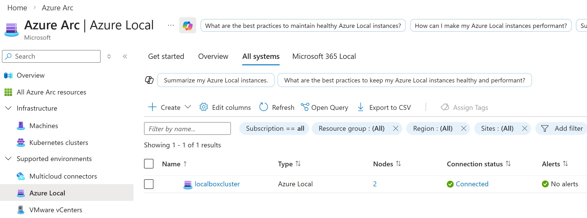
2. Click on the **localboxcluster** Azure Local instance
3. Explore the available features and services under **Resources**
4. Select **Virtual machines** option
5. Click **+ Create VM** to start the VM creation wizard

### 2.2 Configure the Virtual Machine

💥 **Basic settings:**

1. **Subscription**: Select your subscription (e.g. **traininglab-01**)
2. **Resource group**: Select your assigned resource group (e.g., `rg-labuser-0024`; use the exact name provided by the facilitator)
3. **Virtual machine name**: `labuserXX-vm-01` (replace XX with your own suffix)
4. **Security type**: Select **Standard**

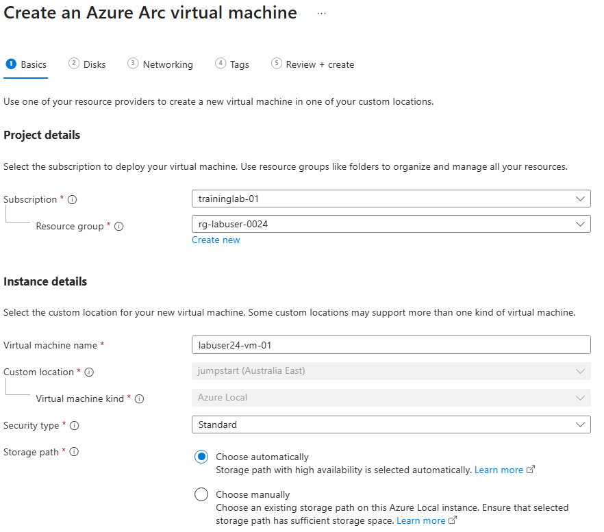

Verify that **Custom location** points to the shared LocalBox environment and **Virtual machine kind** is **Azure Local**. Leave **Storage path** set to **Choose automatically** unless the facilitator instructs otherwise.

> [!NOTE]
> The selected custom location determines the Azure region used for the VM's management resources; it need not match your resource group's location or the Azure region hosting the LocalBox simulator. Fresh hosted deployments and the manual deployment default to **Australia East**, including LocalBox's staging storage account, after a hosted test encountered a West Europe eligibility rejection. This is a lab-only choice, not a European data-residency recommendation. Inspect the actual custom location in your event rather than assuming the latest default has changed an existing environment.
>
> In production, the workload runs on the Azure Local hardware, while Azure stores management data in the registration region. In this lab, that hardware is simulated inside Azure-hosted LocalBox. Registration in Australia East does **not** mean that the nested VM's compute has moved there, but the management-data location still matters for sovereignty and Azure Policy. See [Azure Local regions](https://learn.microsoft.com/azure/azure-local/concepts/system-requirements-23h2#azure-requirements) and [Azure Local data handling](https://learn.microsoft.com/azure/azure-local/faq#does-my-data-stored-on-azure-local-get-sent-to-the-cloud).

The creation screenshots use `labuser24-vm-01`, while the validation and management screenshots use `labuser23-vm-01`. These are examples from different participants; create and use only your own VM throughout the challenge.

5. **Image**: Select the available gallery image **2025-datacenter-azure-edition-smalldisk-01** (Windows Server 2025)
6. **Virtual processor count**: 2
7. **Memory (MB)**: 4096

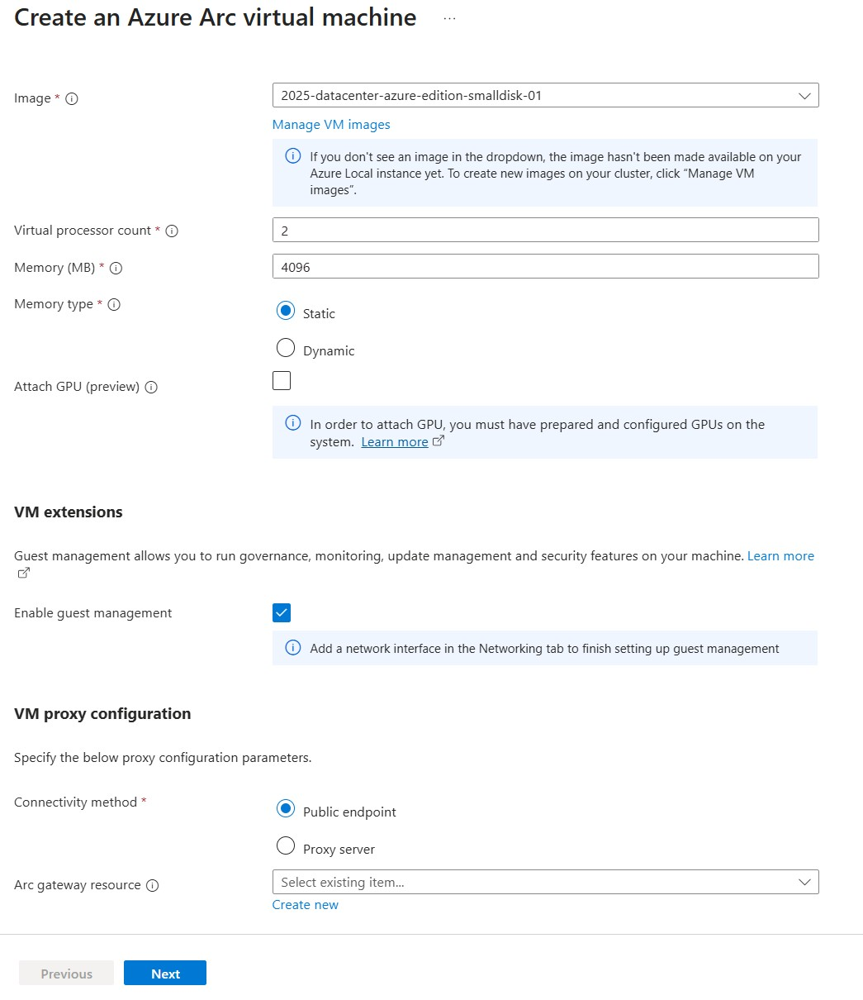

8. Under **VM extensions**, select **Enable guest management**. This installs the Azure Connected Machine agent so that Defender for Cloud and Azure Update Manager can manage the guest OS.

💥 **Administrator account:**

1. **Username**: `localadmin`
2. **Password**: Create a strong password and make a note of it

<a href="./images/localbox_04.jpg">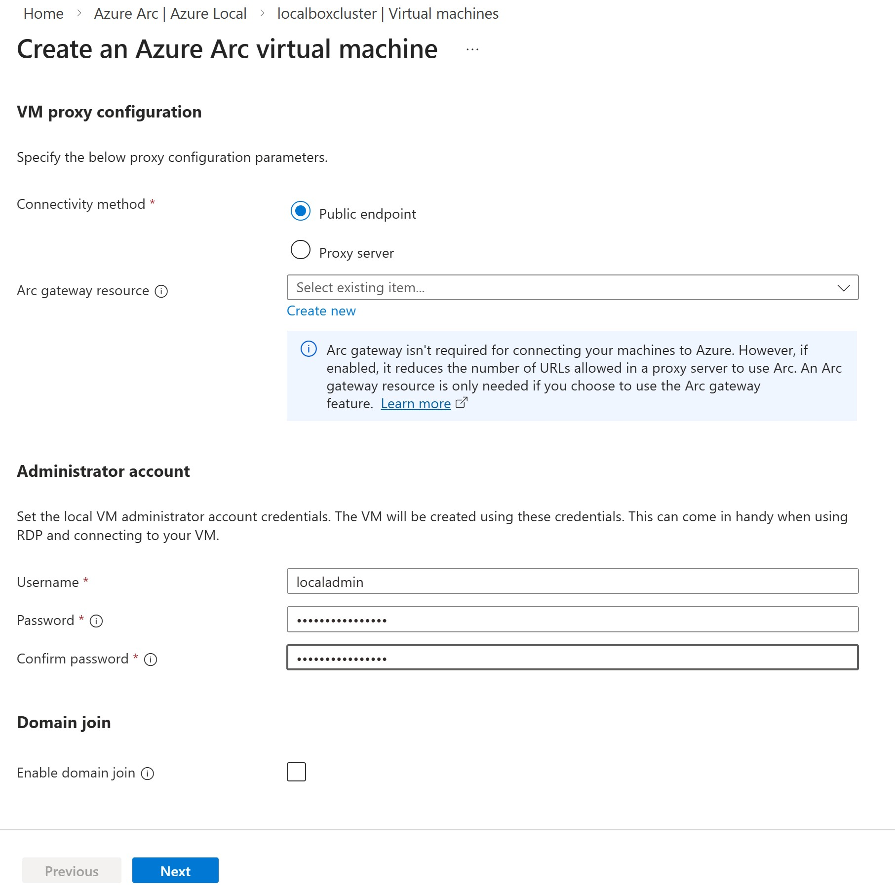</a>

Do not opt-in for domain join at this time, and select **Next**

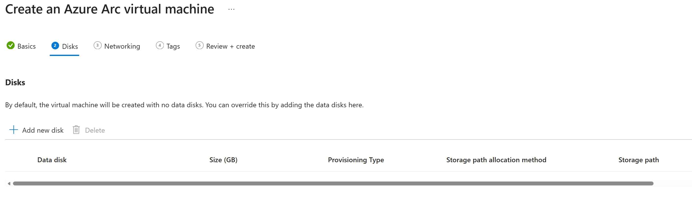

Click **Next** without creating any data disks.


💥 **Networking:**

Click **+ Add network interface**

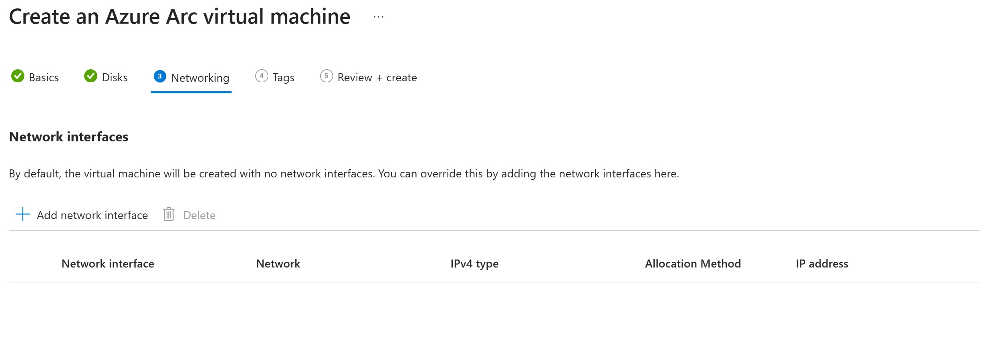

For **Name** use the same value as for **Virtual machine name**: `labuserXX-vm-01` (replace XX with your own suffix)
For **Network** choose **localbox-vm-lnet-vlan200**
Select **Add** and then **Next**

The VM needs a valid IP address, working DNS, and outbound connectivity to the required Azure Arc and Defender endpoints and its configured Windows update source. Use the logical network prepared by the facilitator; VM provisioning alone does not prove that guest connectivity works.

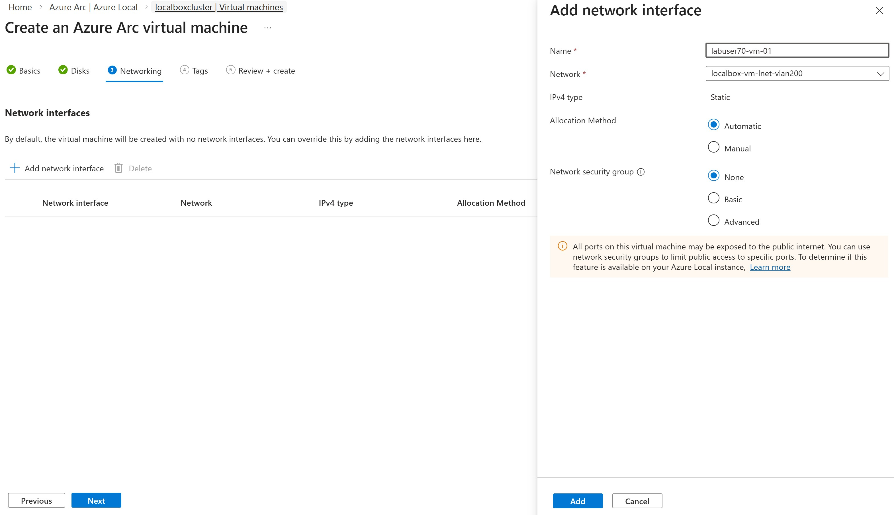

Click **Next** twice

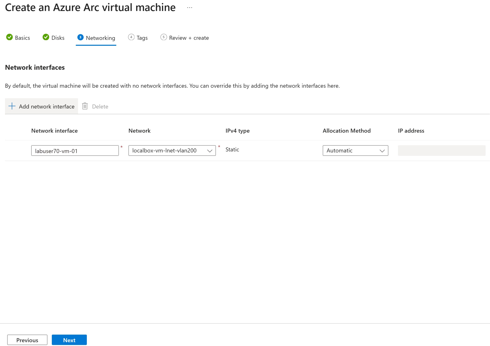

### 2.3 Review and Create

1. Review all settings, especially your assigned resource group, VM name, **Guest management: Enabled**, and a network interface count of **1**
2. Click **Create** to deploy the VM

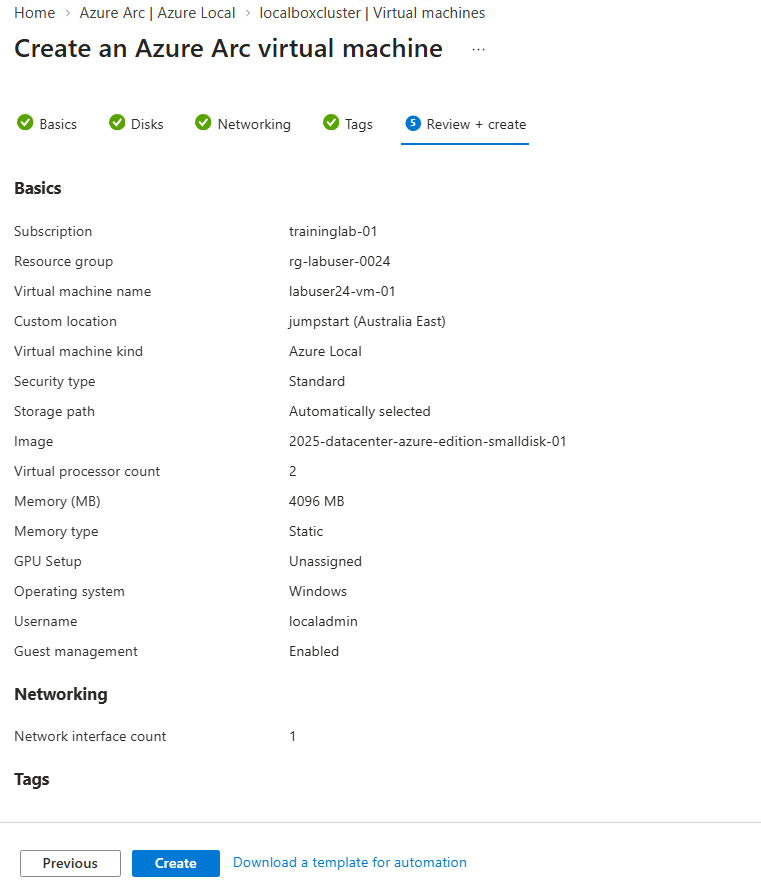

#### If validation or deployment is blocked by a location policy

Do not change the resource group, select another team's custom location, or disable policies at subscription scope to bypass the error.

1. Expand **Error details** on **Review + create**. If the deployment was submitted, open your resource group's **Deployments**, select the failed deployment, and open the failed operation's details. Also check **Activity log** if needed.
2. Record the innermost error code, rejected resource name/type and requested location, **policy assignment ID**, **policy definition ID**, and correlation ID. For an initiative, also record the policy definition reference ID if present. Share only the relevant error details with the facilitator, not deployment parameters, passwords, TAPs or tokens.
3. For `RequestDisallowedByPolicy`, open **Policy > Assignments** and locate the assignment identified by the error. Inspect its **Scope**, **Policy enforcement** and **Parameters**. Check the actual ID, not just the friendly name: an initiative or inherited assignment may enforce a second location restriction.
   - **Your own Challenge 1 exercise assignment:** restore **Do not enforce** using the [Challenge 1 instructions](https://github.com/microsoft/MicroHack/blob/main/03-Azure/01-03-Infrastructure/01_Sovereign_Cloud/walkthrough/challenge-01/solution-01.md#preparing-for-next-challenges), including your bonus initiative if applicable.
   - **Organizer-managed or inherited assignment:** stop and ask the facilitator to review the required metadata region and the approved policy configuration. A resource-group assignment cannot relax a deny inherited from subscription or management-group scope.
   - **Different error code or no policy identifiers:** retain the exact error for the facilitator. A message mentioning a region is not by itself proof that the Challenge 1 policy caused the failure.
4. After the authorized correction has propagated, retry validation in your assigned resource group. Check for partially created resources before retrying a submitted deployment; do not delete shared LocalBox resources.

The current Challenge 1 exercise allowlist retains West Europe and includes **Australia East as a lab-only exception** for LocalBox management resources; older assignments may still have only three or four regions. Keep your exercise assignments in **DoNotEnforce** mode and update only your own assignments following Challenge 1. Do not broaden organizer-managed or inherited allowlists without the policy owner's approval. The updated registration-region default applies to fresh deployments, not existing custom locations. The hosted `SecurityControl=Ignore` and `CostControl=Ignore` tags are **not** general Azure Policy exemptions.

Reference: [Resolve RequestDisallowedByPolicy errors](https://learn.microsoft.com/azure/azure-resource-manager/troubleshooting/error-policy-requestdisallowedbypolicy).

### 2.4 Validate VM Deployment and Guest Management

1. Click **Go to resource** when the deployment is finished
2. Verify the VM is running
3. Review the VM properties and available operations
4. On **Overview -> Properties -> Configuration**, verify that **Arc agent** shows **Enabled (connected)**. Depending on the portal version, this may be labeled **Guest management**
5. Record your VM name, subscription, resource group, and resource ID. Use this same VM in the following exercises

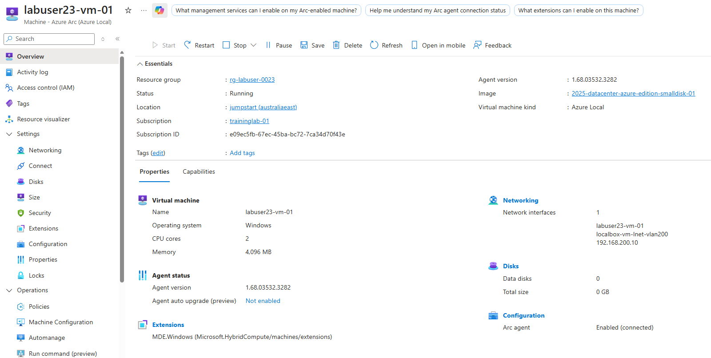

The example also lists the **MDE.Windows** extension under **Extensions**. Its presence alone does not confirm completed Defender for Endpoint onboarding; verify protection status in Task 3.

> [!IMPORTANT]
> If guest management is disabled or still connecting, resolve this before continuing. Check the guest network with the facilitator and follow [Enable guest management on an Azure Local VM](https://learn.microsoft.com/azure/azure-local/manage/manage-arc-virtual-machines#enable-guest-management). Do not separately onboard a duplicate Arc-enabled server resource for a VM whose guest management is already connected.

🔑 **Key insight:** Azure Arc VM management enables self-service VM provisioning on Azure Local using familiar Azure tools and RBAC. This allows organizations to maintain data sovereignty by keeping workloads on-premises while benefiting from Azure management capabilities.

#### **Bonus tip**

This optional Remote Desktop example requires a local computer with an RDP client; it is not part of the browser-only Codespaces workflow and can be skipped.

By appending **--rdp** to the Azure CLI command generated on the **Connect** blade for the VM, it is possible to connect to Windows machines running on Azure Local (and any Arc-enabled Windows machine) via Remote Desktop when running the command from Azure CLI on your local computer:

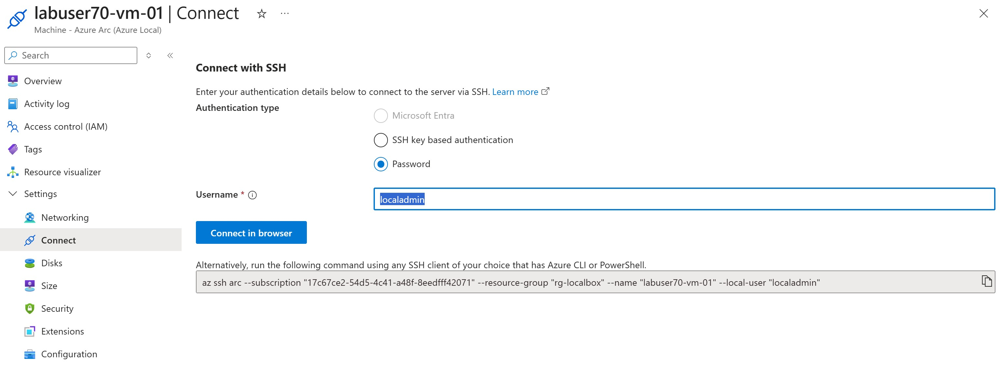

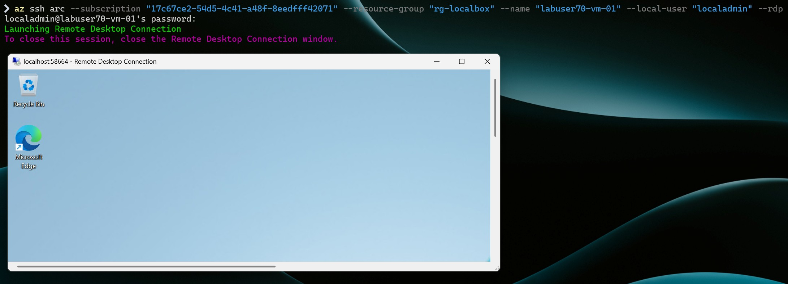

To learn more, see [SSH access to Azure Arc-enabled servers](https://learn.microsoft.com/azure/azure-arc/servers/ssh-arc-overview).

---

## Task 3: Security Monitoring with Microsoft Defender for Cloud

**Verify Defender for Servers coverage and review security recommendations for the VM you created in Task 2.**

The screenshots in Tasks 3 and 4 use `labuser23-vm-01` in resource group `rg-labuser-0023` as an example. Use your own VM, assigned resource group, and subscription throughout; names and assessment results may differ.

### 3.1 Verify Coverage for Your VM

1. Navigate to **Microsoft Defender for Cloud** in the Azure Portal
2. Open **Inventory** and filter by your subscription and assigned resource group
3. Search for `labuserXX-vm-01` (using your own suffix). Match its resource ID to the VM recorded in Task 2, rather than selecting a shared machine with a similar name
4. Open the resource details and review its Defender for Servers coverage and onboarding status. The organizer should already have enabled the approved Servers plan and Defender for Endpoint integration

You can also open your VM resource and select **Settings -> Security** to see its **Microsoft Defender for Servers** status, as illustrated in Task 3.2. The **On** indicator shows the displayed plan status; it does not by itself confirm that Defender for Endpoint onboarding has completed.

For subscription-level context, open **Management -> Environment settings** in Defender for Cloud and locate your lab subscription in the hierarchy:

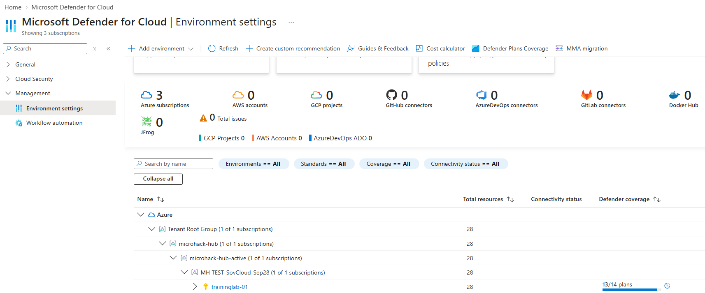

Select the subscription and review **Defender plans**, including the **Servers** row under **Cloud Workload Protection (CWPP)**. This is a read-only check: do not change plan settings or select **Save**. If you cannot access this view, ask the facilitator to confirm the configured plan.

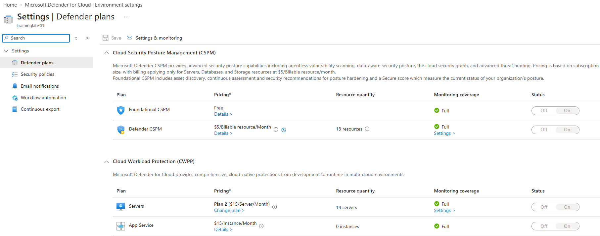

The example subscription uses **Servers Plan 2** with **Full** monitoring coverage. Your lab's approved plan may differ. These subscription-level settings are context, not evidence that your individual VM has completed onboarding.

> [!NOTE]
> A newly created VM can take time to appear and complete onboarding. If it is missing, first recheck **Guest management: Enabled (Connected)** and the selected subscription/resource group, then refresh Inventory. Ask the facilitator to check plan coverage and extension onboarding if it remains missing or unprotected. An Inventory entry alone does not prove that Defender for Servers protection is active. Do not enable a paid subscription-level plan yourself in a hosted lab.

### 3.2 Review Your VM's Security Posture

1. From your VM's resource details in Defender for Cloud, open its **Recommendations**. Alternatively, open your Azure Local VM resource and select **Settings -> Security** to view its recommendations
2. Review the assessment status and any recommendations for that VM. If navigating from the subscription-wide **Recommendations** view, verify the affected resource is your VM by resource ID
3. For an available recommendation, inspect its severity, reason, and remediation guidance

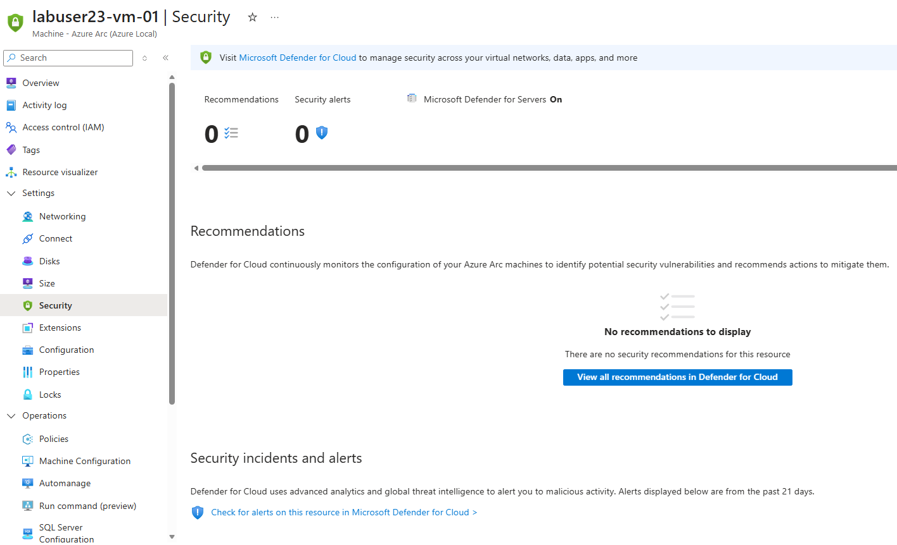

The example VM shows **Microsoft Defender for Servers On** and **No recommendations to display**. Use **View all recommendations in Defender for Cloud** to investigate further, keeping the results scoped to your own VM.

Depending on the enabled plan and completed assessments, recommendations may concern:

| Area | What to investigate |
|------|---------------------|
| System updates | Missing OS security updates |
| Endpoint protection | Defender for Endpoint onboarding or protection status |
| Vulnerabilities | Detected software vulnerabilities and remediation guidance |

Only investigate or remediate your own VM. Do not apply subscription-wide fixes or change shared LocalBox infrastructure as part of this exercise.

> [!NOTE]
> Recommendations may still be pending on a fresh VM, and an assessed VM may have no active recommendations. Record the displayed assessment status separately from the verified protection status. An empty recommendations list does not demonstrate completed assessment or compliance. You can complete Task 4 while waiting, then return to review your VM's results.

### 3.3 Review Security Alerts (if any)

1. Navigate to **Security alerts** in Defender for Cloud
2. Filter by your subscription and inspect only alerts whose affected resource matches your VM's resource ID
3. If an alert exists, review:
   - Attack description
   - Affected resources
   - Recommended actions

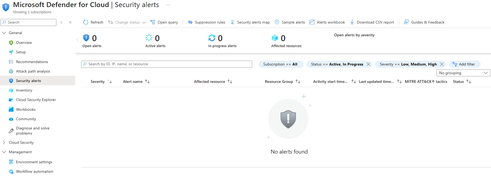

The screenshot shows an empty alerts list with **Subscription == All**. In your lab, narrow this filter to your subscription and use the search box to find your VM before reviewing any results.

No alerts is an expected outcome for a new lab VM; do not generate an alert or select another participant's resources to complete this step.

🔑 **Key insight:** Microsoft Defender for Cloud provides unified security management across Azure and Arc-enabled resources. This enables consistent security posture management for sovereign hybrid deployments.

---

## Task 4: Assess Your VM with Azure Update Manager

**Use Azure Update Manager to assess OS updates on the same Windows Server VM you created in Task 2.**

### 4.1 Locate Your VM

1. In the Azure Portal, search for **Azure Update Manager**
2. Select **Resources -> Machines**
3. Filter by your subscription and assigned resource group, then search for `labuserXX-vm-01` (using your own suffix)
4. Select your VM and verify its resource ID matches the VM recorded in Task 2. Azure Local guest VMs use Azure Arc guest management; do not select the shared cluster nodes, LocalBox host, or Arc Resource Bridge

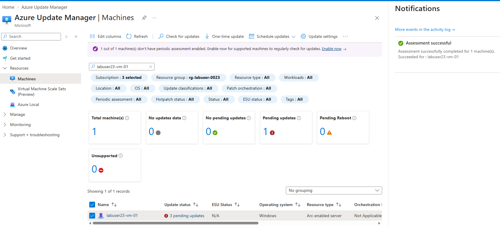

Before the first assessment, your VM may show **No updates data**, as in this example. The screenshot has multiple subscriptions selected; narrow the subscription filter to your own lab subscription as well. The VM appears as an **Arc-enabled server** because Update Manager manages its guest OS through Azure Arc.

> [!IMPORTANT]
> This exercise assesses the guest operating system of your VM. It does not update the Azure Local cluster infrastructure. If your VM is not listed, recheck its running state, connected guest management, and your filters before continuing. Ask the facilitator to verify permissions and connectivity if needed.

### 4.2 Trigger an Update Assessment

1. Review the current update assessment status for your VM. A new VM may not have been assessed yet
2. In the **Machines** list, select the checkbox beside your VM to enable **Check for updates**, then click it and confirm that only your VM is selected
3. Wait for the assessment to finish, then refresh the VM's update status and verify the latest assessment time and successful result

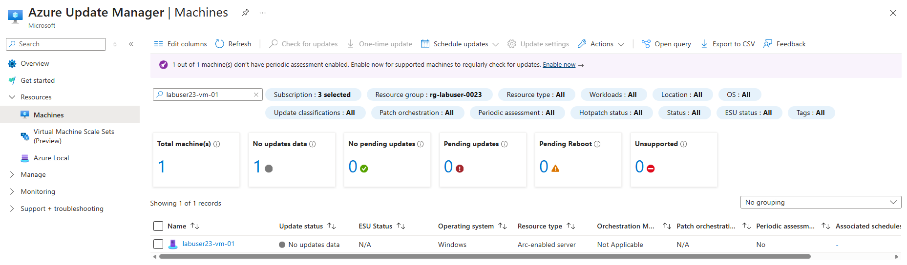

The screenshot shows the result after **Check for updates** completes: **Assessment successful** for one machine and **3 pending updates** on that VM's row. The **Pending updates** summary tile counts machines with pending updates, not individual updates.

The first assessment can take additional time while the required update extension is deployed. If the assessment fails, review the error and check guest connectivity, extension provisioning, permissions, and access to the configured Windows update source with the facilitator. A pending or failed assessment is not a successful result.

### 4.3 Review Available Updates

1. Open the completed assessment results for your VM. You can also open the VM resource and select **Operations -> Updates -> Recommended updates**
2. Review the available update classifications, such as:
   - **Critical and security updates** - High priority
   - **Other updates** - Feature and quality updates
   - **Definition updates** - Antimalware definitions
3. Record the assessment time and pending update counts. A successful assessment with zero pending updates is also a valid outcome

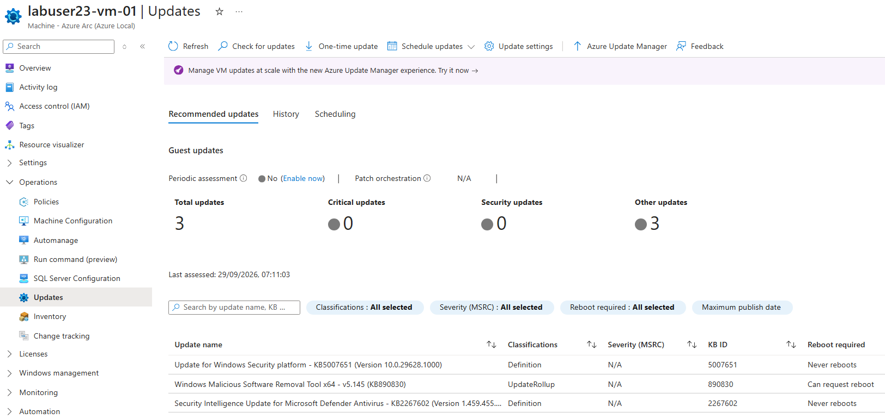

In this example, **Total updates** is **3**, with **0** critical updates, **0** security updates, and **3** other updates. The table provides the individual classifications, KB IDs, and reboot requirements; definition updates are included under **Other updates** in this summary. Record your own **Last assessed** time and results rather than copying the example values.

This exercise stops at assessment. Leave periodic assessment unchanged; the **Enable now** banner is not required for this manual check. Do not install updates, schedule patching, or restart shared resources.

🔑 **Key insight:** Azure Update Manager provides centralized patch management across Azure VMs and Arc-enabled servers. This is critical for maintaining security compliance in sovereign environments where you need to control when and how updates are applied.


## Task 5: Deploy a container to the AKS cluster deployed on Azure Local

**Deploy only your team's application; inspect shared infrastructure without changing it.** The organizer runs `resources/prepare-localbox.ps1` to prepare the AKS cluster and MetalLB after LocalBox deployment. The Console's LocalBox deployment hook alone does not prepare MetalLB. Attendees must not install extensions, create address pools, change routes, or change shared RBAC.

### Task 5.1: Verify Cluster Access and Authentication

1. In the Azure portal, open **`localbox-aks`** in **`rg-localbox-shared`**.
2. Confirm that its authentication configuration is **Microsoft Entra authentication with Kubernetes RBAC**. Have the facilitator confirm your Console-provided membership in the configured administrator group; the historical screenshot's group name is only an example.
3. Open **Kubernetes resources > Workloads** and inspect the system workloads.

The following older screenshot illustrates the authentication setting at the bottom. It is **not** an instruction to create or reconfigure the shared cluster. Its cluster name, region, and group can differ from your workshop. Click any screenshot to view it full-size.

<a href="./images/localbox61.png">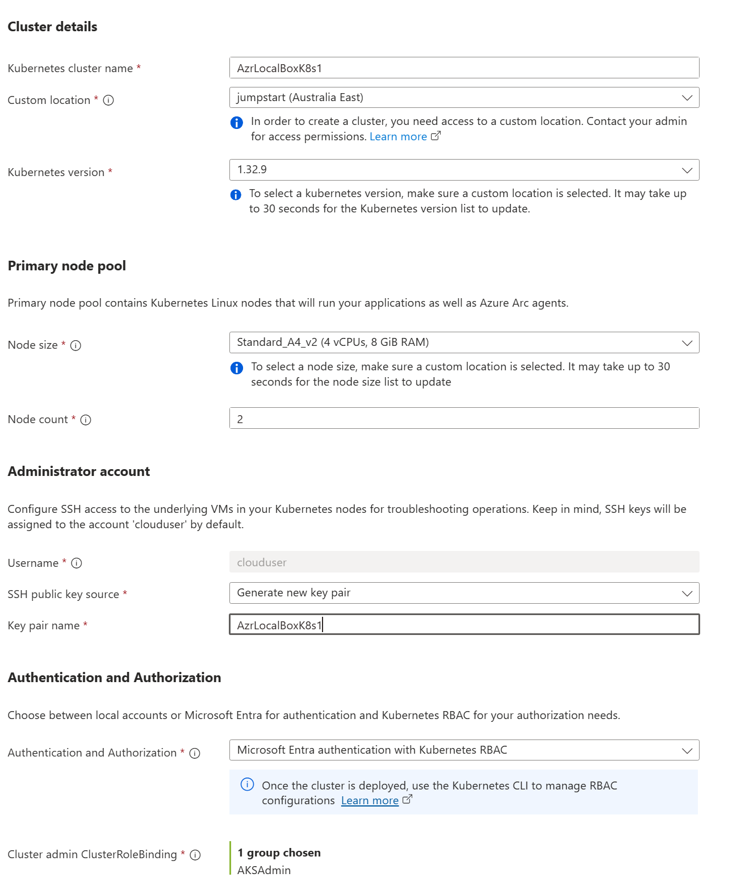</a>

<a href="./images/localbox62.png">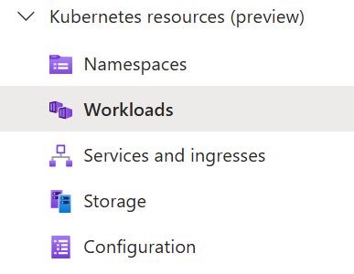</a>

<a href="./images/localbox63.png">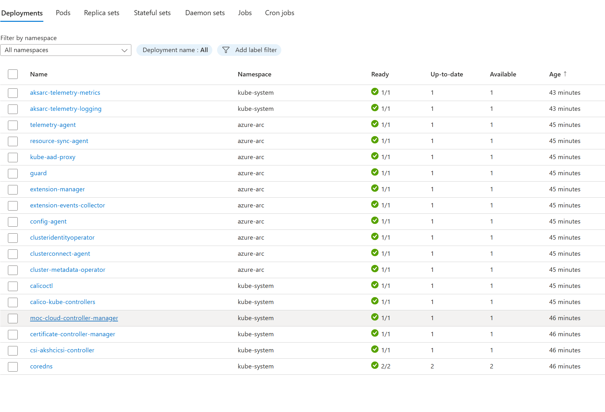</a>

Successful portal workload access proves only that the current identity can perform that operation. It does **not** independently prove administrator-group membership or that CLI access is ready.

> [!IMPORTANT]
> Use your workshop Microsoft Entra identity throughout. If the portal requests a bearer token or the CLI reports `Unauthorized`/`Forbidden`, stop and ask the facilitator to verify the configured group, your membership, the existing **Azure Arc Enabled Kubernetes Cluster User Role**, and Cluster Connect readiness. After membership changes, sign in again to refresh your session. Do not create a service account token, retrieve admin credentials, or grant yourself additional roles.

### Task 5.2: Inspect Organizer-Prepared MetalLB

MetalLB assigns service virtual IP addresses (VIPs) to Kubernetes Services of type `LoadBalancer`. Before deploying:

1. Open **Settings > Extensions** and inspect **`arcnetworking`**, extension type **`microsoft.arcnetworking`**. Its provisioning state must be **Succeeded**.
2. Under **Kubernetes resources > Workloads**, inspect the MetalLB controller and speaker workloads. Check that controller replicas and speaker DaemonSet pods are ready, with no persistent pending or crashing pods. Extension provisioning success alone is not proof of healthy workloads.
3. Open **Settings > Networking** and inspect the existing **`aks-pool`**. Confirm successful provisioning, **ARP** advertisement, and the IP range reserved by the organizer for service VIPs. Record that range; it must exclude the AKS node allocation pool, control-plane IP, gateway, and any other allocated addresses.

The default LocalBox service VIP reservation is **`10.10.0.10-10.10.0.100`**, separate from the node allocation pool **`10.10.0.101-10.10.0.199`**, control-plane IP **`10.10.0.5`**, and gateway **`10.10.0.1`**. The preparer uses the deployment configuration's exact reservation, so confirm the actual range if the organizer customized it. The older screenshots' `10.10.0.150` address overlaps the default node range and must not be reused as a service VIP.

The organizer-created ARP pool is represented in Kubernetes by an **IPAddressPool** and **L2Advertisement** in **`kube-system`**. After starting the proxy in Task 5.3, inspect these read-only resources as shown in Task 5.4; do not create or edit them. See the [official AKS enabled by Azure Arc load-balancer documentation](https://learn.microsoft.com/azure/aks/aksarc/deploy-load-balancer-cli) for background only, not participant setup instructions. Provider registration and managed-identity preparation belong to the organizer; participants need no Microsoft Graph permissions and must not run the linked installation commands.

If the extension, healthy workloads, or pool are missing, stop and contact the facilitator. Do not select **Install extension**, **Add**, **Delete**, or **Uninstall extension**. No participant-side MetalLB configuration is needed.

### Task 5.3: Start the Microsoft Entra Cluster Connect Proxy — Terminal 1

Open a **Bash** terminal in your Sovereign Cloud Codespace. This assumes you are already signed in to Azure CLI with your workshop identity and have selected the workshop subscription. Retrieve the tenant and subscription IDs from the current CLI context, then enter your **assigned participant resource group**, not `rg-localbox-shared`, when prompted. Teammates sharing an assigned resource group share one namespace; coordinate deployment and cleanup.

```bash
TENANT_ID=$(az account show --query tenantId --output tsv) || exit 1
SUBSCRIPTION_ID=$(az account show --query id --output tsv) || exit 1
read -r -p "Your assigned participant resource group: " PARTICIPANT_RG
if [[ -z "$TENANT_ID" || -z "$SUBSCRIPTION_ID" || -z "$PARTICIPANT_RG" ||
      "${PARTICIPANT_RG,,}" == "rg-localbox-shared" ]]; then
  echo "Verify your current Azure CLI context and use your own assigned resource group."
  exit 1
fi
printf 'Current tenant: %s\nCurrent subscription: %s\n' "$TENANT_ID" "$SUBSCRIPTION_ID"
az group show --subscription "$SUBSCRIPTION_ID" --name "$PARTICIPANT_RG" \
  --query '{name:name,id:id}' --output table || exit 1
```

Confirm the displayed tenant, subscription, and resource group match your workshop before continuing. The following derives a valid, bounded namespace from your resource group, adding a stable hash of the subscription and group to distinguish names that normalize alike. It saves **only nonsecret settings**, outside the repository, for the other terminals. Never commit or share your kubeconfig or authentication cache.

```bash
RG_SLUG=$(printf '%s' "${PARTICIPANT_RG,,}" |
  sed -E 's/[^a-z0-9]+/-/g; s/^-+//; s/-+$//' | cut -c1-40)
RG_HASH=$(printf '%s/%s' "${SUBSCRIPTION_ID,,}" "${PARTICIPANT_RG,,}" |
  sha256sum | cut -c1-12)
TEAM_NAMESPACE="team-${RG_SLUG:-rg}-${RG_HASH}"
AKS_CONTEXT="sovereign-${TEAM_NAMESPACE}"
AKS_KUBECONFIG="$HOME/.kube/${AKS_CONTEXT}.config"
MANIFEST="$(git rev-parse --show-toplevel)/03-Azure/01-03-Infrastructure/01_Sovereign_Cloud/walkthrough/challenge-06/manifests/aks-local-sample-app.yaml"
umask 077
mkdir -p "$HOME/.config/microhack" "$HOME/.kube"
printf 'export %s=%q\n' \
  SUBSCRIPTION_ID "$SUBSCRIPTION_ID" PARTICIPANT_RG "$PARTICIPANT_RG" \
  TEAM_NAMESPACE "$TEAM_NAMESPACE" AKS_CONTEXT "$AKS_CONTEXT" \
  AKS_KUBECONFIG "$AKS_KUBECONFIG" MANIFEST "$MANIFEST" \
  > "$HOME/.config/microhack/challenge06.env"
source "$HOME/.config/microhack/challenge06.env"
printf 'Team namespace: %s\n' "$TEAM_NAMESPACE"
az connectedk8s proxy \
  --subscription "$SUBSCRIPTION_ID" \
  --resource-group rg-localbox-shared --name localbox-aks \
  --file "$AKS_KUBECONFIG" --kube-context "$AKS_CONTEXT" --port 47011
```

Wait for the proxy to report that it is listening and complete any Microsoft Entra sign-in prompt. **Leave Terminal 1 running** for all following steps. This command writes an isolated kubeconfig rather than replacing your normal configuration; `--kube-context` names its context. See the official [`az connectedk8s proxy` reference and examples](https://learn.microsoft.com/cli/azure/connectedk8s#az-connectedk8s-proxy).

> [!CAUTION]
> Port **47011** is the Kubernetes API proxy, not your application. Never publish or forward this port through Codespaces Ports; if it is automatically detected, stop forwarding it in that view (leave the proxy process running). Never make the API proxy public. Do not pass `--token` or use service-account/admin credentials.

### Task 5.4: Deploy in Your Team Namespace — Terminal 2

Open a **second Bash terminal** in the same Codespace. Environment variables do not automatically carry between terminals, so source the nonsecret settings again. Every Kubernetes operation below explicitly selects the isolated kubeconfig and context.

```bash
source "$HOME/.config/microhack/challenge06.env"
kubectl --kubeconfig "$AKS_KUBECONFIG" --context "$AKS_CONTEXT" \
  cluster-info
kubectl --kubeconfig "$AKS_KUBECONFIG" --context "$AKS_CONTEXT" \
  --namespace kube-system get ipaddresspools.metallb.io,l2advertisements.metallb.io -o yaml
```

Confirm that the `aks-pool` IPAddressPool contains the organizer-reserved range and that an L2Advertisement covers that pool (an advertisement without an `ipAddressPools` restriction can cover all pools). Missing resources are a readiness issue for the facilitator, not an instruction to install or configure them.

Discover the actual MetalLB controller Deployment and speaker DaemonSet names from their running configuration rather than assuming names or labels:

```bash
source "$HOME/.config/microhack/challenge06.env"
kubectl --kubeconfig "$AKS_KUBECONFIG" --context "$AKS_CONTEXT" \
  --namespace kube-system get deployments,daemonsets \
  -o 'custom-columns=KIND:.kind,NAME:.metadata.name,IMAGES:.spec.template.spec.containers[*].image'
read -r -p "MetalLB controller Deployment name from the list: " METALLB_DEPLOYMENT
read -r -p "MetalLB speaker DaemonSet name from the list: " METALLB_DAEMONSET
kubectl --kubeconfig "$AKS_KUBECONFIG" --context "$AKS_CONTEXT" \
  --namespace kube-system wait --for=condition=Available \
  "deployment/${METALLB_DEPLOYMENT:?Enter the listed MetalLB Deployment name}" --timeout=180s
kubectl --kubeconfig "$AKS_KUBECONFIG" --context "$AKS_CONTEXT" \
  --namespace kube-system rollout status \
  "deployment/$METALLB_DEPLOYMENT" --timeout=180s
kubectl --kubeconfig "$AKS_KUBECONFIG" --context "$AKS_CONTEXT" \
  --namespace kube-system rollout status \
  "daemonset/${METALLB_DAEMONSET:?Enter the listed MetalLB DaemonSet name}" --timeout=180s
```

Identify the MetalLB entries using their names and container images; ask the facilitator if uncertain. These read-only checks wait for controller availability, a completed Deployment rollout, and an available, updated speaker DaemonSet. They do not restart or modify workloads. If a workload is missing or a wait times out, stop and report the output rather than repairing shared configuration. Continue only after these checks and the pool inspection pass.

Now create your team's namespace:

```bash
source "$HOME/.config/microhack/challenge06.env"
kubectl --kubeconfig "$AKS_KUBECONFIG" --context "$AKS_CONTEXT" \
  create namespace "$TEAM_NAMESPACE"
```

If namespace creation reports `AlreadyExists`, proceed **only** if it is your team's namespace from an earlier attempt. Stop on authentication or authorization errors rather than switching identities or contexts.

The supplied [`aks-local-sample-app.yaml`](https://github.com/microsoft/MicroHack/blob/main/03-Azure/01-03-Infrastructure/01_Sovereign_Cloud/walkthrough/challenge-06/manifests/aks-local-sample-app.yaml) creates a ConfigMap, Deployment, and `LoadBalancer` Service named `aks-container-1` (the ConfigMap is `aks-container-1-content`). The manifest has no hard-coded namespace; `--namespace` below keeps these resources out of `default` and other teams' namespaces.

```bash
source "$HOME/.config/microhack/challenge06.env"
kubectl --kubeconfig "$AKS_KUBECONFIG" --context "$AKS_CONTEXT" \
  --namespace "$TEAM_NAMESPACE" apply -f "$MANIFEST"
kubectl --kubeconfig "$AKS_KUBECONFIG" --context "$AKS_CONTEXT" \
  --namespace "$TEAM_NAMESPACE" rollout status deployment/aks-container-1 --timeout=180s
kubectl --kubeconfig "$AKS_KUBECONFIG" --context "$AKS_CONTEXT" \
  --namespace "$TEAM_NAMESPACE" get pods,service -l app.kubernetes.io/name=aks-container-1
kubectl --kubeconfig "$AKS_KUBECONFIG" --context "$AKS_CONTEXT" \
  --namespace "$TEAM_NAMESPACE" get service aks-container-1 --watch
```

Wait for successful rollout, ready application pods, and an **EXTERNAL-IP** from the organizer-confirmed `aks-pool` range. Record the assigned IP; do not assume the first address in the pool. Press **Ctrl+C in Terminal 2** to stop only the Service watch once the address appears. If it remains `<pending>` or is outside the reserved range, report it to the facilitator; do not create or edit pools.

You can also inspect **Workloads** and **Services and ingresses** in the portal, filtering to **your team namespace**. These older screenshots show where to inspect a workload and its Service; their `default` namespace and `10.10.0.150` address are historical examples, **not values to reuse**. The workload screenshot shows a ready pod while its Deployment summary is still updating; rely on your own successful rollout and current readiness.

<a href="./images/localbox611.png">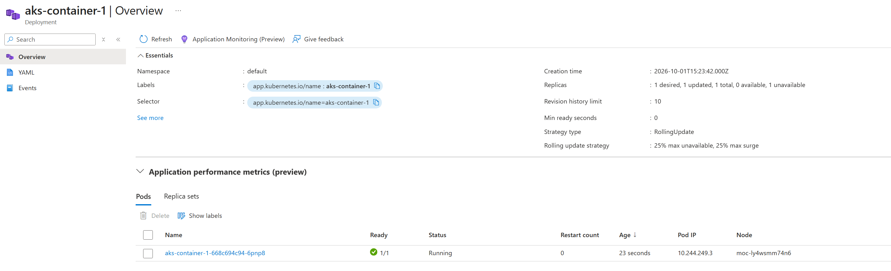</a>

<a href="./images/localbox612.png">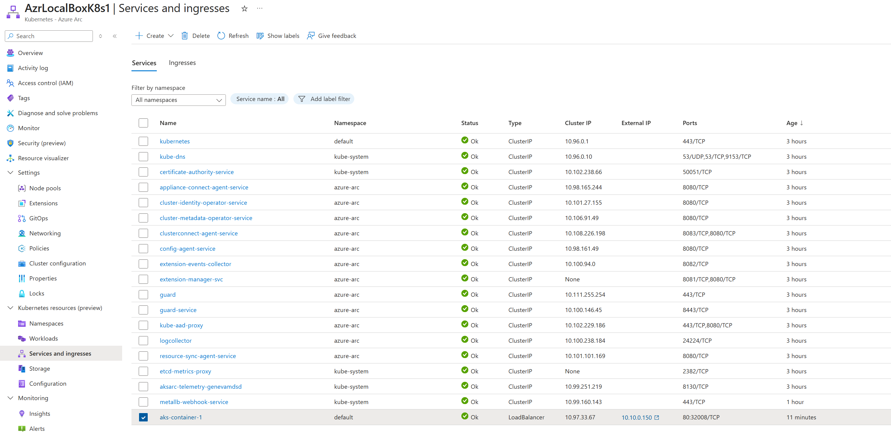</a>

### Task 5.5: Forward and Open the Application — Terminals 2 and 3

Keep the API proxy running in **Terminal 1**. In **Terminal 2**, start the application forward:

```bash
source "$HOME/.config/microhack/challenge06.env"
kubectl --kubeconfig "$AKS_KUBECONFIG" --context "$AKS_CONTEXT" \
  --namespace "$TEAM_NAMESPACE" port-forward \
  service/aks-container-1 8080:80 --address 127.0.0.1
```

Wait for `Forwarding from 127.0.0.1:8080` and **leave Terminal 2 running too**. Use a **third Bash terminal** for the HTTP check, not either occupied terminal:

```bash
curl --fail --show-error http://127.0.0.1:8080/
```

In Codespaces, open the **Ports** view, forward **8080** if it was not detected, and confirm its visibility is **Private** before selecting **Open in Browser**. Sign in to GitHub if prompted. Open that private application URL, not port 47011 and not the MetalLB VIP.

If running this same workflow directly on a local workstation with Bash, Azure CLI, and `kubectl`, instead open **http://localhost:8080/** on that workstation. A Codespace's `localhost` is not your workstation's `localhost`; use its private Ports URL when working in Codespaces.

> [!IMPORTANT]
> Production clients reach a MetalLB VIP through configured network routing and the advertised service network. This lab's Arc proxy plus `kubectl port-forward` tunnels to an application pod through the Kubernetes API. A working page verifies application access through that tunnel; it **does not validate the load-balancer network path**, ARP reachability, or routing to the VIP. No RDP session or static-route change is needed.

If the forward stops after a pod restart, confirm the rollout again and restart it in Terminal 2. If either terminal is closed, restart the proxy first and then the port-forward, sourcing `challenge06.env` in each replacement terminal.

### Task 5.6: Clean Up Only Your Team's Application

After recording your results and coordinating with teammates, press **Ctrl+C in Terminal 2** to stop the application forward. Keep Terminal 1's proxy running while deleting **only** the application resources in your team namespace:

```bash
source "$HOME/.config/microhack/challenge06.env"
kubectl --kubeconfig "$AKS_KUBECONFIG" --context "$AKS_CONTEXT" \
  --namespace "$TEAM_NAMESPACE" delete -f "$MANIFEST"
kubectl --kubeconfig "$AKS_KUBECONFIG" --context "$AKS_CONTEXT" \
  --namespace "$TEAM_NAMESPACE" get deployment,service,configmap,pods
```

The application Deployment, Service, ConfigMap, and pods should be gone (the namespace's automatically supplied `kube-root-ca.crt` ConfigMap can remain). Delete the namespace only if your team created it exclusively for this exercise and all teammates are finished:

```bash
source "$HOME/.config/microhack/challenge06.env"
kubectl --kubeconfig "$AKS_KUBECONFIG" --context "$AKS_CONTEXT" \
  delete namespace "$TEAM_NAMESPACE"
```

Do not delete shared resources, system namespaces, the AKS cluster, MetalLB, its IP pool, or another team's resources. Finally, stop the proxy with **Ctrl+C in Terminal 1** and remove the application forwarding entry from the Codespaces Ports view. Retain your Task 2 VM until its assessments and workshop work are complete; any VM cleanup must target only your own VM, not shared LocalBox infrastructure.


---

## Task 6: Wrap-up and Discussion

### 6.1 Review Key Learnings

After completing this challenge, you should understand:

✅ **Azure Arc as the Hybrid Bridge**
- Azure Local VMs are represented as Azure resources
- Enables unified management through Azure Resource Manager
- Supports Azure RBAC, tags, and policies for hybrid resources

✅ **Azure Local as Sovereign Private Cloud**
- Azure Local enables sovereign on-premises cloud infrastructure
- Arc Resource Bridge connects Azure Local to Azure management plane
- Self-service VM provisioning using Azure Portal (also available via CLI and Infrastructure as Code)

✅ **Security and Compliance**
- Connected guest management enables Azure services inside your VM's operating system
- Microsoft Defender for Cloud provides security coverage and recommendations for your VM
- Azure Update Manager assesses updates on that same VM without changing shared infrastructure

✅ **Deploying a container to your AKS cluster**
- Verified Microsoft Entra access prerequisites and connected through the Arc proxy
- Inspected organizer-prepared MetalLB extension health and the ARP address pool without changing them
- Deployed a containerized application from YAML in a unique team namespace
- Recorded the Kubernetes `LoadBalancer` Service's assigned external IP
- Opened the application through a private Codespaces port-forward, without RDP or route changes
- Distinguished tunneled application access from production load-balancer network-path validation
- Cleaned up only your team's application resources

### 6.2 Real-World Applications

Consider how these capabilities apply to sovereign cloud scenarios:

| Scenario | Azure Arc Capability |
|----------|---------------------|
| Data residency requirements | Keep data on-premises with Azure Local, manage from Azure |
| Regulatory compliance | Apply consistent policies across hybrid estate |
| Security monitoring | Unified threat detection with Defender for Cloud |
| Operational efficiency | Single control plane for hybrid management |
| Disaster recovery | Azure Site Recovery integration for failover |

### 6.3 Further Exploration

For additional learning, explore:

- [Azure Arc Jumpstart Scenarios](https://jumpstart.azure.com/)
- [Azure Local documentation](https://learn.microsoft.com/azure/azure-local/)
- [Microsoft Sovereign Cloud documentation](https://learn.microsoft.com/industry/sovereign-cloud/)

---

## Validation Checklist

Before completing this challenge, verify:

- [ ] You can navigate and understand the LocalBox hybrid environment in the Azure Portal
- [ ] You have deployed your own VM on Azure Local and verified that guest management is Enabled (Connected)
- [ ] You have verified Defender for Servers coverage for your VM and reviewed its available recommendations, or recorded that its assessment is still pending
- [ ] You have completed an Azure Update Manager assessment for your VM and reviewed its timestamp and results, including when no updates are pending
- [ ] You verified the organizer-prepared `arcnetworking` extension is Succeeded, MetalLB workloads are healthy, and `aks-pool` has the reserved ARP VIP range
- [ ] Your application rolled out successfully in your team's namespace and received an IP from that pool
- [ ] You opened the application using a Microsoft Entra Arc proxy and a private application port-forward, never exposing the API proxy
- [ ] You understand why this tunnel does not validate the production load-balancer network path and cleaned up only your team's application
- [ ] You understand how Azure Arc provides a unified control plane for sovereign hybrid scenarios

---

You successfully completed Challenge 6! 🚀🚀🚀
