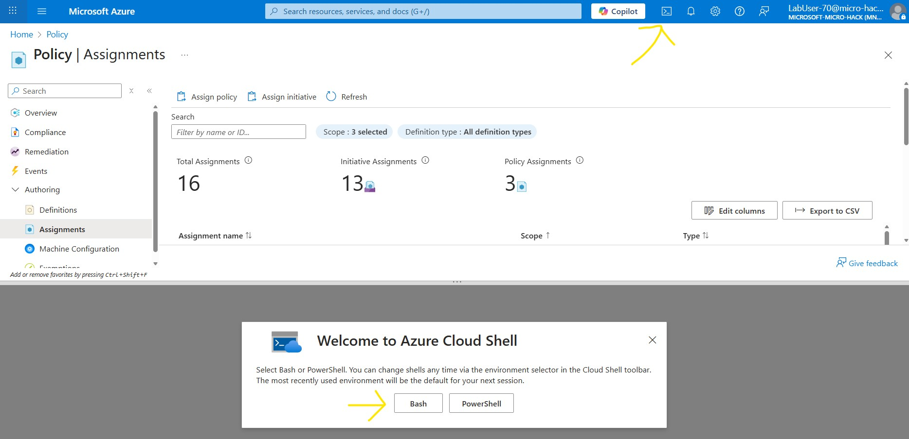

# Walkthrough Challenge 1 - Enforce Sovereign Controls with Azure Policy and RBAC

**Estimated Duration:** 45 minutes

> 💡 **Objective:** Learn how to enforce sovereign cloud governance controls using Azure native platform capabilities. You will restrict resource deployments to sovereign regions, enforce compliance through tagging and network policies, implement least-privilege access with RBAC, and remediate non-compliant resources.

## Prerequisites

Please ensure that you successfully verified the [General prerequisites](../../README.md#general-prerequisites) before continuing with this challenge.

- Azure subscription with Owner or User Access Administrator permissions
- Azure CLI >= 2.54 or access to Azure Portal
- Basic understanding of Azure Resource Manager and resource groups
- A resource group for testing (we'll create resources to test policy compliance)

## Scenario Context

You are a cloud architect at a European organization that must comply with data sovereignty requirements. Your workloads contain sensitive data that must remain within EU sovereign regions. Additionally, regulatory requirements mandate:

- **Geographic restrictions**: All resources must be deployed only in approved sovereign regions (Norway East, Germany North)
- **Data classification**: All resources must be tagged with appropriate data classification labels
- **Network isolation**: Sensitive resources must not expose public IP addresses
- **Access control**: Only authorized teams should have access, following least-privilege principles
- **Compliance monitoring**: Non-compliant resources must be identified and remediated

In this challenge, you'll implement these controls using Azure Policy and RBAC.

---

## Task 1: Understand Azure Policy and Governance Fundamentals

💡 **Before implementing policies, it's important to understand the governance capabilities available in Azure.**

### Key Concepts

- 🔑 **Azure Policy**: A service that enables you to create, assign, and manage policies that enforce different rules and effects over your resources to ensure they stay compliant with corporate standards and service level agreements.

- 🔑 **Policy Definitions**: Define the conditions and effects that apply when those conditions are met. Azure provides many built-in policy definitions, and you can also create custom policies.

- 🔑 **Policy Assignments**: The act of applying a policy definition to a specific scope (management group, subscription, or resource group).

- 🔑 **Policy Initiatives** (also called Policy Sets): A collection of policy definitions grouped together to simplify management. For example, a "Sovereign Cloud Security Baseline" initiative might include location restrictions, tagging requirements, and network controls.

- 🔑 **Compliance State**: Azure Policy evaluates resources and marks them as compliant or non-compliant based on assigned policies. This doesn't prevent non-compliant resources that already exist, but it can prevent new non-compliant deployments.

- 🔑 **Remediation**: The process of bringing non-compliant resources into compliance, either through manual changes or automated remediation tasks.

### Learning Resources

- [Azure Policy overview](https://learn.microsoft.com/azure/governance/policy/overview)
- [Understand Policy effects](https://learn.microsoft.com/azure/governance/policy/concepts/effects)
- [Azure Policy definition structure](https://learn.microsoft.com/azure/governance/policy/concepts/definition-structure)

---

## Task 2: Restrict Deployments to Sovereign Regions

💡 **The first step in enforcing sovereignty is ensuring resources can only be deployed in approved geographic locations.**

### Step 1: Identify the Built-in Policy

The **"Allowed locations"** built-in policy restricts which locations users can specify when deploying resources.

**Policy Definition ID:**
```
/providers/Microsoft.Authorization/policyDefinitions/e56962a6-4747-49cd-b67b-bf8b01975c4c
```

### Step 2 - option A: Assign the Policy Using Azure Portal

💥 **Navigate to Azure Policy and create a location restriction:**

1. In the Azure Portal, navigate to **Policy**
2. Click **Assignments** in the left menu
3. Click **Assign policy**
4. Configure the assignment:
   - **Scope**: Select your subscription or resource group
   - **Exclusions**: Leave empty (or exclude specific resource groups if needed)
   - **Policy definition**: Search for "Allowed locations"
   - **Assignment name**: "LabUser-xx - Restrict to Sovereign Regions"
   - **Description**: "Restrict all resource deployments to EU sovereign regions for data residency compliance"


5. Click **Next** to go to **Parameters**
6. Under **Allowed locations**, select:
   - Norway East
   - Germany North
7. Click **Review + create** and then **Create**

### Step 2 - option B: Assign the Policy Using Azure CLI

Alternatively, use Azure CLI for automation:




```bash
# Define variables
SUBSCRIPTION_ID="xxxxxx-xxxx-xxxx-xxxx-xxxxxxxxxx"
RESOURCE_GROUP="labuser-xx"
POLICY_NAME="labuser-xx-restrict-to-sovereign-regions"
POLICY_DISPLAY_NAME="Lab User-xx - Restrict to Sovereign Regions"
POLICY_DEFINITION_ID="e56962a6-4747-49cd-b67b-bf8b01975c4c"

# Create policy assignment
az policy assignment create \
  --subscription "$SUBSCRIPTION_ID" \
  --name "$POLICY_NAME" \
  --display-name "$POLICY_DISPLAY_NAME" \
  --scope "/subscriptions/$SUBSCRIPTION_ID/resourceGroups/$RESOURCE_GROUP" \
  --policy "$POLICY_DEFINITION_ID" \
  --params '{"listOfAllowedLocations":{"value":["norwayeast","germanynorth", "northeurope"]}}'
```


### Step 3: Also Restrict Resource Group Locations

⚠️ **Important**: The "Allowed locations" policy applies to resources, but resource groups have their own location metadata. You should also assign the **"Allowed locations for resource groups"** policy.

```bash
RG_POLICY_DEFINITION_ID="e765b5de-1225-4ba3-bd56-1ac6695af988"
SUBSCRIPTION_ID="xxxxxx-xxxx-xxxx-xxxx-xxxxxxxxxx"

az policy assignment create \
  --name "lab-user-xx-restrict-rg-to-sovereign-regions" \
  --display-name "Lab User-xx - Restrict Resource Groups to Sovereign Regions" \
  --scope "/subscriptions/$SUBSCRIPTION_ID" \
  --policy "$RG_POLICY_DEFINITION_ID" \
  --params '{
    "listOfAllowedLocations": {
      "value": ["norwayeast", "germanynorth", "northeurope"]
    }
  }' \
--enforcement-mode DoNotEnforce
```

💡 **Note**: In this lab we are using enforcement mode "DoNotEnforce" since this is a lab environment where we might affect other labs/particiapants by enforcing this policy.

🔑 **Best Practice**: Always apply location restrictions at both the resource and resource group levels to ensure comprehensive geographic control.

---

## Task 3: Enforce Resource Tagging for Data Classification

💡 **Tags are essential for governance, cost management, and compliance tracking. In sovereign scenarios, data classification tags help identify sensitive workloads.**

### Step 1: Assign the "Require a tag and its value" Policy

This policy requires that resources have a specific tag with a specific value.

**Policy Definition ID:**

```
/providers/Microsoft.Authorization/policyDefinitions/1e30110a-5ceb-460c-a204-c1c3969c6d62
```

### Using Azure Portal:

1. Navigate to **Policy** > **Assignments**
2. Click **Assign policy**
3. Search for "Require a tag and its value"
4. Configure:
   - **Scope**: Your resource group
   - **Assignment name**: "Require Data Classification Tag"
   - **Parameters**:
     - **Tag name**: `DataClassification`
     - **Tag value**: `Sovereign`
5. Click **Review + create** and **Create**

### Using Azure CLI:

```bash
TAG_POLICY_DEFINITION_ID="1e30110a-5ceb-460c-a204-c1c3969c6d62"
SUBSCRIPTION_ID="xxxxxx-xxxx-xxxx-xxxx-xxxxxxxxxx"
RESOURCE_GROUP="labuser-xx"
POLICY_NAME="labuser-xx-require-data-classification-tag"
POLICY_DISPLAY_NAME="Lab User-xx - Require Data Classification Tag"

az policy assignment create \
  --name "$POLICY_NAME" \
  --display-name "$POLICY_DISPLAY_NAME" \
  --scope "/subscriptions/$SUBSCRIPTION_ID/resourceGroups/$RESOURCE_GROUP" \
  --policy "$TAG_POLICY_DEFINITION_ID" \
  --params '{
    "tagName": {
      "value": "DataClassification"
    },
    "tagValue": {
      "value": "Sovereign"
    }
  }'
```

### Alternative: Use "Require a tag on resources" for Flexibility

If you want to require the tag but allow different values (e.g., "Sovereign", "Public", "Confidential"), use this policy instead:

```bash
FLEXIBLE_TAG_POLICY="871b6d14-10aa-478d-b590-94f262ecfa99"
SUBSCRIPTION_ID="xxxxxx-xxxx-xxxx-xxxx-xxxxxxxxxx"
POLICY_NAME="labuser-xx-require-data-classification-tag-flexible"
POLICY_DISPLAY_NAME="Lab User-xx - Require Data Classification Tag (Any Value)"

az policy assignment create \
  --name "$POLICY_NAME" \
  --display-name "$POLICY_DISPLAY_NAME" \
  --scope "/subscriptions/$SUBSCRIPTION_ID/resourceGroups/$RESOURCE_GROUP" \
  --policy "$FLEXIBLE_TAG_POLICY" \
  --params '{
    "tagName": {
      "value": "DataClassification"
    }
  }'
```

🔑 **Best Practice**: In production, consider using tag inheritance from resource groups to reduce administrative overhead. Use the **"Inherit a tag from the resource group if missing"** policy with a remediation task.

---

## Task 4: Block Public IP Exposure with Private Endpoint Enforcement

💡 **Sovereign workloads often require network isolation. Blocking public IP addresses and enforcing private endpoints reduces the attack surface.**

### Understanding Public IP Restrictions

Azure provides several policies to control public network access:

1. **Deny public IP creation** - Prevents creating public IP address resources
2. **Service-specific policies** - Block public access to specific services (Storage, Key Vault, SQL, etc.)
3. **Require private endpoints** - Mandate private endpoint usage for supported services

### Step 1: Deny Public IP Address Creation

**Policy Definition ID:**
```
/providers/Microsoft.Authorization/policyDefinitions/6c112d4e-5bc7-47ae-a041-ea2d9dccd749
```

### Using Azure Portal:

1. Navigate to **Policy** > **Assignments**
2. Click **Assign policy**
3. Search for "Not allowed resource types"
4. Configure:
   - **Assignment name**: "Block Public IP Addresses"
   - **Parameters**:
     - **Not allowed resource types**: Select `Microsoft.Network/publicIPAddresses`
5. Click **Review + create** and **Create**

### Using Azure CLI:

```bash
DENY_RESOURCE_TYPE_POLICY="6c112d4e-5bc7-47ae-a041-ea2d9dccd749"
SUBSCRIPTION_ID="xxxxxx-xxxx-xxxx-xxxx-xxxxxxxxxx"
RESOURCE_GROUP="labuser-xx"
POLICY_NAME="labuser-xx-block-public-ip-addresses"
POLICY_DISPLAY_NAME="Lab User-xx - Block Public IP Addresses"

az policy assignment create \
  --name "$POLICY_NAME" \
  --display-name "$POLICY_DISPLAY_NAME" \
  --scope "/subscriptions/$SUBSCRIPTION_ID/resourceGroups/$RESOURCE_GROUP" \
  --policy "$DENY_RESOURCE_TYPE_POLICY" \
  --params '{
    "listOfResourceTypesNotAllowed": {
      "value": ["Microsoft.Network/publicIPAddresses"]
    }
  }'
```

### Step 2: Enforce Private Endpoints for Storage Accounts

For sensitive services like Azure Storage, you can require private endpoint usage:

```bash
# Search for storage account public access policies
az policy definition list --query "[?contains(displayName, 'Storage') && contains(displayName, 'public')].{Name:displayName, ID:name}" -o table
```

Example policy assignment to disable public network access for storage accounts:

```bash
STORAGE_PUBLIC_ACCESS_POLICY="34c877ad-507e-4c82-993e-3452a6e0ad3c"
SUBSCRIPTION_ID="xxxxxx-xxxx-xxxx-xxxx-xxxxxxxxxx"
RESOURCE_GROUP="labuser-xx"
POLICY_NAME="labuser-xx-storage-disable-public-access"
POLICY_DISPLAY_NAME="Lab User-xx - Storage accounts should disable public network access"

az policy assignment create \
  --name "storage-disable-public-access" \
  --display-name "Storage accounts should disable public network access" \
  --scope "/subscriptions/$SUBSCRIPTION_ID/resourceGroups/$RESOURCE_GROUP" \
  --policy "$STORAGE_PUBLIC_ACCESS_POLICY"
```

🔑 **Best Practice**: Apply network isolation policies at the service level (Storage, Key Vault, SQL Database, etc.) rather than just blocking public IPs. This provides defense in depth.

---

## Task 5: Create a Policy Initiative (Bonus)

💡 **Policy initiatives group multiple policy definitions together for easier management and assignment.**

### Step 1: Create a Custom Initiative Definition

Create a JSON file named `sovereign-cloud-initiative.json`:

```json
[
  {
    "policyDefinitionId": "/providers/Microsoft.Authorization/policyDefinitions/e56962a6-4747-49cd-b67b-bf8b01975c4c",
    "parameters": {
      "listOfAllowedLocations": {
        "value": [
          "norwayeast",
          "germanynorth",
          "northeurope"
        ]
      }
    }
  },
  {
    "policyDefinitionId": "/providers/Microsoft.Authorization/policyDefinitions/e765b5de-1225-4ba3-bd56-1ac6695af988",
    "parameters": {
      "listOfAllowedLocations": {
        "value": [
          "norwayeast",
          "germanynorth",
          "northeurope"
        ]
      }
    }
  },
  {
    "policyDefinitionId": "/providers/Microsoft.Authorization/policyDefinitions/1e30110a-5ceb-460c-a204-c1c3969c6d62",
    "parameters": {
      "tagName": {
        "value": "DataClassification"
      },
      "tagValue": {
        "value": "Sovereign"
      }
    }
  },
  {
    "policyDefinitionId": "/providers/Microsoft.Authorization/policyDefinitions/6c112d4e-5bc7-47ae-a041-ea2d9dccd749",
    "parameters": {
      "listOfResourceTypesNotAllowed": {
        "value": [
          "Microsoft.Network/publicIPAddresses"
        ]
      }
    }
  }
]
```

### Step 2: Create the Initiative Using Azure CLI

```bash
az policy set-definition create \
  --name "labuser-xx-sovereign-cloud-baseline" \
  --display-name "Lab User-xx - Sovereign Cloud Security Baseline" \
  --description "Enforce location, tagging, and network controls for sovereign workloads" \
  --definitions sovereign-cloud-initiative.json \
  --subscription "$SUBSCRIPTION_ID"
```

### Step 3: Assign the Initiative

```bash
INITIATIVE_ID="/subscriptions/$SUBSCRIPTION_ID/providers/Microsoft.Authorization/policySetDefinitions/sovereign-cloud-baseline"

az policy assignment create \
  --name "labuser-xx-sovereign-baseline-assignment" \
  --display-name "Lab User-xx - Sovereign Cloud Security Baseline" \
  --scope "/subscriptions/$SUBSCRIPTION_ID" \
  --policy-set-definition "$INITIATIVE_ID"
```

🔑 **Best Practice**: Use initiatives to bundle related policies together. This simplifies governance and ensures consistent application of multiple controls.

---

## Task 6: Implement RBAC for SovereignOps Team

💡 **Role-Based Access Control (RBAC) ensures that only authorized personnel can access and manage sovereign cloud resources.**

### Understanding Azure RBAC

- **Security Principal**: User, group, service principal, or managed identity
- **Role Definition**: Collection of permissions (actions and data actions)
- **Scope**: The level at which access applies (management group, subscription, resource group, or resource)
- **Role Assignment**: Binding a security principal to a role at a specific scope

### Step 1: Create a Resource Group for Testing

```bash
RESOURCE_GROUP="labuser-xx-rg-sovereign-test"
LOCATION="norwayeast"

az group create --name "$RESOURCE_GROUP" --location "$LOCATION" --tags DataClassification=Sovereign
```

### Step 2: Create a Security Group for SovereignOps Team

Create a security group:

```bash
# This requires Microsoft Graph permissions
# Alternative: Create the group in Azure Portal > Microsoft Entra > Groups

az ad group create \
  --display-name "Lab-User-xx-SovereignOps-Team" \
  --mail-nickname "Lab-User-xx-SovereignOps"
```

### Step 3: Assign Built-in Roles to the SovereignOps Team

For operational teams managing sovereign workloads, use the **Contributor** role at the resource group scope:

```bash
# Get the group's object ID
GROUP_OBJECT_ID=$(az ad group show --group "Lab-User-xx-SovereignOps-Team" --query id -o tsv)

# Assign Contributor role at resource group scope
az role assignment create \
  --assignee "$GROUP_OBJECT_ID" \
  --role "Contributor" \
  --scope "/subscriptions/$SUBSCRIPTION_ID/resourceGroups/$RESOURCE_GROUP"
```

### Alternative: Assign More Specific Roles

For better least-privilege access, consider specific roles:

```bash
# Virtual Machine Contributor (can manage VMs but not network or storage)
az role assignment create \
  --assignee "$GROUP_OBJECT_ID" \
  --role "Virtual Machine Contributor" \
  --scope "/subscriptions/$SUBSCRIPTION_ID/resourceGroups/$RESOURCE_GROUP"

# Storage Account Contributor
az role assignment create \
  --assignee "$GROUP_OBJECT_ID" \
  --role "Storage Account Contributor" \
  --scope "/subscriptions/$SUBSCRIPTION_ID/resourceGroups/$RESOURCE_GROUP"
```

🔑 **Best Practice**: Always use the most specific role that provides necessary permissions. Avoid using Owner or Contributor roles when more granular roles are available.

---

## Task 7: Create a Custom RBAC Role for Compliance Officers

💡 **Custom roles allow you to create fine-grained permissions tailored to specific job functions.**

### Scenario

Compliance officers need to:

- View all resources and their configurations
- Read Azure Policy compliance data
- Read cost and billing information
- **NOT** create, modify, or delete resources

### Step 1: Create the Custom Role Definition

Create a file named `compliance-auditor-role.json`:

```json
{
  "Name": "Lab User-xx - Sovereign Compliance Auditor",
  "IsCustom": true,
  "Description": "Can view resources and compliance status but cannot make changes. Designed for sovereign cloud compliance officers.",
  "Actions": [
    "*/read",
    "Microsoft.PolicyInsights/policyStates/queryResults/action",
    "Microsoft.PolicyInsights/policyEvents/queryResults/action",
    "Microsoft.PolicyInsights/policyTrackedResources/queryResults/action",
    "Microsoft.Consumption/*/read",
    "Microsoft.CostManagement/*/read",
    "Microsoft.Security/*/read"
  ],
  "NotActions": [],
  "DataActions": [],
  "NotDataActions": [],
  "AssignableScopes": [
    "/subscriptions/{{SUBSCRIPTION_ID}}"
  ]
}
```

### Step 2: Replace the Subscription ID

```bash
# Replace placeholder with actual subscription ID
sed -i "s/{{SUBSCRIPTION_ID}}/$SUBSCRIPTION_ID/g" compliance-auditor-role.json
```

Or manually edit the file to replace `{{SUBSCRIPTION_ID}}` with your subscription ID.

### Step 3: Create the Custom Role

```bash
az role definition create --role-definition compliance-auditor-role.json
```

### Step 4: Assign the Custom Role

```bash
# Create a group for compliance officers
az ad group create \
  --display-name "Lab-User-xx-Compliance-Officers" \
  --mail-nickname "Lab-User-xx-ComplianceOfficers"

# Get the group's object ID
COMPLIANCE_GROUP_ID=$(az ad group show --group "Lab-User-xx-Compliance-Officers" --query id -o tsv)

# Assign the custom role at subscription scope
az role assignment create \
  --assignee "$COMPLIANCE_GROUP_ID" \
  --role "Lab User-xx - Sovereign Compliance Auditor" \
  --scope "/subscriptions/$SUBSCRIPTION_ID"
```

### Step 5: Verify the Custom Role

```bash
# List custom roles
az role definition list --custom-role-only true --query "[].{Name:roleName, Type:roleType}" -o table

# View detailed permissions
az role definition list --name "Lab User-xx - Sovereign Compliance Auditor" -o json
```

🔑 **Best Practice**: Document custom roles and their intended use cases. Review and update custom role permissions regularly as Azure services evolve.

---

## Task 8: Review the Azure Policy Compliance Dashboard

💡 **The Azure Policy Compliance Dashboard provides visibility into which resources comply with assigned policies.**

### Step 1: Navigate to the Compliance Dashboard

1. In the Azure Portal, go to **Policy**
2. Click **Compliance** in the left menu
3. Review the overall compliance percentage
4. Click on individual policy assignments to see detailed compliance data

### Step 2: Understand Compliance States

- ✅ **Compliant**: Resource meets all policy requirements
- ❌ **Non-compliant**: Resource violates one or more assigned policies
- ⚠️ **Conflicting**: Multiple policies with conflicting requirements
- ⏸️ **Not started**: Policy evaluation hasn't completed yet
- 🔒 **Exempt**: Resource has been granted an exemption

### Step 3: Filter and Export Compliance Data

```bash
# Query compliance state for a specific policy
az policy state list \
  --filter "policyAssignmentName eq 'lab-user-xx-restrict-to-sovereign-regions'" \
  --query "[].{Resource:resourceId, State:complianceState}" \
  -o table

# Get summary of non-compliant resources
az policy state summarize \
  --filter "complianceState eq 'NonCompliant'" \
  -o json
```

### Step 4: Identify Non-Compliant Resources

```bash
# List all non-compliant resources
az policy state list \
  --filter "complianceState eq 'NonCompliant'" \
  --query "[].{Resource:resourceId, Policy:policyDefinitionName, Reason:complianceReasonCode}" \
  -o table
```

🔑 **Insight**: Policy compliance evaluation can take up to 30 minutes for new assignments. Use the "Trigger compliance evaluation" feature for immediate results when testing.

---

## Task 9: Create Test Resources to Verify Policy Enforcement

💡 **Let's create test resources to verify that our policies are working correctly.**

### Test 1: Attempt to Deploy to a Non-Sovereign Region (Should Fail)

```bash
# Try to create a storage account in West US (should be denied)
az storage account create \
  --name "teststoragewestus$RANDOM" \
  --resource-group "$RESOURCE_GROUP" \
  --location "westus" \
  --sku Standard_LRS \
  --tags DataClassification=Sovereign
```

Expected result: ❌ **Error** - Location 'westus' is not allowed

### Test 2: Deploy to a Sovereign Region (Should Succeed)

```bash
# Create a storage account in Norway East (should succeed)
STORAGE_NAME="sovereignstore$RANDOM"

az storage account create \
  --name "$STORAGE_NAME" \
  --resource-group "$RESOURCE_GROUP" \
  --location "norwayeast" \
  --sku Standard_LRS \
  --tags DataClassification=Sovereign
```

Expected result: ✅ **Success**

### Test 3: Attempt Deployment Without Required Tag (Should Fail)

```bash
# Try to create a resource without the DataClassification tag
az storage account create \
  --name "testuntagged$RANDOM" \
  --resource-group "$RESOURCE_GROUP" \
  --location "norwayeast" \
  --sku Standard_LRS
```

Expected result: ❌ **Error** - Required tag 'DataClassification' with value 'Sovereign' is missing

### Test 4: Attempt to Create Public IP (Should Fail)

```bash
# Try to create a public IP address (should be denied)
az network public-ip create \
  --name "test-public-ip" \
  --resource-group "$RESOURCE_GROUP" \
  --location "norwayeast" \
  --tags DataClassification=Sovereign
```

Expected result: ❌ **Error** - Resource type 'Microsoft.Network/publicIPAddresses' is not allowed

🔑 **Testing Best Practice**: Always test both positive (should succeed) and negative (should fail) cases to ensure policies work as expected.

---

## Task 10: Remediate Non-Compliant Resources

💡 **Remediation tasks allow you to automatically fix non-compliant resources, such as adding missing tags or changing configurations.**

### Understanding Remediation

- **DeployIfNotExists (DINE)**: Deploys a template if a condition is not met
- **Modify**: Changes resource properties (e.g., adds tags)
- **Remediation Task**: A job that applies DINE or Modify effects to existing resources
- **Managed Identity**: Required for remediation tasks to have permissions to modify resources

### Step 1: Create a Policy with Modify Effect for Tag Remediation

First, let's create a custom policy that adds the DataClassification tag if it's missing:

Create a file named `add-tag-policy.json`:

```json
{
  "properties": {
    "displayName": "Add DataClassification tag to resources",
    "policyType": "Custom",
    "mode": "Indexed",
    "description": "Adds the DataClassification tag with value 'Sovereign' if it's missing",
    "metadata": {
      "category": "Tags"
    },
    "parameters": {
      "tagName": {
        "type": "String",
        "metadata": {
          "displayName": "Tag Name",
          "description": "Name of the tag to add"
        },
        "defaultValue": "DataClassification"
      },
      "tagValue": {
        "type": "String",
        "metadata": {
          "displayName": "Tag Value",
          "description": "Value of the tag to add"
        },
        "defaultValue": "Sovereign"
      }
    },
    "policyRule": {
      "if": {
        "field": "[concat('tags[', parameters('tagName'), ']')]",
        "exists": "false"
      },
      "then": {
        "effect": "modify",
        "details": {
          "roleDefinitionIds": [
            "/providers/microsoft.authorization/roleDefinitions/b24988ac-6180-42a0-ab88-20f7382dd24c"
          ],
          "operations": [
            {
              "operation": "add",
              "field": "[concat('tags[', parameters('tagName'), ']')]",
              "value": "[parameters('tagValue')]"
            }
          ]
        }
      }
    }
  }
}
```

### Step 2: Create the Custom Policy Definition

```bash
az policy definition create \
  --name "lab-user-xx-add-dataclassification-tag" \
  --display-name "Lab User-xx - Add DataClassification Tag" \
  --description "Adds DataClassification=Sovereign tag if missing" \
  --rules add-tag-policy.json \
  --mode Indexed \
  --subscription "$SUBSCRIPTION_ID"
```

### Step 3: Assign the Policy with Managed Identity

For remediation to work, the policy assignment needs a managed identity:

```bash
POLICY_DEF_ID="/subscriptions/$SUBSCRIPTION_ID/providers/Microsoft.Authorization/policyDefinitions/add-dataclassification-tag"

az policy assignment create \
  --name "lab-user-xx-add-tag-with-remediation" \
  --display-name "Lab User-xx - Add DataClassification Tag with Remediation" \
  --scope "/subscriptions/$SUBSCRIPTION_ID" \
  --policy "$POLICY_DEF_ID" \
  --location "norwayeast" \
  --assign-identity \
  --identity-scope "/subscriptions/$SUBSCRIPTION_ID" \
  --role "Contributor"
```

### Step 4: Create a Remediation Task

```bash
# Create remediation task for the policy assignment
az policy remediation create \
  --name "lab-user-xx-remediate-missing-tags" \
  --policy-assignment "lab-user-xx-add-tag-with-remediation" \
  --resource-group "$RESOURCE_GROUP"
```

### Step 5: Monitor Remediation Progress

```bash
# Check remediation status
az policy remediation show \
  --name "lab-user-xx-remediate-missing-tags" \
  --resource-group "$RESOURCE_GROUP"

# List all remediation tasks
az policy remediation list --resource-group "$RESOURCE_GROUP" -o table
```

### Alternative: Use Built-in Tag Inheritance Policy

Azure provides a built-in policy for tag inheritance from resource groups:

```bash
TAG_INHERIT_POLICY="/providers/Microsoft.Authorization/policyDefinitions/cd3aa116-8754-49c9-a813-ad46512ece54"

az policy assignment create \
  --name "lab-user-xx-inherit-dataclassification-tag" \
  --display-name "Lab User-xx - Inherit DataClassification Tag from RG" \
  --scope "/subscriptions/$SUBSCRIPTION_ID" \
  --policy "$TAG_INHERIT_POLICY" \
  --params '{
    "tagName": {
      "value": "DataClassification"
    }
  }' \
  --location "norwayeast" \
  --assign-identity \
  --identity-scope "/subscriptions/$SUBSCRIPTION_ID" \
  --role "Contributor"

# Create remediation task
az policy remediation create \
  --name "lab-user-xx-remediate-tag-inheritance" \
  --policy-assignment "lab-user-xx-inherit-dataclassification-tag" \
  --resource-group "$RESOURCE_GROUP"
```

🔑 **Best Practice**: Use remediation tasks for existing resources and "deny" or "modify" effects for new deployments. This ensures both existing and new resources comply with policies.

---

## Task 11: Create Policy Exemptions (Optional)

💡 **Sometimes you need to exempt specific resources from policies due to legitimate business reasons.**

### Step 1: Create a Policy Exemption

```bash
# Exemption for a test resource
az policy exemption create \
  --name "lab-user-xx-test-exemption" \
  --display-name "Lab User-xx - Test Resource Exemption" \
  --description "Temporary exemption for testing purposes" \
  --policy-assignment "lab-user-xx-restrict-to-sovereign-regions" \
  --exemption-category "Waiver" \
  --expires "2025-12-31T23:59:59Z" \
  --scope "/subscriptions/$SUBSCRIPTION_ID/resourceGroups/$RESOURCE_GROUP"
```

### Exemption Categories

- **Waiver**: Resource is exempt due to business justification
- **Mitigated**: Compliance requirement is met through alternative means

### Step 2: List and Review Exemptions

```bash
az policy exemption list --query "[].{Name:name, Category:exemptionCategory, Expires:expiresOn}" -o table
```

⚠️ **Warning**: Use exemptions sparingly and always document the business justification. Set expiration dates and review exemptions regularly.

---

## Validation

To verify you've successfully completed this challenge, confirm the following:

### ✅ Policy Validation

1. **Location Restrictions**: Attempt to create a resource in a non-sovereign region (should fail)
2. **Tagging Requirements**: Attempt to create a resource without required tags (should fail)
3. **Public IP Block**: Attempt to create a public IP address (should fail)
4. **Compliant Deployment**: Successfully create a resource in Norway East with proper tags

### ✅ RBAC Validation

```bash
# List role assignments for your resource group
az role assignment list --resource-group "$RESOURCE_GROUP" --query "[].{Principal:principalName, Role:roleDefinitionName}" -o table

# Verify custom role exists
az role definition list --name "Lab User-xx - Sovereign Compliance Auditor" --query "[].roleName" -o tsv
```

### ✅ Compliance Dashboard Validation

1. Navigate to **Policy** > **Compliance** in Azure Portal
2. Verify you can see compliance status for all assigned policies
3. Check that test deployments appear in compliance data

### ✅ Remediation Validation

```bash
# Check remediation task status
az policy remediation list --resource-group "$RESOURCE_GROUP" -o table

# Verify resources now have required tags
az resource list --resource-group "$RESOURCE_GROUP" --query "[].{Name:name, Tags:tags}" -o json
```

---

## Key Takeaways

🔑 **Azure Policy** provides powerful declarative controls for enforcing compliance and governance at scale without requiring code changes or manual processes.

🔑 **Policy Initiatives** simplify management by grouping related policies into logical sets that can be assigned together.

🔑 **RBAC** implements least-privilege access control, ensuring only authorized personnel can access sovereign resources.

🔑 **Custom Roles** enable fine-grained permission models tailored to specific job functions like compliance auditing.

🔑 **Remediation Tasks** automatically bring existing resources into compliance, closing the gap between current state and desired state.

🔑 **Sovereign Cloud Controls** require a defense-in-depth approach combining location restrictions, tagging, network isolation, and access control.

---

## Next Steps

In **Challenge 2**, you'll implement encryption at rest using Customer-Managed Keys (CMK) in Azure Key Vault, adding another layer of security and control to your sovereign cloud environment.

**Optional Advanced Tasks:**

- Explore Azure Policy compliance reporting with Azure Monitor Logs
- Implement policy-as-code using Terraform or Bicep
- Create Azure Policy definitions using Azure Resource Graph queries
- Set up automated compliance notifications using Azure Logic Apps or Azure Functions

---

## Additional Resources

- [Sovereign Landing Zone (SLZ)](https://learn.microsoft.com/en-us/industry/sovereign-cloud/sovereign-public-cloud/sovereign-landing-zone/overview-slz?tabs=hubspoke)
- [Azure Policy samples repository](https://github.com/Azure/azure-policy)
- [Azure Policy GitHub community](https://github.com/Azure/Community-Policy)
- [Azure RBAC built-in roles](https://learn.microsoft.com/azure/role-based-access-control/built-in-roles)
- [Azure Governance documentation](https://learn.microsoft.com/azure/governance/)
- [Well-Architected Framework - Security](https://learn.microsoft.com/azure/architecture/framework/security/)
