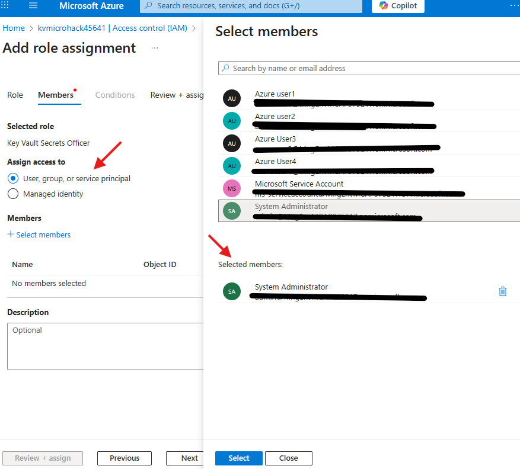
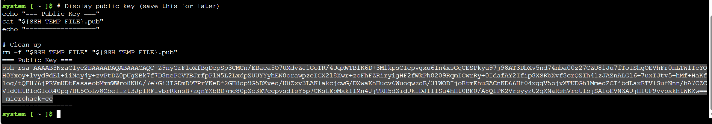
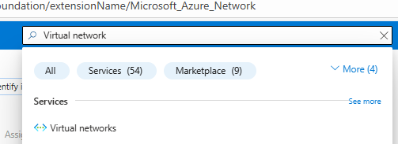
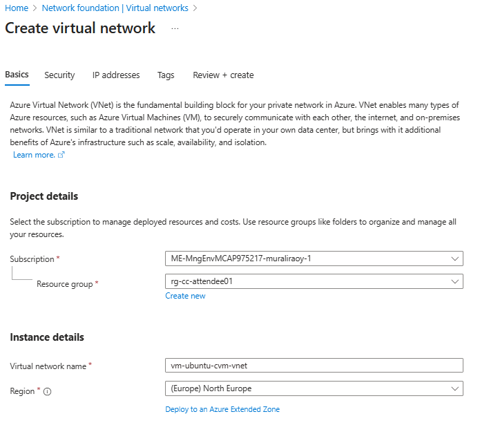
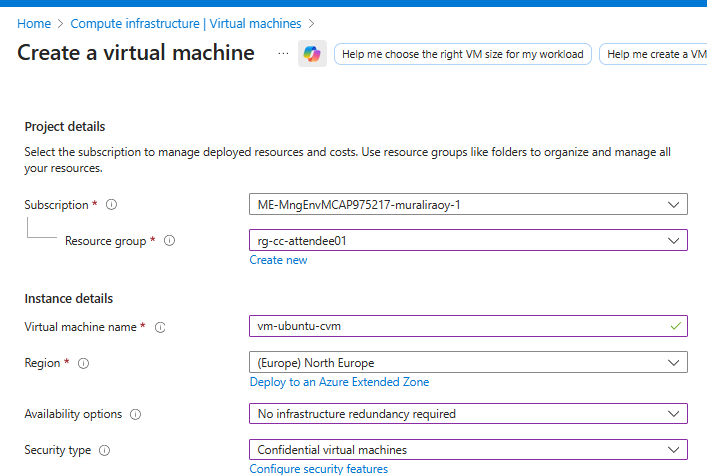
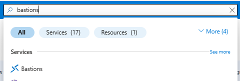

# Walkthrough Challenge 4 - Encryption in use with Azure Confidential Compute – VM
# Azure Portal Guide

**Estimated Duration:** 90-120 minutes

> 💡 **Objective:** Learn how to implement and validate guest attestation on Azure Confidential VMs using the Azure Portal to ensure business logic only executes in trusted, hardware-backed confidential computing environments. You will deploy a Confidential VM through the portal, configure secure access through Azure Bastion and Key Vault, build and run attestation client applications, and verify cryptographic proof of VM integrity before processing sensitive workloads.

## Prerequisites

Please ensure that you successfully verified the [General prerequisites](../../README.md#general-prerequisites) before continuing with this challenge.

- Azure Portal access (https://portal.azure.com)
- Azure subscription with permissions to create VMs, Key Vault, and Attestation Providers
- Basic understanding of Azure Virtual Machines and networking concepts
- Familiarity with SSH key authentication
- Access to Azure Cloud Shell
- Basic understanding of confidential computing concepts

## Scenario Context

You are a security architect at a European financial services organization that processes highly sensitive customer data and must comply with strict data sovereignty and protection requirements. Your organization has determined that traditional encryption at rest and in transit is insufficient for protecting high-value workloads.

Your mandate includes:

- **Encryption in Use**: Data must be protected even while being processed, not just when stored or transmitted
- **Hardware-Based Trust**: Security guarantees must be rooted in hardware, not just software configurations
- **Attestation Requirements**: Workloads must verify they are running in a genuine confidential environment before processing sensitive data
- **Zero Trust Architecture**: Never assume trust; always verify the execution environment cryptographically
- **Regulatory Compliance**: Meet stringent requirements for data protection in financial services

In this challenge, you'll implement Azure Confidential Computing using AMD SEV-SNP technology to create a hardware-based Trusted Execution Environment (TEE). You'll configure guest attestation to provide cryptographic proof that your workload is running in a protected environment before it processes any sensitive operations.

### Understanding Guest Attestation

Guest attestation helps you confirm that your confidential VM environment is secured by a genuine hardware-backed Trusted Execution Environment (TEE) with security features enabled for isolation and integrity.

**You can use guest attestation to:**

- **Verify hardware platform** - Confirm the confidential VM runs on expected AMD SEV-SNP hardware
- **Validate secure boot** - Verify secure boot is enabled, protecting firmware, bootloader, and kernel from malware
- **Provide cryptographic evidence** - Obtain JWT tokens proving the VM runs on confidential hardware
- **Prevent data exposure** - Ensure workloads refuse to start in untrusted environments

### Attestation Workflow Pattern

### Attestation Workflow Pattern


In this challenge, you will implement a common pattern where **attestation requests are made from inside the workload** at program startup. The workload verifies that it's running on the correct hardware platform before executing any sensitive business logic.

**How it works:**

1. Your workload starts on the Confidential VM
2. Before processing any sensitive data, the workload calls the attestation library
3. The attestation library contacts Microsoft Azure Attestation (MAA) to verify the TEE environment
4. The workload parses the attestation response (JWT token) to confirm:
   - The VM runs on genuine AMD SEV-SNP confidential hardware
   - Secure boot is enabled and validated
   - The VM guest state is protected
5. Only after successful verification does the workload proceed with sensitive operations

**Why this matters:**

This pattern ensures your application never processes sensitive data in an untrusted environment. If attestation fails (e.g., the code is running on a standard VM or a compromised environment), the workload can refuse to start or handle data differently.

### Learning Resources

- [Azure Confidential Computing overview](https://learn.microsoft.com/azure/confidential-computing/overview)
- [Confidential VM concepts](https://learn.microsoft.com/azure/confidential-computing/confidential-vm-overview)
- [Guest attestation for confidential VMs](https://learn.microsoft.com/azure/confidential-computing/guest-attestation-confidential-vms)
- [Microsoft Azure Attestation](https://learn.microsoft.com/azure/attestation/overview)

### Original Source Materials

This challenge is based on the **Confidential VM Guest Attestation Sample Application** from the Microsoft Azure Confidential Computing repository:

- **Main Repository**: [Azure Confidential Computing CVM Guest Attestation](https://github.com/Azure/confidential-computing-cvm-guest-attestation)
- **Source Module**: [CVM Attestation Sample App](https://github.com/Azure/confidential-computing-cvm-guest-attestation/tree/main/cvm-attestation-sample-app)

The sample application and deployment patterns have been adapted for this MicroHack challenge to provide a guided learning experience with Azure Confidential VMs using the Azure Portal.

---

## Task 1: Understand the Deployment Architecture and Naming Conventions

💡 **Before deploying resources through the portal, it's important to understand the security architecture, components you'll be creating, and the naming conventions you'll use.**

### Resources Being Deployed

The following resources will be created in the `North Europe` Azure region:

- **1 Attestation Provider** - Microsoft Azure Attestation (MAA) service for verifying TEE integrity
- **1 Virtual Network** - Isolated network with VM and Bastion subnets
- **1 Confidential VM** - Ubuntu 22.04 with AMD SEV-SNP hardware encryption
- **1 Azure Bastion** - Secure remote access without public IP exposure
- **1 Azure Key Vault** - Secure storage for SSH keys
- **Associated Resources** - NSGs, NICs, OS Disks (auto-created)

### Security Architecture

This setup implements a zero-trust security model:

- **No Public IPs on VMs** - VMs are not directly accessible from internet
- **Azure Bastion (Basic SKU)** - Provides secure RDP/SSH access through Azure Portal
- **Azure Key Vault** - Stores SSH private keys securely with RBAC controls
- **Fresh SSH Key Pair** - Generated specifically for this deployment, never stored locally
- **Hardware-Based Encryption** - AMD SEV-SNP encrypts VM memory at the hardware level
- **Secure Boot** - Protects boot chain integrity from firmware through kernel

🔑 **Security Best Practice**: This architecture ensures VM access is authenticated through Azure AD, encrypted with TLS, and never exposes SSH directly to the internet.

### Naming Conventions

Throughout this guide, you'll need to use consistent naming. Choose your own values:

- **ATTENDEE_ID**: `labuser-xx` (Change this for each participant)
- **LOCATION**: `North Europe`
- **RESOURCE_GROUP**: `{ATTENDEE_ID}` (replace with your ATTENDEE_ID)

For globally unique resources, append a random 6-character suffix:
- **KEYVAULT_NAME**: `kvmicrohacka1b2c3` (use your own random suffix)
- **ATTESTATION_NAME**: `attesta1b2c3` (use your own random suffix, no hyphens)

> **💡 Tip**: Write down your chosen names before starting!

---

## Task 2: Create Resource Group and Key Vault

💡 **You'll create the foundational Azure resources to organize and secure your deployment.**

### Step 1: Create Resource Group

| Step | Action | Screenshot |
|------|--------|------------|
| 1. Navigate to the [Azure Portal](https://portal.azure.com)<br>2. In the search bar at the top, type **"Resource groups"** and select it<br>3. Click **+ Create** | |  |
| 4. Fill in the details:<br>   - **Subscription**: Select your subscription<br>   - **Resource group**: `<ATTENDEE_ID>` (use your ATTENDEE_ID)<br>   - **Region**: `North Europe` | |  |
| 5. Click **Review + create**<br>6. Click **Create** | | |


---

### Step 2: Create Key Vault

💡 **Create a Key Vault with RBAC permissions to securely store SSH keys.**

| Step | Action | Screenshot |
|------|--------|------------|
| 1. In the search bar, type **"Key vaults"** and select it<br>2. Click **+ Create** | | |
| 3. Fill in the **Basics** tab:<br>   - **Subscription**: Select your subscription<br>   - **Resource group**: `rg-cc-attendee01`<br>   - **Key vault name**: `kv-cc-a1b2c3` (use your random suffix)<br>   - **Region**: `North Europe`<br>   - **Pricing tier**: `Standard` | |  |
| 4. Click on the **Access configuration** tab:<br>   - **Permission model**: Select **Azure role-based access control**<br>   - Check ✅ **Azure Virtual Machines for deployment**<br>   - Check ✅ **Azure Resource Manager for template deployment** | |  |
| 5. Click **Review + create**<br>6. Click **Create**<br>7. Wait for deployment to complete, then click **Go to resource** | | |


### Assign Key Vault Permissions

| Step | Action | Screenshot |
|------|--------|------------|
| 1. In your Key Vault, click on **Access control (IAM)** in the left menu<br>2. Click **+ Add** > **Add role assignment** | |  |
| 3. In the **Role** tab, search for and select **Key Vault Secrets Officer**<br>4. Click **Next** | |  |
| 5. In the **Members** tab:<br>   - Select **User, group, or service principal**<br>   - Click **+ Select members**<br>   - Search for and select your user account<br>   - Click **Select** | |  |
| 6. Click **Review + assign**<br>7. Click **Review + assign** again | | |

> **⏱️ Wait 2-3 minutes for permissions to propagate before proceeding**

---

## Task 3: Generate and Store SSH Keys Securely

💡 **Generate SSH key pairs using Azure Cloud Shell and store them in Key Vault for secure authentication.**

| Step | Action | Screenshot |
|------|--------|------------|
| 1. Click the **Cloud Shell** icon (>_) in the top-right corner of the Azure Portal<br>2. Select **Bash** when prompted | | <br> |
| 3. Run the following commands in Cloud Shell:<br><pre># Set your attendee ID and Key Vault name<br/>ATTENDEE_ID="attendee01"  # Change this<br/><br/>KEYVAULT_NAME="kv-cc-a1b2c3"  # Change this to your Key Vault name<br/><br/># Generate SSH key pair<br/>SSH_TEMP_FILE="/tmp/cc_ssh_key_\${ATTENDEE_ID}_\${RANDOM}"<br/>ssh-keygen -t rsa -b 4096 -f "\$SSH_TEMP_FILE" -N "" -C "microhack-cc"<br/><br/># Store private key in Key Vault<br/>az keyvault secret set --vault-name \$KEYVAULT_NAME --name "ssh-private-key" --file "\$SSH_TEMP_FILE"<br/><br/># Store public key in Key Vault<br/>az keyvault secret set --vault-name \$KEYVAULT_NAME --name "ssh-public-key" --file "\${SSH_TEMP_FILE}.pub"<br/><br/># Display public key (save this for later)<br/>echo "=== Public Key ==="<br/>cat "\${SSH_TEMP_FILE}.pub"<br/>echo "=================="<br/><br/># Clean up<br/>rm -f "\${SSH_TEMP_FILE}" "\${SSH_TEMP_FILE}.pub"</pre> | | <br><br> |
| 4. **Important**: Copy and save the public key output - you'll need it when creating the VM. | |  |

---

## Task 4: Create Attestation Provider

💡 **Deploy Microsoft Azure Attestation service for verifying confidential VM integrity.**

| Step | Action | Screenshot |
|------|--------|------------|
| 1. In the search bar, type **"Attestation providers"** and select it<br>2. Click **+ Create** | |  |
| 3. Fill in the details:<br>   - **Subscription**: Select your subscription<br>   - **Resource group**: `rg-cc-attendee01`<br>   - **Name**: `attesta1b2c3` (use your random suffix, **only alphanumeric characters, no hyphens**)<br>   - **Region**: `North Europe` | |  |
| 4. Click **Review + create**<br>5. Click **Create** | | |

---

## Task 5: Create Virtual Network with Isolated Subnets

💡 **Create a virtual network with separate subnets for VMs and Azure Bastion to ensure network segmentation.**

| Step | Action | Screenshot |
|------|--------|------------|
| 1. In the search bar, type **"Virtual networks"** and select it<br>2. Click **+ Create** | |  |
| 3. Fill in the **Basics** tab:<br>   - **Subscription**: Select your subscription<br>   - **Resource group**: `rg-cc-attendee01`<br>   - **Virtual network name**: `vm-ubuntu-cvm-vnet`<br>   - **Region**: `North Europe` | |  |
| 4. Click on the **IP addresses** tab:<br>   - Keep the default address space or set to `10.10.0.0/24`<br>   - Delete the "default" subnet<br>   - Click **+ Add a subnet**<br>     - **Subnet name**: `vm-subnet`<br>     - **Subnet address range**: `10.10.0.0/26`<br>     - Click **Add**<br>   - Click **+ Add a subnet** again<br>     - **Subnet name**: `AzureBastionSubnet` (must be exactly this name)<br>     - **Subnet address range**: `10.10.0.64/26`<br>     - Click **Add** | | <br><br><br> |
| 5. Click **Review + create**<br>6. Click **Create** | | |

---

## Task 6: Deploy Confidential VM with Hardware Encryption

💡 **Create an Azure Confidential VM with AMD SEV-SNP hardware-based encryption and secure boot.**

| Step | Action | Screenshot |
|------|--------|------------|
| 1. In the search bar, type **"Virtual machines"** and select it<br>2. Click **+ Create** > **Azure virtual machine** | |  |

### Basics Tab

| Step | Action | Screenshot |
|------|--------|------------|
| 3. Fill in the **Basics** tab:<br>   - **Subscription**: Select your subscription<br>   - **Resource group**: `rg-cc-attendee01`<br>   - **Virtual machine name**: `vm-ubuntu-cvm`<br>   - **Region**: `North Europe`<br>   - **Availability options**: No infrastructure redundancy required<br>   - **Security type**: **Confidential virtual machines**<br>   - **Image**: Click **See all images**<br>     - Search for **Ubuntu 22.04 Confidential VM**<br>     - Select **Ubuntu Server 22.04 LTS - Confidential VM x64 Gen2**<br>   - **VM architecture**: x64<br>   - **Size**: Click **See all sizes**<br>     - Search for **DC2as_v5**<br>     - Select **Standard_DC2as_v5** (4 vCPUs, 32 GB memory)<br>     - Click **Select** | | <br><br><br> |
| 4. Configure **Administrator account**:<br>   - **Authentication type**: SSH public key<br>   - **Username**: `azureuser`<br>   - **SSH public key source**: **Use existing key**<br>   - Open Cloud Shell<br>   - Run this command to get SSH public key:<br>     `az keyvault secret show --name ssh-public-key --vault-name <keyvault name> --query value -o tsv`<br>   - **SSH Public Key**: Copy the output into the `SSH Public Key` field | |  |
| 5. Configure **Inbound port rules**:<br>   - **Public inbound ports**: None | | |

### Disks Tab

| Step | Action | Screenshot |
|------|--------|------------|
| 6. Click **Next: Disks >**<br>   - **OS disk type**: Keep default (Premium SSD) | | |

### Networking Tab

| Step | Action | Screenshot |
|------|--------|------------|
| 7. Click **Next: Networking >**<br>   - **Virtual network**: `vm-ubuntu-cvm-vnet`<br>   - **Subnet**: `vm-subnet (10.10.0.0/26)`<br>   - **Public IP**: **None**<br>   - **NIC network security group**: Basic<br>   - **Public inbound ports**: None | |  |

### Management Tab

| Step | Action | Screenshot |
|------|--------|------------|
| 8. Click **Next: Management >**<br>   - Scroll to **Identity**<br>   - **System assigned managed identity**: ✅ Enable | |  |

### Advanced Tab

| Step | Action | Screenshot |
|------|--------|------------|
| 9. Click **Next: Advanced >** | | |

### Review and Create

| Step | Action | Screenshot |
|------|--------|------------|
| 10. Click **Review + create**<br>11. Review all settings<br>12. Click **Create**<br>13. Wait for deployment (5-10 minutes) | | |

---

## Task 7: Deploy Azure Bastion for Secure Access

💡 **Create Azure Bastion to enable secure RDP/SSH connectivity without exposing VMs to the public internet.**

| Step | Action | Screenshot |
|------|--------|------------|
| 1. In the search bar, type **"Bastions"** and select it<br>2. Click **+ Create** | |  |
| 3. Fill in the **Basics** tab:<br>   - **Subscription**: Select your subscription<br>   - **Resource group**: `rg-cc-attendee01`<br>   - **Name**: `bastion-northeurope`<br>   - **Region**: `North Europe`<br>   - **Tier**: Basic<br>   - **Virtual network**: `vm-ubuntu-cvm-vnet`<br>   - **Subnet**: `AzureBastionSubnet` (should be auto-selected)<br>   - **Public IP address**: Create new<br>     - **Public IP address name**: `bastion-northeurope-ip`<br>     - Click **OK** | |  |
| 4. Click **Review + create**<br>5. Click **Create**<br>6. **Wait 5-10 minutes** for Bastion deployment (this takes time) | | |

---

## Task 8: Connect to VM, Build, and Run Attestation Client

💡 **Connect to the Confidential VM through Bastion, install dependencies, build the attestation client, and verify cryptographic proof of the VM's trusted state.**

| Step | Action | Screenshot |
|------|--------|------------|
| 1. Navigate to **Virtual machines**<br>2. Click on **vm-ubuntu-cvm**<br>3. Click **Connect** > **Connect via Bastion** | |  |
| 4. Fill in the Bastion connection form:<br>   - **Authentication Type**: **SSH Private Key from Azure Key Vault**<br>   - **Username**: `azureuser`<br>   - **Azure Key Vault**: Select your Key Vault `kv-cc-a1b2c3`<br>   - **Azure Key Vault Secret**: `ssh-private-key` | |  |
| 5. Click **Connect**<br>6. A new browser tab will open with a terminal connection | | |

### Install Dependencies and Run Attestation

| Step | Action | Screenshot |
|------|--------|------------|
| 7. In the terminal, run the following commands:<br><br>**NOTE**: if you encounter any prompts to restart services, just hit \<Enter\> to confirm and continue to the next command.<br><br><pre><br># Install system dependencies<br>export DEBIAN_FRONTEND=noninteractive<br>export NEEDRESTART_MODE=a<br>export APT_LISTCHANGES_FRONTEND=none<br><br>sudo -E apt-get update -y<br>sudo -E apt-get upgrade -y<br><br>sudo -E apt-get install -y build-essential libcurl4-openssl-dev libjsoncpp-dev libboost-all-dev nlohmann-json3-dev cmake wget git jq<br><br># Clone the attestation repository<br>git clone https://github.com/Azure/confidential-computing-cvm-guest-attestation.git<br><br># Download the attestation package<br>wget https://packages.microsoft.com/repos/azurecore/pool/main/a/azguestattestation1/azguestattestation1_1.1.2_amd64.deb<br><br># Install the attestation package<br>sudo dpkg -i azguestattestation1_1.1.2_amd64.deb<br><br># Build the attestation client<br>cd confidential-computing-cvm-guest-attestation/cvm-attestation-sample-app/<br>cmake .<br>make<br></pre> | | <br> |

| Step | Action | Screenshot |
|------|--------|------------|
| 8. Get your custom attestation provider URI from the Azure Portal:<br>   - Navigate to **All Resources**<br>   - Search for your attestation provider (e.g., `attesta1b2c3`)<br>   - Click on the attestation provider<br>   - Copy the **Attest URI** from the Overview page | | <br> |
| 9. Back in the Bastion terminal, run the attestation client with your custom provider URI:<br><br><pre># Replace with your actual Attestation URI<br>sudo ./AttestationClient -a https://attesta1b2c3.neu.attest.azure.net -o token \| jq -R 'split(".") \| .[0],.[1] \| @base64d \| fromjson'</pre><br><br>🔑 **Why Use a Custom Attestation Provider?**:<br>- **Custom Policies**: Define organization-specific attestation policies<br>- **Audit Control**: Maintain your own attestation logs and policies<br>- **Compliance**: Meet regulatory requirements for attestation service ownership<br>- **Isolation**: Separate attestation infrastructure from shared services | |  |

---

## Task 9: Understanding Attestation Results and Production Use

💡 **Understanding what the attestation token proves and how to use it in production workloads.**

### What the Attestation Token Proves

The JWT token you generated contains multiple claims that cryptographically prove the VM's security posture:

**Key Claims to Review**:

- `x-ms-isolation-tee.x-ms-attestation-type` - Should show `sevsnpvm` (AMD SEV-SNP)
- `x-ms-isolation-tee.x-ms-compliance-status` - Should show `azure-compliant-cvm`
- `x-ms-isolation-tee.x-ms-sevsnpvm-is-debuggable` - Should be `false` (debugging disabled for security)
- `x-ms-policy-hash` - Hash of the attestation policy used
- `secureboot` - Should be `true`
- `x-ms-ver` - Attestation service version

🔑 **Security Insight**: This JWT token is signed by Microsoft Azure Attestation. Any relying party can verify the signature to confirm the claims are authentic and the VM is running in a genuine confidential environment.

### Production Implementation Pattern

In a production scenario, your application would implement attestation checks before processing sensitive data:

```python
# Pseudocode - Production attestation pattern
def process_sensitive_data(customer_data):
    # Step 1: Perform attestation
    attestation_token = get_attestation_token()
    
    # Step 2: Validate token with relying party
    if not validate_attestation(attestation_token):
        log_error("Attestation failed - not running in confidential environment")
        raise SecurityException("Execution environment not trusted")
    
    # Step 3: Verify specific claims
    claims = parse_jwt_claims(attestation_token)
    if claims['x-ms-isolation-tee.x-ms-attestation-type'] != 'sevsnpvm':
        raise SecurityException("Not running on AMD SEV-SNP hardware")
    
    if claims['x-ms-isolation-tee.x-ms-sevsnpvm-is-debuggable'] == 'true':
        raise SecurityException("VM debugging is enabled - security risk")
    
    # Step 4: Only now proceed with sensitive operations
    encrypted_results = process_pii_data(customer_data)
    return encrypted_results
```

🔑 **Best Practice**: Attestation should be performed at application startup and periodically during long-running workloads to detect runtime tampering.

---

## Task 10: Clean Up Resources

💡 **Delete all resources to avoid ongoing charges.**

### Delete Resource Group

1. Navigate to **Resource groups**
2. Click on `rg-cc-attendee01`
3. Click **Delete resource group**
4. Type the resource group name to confirm: `rg-cc-attendee01`
5. Click **Delete**
6. Wait for deletion to complete (5-10 minutes)

> **💡 Tip**: Deleting the resource group will remove all resources created in this workshop

⚠️ **Warning**: This command will permanently delete all resources in the resource group including the VM, Key Vault, Bastion, and all associated resources.

---

## Troubleshooting

### Cannot Connect via Bastion

- **Check**: Bastion deployment is complete (Status: Succeeded)
- **Check**: VM is running (Status: Running)
- **Check**: You have Key Vault Secrets Officer role on the Key Vault
- **Wait**: 2-3 minutes after Bastion deployment before connecting

### VM Creation Failed

- **Check**: Quota availability for DC-series VMs in North Europe
- **Try**: Different region (e.g., West Europe, UK South)
- **Try**: Smaller VM size (Standard_DC2es_v5)

### Attestation Client Build Fails

- **Check**: All dependencies were installed successfully
- **Try**: Re-run the apt-get commands
- **Check**: VM has internet connectivity

### Key Vault Access Denied

- **Check**: RBAC role assignment completed successfully
- **Wait**: 2-3 minutes for permissions to propagate
- **Verify**: You're logged in with the correct account

---

## Key Takeaways

In this challenge, you successfully implemented and validated Azure Confidential Computing with guest attestation using the Azure Portal. Here are the key concepts and best practices:

### Confidential Computing Fundamentals

✅ **Hardware-Based Trust** - AMD SEV-SNP provides hardware-level memory encryption that protects data in use, not just at rest or in transit

✅ **Trusted Execution Environments (TEEs)** - Confidential VMs create isolated environments where even the cloud operator cannot access your data

✅ **Virtual TPM (vTPM)** - Enables cryptographic attestation and secure boot validation

### Attestation and Verification

✅ **Guest Attestation** - Cryptographically proves that workloads run in genuine confidential computing environments before processing sensitive data

✅ **Microsoft Azure Attestation (MAA)** - Provides centralized attestation services that validate TEE integrity and issue signed JWT tokens

✅ **Zero Trust Validation** - Applications should verify execution environment before processing sensitive operations

### Security Architecture

✅ **Defense in Depth** - Combining multiple security layers (no public IPs, Azure Bastion, Key Vault, hardware encryption, attestation)

✅ **Secure Key Management** - SSH keys stored exclusively in Azure Key Vault with RBAC controls, never persisted locally

✅ **Network Isolation** - VMs without public IPs, accessed only through Azure Bastion with Azure AD authentication

### Production Best Practices

✅ **Attestation at Startup** - Perform attestation checks before processing any sensitive data

✅ **Periodic Re-attestation** - Long-running workloads should re-attest periodically to detect runtime tampering

✅ **JWT Token Validation** - Verify attestation tokens are signed by trusted authorities and contain expected claims

✅ **Fail Securely** - Applications should refuse to start or handle data differently if attestation fails

### Compliance and Governance

✅ **Data Sovereignty** - Confidential computing ensures data remains encrypted even from cloud operators

✅ **Regulatory Requirements** - Meets stringent requirements for financial services, healthcare, and government workloads

✅ **Audit Trail** - Attestation tokens provide cryptographic proof for compliance auditing

---

## Next Steps

### Explore Advanced Confidential Computing Scenarios

- **[Azure Confidential Containers](https://learn.microsoft.com/azure/confidential-computing/confidential-containers)** - Deploy containerized workloads with hardware-based confidential computing
- **[Confidential VMs with Customer-Managed Keys](https://learn.microsoft.com/azure/confidential-computing/confidential-vm-overview#encryption-at-host-with-customer-managed-keys)** - Use your own encryption keys for additional control
- **[Confidential Computing on Azure Kubernetes Service](https://learn.microsoft.com/azure/aks/confidential-computing-azure)** - Orchestrate confidential containers at scale

### Implement Application-Level Confidential Computing

- **[Enclave Applications](https://learn.microsoft.com/azure/confidential-computing/application-development)** - Build applications that use Intel SGX or AMD SEV-SNP enclaves
- **[Confidential Inferencing](https://learn.microsoft.com/azure/machine-learning/how-to-machine-learning-confidential-containers)** - Protect ML models and data during inference
- **[Always Encrypted](https://learn.microsoft.com/sql/relational-databases/security/encryption/always-encrypted-database-engine)** - Combine confidential computing with SQL Server encryption

### Learn More About Azure Security

- **[Azure Security Benchmark for Confidential Computing](https://learn.microsoft.com/security/benchmark/azure/baselines/confidential-computing-security-baseline)** - Follow Microsoft's security recommendations
- **[Azure Confidential Ledger](https://learn.microsoft.com/azure/confidential-ledger/overview)** - Tamper-proof, immutable ledger for audit logs
- **[Microsoft Azure Attestation Documentation](https://learn.microsoft.com/azure/attestation/overview)** - Deep dive into attestation concepts and policies

### Practice Confidential Computing Patterns

- **Multi-Party Computation** - Build scenarios where multiple organizations jointly process data without exposing it to each other
- **Confidential AI** - Implement ML training and inference in confidential environments
- **Secure Enclaves** - Explore Intel SGX for process-level isolation within VMs

---

## Additional Resources

- [Azure Confidential Computing overview](https://learn.microsoft.com/azure/confidential-computing/overview)
- [Confidential VM concepts](https://learn.microsoft.com/azure/confidential-computing/confidential-vm-overview)
- [Guest attestation for confidential VMs](https://learn.microsoft.com/azure/confidential-computing/guest-attestation-confidential-vms)
- [Microsoft Azure Attestation](https://learn.microsoft.com/azure/attestation/overview)
- [AMD SEV-SNP Technology](https://www.amd.com/en/developer/sev.html)
- [Azure Bastion Documentation](https://learn.microsoft.com/azure/bastion/bastion-overview)
- [Azure Key Vault Best Practices](https://learn.microsoft.com/azure/key-vault/general/best-practices)

---

## Technical Notes

1. **Resource Naming**: Ensure globally unique names for Key Vault and Attestation Provider
2. **SSH Keys**: Generated keys are securely stored in Key Vault and never exposed locally
3. **Security**: No public IPs are used; all access is through Azure Bastion
4. **Pricing**: VMs use standard pricing; remember to delete resources after the workshop
5. **Bastion**: Basic SKU is sufficient for this workshop
6. **Regions**: North Europe has good availability for DC-series VMs
7. **Attestation**: The attestation token provides cryptographic proof of VM integrity
8. **Deployment Time**: Azure Bastion typically takes 5-10 minutes to deploy
9. **Auto-Created Resources**: NSGs, NICs, and OS Disks are created automatically by the portal
10. **RBAC Propagation**: Key Vault RBAC permissions may take 2-3 minutes to propagate
