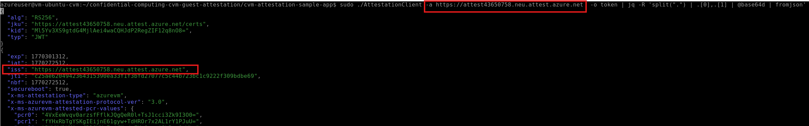

# Walkthrough Challenge 4 - Encryption in use with Azure Confidential Compute – VM

**Estimated Duration:** 90-120 minutes

> 💡 **Objective:** Learn how to implement and validate guest attestation on Azure Confidential VMs to ensure business logic only executes in trusted, hardware-backed confidential computing environments. You will deploy a Confidential VM, configure secure access through Azure Bastion, build and run attestation client applications, and verify cryptographic proof of VM integrity before processing sensitive workloads.

## Prerequisites

Please ensure that you successfully verified the [General prerequisites](../../README.md#general-prerequisites) before continuing with this challenge.

- Azure subscription with permissions to create VMs, Key Vault, and Attestation Providers
- **Linux/Bash environment** - Choose one of the following:
  - **Azure Cloud Shell (Bash)** - Recommended for ease of use
  - **WSL2 on Windows** - Windows Subsystem for Linux 2
  - **Linux or macOS** - Native Bash terminal
- Azure CLI >= 2.54 (pre-installed in Azure Cloud Shell)
- Basic understanding of Azure Virtual Machines and networking concepts
- Familiarity with SSH key authentication and basic Bash commands
- Basic understanding of confidential computing concepts

## Scenario Context

You are a security architect at a European financial services organization that processes highly sensitive customer data and must comply with strict data sovereignty and protection requirements. Your organization has determined that traditional encryption at rest and in transit is insufficient for protecting high-value workloads.

Your mandate includes:

- **Encryption in Use**: Data must be protected even while being processed, not just when stored or transmitted
- **Hardware-Based Trust**: Security guarantees must be rooted in hardware, not just software configurations
- **Attestation Requirements**: Workloads must verify they are running in a genuine confidential environment before processing sensitive data
- **Zero Trust Architecture**: Never assume trust; always verify the execution environment cryptographically
- **Regulatory Compliance**: Meet stringent requirements for data protection in financial services

In this challenge, you'll implement Azure Confidential Computing using AMD SEV-SNP technology to create a hardware-based Trusted Execution Environment (TEE). You'll configure guest attestation to provide cryptographic proof that your workload is running in a protected environment before it processes any sensitive operations.

### Understanding Guest Attestation

Guest attestation helps you confirm that your confidential VM environment is secured by a genuine hardware-backed Trusted Execution Environment (TEE) with security features enabled for isolation and integrity.

**You can use guest attestation to:**

- **Verify hardware platform** - Confirm the confidential VM runs on expected AMD SEV-SNP hardware
- **Validate secure boot** - Verify secure boot is enabled, protecting firmware, bootloader, and kernel from malware
- **Provide cryptographic evidence** - Obtain JWT tokens proving the VM runs on confidential hardware
- **Prevent data exposure** - Ensure workloads refuse to start in untrusted environments

### Attestation Workflow Pattern


In this challenge, you will implement a common pattern where **attestation requests are made from inside the workload** at program startup. The workload verifies that it's running on the correct hardware platform before executing any sensitive business logic.

**How it works:**

1. Your workload starts on the Confidential VM
2. Before processing any sensitive data, the workload calls the attestation library
3. The attestation library contacts Microsoft Azure Attestation (MAA) to verify the TEE environment
4. The workload parses the attestation response (JWT token) to confirm:
   - The VM runs on genuine AMD SEV-SNP confidential hardware
   - Secure boot is enabled and validated
   - The VM guest state is protected
5. Only after successful verification does the workload proceed with sensitive operations

**Why this matters:**

This pattern ensures your application never processes sensitive data in an untrusted environment. If attestation fails (e.g., the code is running on a standard VM or a compromised environment), the workload can refuse to start or handle data differently.

### Learning Resources

- [Azure Confidential Computing overview](https://learn.microsoft.com/azure/confidential-computing/overview)
- [Confidential VM concepts](https://learn.microsoft.com/azure/confidential-computing/confidential-vm-overview)
- [Guest attestation for confidential VMs](https://learn.microsoft.com/azure/confidential-computing/guest-attestation-confidential-vms)
- [Microsoft Azure Attestation](https://learn.microsoft.com/azure/attestation/overview)

### Original Source Materials

This challenge is based on the **Confidential VM Guest Attestation Sample Application** from the Microsoft Azure Confidential Computing repository:

- **Main Repository**: [Azure Confidential Computing CVM Guest Attestation](https://github.com/Azure/confidential-computing-cvm-guest-attestation)
- **Source Module**: [CVM Attestation Sample App](https://github.com/Azure/confidential-computing-cvm-guest-attestation/tree/main/cvm-attestation-sample-app)

The sample application and deployment patterns have been adapted for this MicroHack challenge to provide a guided learning experience with Azure Confidential VMs.

---

## Task 1: Understand the Deployment Architecture

💡 **Before deploying resources, it's important to understand the security architecture and components you'll be creating.**

### Resources Being Deployed

The following resources will be created in the `North Europe` Azure region:

- **1 Attestation Provider** - Microsoft Azure Attestation (MAA) service for verifying TEE integrity
- **1 Virtual Network** - Isolated network with VM and Bastion subnets
- **1 Confidential VM** - Ubuntu 22.04 with AMD SEV-SNP hardware encryption
- **1 Azure Bastion** - Secure remote access without public IP exposure
- **1 Azure Key Vault** - Secure storage for SSH keys
- **Associated Resources** - NSGs, NICs, OS Disks (auto-created)

### Security Architecture

This setup implements a zero-trust security model:

- **No Public IPs on VMs** - VMs are not directly accessible from internet
- **Azure Bastion (Basic SKU)** - Provides secure RDP/SSH access through Azure Portal
- **Azure Key Vault** - Stores SSH private keys securely with RBAC controls
- **Fresh SSH Key Pair** - Generated specifically for this deployment, never stored locally
- **Hardware-Based Encryption** - AMD SEV-SNP encrypts VM memory at the hardware level
- **Secure Boot** - Protects boot chain integrity from firmware through kernel

🔑 **Security Best Practice**: This architecture ensures VM access is authenticated through Azure AD, encrypted with TLS, and never exposes SSH directly to the internet.

---

## Task 2: Set Up Your Environment and Deploy Infrastructure

💡 **You'll create the foundational Azure resources including Resource Group, Key Vault, SSH keys, Attestation Provider, Virtual Network, Confidential VM, and Azure Bastion.**

> **💡 Note**: This guide uses Bash commands. If you're on Windows, use Azure Cloud Shell (Bash) or WSL2.

---

### Step 1: Configure Environment Variables

Set up the variables that will be used throughout the deployment:

```bash
# Set common variables
# Customize ATTENDEE_ID for each participant
RESOURCE_GROUP="labuser-xx"  # Change this for each participant (e.g., labuser-01, labuser-02, ...)

ATTENDEE_ID="${RESOURCE_GROUP}"
# Generate a short hash from ATTENDEE_ID with random component for uniqueness
HASH_SUFFIX=$(echo -n "${ATTENDEE_ID}-${RANDOM}-${RANDOM}" | md5sum | cut -c1-8)

LOCATION="northeurope"
ADMIN_USERNAME="azureuser"
KEYVAULT_NAME="kv-cc-${HASH_SUFFIX}"  # Must be globally unique
SSH_KEY_NAME="cc-${ATTENDEE_ID}-key"
ATTESTATION_NAME="attest${HASH_SUFFIX}"
```

🔑 **Best Practice**: Using hash-based suffixes ensures globally unique resource names even if multiple participants use similar attendee IDs.

### Step 2: Create Resource Group and Key Vault

Create the resource group and Key Vault with RBAC-based permissions:

```bash
# Create Resource Group
az group create \
  --name $RESOURCE_GROUP \
  --location $LOCATION

# Create Key Vault with Azure RBAC permission model
az keyvault create \
  --name $KEYVAULT_NAME \
  --resource-group $RESOURCE_GROUP \
  --location $LOCATION \
  --sku standard \
  --enable-rbac-authorization true \
  --enabled-for-deployment true \
  --enabled-for-template-deployment true

# Get current user's object ID
CURRENT_USER_ID=$(az ad signed-in-user show --query id -o tsv)

# Assign Key Vault Secrets Officer role to current user
az role assignment create \
  --role "Key Vault Secrets Officer" \
  --assignee $CURRENT_USER_ID \
  --scope $(az keyvault show --name $KEYVAULT_NAME --resource-group $RESOURCE_GROUP --query id -o tsv)

# Wait for RBAC permissions to propagate
echo "Waiting for RBAC permissions to propagate..."
sleep 30
```

🔑 **Best Practice**: Using Azure RBAC for Key Vault instead of access policies provides more granular control and better integration with Azure AD identity governance.

### Step 3: Generate and Store SSH Keys

Generate SSH key pair and store securely in Key Vault:

```bash
# Generate SSH key pair using temporary file
SSH_TEMP_FILE="/tmp/cc_ssh_key_${ATTENDEE_ID}_${RANDOM}"
ssh-keygen -t rsa -b 4096 -f "$SSH_TEMP_FILE" -N "" -C "microhack-cc"

# Store private key in Key Vault
az keyvault secret set \
  --vault-name $KEYVAULT_NAME \
  --name "ssh-private-key" \
  --file "$SSH_TEMP_FILE"

# Store public key in Key Vault
az keyvault secret set \
  --vault-name $KEYVAULT_NAME \
  --name "ssh-public-key" \
  --file "${SSH_TEMP_FILE}.pub"

# Read public key for VM creation
SSH_PUBLIC_KEY=$(cat "${SSH_TEMP_FILE}.pub")

# Clean up temporary files
rm -f "$SSH_TEMP_FILE" "${SSH_TEMP_FILE}.pub"

echo "SSH key pair generated and stored in Key Vault: $KEYVAULT_NAME"
echo "Public key: $SSH_PUBLIC_KEY"
```

🔑 **Security Insight**: SSH keys are never stored persistently on your local machine. They exist only in Azure Key Vault, reducing the risk of key compromise.

### Step 4: Create Attestation Provider

Create the Microsoft Azure Attestation provider:

```bash
# Create Attestation Provider
az attestation create \
  --name $ATTESTATION_NAME \
  --resource-group $RESOURCE_GROUP \
  --location $LOCATION
```

💡 **Understanding MAA**: Microsoft Azure Attestation is a unified solution for remotely verifying the trustworthiness of platforms and integrity of binaries running inside them.

### Step 5: Create Virtual Network with Subnets

Create virtual network with separate subnets for VMs and Azure Bastion:

```bash
# Create Virtual Network with VM and Bastion subnets for CVM
az network vnet create \
  --resource-group $RESOURCE_GROUP \
  --name "vm-ubuntu-cvm-vnet" \
  --location $LOCATION \
  --address-prefix "10.10.0.0/24" \
  --subnet-name "vm-subnet" \
  --subnet-prefix "10.10.0.0/26"

# Create Bastion subnet (must be named AzureBastionSubnet)
az network vnet subnet create \
  --resource-group $RESOURCE_GROUP \
  --vnet-name "vm-ubuntu-cvm-vnet" \
  --name "AzureBastionSubnet" \
  --address-prefix "10.10.0.64/26"
```

🔑 **Networking Best Practice**: Separating VM and Bastion subnets provides network segmentation and allows for different security policies.

### Step 6: Deploy Confidential VM

Create the Confidential VM with AMD SEV-SNP hardware encryption:

```bash
# Create Confidential VM (North Europe) - No public IP
az vm create \
  --resource-group $RESOURCE_GROUP \
  --name "vm-ubuntu-cvm" \
  --location $LOCATION \
  --size "Standard_DC2as_v5" \
  --admin-username $ADMIN_USERNAME \
  --ssh-key-value "$SSH_PUBLIC_KEY" \
  --authentication-type ssh \
  --enable-vtpm true \
  --image "Canonical:0001-com-ubuntu-confidential-vm-jammy:22_04-lts-cvm:latest" \
  --security-type "ConfidentialVM" \
  --os-disk-security-encryption-type "VMGuestStateOnly" \
  --enable-secure-boot true \
  --vnet-name "vm-ubuntu-cvm-vnet" \
  --subnet "vm-subnet" \
  --public-ip-address ""

# Enable system-assigned managed identity for CVM
az vm identity assign \
  --resource-group $RESOURCE_GROUP \
  --name "vm-ubuntu-cvm"
```

💡 **Key Configuration Details**:
- `--security-type "ConfidentialVM"` - Enables hardware-based confidential computing
- `--os-disk-security-encryption-type "VMGuestStateOnly"` - Encrypts VM guest state with platform-managed keys
- `--enable-secure-boot true` - Protects boot integrity
- `--enable-vtpm true` - Enables virtual Trusted Platform Module for attestation
- `--public-ip-address ""` - No public IP for enhanced security

### Step 7: Deploy Azure Bastion

Create Azure Bastion for secure remote access:

```bash
# Create Public IP for Bastion (North Europe)
az network public-ip create \
  --resource-group $RESOURCE_GROUP \
  --name "bastion-northeurope-ip" \
  --location $LOCATION \
  --sku "Standard" \
  --allocation-method "Static"

# Create Azure Bastion (Basic SKU) for North Europe
az network bastion create \
  --resource-group $RESOURCE_GROUP \
  --name "bastion-northeurope" \
  --location $LOCATION \
  --vnet-name "vm-ubuntu-cvm-vnet" \
  --public-ip-address "bastion-northeurope-ip" \
  --sku "Basic"

echo "Bastion deployment in North Europe initiated (this may take 5-10 minutes)"
```

⏱️ **Deployment Time**: Azure Bastion typically takes 5-10 minutes to deploy. You can proceed with reviewing the next sections while waiting.

---

## Task 3: Connect to Confidential VM and Install Attestation Tools

💡 **Now you'll connect to the Confidential VM through Azure Bastion and install the necessary dependencies to build and run the attestation client.**

### Step 1: Connect via Azure Bastion

> **📝 Note: These commands run ON the Linux VM itself after connecting via Bastion (not on your local machine)**

1. Navigate to the Azure Portal
2. Go to **Virtual Machines** > **vm-ubuntu-cvm**
3. Click **Connect** > **Connect via Bastion**
4. **Authentication Type**: SSH Private Key from Azure Key Vault
5. **Username**: `azureuser`
6. **Azure Key Vault Secret**: Select your Key Vault and choose `ssh-private-key`
7. Click **Connect**


### Step 2: Install System Dependencies and Build Tools

Once connected to the VM via Bastion, run the following commands:

```bash
# Install system dependencies
export DEBIAN_FRONTEND=noninteractive
export NEEDRESTART_MODE=a
export APT_LISTCHANGES_FRONTEND=none

sudo -E apt-get update -y
sudo -E apt-get upgrade -y

sudo -E apt-get install -y build-essential libcurl4-openssl-dev libjsoncpp-dev libboost-all-dev nlohmann-json3-dev cmake wget git jq
```

💡 **What's Being Installed**:
- Build tools (gcc, g++, make) for compiling C++ attestation client
- Cryptographic libraries (libcurl, jsoncpp) for HTTPS and JSON handling
- Boost libraries for advanced C++ functionality
- CMake for build orchestration
- jq for JSON parsing and token inspection

### Step 3: Clone Attestation Repository

```bash
# Clone the attestation repository
git clone https://github.com/Azure/confidential-computing-cvm-guest-attestation.git
```

### Step 4: Install Azure Guest Attestation Package

```bash
# Download the attestation package
wget https://packages.microsoft.com/repos/azurecore/pool/main/a/azguestattestation1/azguestattestation1_1.1.2_amd64.deb

# Install the attestation package
sudo dpkg -i azguestattestation1_1.1.2_amd64.deb
```

💡 **About the Package**: The `azguestattestation1` package provides the attestation client library that interfaces with the VM's vTPM and Microsoft Azure Attestation service.

---

## Task 4: Build and Execute Attestation Client

💡 **You'll compile the attestation client application and execute it to obtain cryptographic proof of the VM's confidential computing capabilities.**

### Step 1: Build the Attestation Client

```bash
# Navigate to the sample app directory
cd confidential-computing-cvm-guest-attestation/cvm-attestation-sample-app/

# Generate build files with CMake
cmake .

# Compile the application
make
```

💡 **Build Process**: CMake analyzes dependencies and generates Makefiles, then `make` compiles the C++ source code into the `AttestationClient` executable.

### Step 2: Run Attestation and Inspect JWT Token

To use the dedicated Attestation Provider you created in Task 2 Step 4, you need to pass its URI using the `-a` argument.

**Retrieve Your Attestation URI via Azure CLI**

```bash
# Retrieve your attestation provider URI
ATTESTATION_URI=$(az attestation show \
  --name $ATTESTATION_NAME \
  --resource-group $RESOURCE_GROUP \
  --query "attestUri" \
  -o tsv)

# Run attestation with your custom provider
sudo ./AttestationClient -a $ATTESTATION_URI -o token | jq -R 'split(".") | .[0],.[1] | @base64d | fromjson'
```



🔑 **Why Use a Custom Attestation Provider?**:
- **Custom Policies**: Define organization-specific attestation policies
- **Audit Control**: Maintain your own attestation logs and policies
- **Compliance**: Meet regulatory requirements for attestation service ownership
- **Isolation**: Separate attestation infrastructure from shared services

### Step 3: Understand the Attestation Token

The JWT token contains multiple claims that cryptographically prove the VM's security posture:

**Key Claims to Review**:

- `x-ms-isolation-tee.x-ms-attestation-type` - Should show `sevsnpvm` (AMD SEV-SNP)
- `x-ms-isolation-tee.x-ms-compliance-status` - Should show `azure-compliant-cvm`
- `x-ms-isolation-tee.x-ms-sevsnpvm-is-debuggable` - Should be `false` (debugging disabled for security)
- `x-ms-policy-hash` - Hash of the attestation policy used
- `secureboot` - Should be `true`
- `x-ms-ver` - Attestation service version

🔑 **Security Insight**: This JWT token is signed by Microsoft Azure Attestation. Any relying party can verify the signature to confirm the claims are authentic and the VM is running in a genuine confidential environment.

---

## Task 5: Implement Attestation-Based Workload Protection (Conceptual)

💡 **Understanding how to use attestation in production applications to enforce "only execute in confidential environment" policies.**

### Production Implementation Pattern

In a production scenario, your application would implement attestation checks before processing sensitive data:

```python
# Pseudocode - Production attestation pattern
def process_sensitive_data(customer_data):
    # Step 1: Perform attestation
    attestation_token = get_attestation_token()

    # Step 2: Validate token with relying party
    if not validate_attestation(attestation_token):
        log_error("Attestation failed - not running in confidential environment")
        raise SecurityException("Execution environment not trusted")

    # Step 3: Verify specific claims
    claims = parse_jwt_claims(attestation_token)
    if claims['x-ms-isolation-tee.x-ms-attestation-type'] != 'sevsnpvm':
        raise SecurityException("Not running on AMD SEV-SNP hardware")

    if claims['x-ms-isolation-tee.x-ms-sevsnpvm-is-debuggable'] == 'true':
        raise SecurityException("VM debugging is enabled - security risk")

    # Step 4: Only now proceed with sensitive operations
    encrypted_results = process_pii_data(customer_data)
    return encrypted_results
```

### Use Cases for Attestation-Based Protection

1. **Financial Services**: Verify trading algorithms run only in hardware-protected environments
2. **Healthcare**: Ensure patient data processing occurs only in attested confidential VMs
3. **Government**: Validate classified workloads execute in compliant infrastructure
4. **Multi-Party Computation**: Prove to partners that shared data is processed securely

🔑 **Best Practice**: Attestation should be performed at application startup and periodically during long-running workloads to detect runtime tampering.

---

## Task 6: Clean Up Resources

💡 **Delete all resources to avoid ongoing charges.**

### Delete Resource Group

To delete all resources created in this challenge:

```bash
az group delete --name $RESOURCE_GROUP --yes --no-wait
```

⚠️ **Warning**: This command will permanently delete all resources in the resource group including the VM, Key Vault, Bastion, and all associated resources.

---

## Key Takeaways

In this challenge, you successfully implemented and validated Azure Confidential Computing with guest attestation. Here are the key concepts and best practices:

### Confidential Computing Fundamentals

✅ **Hardware-Based Trust** - AMD SEV-SNP provides hardware-level memory encryption that protects data in use, not just at rest or in transit

✅ **Trusted Execution Environments (TEEs)** - Confidential VMs create isolated environments where even the cloud operator cannot access your data

✅ **Virtual TPM (vTPM)** - Enables cryptographic attestation and secure boot validation

### Attestation and Verification

✅ **Guest Attestation** - Cryptographically proves that workloads run in genuine confidential computing environments before processing sensitive data

✅ **Microsoft Azure Attestation (MAA)** - Provides centralized attestation services that validate TEE integrity and issue signed JWT tokens

✅ **Zero Trust Validation** - Applications should verify execution environment before processing sensitive operations

### Security Architecture

✅ **Defense in Depth** - Combining multiple security layers (no public IPs, Azure Bastion, Key Vault, hardware encryption, attestation)

✅ **Secure Key Management** - SSH keys stored exclusively in Azure Key Vault with RBAC controls, never persisted locally

✅ **Network Isolation** - VMs without public IPs, accessed only through Azure Bastion with Azure AD authentication

### Production Best Practices

✅ **Attestation at Startup** - Perform attestation checks before processing any sensitive data

✅ **Periodic Re-attestation** - Long-running workloads should re-attest periodically to detect runtime tampering

✅ **JWT Token Validation** - Verify attestation tokens are signed by trusted authorities and contain expected claims

✅ **Fail Securely** - Applications should refuse to start or handle data differently if attestation fails

### Compliance and Governance

✅ **Data Sovereignty** - Confidential computing ensures data remains encrypted even from cloud operators

✅ **Regulatory Requirements** - Meets stringent requirements for financial services, healthcare, and government workloads

✅ **Audit Trail** - Attestation tokens provide cryptographic proof for compliance auditing

---

## Next Steps

### Explore Advanced Confidential Computing Scenarios

- **[Azure Confidential Containers](https://learn.microsoft.com/azure/confidential-computing/confidential-containers)** - Deploy containerized workloads with hardware-based confidential computing
- **[Confidential VMs with Customer-Managed Keys](https://learn.microsoft.com/azure/confidential-computing/confidential-vm-overview#encryption-at-host-with-customer-managed-keys)** - Use your own encryption keys for additional control
- **[Confidential Computing on Azure Kubernetes Service](https://learn.microsoft.com/azure/aks/confidential-computing-azure)** - Orchestrate confidential containers at scale

### Implement Application-Level Confidential Computing

- **[Enclave Applications](https://learn.microsoft.com/azure/confidential-computing/application-development)** - Build applications that use Intel SGX or AMD SEV-SNP enclaves
- **[Confidential Inferencing](https://learn.microsoft.com/azure/machine-learning/how-to-machine-learning-confidential-containers)** - Protect ML models and data during inference
- **[Always Encrypted](https://learn.microsoft.com/sql/relational-databases/security/encryption/always-encrypted-database-engine)** - Combine confidential computing with SQL Server encryption

### Learn More About Azure Security

- **[Azure Security Benchmark for Confidential Computing](https://learn.microsoft.com/security/benchmark/azure/baselines/confidential-computing-security-baseline)** - Follow Microsoft's security recommendations
- **[Azure Confidential Ledger](https://learn.microsoft.com/azure/confidential-ledger/overview)** - Tamper-proof, immutable ledger for audit logs
- **[Microsoft Azure Attestation Documentation](https://learn.microsoft.com/azure/attestation/overview)** - Deep dive into attestation concepts and policies

### Practice Confidential Computing Patterns

- **Multi-Party Computation** - Build scenarios where multiple organizations jointly process data without exposing it to each other
- **Confidential AI** - Implement ML training and inference in confidential environments
- **Secure Enclaves** - Explore Intel SGX for process-level isolation within VMs

---

## Additional Resources

- [Azure Confidential Computing overview](https://learn.microsoft.com/azure/confidential-computing/overview)
- [Confidential VM concepts](https://learn.microsoft.com/azure/confidential-computing/confidential-vm-overview)
- [Guest attestation for confidential VMs](https://learn.microsoft.com/azure/confidential-computing/guest-attestation-confidential-vms)
- [Microsoft Azure Attestation](https://learn.microsoft.com/azure/attestation/overview)
- [AMD SEV-SNP Technology](https://www.amd.com/en/developer/sev.html)
- [Azure Bastion Documentation](https://learn.microsoft.com/azure/bastion/bastion-overview)
- [Azure Key Vault Best Practices](https://learn.microsoft.com/azure/key-vault/general/best-practices)

---

## Technical Notes

1. **Attendee Identification**:
   - Set `ATTENDEE_ID` to a unique value for each participant (e.g., attendee01, attendee02, etc.)
   - A hash-based suffix is automatically generated from ATTENDEE_ID plus random numbers for globally unique resources
   - The hash output is alphanumeric (hexadecimal) and safe for all Azure resource naming requirements
   - This prevents resource name collisions even if multiple students use the same ATTENDEE_ID

2. **SSH Key Generation**:
   - Fresh SSH key pair is generated and stored directly in Key Vault
   - No local SSH key files are created or retained
   - Keys are only accessible through Key Vault

3. **Security Compliance**:
   - VMs have **no public IPs** - not directly accessible from internet
   - Access only through Azure Bastion (Basic SKU)
   - Private SSH key stored securely in Azure Key Vault
   - Bastion uses Key Vault integration for authentication

4. **Network Range**:
   - VNet (North Europe): `10.10.0.0/24`
     - VM Subnet: `10.10.0.0/26`
     - Bastion Subnet: `10.10.0.64/26`

5. **VM Pricing**: VMs use standard (pay-as-you-go) pricing for microhack reliability

6. **Bastion Deployment**: Takes 5-10 minutes to complete. You can proceed with other steps while it deploys

7. **Auto-Created Resources**:
   - NSGs (Network Security Groups) - Created automatically by `az vm create`
   - NICs (Network Interfaces) - Created automatically and named `<vm-name>VMNic`
   - OS Disks - Created automatically with the VMs

8. **Key Vault Access**: Ensure your Azure account has appropriate permissions to read secrets from Key Vault when using Bastion
