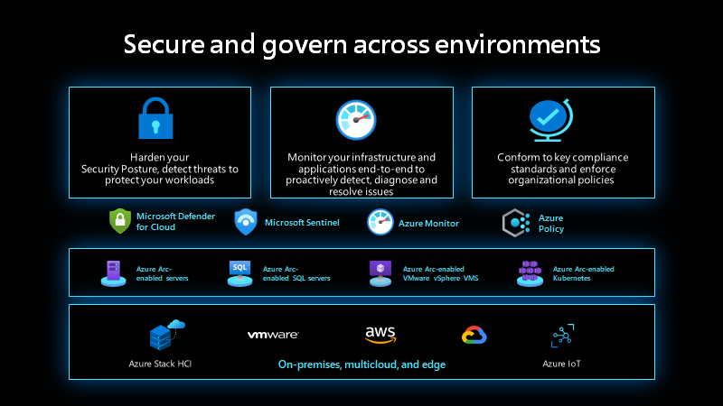

# MicroHack Azure Arc for Servers

- [**MicroHack introduction**](#microhack-introduction)
  - [What is Azure Arc?](#what-is-azure-arc)
- [**MicroHack context**](#microhack-context)
- [**Objectives**](#objectives)
- [**MicroHack Challenges**](#microhack-challenges)
  - [General prerequisites](#general-prerequisites)
  - [Challenge 1 - Azure Arc prerequisites & onboarding](#challenge-1---azure-arc-prerequisites--onboarding)
  - [Challenge 2 - Azure Monitor integration](#challenge-2---azure-monitor-integration)
  - [Challenge 3 - Access Azure resources using Managed Identities from your on-premises servers](#challenge-3---access-azure-resources-using-managed-identities-from-your-on-premises-servers)
  - [Challenge 4 - Microsoft Defender for Cloud integration with Azure Arc](#challenge-4---microsoft-defender-for-cloud-integration-with-azure-arc)
  - [Challenge 5 - Best Practices assessment for Windows Server](#challenge-5---best-practices-assessment-for-windows-server)
  - [Challenge 6 - Activate ESU for Windows Server 2012 R2 via Arc (optional)](#challenge-6---activate-esu-for-windows-server-2012-r2-via-arc---optional)
  - [Challenge 7 - Azure Machine Configuration (optional)](#challenge-7---azure-machine-configuration---optional)

- [**Contributors**](#contributors)

## MicroHack introduction

### What is Azure Arc?

For customers who want to simplify complex and distributed environments across on-premises, edge, and multi-cloud, [Azure Arc](https://azure.microsoft.com/services/azure-arc/) enables deployment of Azure services anywhere and extends Azure management to any infrastructure. Azure Arc helps you accelerate innovation across hybrid and multi-cloud environments and provides the following benefits to your organization:



- Gain central visibility, operations, and compliance Standardize visibility, operationsand compliance across a wide range of resources and locations by extending the Azure control plane. Right from Azure, you can easily organize, govern, and secure Windows, Linux, SQL Servers and Kubernetes clusters across datacenters, edge, and multi-cloud.

- Build Cloud native apps anywhere, at scale Centrally code and deploy applications confidently to any Kubernetes distribution in any location. Accelerate development by using best in class applications services with standardized deployment, configuration, security, and observability.

- Run Azure services anywhere Flexibly use cloud innovation where you need it by deploying Azure services anywhere. Implement cloud practices and automation to deploy faster, consistently, and at scale with always-up-to-date Azure Arc enabled services.

**Note**: for Arc-enabled Windows servers covered with Software Assurance, Microsoft provides features and services that were paid before, now for no additional cost. In fact, they will become part of your Software Assurance benefits. On top of this, additional features such as the [Best Practice Assessment](https://learn.microsoft.com/en-us/windows-server/manage/azure-arc/best-practices-assessment-for-windows-server) or [Remote Support](https://learn.microsoft.com/en-us/windows-server/manage/azure-arc/remote-support-for-windows-server), are exclusively available to these servers. More information about this announcement on the [Tech Community](https://techcommunity.microsoft.com/blog/azurearcblog/announcing-general-availability-windows-server-management-enabled-by-azure-arc/4303854) and [Microsoft docs](https://learn.microsoft.com/en-us/azure/azure-arc/servers/windows-server-management-overview?tabs=portal).

## MicroHack context

This MicroHack scenario walks through the use of Azure Arc with a focus on the best practices and the design principles and some interesting challenges for real world scenarios. Specifically, this builds up to include working with an existing infrastructure in your datacenter.

Further resources

- [Azure Arc Overview Documentation](https://learn.microsoft.com/azure/azure-arc/overview)
- [Azure Arc Blog from Microsoft](https://techcommunity.microsoft.com/category/azure/blog/azurearcblog)
- [Azure Arc Enabled Extended Security Updates](https://learn.microsoft.com/windows-server/get-started/extended-security-updates-deploy)
- [Azure Arc Jumpstart Scenarios](https://jumpstart.azure.com/azure_arc_jumpstart)
- [Azure Arc Jumpstart LocalBox](https://jumpstart.azure.com/azure_jumpstart_localbox)
- [Azure Arc Jumpstart ArcBox](https://jumpstart.azure.com/azure_jumpstart_arcbox)
- [Azure Arc for Developers](https://techcommunity.microsoft.com/t5/itops-talk-blog/azure-arc-for-developers/ba-p/2561513)
- [Azure Arc for Cloud Solutions Architects](https://techcommunity.microsoft.com/t5/itops-talk-blog/azure-arc-for-cloud-solutions-architects/ba-p/2521928)
- [Azure Arc for IT Pros](https://techcommunity.microsoft.com/t5/itops-talk-blog/azure-arc-for-it-pros/ba-p/2347921)
- [Azure Arc for Security Engineers](https://techcommunity.microsoft.com/t5/itops-talk-blog/azure-arc-for-security-engineers/ba-p/2367830)
- [Learning Path Bring Azure innovation to your hybrid environments with Azure Arc](https://learn.microsoft.com/training/paths/manage-hybrid-infrastructure-with-azure-arc/)
- [Customer reference: Wüstenrot & Württembergische reduces patching time by 35 percent, leans into hybrid cloud management with Azure Arc](https://customers.microsoft.com/story/1538266003319018436-ww-azure-banking-and-capital-markets)
- [Introduction to Azure Arc landing zone accelerator for hybrid and multicloud](https://learn.microsoft.com/azure/cloud-adoption-framework/scenarios/hybrid/enterprise-scale-landing-zone)

💡 Optional: Read this after completing this lab to deepen what you have learned!

## Objectives

After completing this MicroHack you will:

- Know how to use Azure Arc in your environment, on-prem or Multi-cloud
- Understand use cases and possible scenarios in your hybrid world to modernize your infrastructure estate
- Get insights into real world challenges and scenarios

## MicroHack Challenges

### General prerequisites

This MicroHack has a few but important prerequisites to be understood before starting this lab!

- Your own Azure subscription with Owner RBAC rights at the subscription level
- You need to have 3 virtual machines ready and updated. One with a Linux operating system (tested with Ubuntu Server 24.04), one with Windows Server 2025 and one with Windows Server 2012 R2 (optional). You can use machines in Azure for this following this guide: [Azure Arc Jumpstart Servers](https://jumpstart.azure.com/azure_arc_jumpstart/azure_arc_servers/azure)
    > **Note**
    > When using the Jumpstart the virtual machines will already be onboarded to Azure Arc and therefore "Challenge 1 - Azure Arc prerequisites & onboarding" is not needed.
- [Azure CLI](https://learn.microsoft.com/cli/azure/install-azure-cli) (Hint: Make sure to use the latest version)
- [Azure PowerShell Guest Configuration Cmdlets](https://learn.microsoft.com/azure/governance/machine-configuration/machine-configuration-create-setup#install-the-module-from-the-powershell-gallery)
  - It is not possible to run those commands from Azure Cloud Shell
  - Please make sure you have at least version 4.11.0 installed with the following Command: ```Install-Module -Name GuestConfiguration -Scope CurrentUser -RequiredVersion 4.11.0```
- [Visual Studio Code](https://code.visualstudio.com/)
- [Git SCM](https://git-scm.com/download/)

## Challenge 1 - Azure Arc prerequisites & onboarding

### Goal

In challenge 1 you will prepare your Azure environemnt for onboarding of existing Windows- and Linux servers and onboard them to Azure Arc.

### Actions

- Verify all necessary Azure resources are in place
  - Resource Group (Name: mh-arc-servers-rg)
  - Service Principal (Name: mh-arc-servers-sp)
- Service Principal (Name: LabUser-xx-arc-servers-sp)
- Enable required Resource Providers (if not already enabled)
- Prep existing servers` operating system on-prem
  - Hint: We are using Azure VMs to simulate on-prem servers
- Onboard existing servers to Azure Arc
  - win2012-vm may be skipped unless you plan to do the optional Challenge 6 (Extended Security Updates)

### Success criteria

- You created an Azure resource group
- You created an service principal with the required role membership
- Successfully prepared existing servers
- Onboarded servers which is visible in the Azure Arc machines blade in the Azure Portal

### Learning resources

- [Plan and deploy Azure Arc-enabled servers](https://learn.microsoft.com/azure/azure-arc/servers/plan-at-scale-deployment)
- [Prerequisites for Connect hybrid machines with Azure Arc-enabled servers](https://learn.microsoft.com/azure/azure-arc/servers/learn/quick-enable-hybrid-vm#prerequisites)
- [Connect hybrid machines with Azure Arc-enabled servers](https://learn.microsoft.com/azure/azure-arc/servers/learn/quick-enable-hybrid-vm#generate-installation-script)
- [Create a service principal for onboarding](https://learn.microsoft.com/azure/azure-arc/servers/onboard-service-principal#create-a-service-principal-for-onboarding-at-scale)

### Solution - Spoilerwarning

[Solution Steps](./walkthrough/challenge-1/solution.md)

## Challenge 2 - Azure Monitor, Update Manager, and Change Tracking integration

### Goal

In challenge 2 you will onboard your Windows and Linux virtual machines to Azure Monitor using the Azure Monitoring Agent (AMA) to leverage Azure Update Manager, Change Tracking, Inventory and more.

### Actions

- Create all necessary Azure resources
  - Log Analytics workspace (Name: mh-arc-servers-kv-law)
- Configure Data Collection Rules to collect Windows event logs and Linux syslog
- Enable Azure Monitor for Azure Arc-enabled Servers with Azure Policy initiative
- Enable and configure Update Manager
- Enable Change Tracking and Inventory
- Enable VM Insights


### Success criteria

- You have a Log Analytics Workspace
- You successfully linked the necessary Azure Policy initiative to the Azure resource group
- You can query the Log Analytics Workspace for events of your virtual machines
- All virtual machines have the latest Windows and Linux updates installed
- You can browse through the software inventory of your virtual machines
- You can use VM Insights to get a detailed view of your virtual machines

### Learning resources

- [Create a Log Analytics workspace in the Azure portal](https://docs.microsoft.com/azure/azure-monitor/logs/quick-create-workspace)
- [Deployment options for Azure Monitor agent on Azure Arc-enabled servers](https://learn.microsoft.com/azure/azure-arc/servers/concept-log-analytics-extension-deployment)
- [Data collection rules in Azure Monitor](https://learn.microsoft.com/azure/azure-monitor/essentials/data-collection-rule-overview)
- [Azure Policy built-in definitions for Azure Arc-enabled servers](https://docs.microsoft.com/azure/azure-arc/servers/policy-reference)
- [Azure Update Manager](https://learn.microsoft.com/azure/update-manager/overview)
- [Enable Change Tracking and Inventory using Azure Monitoring Agent](https://learn.microsoft.com/azure/automation/change-tracking/enable-vms-monitoring-agent?tabs=singlevm%2Cmultiplevms&pivots=single-portal)
- [Monitor a hybrid machine with VM insights](https://docs.microsoft.com/azure/azure-arc/servers/learn/tutorial-enable-vm-insights)


### Solution - Spoilerwarning

[Solution Steps](./walkthrough/challenge-2/solution.md)

## Challenge 3 - Access Azure resources using Managed Identities from your on-premises servers

### Goal

Managing secrets, credentials or certificates to secure communication between different services is a main challenge for developers and administrators. Managed Identities is Azure's answer to all these challenges and eliminates the need to manage and securely store secrets, credentials or certificates on the virtual machine. In challenge 3 you will leverage Managed Identities via Azure Arc to securely access an Azure Key Vault secret from your Azure Arc enabled servers without the need of managing any credential.

### Actions

- Create an Azure Key Vault in your Azure resource group
- Create a secret in the Azure Key Vault and assign permissions to your Linux virtual machine
- Access the secret via bash script

### Success Criteria

- You successfully output the secret in the terminal on your Linux server without providing any credentials (except for your SSH login 😊).

### Learning resources

- [Create a key vault using the Azure portal](https://docs.microsoft.com/azure/key-vault/general/quick-create-portal)
- [Set and retrieve a secret from Azure Key Vault using the Azure portal](https://docs.microsoft.com/azure/key-vault/secrets/quick-create-portal)
- [Use a Linux VM system-assigned managed identity to access Azure Key Vault](https://docs.microsoft.com/azure/active-directory/managed-identities-azure-resources/tutorial-linux-vm-access-nonaad)
- [Authenticate against Azure resources with Azure Arc-enabled servers](https://docs.microsoft.com/azure/azure-arc/servers/managed-identity-authentication)

### Solution - Spoilerwarning

[Solution Steps](./walkthrough/challenge-3/solution.md)

## Challenge 4 - Microsoft Defender for Cloud integration with Azure Arc

### Goal

- In this challenge, we will integrate your Azure Arc connected machines with Azure Defender for Cloud. After completing the previous challenges, you should now have an Azure subscription with one or more Azure Arc-enabled servers. You should also have an available Log Analytics workspace and have deployed the Azure Monitor Agent to your server(s).

### Actions

- Enable Microsoft Defender for Cloud on your Azure Arc-enabled machines.

### Success criteria

- Open Microsoft Defender for Cloud and view the Secure Score for your Azure Arc-enabled machine(s).

### Learning resources

- [What is Microsoft Defender for Cloud?](https://learn.microsoft.com/azure/defender-for-cloud/defender-for-cloud-introduction)
- [Quickstart: Connect your non-Azure machines to Microsoft Defender for Cloud](https://learn.microsoft.com/azure/defender-for-cloud/quickstart-onboard-machines?pivots=azure-arc)
- [Connect Azure Arc-enabled servers to Microsoft Defender for Cloud](https://learn.microsoft.com/azure/cloud-adoption-framework/manage/hybrid/server/best-practices/arc-security-center)
- [Protect non-Azure resources using Azure Arc and Microsoft Defender for Cloud](https://techcommunity.microsoft.com/t5/microsoft-defender-for-cloud/protect-non-azure-resources-using-azure-arc-and-microsoft/ba-p/2277215)
- [Deploy the Azure Monitor Agent to protect your servers with Microsoft Defender for Cloud](https://learn.microsoft.com/azure/defender-for-cloud/auto-deploy-azure-monitoring-agent)


### Solution - Spoilerwarning

[Solution Steps](./walkthrough/challenge-4/solution.md)

## Challenge 5 - Best Practices assessment for Windows Server

### Goal

In this challenge, you will configure and deploy the Best Practices Assessment for Windows Servers onboarded to Azure Arc. The assessment will evaluate the server’s configuration against Windows best practices, generate actionable remediation steps for identified issues, and help you enhance your server infrastructure's performance, security, and stability.

### Actions

- Set Up Best Practices Assessment for one machine
- Run the Best Practices Assessment
- Analyze Results

### Success criteria

- Best Practices Assessment is enabled and installed on your Arc-enabled Windows Server
- The Assessment Platform, Windows Server Assessment, and Azure Monitor Agent (AMA)  extensions are installed successfully
- The first Best Practices Assessment is run successfully

Note: this feature is only available for Arc-enabled Windows Server that are covered with Software Assurance.

### Learning resources

- [Configure Best Practices Assessment for Arc-enabled Windows servers](https://learn.microsoft.com/windows-server/manage/azure-arc/best-practices-assessment-for-windows-server)


### Solution - Spoilerwarning

[Solution Steps](./walkthrough/challenge-5/solution.md)

## Challenge 6 - Activate ESU for Windows Server 2012 R2 via Arc - optional

### Goal

In this challenge, you will activate Extended Security Updates (ESU) for Windows Server 2012 R2 via Azure Arc. This will ensure that your server continues to receive critical security updates beyond the end of support date and allows you to stop paying for updates once the server gets decommissioned or upgraded.

### Actions

- Purchase and activate the ESU license for your Windows Server 2012 R2.
- Apply the ESU license to your server.

### Success criteria

- The ESU license is purchased and activated.
- The server has an attached ESU license and its ESU status shows as "Enabled"

### Learning resources

- [Extended Security Updates for Windows Server 2012 and 2012 R2](https://learn.microsoft.com/lifecycle/faq/extended-security-updates)
- [Deploy Extended Security Updates using Azure Arc](https://learn.microsoft.com/azure/azure-arc/servers/prepare-extended-security-updates?tabs=azure-cloud)

### Solution - Spoilerwarning

[Solution Steps](./walkthrough/challenge-6/solution.md)

## Challenge 7 - Azure Machine Configuration - optional

### Goal

This challenge is about interacting with the client operating system. We will have a look at Machine Configurations as the final step of this journey.

### Actions

- Create all necessary Azure resources
  - Azure Storage account
- Setup a Policy that checks if the user "FrodoBaggins" is part of the local administrators group
- Setup a Custom Machine Configuration, for the Windows Server, that creates a registry key in ``` HKLM:\SYSTEM\CurrentControlSet\Control\Session Manager\Environment\ ```

### Success criteria

- You can view the compliance state of the Administrator Group Policy
- You can show the registry key being present on the Windows Server

### Learning resources

- [Understand the machine configuration feature](https://learn.microsoft.com/azure/governance/machine-configuration/overview)
- [How to setup a machine configuration authoring environment](https://learn.microsoft.com/azure/governance/machine-configuration/machine-configuration-create-setup)
- [How to create custom machine configuration package artifacts](https://learn.microsoft.com/azure/governance/machine-configuration/machine-configuration-create)
- [How to create custom machine configuration policy definitions](https://learn.microsoft.com/azure/governance/machine-configuration/machine-configuration-create-definition)
- [Create SAS tokens for storage containers](https://learn.microsoft.com/azure/applied-ai-services/form-recognizer/create-sas-tokens)

### Solution - Spoilerwarning

[Solution Steps](./walkthrough/challenge-7/solution.md)

## Finish

Congratulations! You finished the MicroHack Azure Arc for Servers. We hope you had the chance to learn about the Hybrid capabilities of Azure.
If you want to give feedback please dont hesitate to open an Issue on the repository or get in touch with one of us directly.

Thank you for investing the time and see you next time!

## Contributors

- Adrian Schöne [GitHub](https://github.com/adriandiver); [LinkedIn](https://www.linkedin.com/in/adrian-schoene//)
- Christian Thönes [Github](https://github.com/cthoenes); [LinkedIn](https://www.linkedin.com/in/christian-t-510b7522/)
- Nils Bankert [GitHub](https://github.com/nilsbankert); [LinkedIn](https://www.linkedin.com/in/nilsbankert/)
- Alexander Ortha [GitHub](https://github.com/alexor-ms/); [LinkedIn](https://www.linkedin.com/in/alexanderortha/)
- Christoph Süßer (Schmidt) [GitHub](https://github.com/TheFitzZZ); [LinkedIn](https://www.linkedin.com/in/suesser/)
- Jan Egil Ring [GitHub](https://github.com/janegilring); [LinkedIn](https://www.linkedin.com/in/janegilring/)
- Tom Claes [GitHub](https://github.com/claestom); [LinkedIn](https://www.linkedin.com/in/tomclaes-/)