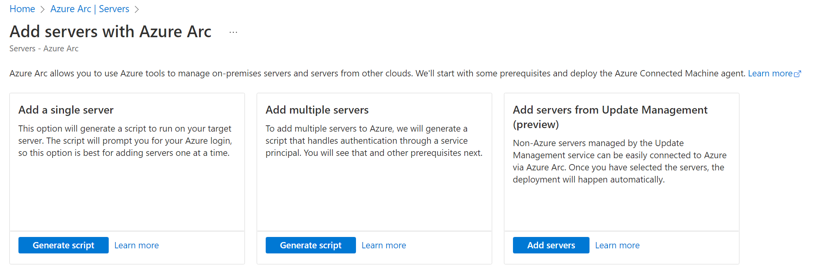
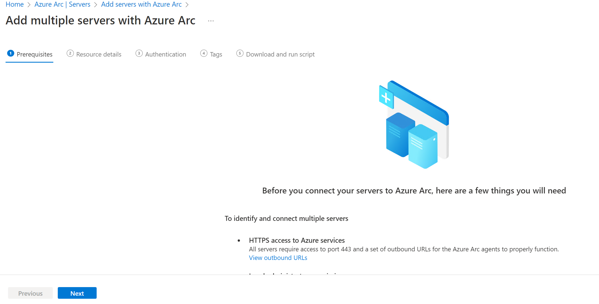
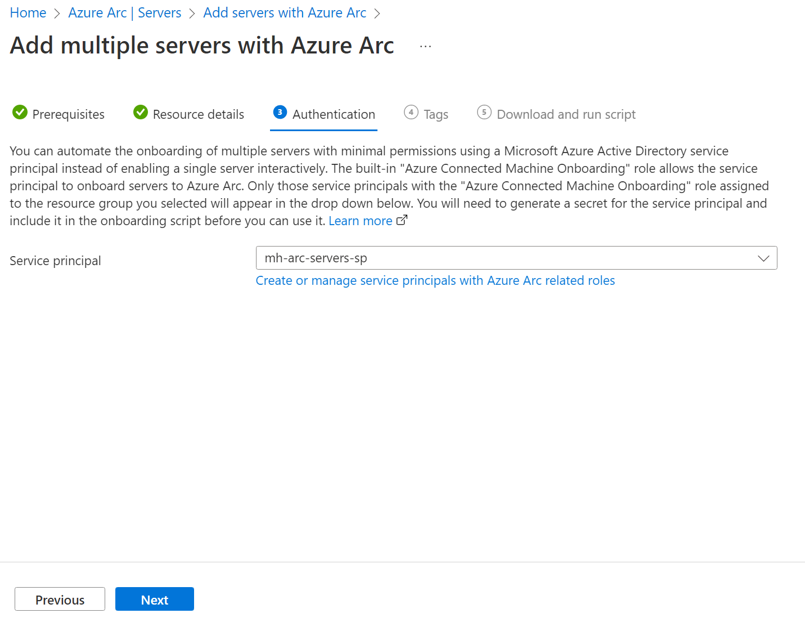
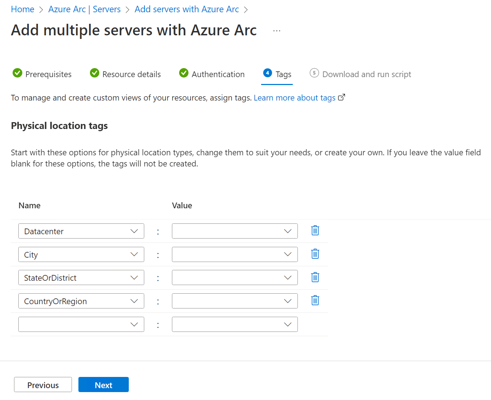
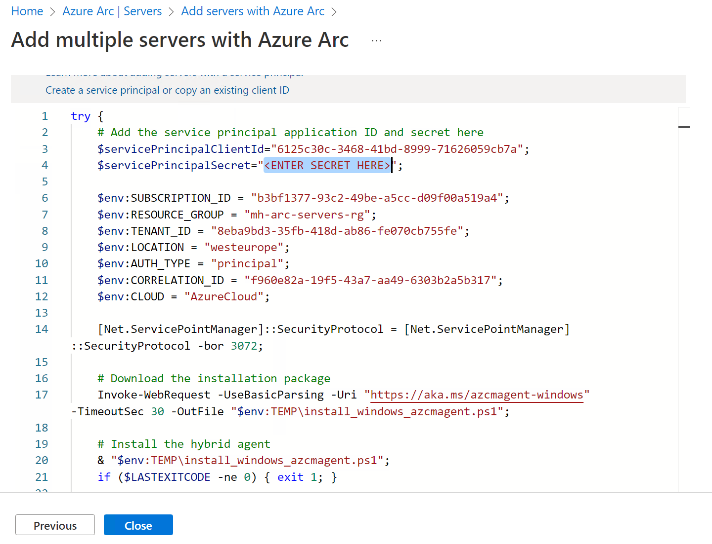

# Walkthrough Challenge 1 - Azure Arc prerequisites & onboarding

Duration: 20 minutes

 **[Home](../../Readme.md)** - [Next Challenge Solution](../challenge-2/solution.md)

## Prerequisites

Please ensure that you successfully verified the [General prerequisits](../../Readme.md#general-prerequisites) before continuing with this challenge.

### Task 1: Create Azure Resource Group

Sign in to the [Azure Portal](https://portal.azure.com/).

* [Create Resource Group](https://learn.microsoft.com/en-us/azure/azure-resource-manager/management/manage-resource-groups-portal#create-resource-groups)

### Task 2: Create Service Principal 

* [Create Service Principal](https://learn.microsoft.com/en-us/azure/azure-arc/servers/onboard-service-principal#create-a-service-principal-for-onboarding-at-scale)

### Task 3: Enable Service providers

* Enable Azure Resource Provider 
  [Azure Arc Azure resource providers](https://learn.microsoft.com/en-us/azure/azure-arc/servers/prerequisites#azure-resource-providers)

### Task 4: Prepare on-prem Server OS

* Have a server, windows or linux ready, perhaps on your own laptop/notebook 
* For windows, please use Windows Server 2019 or 2022 with the latest patch level. 💡 ATTENTION: Use Windows Update to apply the latest patch level!!

  [Supported operating systems @ Connected Machine agent prerequisites - Azure Arc | Microsoft Docs](https://docs.microsoft.com/en-us/azure/azure-arc/servers/prerequisites#supported-operating-systems)
	
  This Server OS could be hosted as a VM on VMware, Hyper-V, Nutanix, AWS, GCP or bare metal. We are focused on-prem. 
	
#### Additional:
  * These servers should be able to reach the internet and Azure.
  * You need to have full access and admin or root permissions on this Server OS.

* If you need to install and deploy your own server OS from scratch, then, download the following ISO files and save them on your own PC / Environment with your preferred Hypervisor e.g. Hyper-V or Virtualization Client (Windows 10/11 Hyper-V or Virtual Box).
  * [Ubuntu](https://ubuntu.com/download)
  * [Windows Server 2022](https://www.microsoft.com/en-us/evalcenter/download-windows-server-2022)

* Install from the downloaded ISO your preferred OS. 

#### Using Azure Arc with Azure VMs
* In case you want to use an Azure VM for this MicroHack, you need to follow the guidance 
  * [Evaluate Azure Arc-enabled servers on an Azure virtual machine](https://learn.microsoft.com/en-us/azure/azure-arc/servers/plan-evaluate-on-azure-virtual-machine)

With these prerequisites in place, we can focus on building the differentiated knowledge in the hybrid world with Azure Arc to enable your on-prem, Multi-Cloud environment for the Cloud operations model.

### Task 5: Onboard Server OS to Azure Arc

* Onboard the recent installed or prepared Server OS to Azure Arc, by using the documented steps
1. Generate the installation script from the Azure portal [Link](https://learn.microsoft.com/en-us/azure/azure-arc/servers/onboard-service-principal#generate-the-installation-script-from-the-azure-portal)
* Step by step

2. Add the passphrase for the service principal the downloaded script

3. Login into the Server OS on-prem and run the script [Link](https://learn.microsoft.com/en-us/azure/azure-arc/servers/onboard-portal#install-with-the-scripted-method)

4. Check in the Azure portal that the Server OS is visible.

You successfully completed challenge 2! 🚀🚀🚀