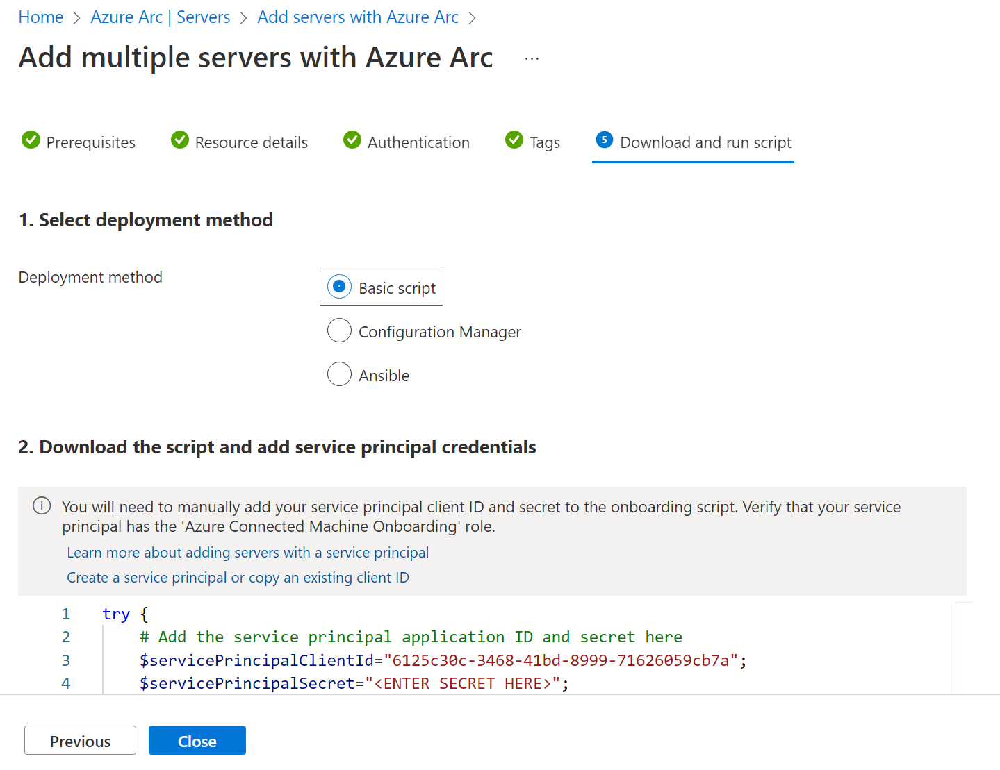
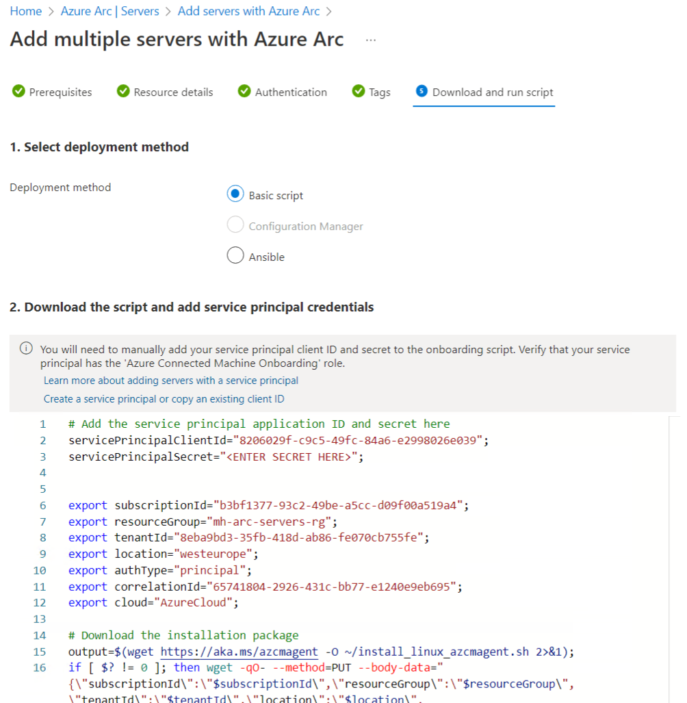
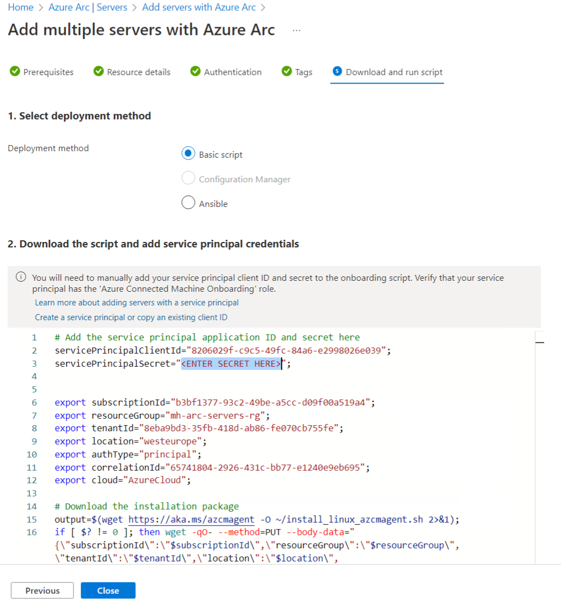
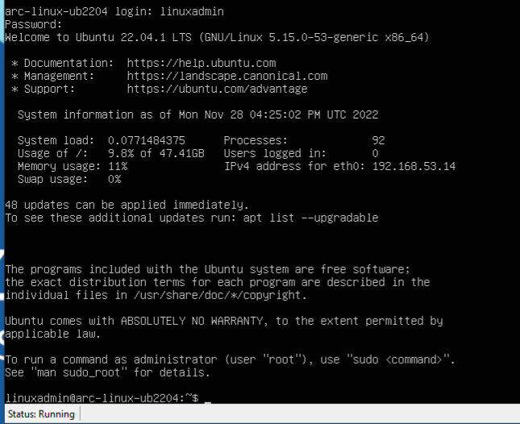
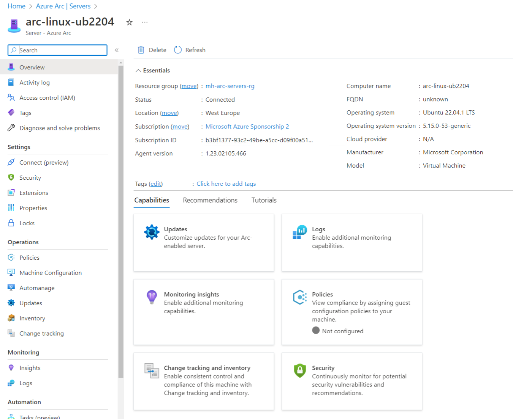

# Walkthrough Challenge 1 - Azure Arc prerequisites & onboarding

Duration: 20 minutes

 **[Home](../../Readme.md)** - [Next Challenge Solution](../challenge-2/solution.md)

## Prerequisites

Please ensure that you successfully verified the [General prerequisits](../../Readme.md#general-prerequisites) before continuing with this challenge.

### Task 1: Create Azure Resource Group

Sign in to the [Azure Portal](https://portal.azure.com/).

* [Create Resource Group](https://learn.microsoft.com/en-us/azure/azure-resource-manager/management/manage-resource-groups-portal#create-resource-groups)

*Please note: At the time of writing this solution, not all Azure Arc features are fully supported in all regions. We tested this solution in region Sweden Central.*

### Task 2: Create Service Principal

* [Create Service Principal](https://learn.microsoft.com/en-us/azure/azure-arc/servers/onboard-service-principal#create-a-service-principal-for-onboarding-at-scale)

### Task 3: Enable Service providers

* Enable Azure Resource Provider
  [Azure Arc Azure resource providers](https://learn.microsoft.com/en-us/azure/azure-arc/servers/prerequisites#azure-resource-providers)

### Task 4: Prepare on-prem Server OS

* Have a server, windows or linux ready, perhaps on your own laptop/notebook
* For windows, please use Windows Server 2025 with the latest patch level. 💡 ATTENTION: Use Windows Update to apply the latest patch level!!

  [Supported operating systems @ Connected Machine agent prerequisites - Azure Arc | Microsoft Docs](https://docs.microsoft.com/en-us/azure/azure-arc/servers/prerequisites#supported-operating-systems)

  This Server OS could be hosted as a VM on VMware, Hyper-V, Nutanix, AWS, GCP or bare metal. We are focused on-prem.

#### Additional:
  * These servers should be able to reach the internet and Azure.
  * You need to have full access and admin or root permissions on this Server OS.

* If you need to install and deploy your own server OS from scratch, then, download the following ISO files and save them on your own PC / Environment with your preferred Hypervisor e.g. Hyper-V or Virtualization Client (Windows 10/11 Hyper-V or Virtual Box).
  * [Ubuntu](https://ubuntu.com/download)
  * [Windows Server 2025](https://www.microsoft.com/en-us/evalcenter/evaluate-windows-server-2025)

* Install from the downloaded ISO your preferred OS.

#### Using Azure Arc with Azure VMs
* In case you want to use an Azure VM for this MicroHack, you need to follow the guidance
  * [Evaluate Azure Arc-enabled servers on an Azure virtual machine](https://learn.microsoft.com/en-us/azure/azure-arc/servers/plan-evaluate-on-azure-virtual-machine)

With these prerequisites in place, we can focus on building the differentiated knowledge in the hybrid world with Azure Arc to enable your on-prem, Multi-Cloud environment for the Cloud operations model.

### Task 5: Onboard Windows Server OS to Azure Arc

* Onboard the recent installed or prepared Windows Server OS to Azure Arc, by using the documented steps
1. Generate the installation script from the Azure portal [Link](https://learn.microsoft.com/en-us/azure/azure-arc/servers/onboard-service-principal#generate-the-installation-script-from-the-azure-portal)

*Please note: As not all Azure Arc features are implemented in Germany West Central region, we highly recommended to use West Europe region to onboard your VMs at the time of writing!*

* Step by step



2. Add the passphrase for the service principal the downloaded script

3. Login into the Server OS on-prem and run the script [Link](https://learn.microsoft.com/en-us/azure/azure-arc/servers/onboard-portal#install-with-the-scripted-method)

4. Check in the Azure portal that the Server OS is visible.

### Task 6: Onboard Linux Server OS to Azure Arc

* Onboard the recently installed or prepared Linux Server OS to Azure Arc, by using the documented steps or create a new VM based on the following steps
1. Create Hyper-V VM for Linux

* Step by step

1. Generate the installation script from the Azure portal [Link](https://learn.microsoft.com/en-us/azure/azure-arc/servers/onboard-service-principal#generate-the-installation-script-from-the-azure-portal)





2. Connect to Linux server via SSH [Link] (https://devblogs.microsoft.com/powershell/using-the-openssh-beta-in-windows-10-fall-creators-update-and-windows-server-1709/)

* Use the account and password from setup:



3. Open your favorite editor in Linux (i.e. sudo vim onboarding.sh) and paste the downloaded onboarding script for linux, replace the service principal secret according to your own service principal secret and save the script:
```shell
sudo vim onboarding.sh
sudo chmod +x ./onboarding.sh
```

4. run the script [Link](https://learn.microsoft.com/en-us/azure/azure-arc/servers/onboard-portal#install-with-the-scripted-method)
```shell
sudo ./onboarding.sh
```

5. Check in the Azure portal that the Server OS is visible.


You successfully completed challenge 1! 🚀🚀🚀