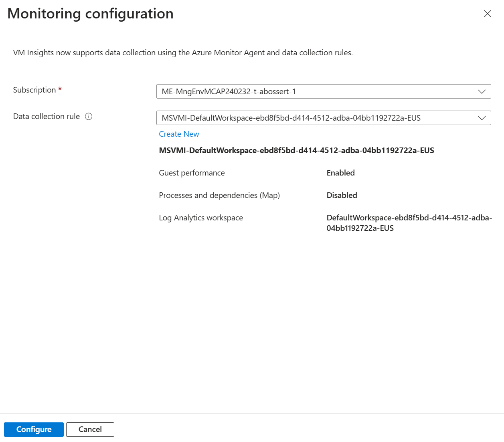

# Walkthrough Challenge 2 - Use Azure Monitor, Azure Update Management and Inventory for your Azure Arc enabled Servers

Duration: 30 minutes

[Previous Challenge Solution](../challenge-1/solution.md) - **[Home](../../Readme.md)** - [Next Challenge Solution](../challenge-3/solution.md)

## Prerequisites

Please ensure that you successfully passed [challenge 1](../../Readme.md#challenge-1) before continuing with this challenge.

### Task 1: Create all necessary Azure Resources (Log Analytics workspace)

1. Sign in to the [Azure Portal](https://portal.azure.com/).

2. Create a new Log Analytics Workspace called *mh-arc-servers-automation-law* with default settings in the your Resource Group.

***Please note**: For convenience, in this MicroHack create the Log Analytics workspace in the same resource group as you are using for your arc-enabled servers. Reason: The service pricinipal (used for remediation tasks) of the policy will be given the necessary RBAC roles on the scope where the policy is assigned. In this MicroHack we assume that every participant will assign the policy on resource group level. Hence, if the LAW is outside of that scope, you would need to assign the required permissions manually on the LAW.*

### Task 2: Configure Data Collection Rules in Log Analytics to collect Windows event logs and Linux syslog

1. Navigate to the Log Analytics Workspace and open *Agents* in the left navigation pane.

2. Select *Data Collection Rules* followed by a click on *Create* to create Data collection rules. 

3. Name the Data Collection Rule *mh-dcr* select your subscription, set your ressource group and change the Region to *West Europe*. Change Platform Type to *All* and click *Next: Resources* to continue.

4. Click on *Collect and deliver* as we going to set the scope of resources later on via Azure Policy. Click *Add data source*. For *Data source type* select *Windows Event Logs* and check the boxes of the log levels you would like to collect.

5. Click *Next: Destination* and *Add destination*. As *Destination type* select *Azure Monitor Logs* and in *Account or namespace* pick the Log Analytics workspace your created earlier. Click *Add data source*.

6. Repeat step 4 & 5 for Linux Syslog and accept the defaults.

7. Create the Data Collection Rule. 

### Task 3: Enable Azure Monitor Insights for Azure Arc enabled Servers through the Azure portal (incl. Azure Monitoring Agent)
Enabling Azure Monitor insights automatically sets up the Azure Monitoring Agent (AMA) on the selected machines. It is also possible to set up AMA with custom data collection rules. This gives you fine-grained control over what data is collected and avoids the default configurations that come with VM Insights. To enable Azure Monitor Insights for arc enabled servers, follow the steps below.

1. Navigate to Azure Monitor by typing *Monitor* in the top search bar

2. In the navigation side bar, under *Insights*, select the *Virtual machines* tab and click on "Configure Insights" or "Overiew".

3. In the "Not monitored" tab, adjust the filter type to "arc machines" and resource group to only show your resource group

4. For each machine, do the following:

5. In the tree view, click "enable" and then enable again int the pop up

6. Under data collection rule, click "Create New"

7. Create a new rule with an appropriate name, enable processes and dependencies and select your log analytics workspace you created earlier. Then click "Create"

8. to Verify the monitoring works, navigate to the Arc control pane and select your one of your enabled VMs. Navigate to the *Insights* tab to see the metrics for that virtual machine. 

### Task 4: Enable and configure Update Manager through the Azure portal
To enable periodic update checking with the Azure Update Manager through the Azure Portal, the following steps have to be completed:

1. Navigate to the Update manager by typing *Azure Update Manager* in the top search bar

2. Under the resource category, select the *Machines* tab in the side navigation bar. 

3. Filter by resource type and select "Arc-enabled servers" and your resource group

4. Select all servers with a checkbox and click on "Update settings". Click on confirm in the pop-up dialouge

5. In the wizard, select "enable" in the periodic assessment column for all servers and confirm by pressing "save".

To verify your new settings you can either check one or multiple servers. To select one machine:

1. Navigate to *Azure Arc* using the top search bar and select a machine. Within the overview panel, on the sidebar select *Updates*. If there are no update information dispayed yet, click *Check for updates* and wait until missing updates appear. Then click on *One-time update* or *Schedule updates* if you would like to postpone the installation to a later point in time. (follow the wizzard).

2. After applying the updates point-in-time or via scheduler you should see the updates being installed on the system.

Or to verify the new settings for all machines:

1. Navigate to the Update manager by typing *Azure Update Manager* in the top search bar

2. Check for pending Updates in the *Pending Updates* overview - if there are none, follow the steps below

3. Under the *Machines* tab, filter for and then select all arc-enabled machines

4. Click on *Check for updates*

5. The identified updates can be found after the operations completes in the navigation bar under *Pending updates*

### Task 5: Enable Change Tracking and Inventory through the Azure portal
To enable change tracking and inventory, we can use the azure portal. There are multiple ways to enable it and the following will describe two possible options. Firstly, it can be enabled for individual arc enabled machines:

1. Select an arc-enabled server in your resource group

2. In the side panel under *Operations*, select > *Inventory* and input the previously created log analytics workspace. You might need to first select the correct azure region to see a list of all log analytics workspaces in that region.

3. Click on *Enable* and wait for the option to complete

4. Repeat the same steps in the interface under *Operations* > *Change Tracking*. Important: If the previous operation from step three did not complete yet, you will recieve an error when you enable the extension. ("Wait, An extension of type AzureMonitorLinuxAgent is still processing. Only one instance of an extension may be in progress at a time for the same resource")

Change Tracking and inventory can also be enabled through the portal for for multiple machines at once:

1. Navigate to *Change Tracking and Inventory* using the top search bar and select *Arch enabled Machines* in the filter settings.

1. Use the checkboxes to select all machines you want to enable change tracking for and then click on *Enable Change Tracking & Inventory* in the row over the filter settings.

3. Confirm your selection in the dialogue box. In the next screen of the wizard, make sure to change all the log analytics workspaces to the one you created previously by selecting the right region and picking your LAW from the dropdown. Confirm by clickng on the enable button in the wizard. 

4. Wait for the deployment to finish and verify the machines showing up in the overview in side panel *Inventory*. In the panel *Change tracking*, you will not see any entries, until you start changing files on your previously added servers

### Task 6: Enable VM Insights

1. Navigate to your Virtual Machines, in section *Monitoring* select *Insights* in the left navigation pane.

2. In the *Insights* tab, click the *Enable* button.

3. In the *Monitoring Configuration* form, for *Data collection rule* click the *Create New* link

4. Fill in the *Create new rule* form
- Data collection rule name: Provide a name (MSVMI for VMInsights will be appended automatically) - i.e. *DCR-MicroHack*
- Enable process and dependencies (Map): Check the box
- Subscription: Keep the default
- Log Analytics workspace: Choose the workspace you created in task 1
- Click *Create* button. Then click *Configure* button.

5. For all other VMs you want to enable for VM Insights in that region, repeat step 1 and 2. Then, in the *Monitoring configuration* form, make sure your newly created data collection rule is selected and click configure.

6. Wait for the deployment of the data collection rule to finish. This might take several minutes.

### Coffee Break of 10 minutes to let the data flow between your Virtual Machines and Azure

After your coffee break you should see that the Virtual Machines are reporting their status. You can now check the Update Management for pending updates, verify what software is installed on the machines and get deep insights of the utilization of your Virtual Machines.

You successfully completed challenge 2! 🚀🚀🚀
