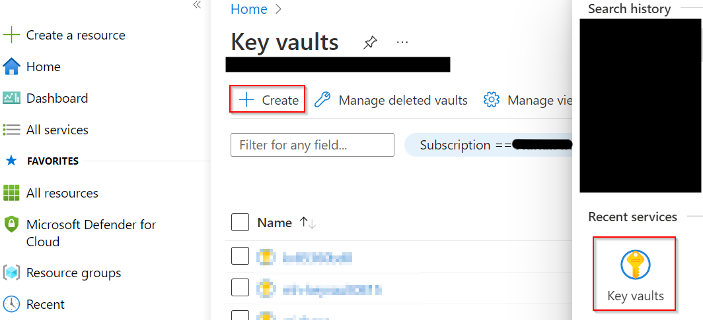
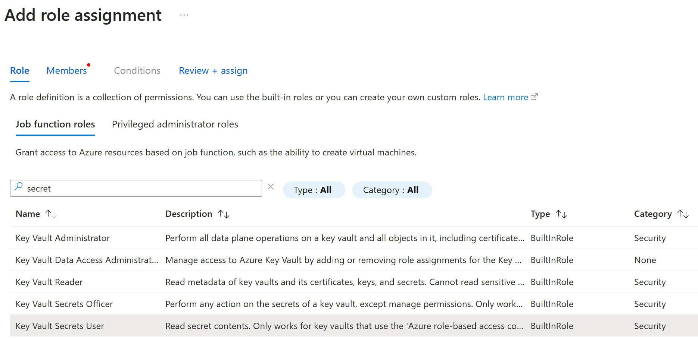

# Walkthrough Challenge 3 - Access Azure resources using Managed Identities from your on-premises servers

Duration: 30 minutes

[Previous Challenge Solution](../challenge-2/solution.md) - **[Home](../../Readme.md)** - [Next Challenge Solution](../challenge-4/solution.md)

## Prerequisites

Please ensure that you successfully passed [challenge 2](../../Readme.md#challenge-2) before continuing with this challenge.

### Task 1: Create an Azure Key Vault

1. Navigate to *Azure Key Vault* using the top search bar and select *Create* in the top navigation pane.



2. Create the Azure Key Vault in your resource group *mh-arc-servers-rg* with default settings and call it *mh-arc-servers-kv* with a random number at the end as the name needs to be unique across all Azure Key Vaults.


3. Please wait a few seconds until the creation of the Key Vault is complete.

### Task 2: Create a new secret in your Key Vault

1. After the creation navigate to the Azure Key Vault and assign the *Key Vault Secrets User* role to the managed identity of your Linux Azure Arc-enabled server.



2. Create a new secret called *kv-secret* and give it a value like *This-is-top-secret!!!*.


### Task 3: Call the secret without providing any credentials

1. Connect via SSH to the Virtual Machine *microhack-arc-servers-lin01*.

2. Elevate your privileges using the following command:

```
sudo -i
```

3. Install your favorite JSON parser. In this example we will use jq.

```
apt-get -y install jq
```

4. Request an access token for the Key Vault using the following command:

```shell
ChallengeTokenPath=$(curl -s -D - -H Metadata:true "http://127.0.0.1:40342/metadata/identity/oauth2/token?api-version=2019-11-01&resource=https%3A%2F%2Fmanagement.azure.com" | grep Www-Authenticate | cut -d "=" -f 2 | tr -d "[:cntrl:]")
ChallengeToken=$(cat $ChallengeTokenPath)
if [ $? -ne 0 ]; then
    echo "Could not retrieve challenge token, double check that this command is run with root privileges."
else
    AccessToken=$(curl -s -H Metadata:true -H "Authorization: Basic $ChallengeToken" "http://127.0.0.1:40342/metadata/identity/oauth2/token?api-version=2019-11-01&resource=https%3A%2F%2Fvault.azure.net")
fi
```

   > **Note**
   >  For Windows machines you can use the following command:

```powershell
        Function Get-AzureArcToken {
            [cmdletbinding()]
            param(
                [string]$ResourceURI
            )
            # Build up URL
            $SafeString = [System.Net.WebUtility]::URLEncode($ResourceURI)
            $URI = "http://localhost:40342/metadata/identity/oauth2/token?api-version=2019-11-01&resource={0}" -f $SafeString
            # Get Arc API Token
            try {
                Invoke-WebRequest -UseBasicParsing -Uri $uri -Headers @{ Metadata = "true" } -Verbose:0
            }
            catch {
                $script:response = $_.Exception.Response
            }

            # Extract the path to the challenge token
            $tokenpath = $script:response.Headers["WWW-Authenticate"].TrimStart("Basic realm=")

            # Read the token
            $token = Get-Content $tokenpath

            # Acquire and return Access Token
            Invoke-RestMethod -UseBasicParsing -Uri $uri -Headers @{ Metadata = "true"; Authorization = "Basic $token" }
        }
```


> **❗Hint:**
> The above request connects to the Azure Instance Metadata Service to retrieve an access token for the managed identity of your Azure Arc-enabled server. By default, the IMDS is accessible via 169.254.169.254 from Azure VMs. Azure Arc-enabled servers need to use 127.0.0.1 to proxy the request with the Azure Arc agent to Azure.`

4. Verify that you received an access token using the following command:

```shell
token=$(echo "$AccessToken" | jq -r '.access_token')
echo $token
```
You should see the access token in the output. In addition, the result is saved in the variable *token* for the next step.

5. Now, it's time to call the Azure Key Vault instance to retrieve the secret from the previous task.

```shell
curl 'https://mh-arc-servers-kv0815.vault.azure.net/secrets/kv-secret?api-version=2016-10-01' -H "Authorization: Bearer $token"
```

> **❗Hint:**
> Please make sure to call your instance of Key Vault and adjust the name in the above command accordingly.


   > **Note**
   >  For Windows machines you can use the following command:

```powershell
        # Get an Azure KeyVault Access Token with new Function
        $AccessToken = Get-AzureArcToken -ResourceURI 'https://vault.azure.net'
        # Setup Query Attributes
        $Query = @{
            # URI of the specific secret we want
            Uri     = "https://mh-arc-servers-kv2212.vault.azure.net/secrets/test?api-version=7.1"
            Method  = "Get"
            Headers = @{
                Authorization = "Bearer $($AccessToken.access_token)"
            }
        }

        # Retrieve Secrets
        Invoke-RestMethod @Query | Select-Object -ExpandProperty Value | fl *
```

Congratulations! You retrieved the secret from your Key Vault without providing any credentials. The resulting possibilities are limitless. You can use it for managing certificates or any secret that is necessary to run your on-premises application.

You successfully completed challenge 3! 🚀🚀🚀
