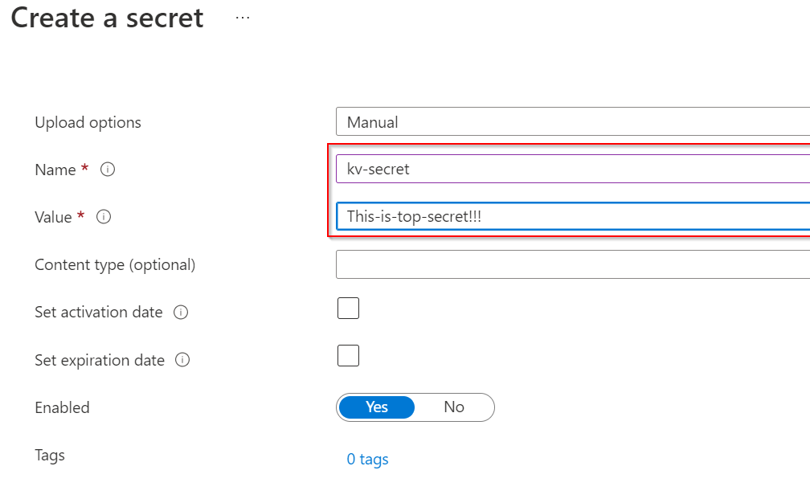

# Walkthrough Challenge 3 - Access Azure resources using Managed Identities from your on-premises servers

Duration: 30 minutes

[Previous Challenge Solution](../challenge-2/solution.md) - **[Home](../../Readme.md)** - [Next Challenge Solution](../challenge-4/solution.md)

## Prerequisites

Please ensure that you successfully passed [challenge 2](../../Readme.md#challenge-2) before continuing with this challenge.

### Task 1: Create an Azure Key Vault

1. Navigate to *Azure Key Vault* using the top search bar and select *Create* in the top navigation pane.


2. Create the Azure Key Vault in your resource group with default settings and call it *mh-arc-servers-kv* with a random number at the end as the name needs to be unique across all Azure Key Vaults.


3. Please wait a few seconds until the creation of the Key Vault is complete. 

### Task 2: Create a new secret in your Key Vault

1. After the creation navigate to the Azure Key Vault, select *Access control (IAM)* on the left control pane and assign your own user the *Key Vault Secrets Officer* role. This is necesarry to create secrets in the next step.

2. Now assign the role *Key Vault Secrets User* to the managed identity of your Linux Azure Arc-enabled server.


3. Create a new secret called *kv-secret* and give it a value like *This-is-top-secret!!!*. You might need to wait several minutes for role assignments from Step 1. to become effective




### Task 3: Call the secret without providing any credentials

1. Connect via SSH to the virtual Machine running linux

2. Elevate your privileges using the following command:

```
sudo -i
```

3. Install your favorite JSON parser. In this example we will use jq.

```
apt-get -y install jq
```

4. Request an access token for the Key Vault. With the access token, you can call the Azure Key Vault instance to retrieve the secret from the previous task. The below script can be used 
```shell
#!/bin/sh

VAULT_NAME="REPLACE-ME"
SECRET_NAME="REPLACE-ME"

CHALLENGE_TOKEN_PATH=$(curl -s -D - -H Metadata:true "http://127.0.0.1:40342/metadata/identity/oauth2/token?api-version=2021-02-01&resource=https://vault.azure.net" \
  | grep -i "Www-Authenticate" \
  | cut -d "=" -f 2 \
  | tr -d '[:cntrl:]')

CHALLENGE_TOKEN=$(cat "$CHALLENGE_TOKEN_PATH")
if [ -z "$CHALLENGE_TOKEN" ]; then
  echo "Could not retrieve challenge token. Are you running as root?"
  exit 1
fi

ACCESS_TOKEN_RESPONSE=$(curl -s -H Metadata:true -H "Authorization: Basic $CHALLENGE_TOKEN" \
  "http://127.0.0.1:40342/metadata/identity/oauth2/token?api-version=2021-02-01&resource=https://vault.azure.net")

ACCESS_TOKEN=$(echo "$ACCESS_TOKEN_RESPONSE" | jq -r '.access_token')

if [ -z "$ACCESS_TOKEN" ] || [ "$ACCESS_TOKEN" = "null" ]; then
  echo "Failed to retrieve access token:"
  echo "$ACCESS_TOKEN_RESPONSE"
  exit 1
else
  echo "Access token retrieved successfully."
  echo "$ACCESS_TOKEN"
  echo
fi

curl -s -H "Authorization: Bearer $ACCESS_TOKEN" \
  "https://${VAULT_NAME}.vault.azure.net/secrets/${SECRET_NAME}?api-version=7.3"
```

> **❗Hint:**  
> The above request connects to the Azure Instance Metadata Service to retrieve an access token for the managed identity of your Azure Arc-enabled server. By default, the IMDS is accessible via 169.254.169.254 from Azure VMs. Azure Arc-enabled servers need to use 127.0.0.1 to proxy the request with the Azure Arc agent to Azure.`


Congratulations! You retrieved the secret from your Key Vault without providing any credentials. The resulting possibilities are limitless. You can use it for managing certificates or any secret that is necessary to run your on-premises application. 

You successfully completed challenge 3! 🚀🚀🚀
