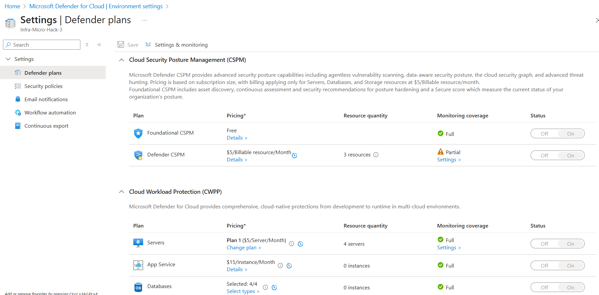
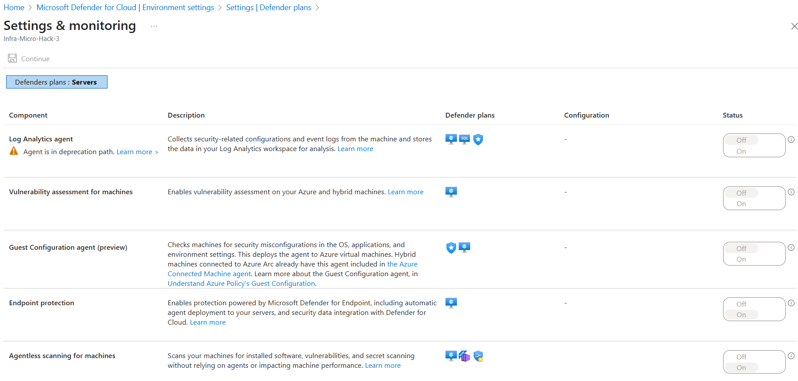
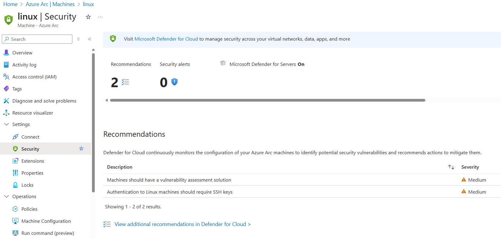

# Walkthrough Challenge 4 - Microsoft Defender for Cloud integration with Azure Arc

Duration: 30 minutes

[Previous Challenge Solution](../challenge-3/solution.md) - **[Home](../../Readme.md)** - [Next Challenge Solution](../challenge-5/solution.md)

## Prerequisites

Please ensure that you successfully passed [challenge 3](../../Readme.md#challenge-3) before continuing with this challenge.

### Task 1: Verify Defender for Cloud settings

* In the Defender for Cloud environment settings, click on the subscription your resource group resides in

* Verify that Plan 1 or 2 is enabled for Servers

* Go to Settings under the Monitoring coverage column for Servers and verify that the following is enabled:
  - Vulnerability assessment for machines
  - Endpoint protection
  - Agentless scanning for machines

In the Defender for Cloud environment settings, explore the E-mail notifications and Workflow automation settings for configuring notifications. Discuss with your proctor or side-person what Workflow automations could be configured.

- Navigate to the win2025 Arc-enabled Server and go to the Security blade to confirm that Microsoft Defender for Servers is On

- Perform the same steps for the linux Arc-enabled Server

Congratulations! You verified that you have secured any server which is outside of Azure and onboarded via Azure Arc.

You successfully completed challenge 4! 🚀🚀🚀

