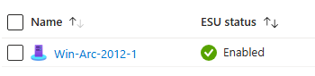
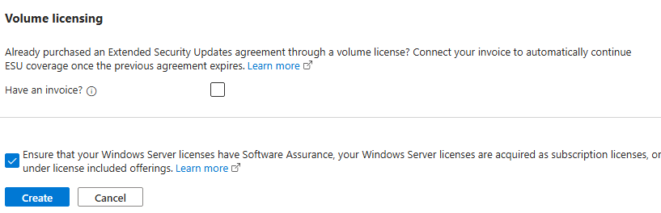
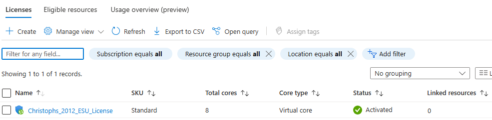
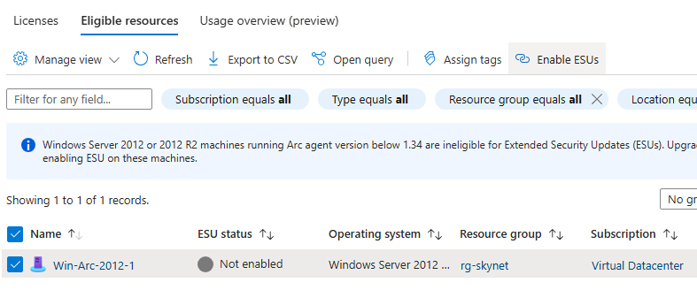
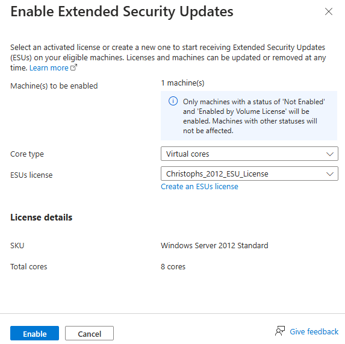

# Walkthrough Challenge 5 - Best Practices Assessment for Windows Server

Duration: 20 minutes

[Previous Challenge Solution](../challenge-4/solution.md) - **[Home](../../Readme.md)**

## Prerequisites

Please ensure that you successfully passed [challenge 2](../../Readme.md#challenge-3) before continuing with this challenge, as we need a Log Analytics Workspace for this feature.

## Task 1: Set up the Best Practices Assessment for a Windows server

1. Browse to the Azure Arc [Machines overview](https://portal.azure.com/#view/Microsoft_Azure_ArcCenterUX/ArcCenterMenuBlade/~/servers)
2. Click on one of your Windows Server 2025 machine
3. In the left pane, select "Windows Management" and then "Best Practices Assessment (preview)"
4. Click "Attest to your license type" in the blue overlay

4. If not already done, check the "Activate Azure benefits" box and click "Confirm" to enable the Azure Benefits for this machine. This may take up to 10 minutes. Go back to the page of step 3.

4. Click the "Get Started" button. A blade will open on the right.

5. Select your resource group and previously created Log Analytics Workspace
6. Let the validation check and confirm via "Set up"

7. Wait for the deployment to go through. This may take up to 15 minutes. Feel free to continue with another challenge in the meantime.

###

## Task 2: Start the assessment

1. Click "Go to resource" after the deployment has finished to move back to the Windows Server we're working on
2. In the left pane, select "Windows Management" and then "Best Practices Assessment (preview)"

3. Click the "Run assessment" at the top of the page (you might get a message it's already processing)
4. Running the assessment for the first time takes upward to 4 hours for the assessment to run and provide results. Please continue with the next challenge and feel free to come back later.

###

**Congratulations**! You successfully completed this challenge! 🚀🚀🚀
###

## Optional Steps:

1. You can take a look at the installed extensions that were deployed when setting up the BPA by navigating to your server and clicking "Settings" -> "Extensions" in the left navigation blade:
    - AzureMonitorWindowsAgent
    - assessmentplatform
    - windowsserverassessment
    
2. Please come back later to review the output of the assessment once it has finished.