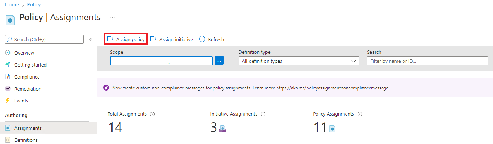
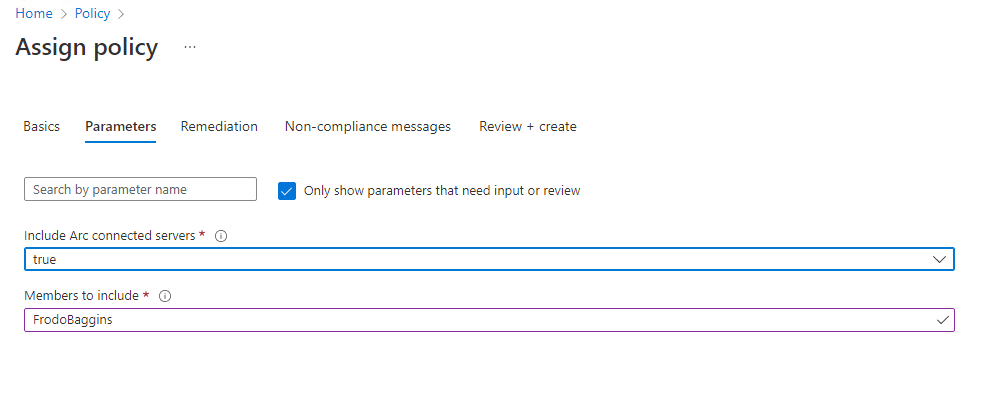
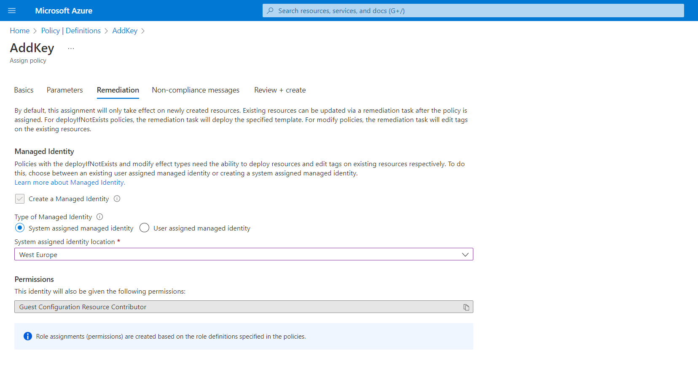

# Walkthrough Challenge 5 - Azure Automanage Machine Configuration

Duration: 30 minutes

[Previous Challenge Solution](../challenge-4/solution.md) - **[Home](../../Readme.md)**

## Action 1: Create an Azure Policy Guest Configuration for your Azure Arc VMs

### Setup a Policy that checks if the user "FrodoBaggins" is part of the local administrators group


1. Please navigate to Azure Policy.

2. Navigate to *Assignments* in the left navigation pane and select *Assign policy* in the top menu.



3. In this section you can now configure the assignment with the following settings and create the assignment:

- Scope: Please select the resource group called *mh-arc-servers-rg*
- Policy Definition: Please search for *administrators group* and select *Audit Windows machines missing any of the specified members in the Administrators group*.
- Parameters: Please ensure to set *Include Arc connected servers* to *true and *Members to include* to *FrodoBaggins*.




> **Note**  
> This example does not include remediation. If you want to learn more on how to use guest configuration to remediate the state of your servers please refer to [Remediation options for guest configuration](https://docs.microsoft.com/en-us/azure/governance/policy/concepts/guest-configuration-policy-effects). 
  
    
4. On Non-Compliance Message you can create a custom message that may contain additional information like link to internal documentation or just an explaination why this policy is set.


5. Review the policy assignment and select *Create*.


6. After a few minutes you will be able to see the compliance state of your Windows-based servers.

## Action 2: Create an Machine Configuration

### Setup a Machine Configuration that creates a registry key 

Find the needed DSC Configuration in the following powershell code block


```powershell
Configuration AddKey {
    Import-DscResource -ModuleName 'PSDscResources'

    Node localhost {
        Registry EnvironmentDSCKey {
            Key       = 'HKLM:\SYSTEM\CurrentControlSet\Control\Session Manager\Environment\EnvironmentKeyDSC'
            Ensure    = 'Present'
            ValueName = ''
        }
    }
}

AddKey
```

#### Optional Steps:  

1. Set up your Authoring Environment for DSC
2. Create DSC Config and Corresponding MOF File
3. Create the zip file for the Machine Configuration

As this MicroHack focuses on the Arc and Hybrid those Steps are optional and you can also use the prepared zip file from the repository.  
Find it here [AddKey.zip](https://github.com/microsoft/MicroHack/raw/main/03-Azure/01-03-Infrastructure/02_Hybrid_Azure_Arc_Servers/resources/AddKey.zip)

### Create the Machine Configuration as Azure Policy

1. You will need to upload the zip file to a Storage Account and create a SAS with read permissions. Hint: You will need at least the *Storage Blob Data Contributor* role to be able to upload the file. 

```powershell
$blob = az storage blob upload --auth-mode login --account-name [StorageAccountName] --container-name [ContainerName] --file [File] --name [Name] --overwrite

$sas = az storage blob generate-sas --account-name [StorageAccountName] --container-name [ContainerName] --name [File] --permissions r --expiry [ExpirationDate format: 2023-01-01T00:00:00Z] --https-only --full-uri
```

2. To assign the Machine Configuration we will use a Azure Policy. To create the Policy refer to the following Powershell Block. The Policy is created at the Tenant Root so that we can assign it to all subscriptions.
```powershell
#Define Policy Parameters
$id = (New-Guid).guid
$name = "AddKey Policy"
$version = "1.0.0"
$url = $sas #SAS of the Blob in the Storage Account
$PolicyConfig      = @{
    PolicyId      = $id
    ContentUri    = $url
    DisplayName   = $name
    Description   = $name
    Path          = 'PathToGenerateThePolicyTo'
    Platform      = 'Windows'
    PolicyVersion = $version
    Mode          = 'ApplyAndAutoCorrect'
}

# Create the policy definition file
New-GuestConfigurationPolicy @PolicyConfig

# Create new policy from definition file
New-AzPolicyDefinition -Name [Name] -Policy [PathToGenerateThePolicyJSONFile] -ManagementGroupName [TenantID] #Tenant ID is the ID of the Root Management Group
```
3. Now that the policy definition is created you can assign the policy like in Action 1 but add a remediation like in the screenshot below.



4. It takes some minutes for the Machine Configuration to become compliant. If thats the case you can verify the registry key being created by launching ``` regedit.exe ``` and browse to ``` HKLM:\SYSTEM\CurrentControlSet\Control\Session Manager\Environment\ ```