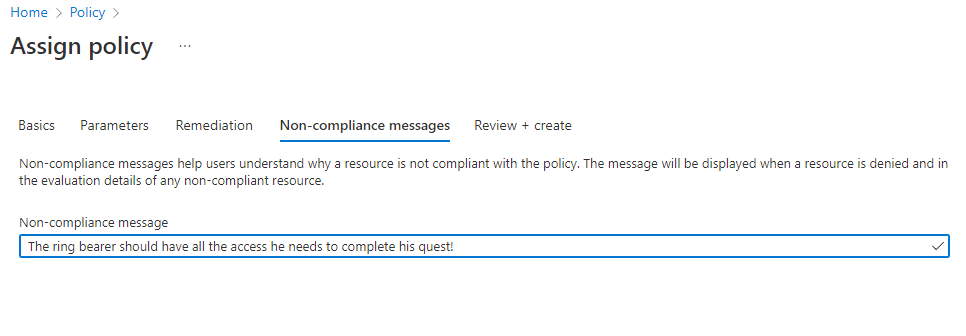

## Action 1: Create an Azure Policy Guest Configuration for your Azure Arc VMs

### Setup a Policy that checks if the user "FrodoBaggins" is part of the local administrators group

1. Please navigate to Azure Policy.

2. Navigate to *Assignments* in the left navigation pane and select *Assign policy* in the top menu.

3. In this section you can now configure the assignment with the following settings and create the assignment:

- Scope: Please select the resource group called *AzStackHCI-MicroHack-Azure*
- Policy Definition: Please search for *administrators group* and select *Audit Windows machines missing any of the specified members in the Administrators group*.
- Parameters: Please ensure to set *Include Arc connected servers* to *true and *Members to include* to *FrodoBaggins*.

> **Note**  
> This example does not include remediation. If you want to learn more on how to use guest configuration to remediate the state of your servers please refer to [Remediation options for guest configuration](https://docs.microsoft.com/en-us/azure/governance/policy/concepts/guest-configuration-policy-effects). 
  
    
4. On Non-Compliance Message you can create a custom message that may contain additional information like link to internal documentation or just an explaination why this policy is set.

5. Review the policy assignment and select *Create*.

6. After a few minutes you will be able to see the compliance state of your Windows-based servers.

## Action 2: Create an Azure Policy Guest Configuration for your Azure Arc VMs

### Setup a Custom Configuration that created a file in "C:\temp" Folder.

#### Optional Steps:  

1. Set up your Authoring Environment for DSC
2. Create DSC Config and Corresponding MOF File

### Create the Machine Configuration from the Portal

1. Take the attached zip file to be used as your package. If you want to learn how to create those package plase refer to the Learning Resources
2. Upload the Package to a Storage Account in your environment
3. Make sure the machine we want to apply the machine config to can connect to the storage account
4. Create a SAS for package file
5. From the Arc Server in the Portal select "Machine Configuration" and select "Create" in the top.  
**TODO** Screenshot portal
6. Fill in the required information and create the resource

After the resource is being create check you Client Operating System for the desired change.