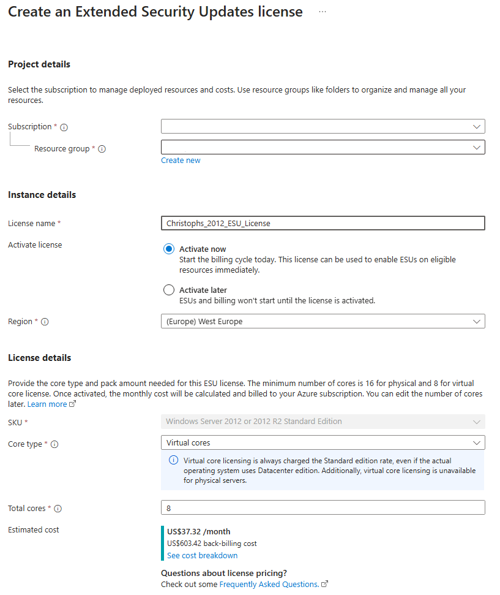
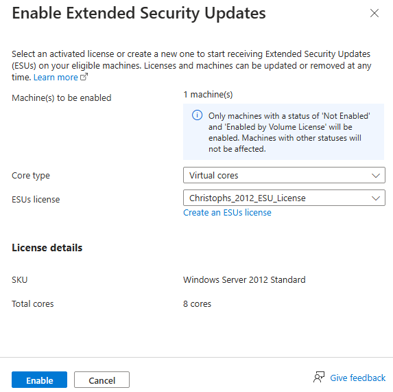

# Walkthrough Challenge 6 - Activate ESU for Windows Server 2012 R2

Duration: 15 minutes

[Previous Challenge Solution](../challenge-5/solution.md) - **[Home](../../Readme.md)**

## Task 1: Create a Windows Server ESU license

1. Navigate to the Azure Arc center and click "Licenses" and "Windows Server ESU licenses" (or click [here](https://portal.azure.com/#view/Microsoft_Azure_ArcCenterUX/ArcCenterMenuBlade/~/license))
2. Click "Create" on the top bar. A new blade will open.
3. Fill in the required field:
    - Subscription and Resource group (where you created your previous objects)
    - A license name - should only contain letters (both uppercase and lowercase), digits, hyphens, underscores, and periods. Consecutive dots are not allowed.
    - Select "Activate now" (you could create one with "Activate later" but cannot attach it to a server then)
    - Keep "West Europe" as the selected region
    - Select virtual cores with 8 total
    - De-select the "Have an invoice?" checkbox at the bottom
    - Make sure the Software Assurance box is checked, and then click "Create"
    
    
    - Wait a couple of moments and click "Refresh" in the license overview. Your new item will apprear:
    
### 

## Task 2: Attach the ESU license to the server: 

1. Navigate to the Azure Arc center and click "Licenses" and "Windows Server ESU licenses" (or click [here](https://portal.azure.com/#view/Microsoft_Azure_ArcCenterUX/ArcCenterMenuBlade/~/license))
2. Click "Eligible resources" on the top to get a list of Arc enabled server that are eligible to use an ESU license
3. Select your Windows 2012 server and click "Enable ESUs"

4. Select "Virtual Cores" which will then allow you to select your previously created license

5. Click "Enable" to attach the license to the server
6. The overview, once refreshed, will now report the server es ESU enabled

    

###
**Congratulations!** You successfully completed the challenge! 🚀🚀🚀

### Optional Steps:  
1. Check for Windows Updates and observe that new security rollups are being downloaded and installed