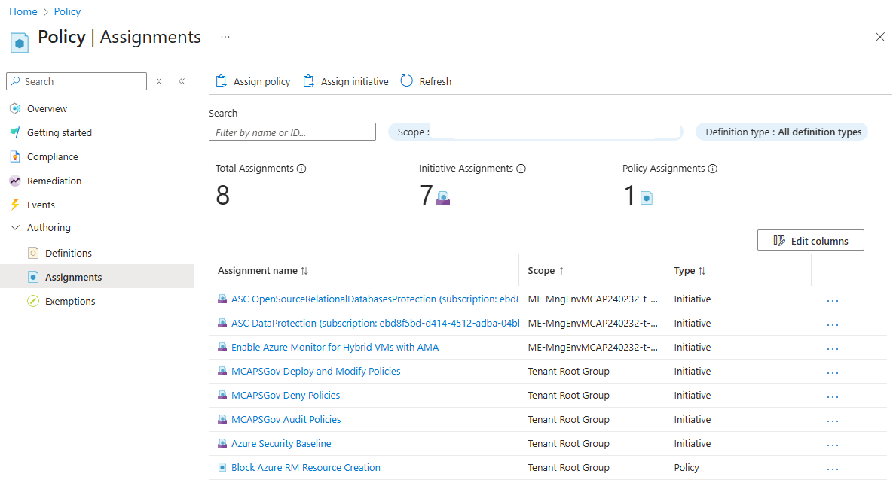
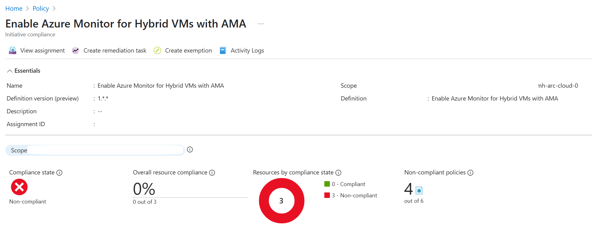
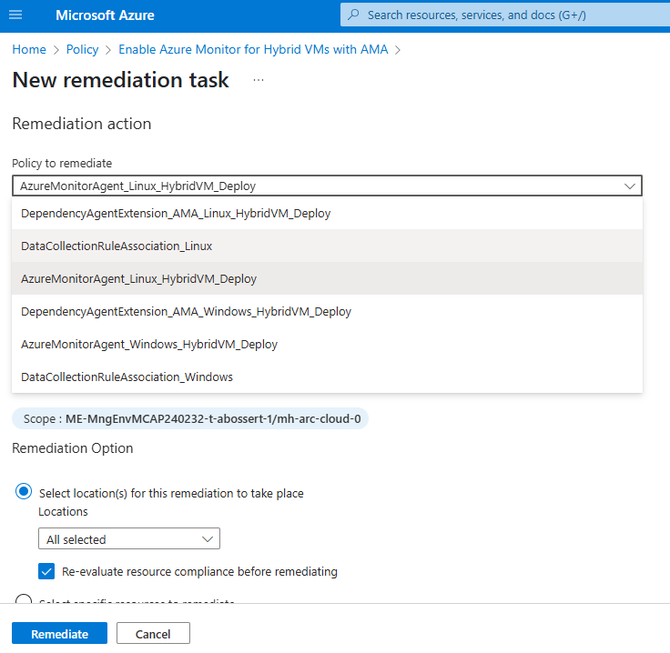
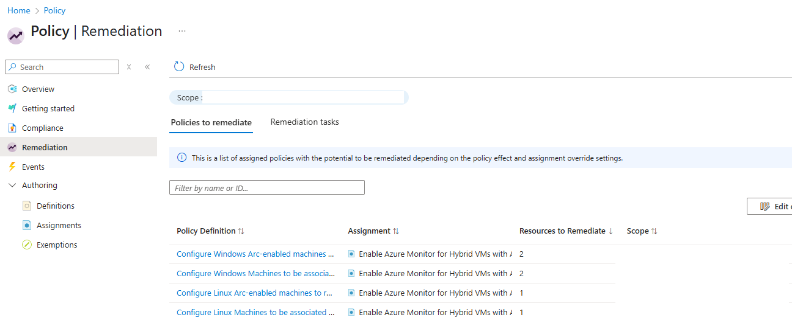

# Walkthrough Challenge 7 - Azure Automanage Machine Configuration

Duration: 30 minutes

### Task 1: Disable Azure Monitor Insights and Azure Monitor Agent for arc enabled servers through the Azure portal

1. Navigate to Azure Monitor by using the top search bar and typing *Monitor*

2. In the left navigation plane, open the *Insights* menu and select *Virtual Machines*

3. In the center navigation plane under *Overview*, choose *Monitored* to find the Azure monitor enabled Arc VMs.

4. For each VM, click on *Enabled* in the Monitor Coverage Column. In the context menu, select edit and on the next screen, disable VM insights.

5. To now remove the AMA, open the arc machine in your resource group and navigate to *Settings > Extensions* in the left control plane.

6. Select the appropriate Monitoring agent (in the picture for Linux) and click on uninstall

7. Verify the uninstalling of the monitoring extension by navigating to the Azure Arc control plane by entering *Azure Arc* in the top search bar. From here, select *Azure Arc resources* in the left control plane and check the colum *Monitoring extension* for your servers.

### Task 2: Re-Enable Azure Monitor Agent for Azure Arc enabled Servers with Azure Policy initiatives

1. Navigate to *Policy* using the top search bar and select *Assignments* in the left navigation pane.

2. Select *Assignments* in the left navigation pane and go to *Assign initiative*

3. In this section you can now configure the assignment with the following settings and create the assignment:

- Scope: Please select your resource group
- Basics: Please search for *Enable Azure Monitor for Hybrid VMs with AMA* and select the initiative.
- Parameters: Please insert the Resource ID of the Data Collection Rule from Task 2. 
- Remediation: Please select the System assigned identity location according to your resources, e.g. West Europe. Don't check the box for "Create a remediation task" here, as it would only create a remediation task for the first policy within the policy initiative. We will do this in one of the next steps for all policies.
- Click *Review + create* and then *Create*

4. Please wait around 30 seconds until the creation of the assignment is complete. You should see that the initiative is assigned. Every new Azure Arc server will now automatically install the AMA and Dependency agents as well the necessary association with the data collection rule we created in task 2. Be aware that agent installation can take up to 60 Minutes.

5. Important: All three machines were already onboarded earlier. As a result, you need to create a remediation task for each policy in the initiative to apply the policy to your existing Azure Arc Servers. Please select the Initivative Assignment and select *Create Remediation Task*.

6. Accept the default values, check *Re-evaluate resource compliance before remediating* and repeat the remediation for the following policies:
 - AzureMonitorAgent_Windows_HybridVM_Deploy
 - AzureMonitorAgent_Linux_HybridVM_Deploy
 - DependencyAgentExtension_AMA_Windows_HybridVM_Deploy
 - DependencyAgentExtension_AMA_Linux_HybridVM_Deploy
 - DataCollectionRuleAssociation_Windows
 - DataCollectionRuleAssociation_Linux

7. In Policy > Remediation > Remediation Task, verify that all remediation completed successfully:

8. After Policy remidiation, you should be able to confirm that the monitoring extension is enabled again by navigating to the Azure Arc control plane by entering *Azure Arc* in the top search bar. From here, select *Azure Arc resources* in the left control plane and check the colum *Monitoring extension* for your servers.
