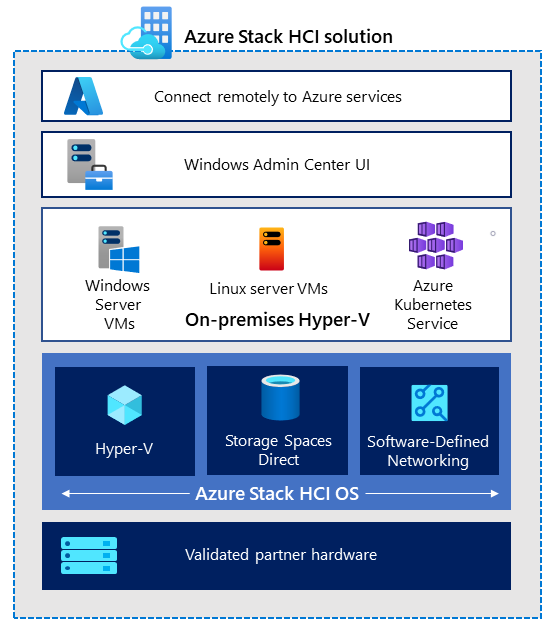
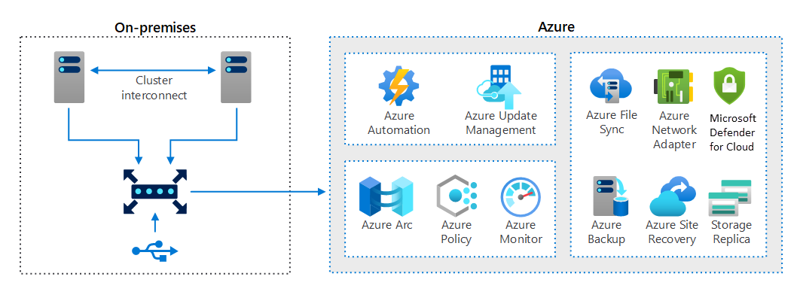

# **MicroHack Azure Stack HCI - Part I**

[toc]

# MicroHack introduction and context

This MicroHack scenario walks through the use of Azure Stack HCI with a focus on the best practices and the design principles and some interesting challenges for real world scenarios. Specifically, this builds up to include working with an existing infrastructure in your datacenter. 

This lab is not a full explanation of Azure Stack HCI as a technology, please consider the following articles required pre-reading to build foundational knowledge.

- [What is Azure Stack HCI?](https://docs.microsoft.com/en-us/azure-stack/hci/overview)
- [Watch a video to see an high level overview of the features from Azure Stack HCI](https://youtu.be/fw8RVqo9dcs)
- [eBook: Five Hybrid Cloud Use Cases for Azure Stack HCI](https://aka.ms/technicalusecaseswp)
- [What´s new for Azure Stack HCI at Microsoft Ignite 2021](https://techcommunity.microsoft.com/t5/azure-stack-blog/what-s-new-for-azure-stack-hci-at-microsoft-ignite-2021/ba-p/2897222)
- [Azure Stack HCI Solutions](https://hcicatalog.azurewebsites.net/#/)
- [Plan your solution with the sizer tool](https://hcicatalog.azurewebsites.net/#/sizer)
- [Azure Stack HCI FAQ](https://docs.microsoft.com/en-us/azure-stack/hci/faq)

💡 Optional: Read this after completing this lab to take your learning even deeper!

# Objectives

After completing this MicroHack you will:

- Know how to build or use Azure Stack HCI
- Understand use cases and possible scenarios in your hybrid world to modernize your infrastructure estate. 
- Get insights into real world challenges and scenarios

# Prerequisites

For this MicroHack we have a few prerequisites they are very important to be successful in this MicroHack. Normally, for the use of Azure Stack HCI, validated hardware is required from selected partners and such hardware can of course be used for the MicroHack. The alternative is the Azure Stack HCI Evaluation Lab, which allows to convert Azure Stack HCI to Hyper-V with Nested Virtualization.

In order to use the MicroHack time most effectively, the following tasks should be completed prior to starting the session.

- If you do not have own hardware then you need to go through the [Azure Stack HCI Evaluation Lab](https://github.com/Azure/AzureStackHCI-EvalGuide?msclkid=44e04d5fb4e811eca429547b3ced494b) 

- Download ISO FIles on Azure Stack HCI to location for example Cluster Shared Volumes: 
  - [Ubuntu](https://ubuntu.com/download)
  - [Windows Server 2022](https://software-static.download.prss.microsoft.com/sg/download/888969d5-f34g-4e03-ac9d-1f9786c66749/SERVER_EVAL_x64FRE_en-us.iso)

With these pre-requisites in place, we can focus on building the differentiated knowledge in the hybrid world on Azure Stack HCI to modernize your hybrid estate. 

# Lab environment for this MicroHack

Explain the lab ..

## Architecture

Description

Naming standards / taxonomie: 
- https://docs.microsoft.com/en-us/azure/cloud-adoption-framework/ready/azure-best-practices/resource-naming

MicroHack Series - Hybrid Stack HCI / Arc

# MicroHack Challenges 

Before you dive into the challenges please make sure that the pre-requisites are fulfilled otherwise move on with the challenges. [Jump directly to prerequisites to verify](#prerequisites)

# Challenge 1 - Create your first virtual machines on Azure Stack HCI

## Goal 

The goal of this exercise is to deploy the first virtual machines on your Azure Stack HCI cluster. We will use these virtual machines in the upcoming challenges for different purposes. 

## Actions

* Create three virtual machines running on your Azure Stack HCI cluster via Windows Admin Center
  * Basic VM configuration: 2 vCPU, 8 GB RAM, 1 disk with 128 GB storage
  * win-app, win-file based on Windows Server 2022 
  * lin-app based on Ubuntu 22.04 LTS (or your prefered Linux distro)
* Join the Windows-based Virtual Machines to Active Directory

## Success criteria

* You have two Windows-based Virtual Machines running on your Azure Stack HCI cluster
* You have one Linux-based Virtual Machine running on your Azure Stack HCI cluster
* The Windows-based Virtual Machines are domain-joined and successfully activated
* You can access the Virtual Machines via RDP/SSH

## Learning resources

* [Get started with Azure Stack HCI and Windows Admin Center](https://docs.microsoft.com/en-us/azure-stack/hci/get-started)
* [Manage VMs with Windows Admin Center](https://docs.microsoft.com/en-us/azure-stack/hci/manage/vm)
* [License Windows Server VMs on Azure Stack HCI](https://docs.microsoft.com/en-us/azure-stack/hci/manage/vm-activate)

### Solution - Spoilerwarning
[Solution Steps](./Walkthrough/challenge1/solution.md)

# Challenge 2 - Management / control plane fundamentals at the beginning

## Goal

At the beginning it is always a good approach setting up the stage, onboard the necessary infrastructure and management components to have the right focus and support for the next challenges. In this section the focus will be on onboarding the servers we have created in the first challenge and integrate them in the necessary control plane & management tools. 

## Actions

* Create all necessary Azure Resources
  * Azure Resource group (Name: AzStackHCI-MicroHack-Azure)
  * Azure Automation Account (Name: mh-automation)
  * Log Analytics Workspace (Name: mh-la)
* Configure Log Analytics to collect Windows event logs and Linux syslog
* Deploy Azure Policy initiative for automatic onboarding of Azure Arc enabled Servers
* Configure Azure Arc environment

## Success criteria

* You have one Azure resource group containing the Azure Automation Account and Log Analytics Workspace
* You successfully linked the necessary Azure Policy initiative to the Azure resource group
* You have the onboarding scripts for both Windows and Linux servers

## Learning resources

* [Manage Azure resource groups by using the Azure portal](https://docs.microsoft.com/en-us/azure/azure-resource-manager/management/manage-resource-groups-portal)
* [Create an Automation account using the Azure portal](https://docs.microsoft.com/en-us/azure/automation/quickstarts/create-account-portal)
* [Create a Log Analytics workspace in the Azure portal](https://docs.microsoft.com/en-us/azure/azure-monitor/logs/quick-create-workspace)
* [Collect Windows event log data sources with Log Analytics agent](https://docs.microsoft.com/en-us/azure/azure-monitor/agents/data-sources-windows-events#configuring-windows-event-logs)
* [Collect Syslog data sources with Log Analytics agent](https://docs.microsoft.com/en-us/azure/azure-monitor/agents/data-sources-syslog#configure-syslog-in-the-azure-portal)
* [Understand deployment options for the Log Analytics agent on Azure Arc-enabled servers](https://docs.microsoft.com/en-us/azure/azure-arc/servers/concept-log-analytics-extension-deployment)
* [Azure Policy built-in definitions for Azure Arc-enabled servers](https://docs.microsoft.com/en-us/azure/azure-arc/servers/policy-reference)

### Solution - Spoilerwarning
[Solution Steps](./Walkthrough/challenge2/solution.md)

# Challenge 3 - Onboard your servers to Azure Arc

## Goal

In challenge 3 you will successfully onboard your servers to Azure Arc and leverage Azure native services like Update Management, Inventory and VM Insights for your Azure Stack HCI Virtual Machines.

## Actions

* Onboard your three Virtual Machines to Azure Arc using the onboarding scripts
* Enable and configure Update Management
* Enable Inventory 
* Enable VM Insights
* Setup a Policy that checks if the user "FrodoBaggins" is part of the local administrators group

## Success Criteria

* All Virtual Machines are connected to Azure Arc and visible in the Azure Portal
* All Virtual Machines have the latest Windows and Linux updates installed
* You can browse through the software inventory of your Virtual Machines
* You can use VM Insights to get a detailed view of your Virtual Machines
* You can view the compliance state of the Administrator Group Policy

## Learning resources

* [Connect hybrid machines with Azure Arc-enabled servers](https://docs.microsoft.com/en-us/azure/azure-arc/servers/learn/quick-enable-hybrid-vm)
* [Enable Update Management from an Automation account](https://docs.microsoft.com/en-us/azure/automation/update-management/enable-from-automation-account)
* [How to deploy updates and review results](https://docs.microsoft.com/en-us/azure/automation/update-management/deploy-updates)
* [Enable Change Tracking and Inventory from an Automation account](https://docs.microsoft.com/en-us/azure/automation/change-tracking/enable-from-automation-account)
* [Monitor a hybrid machine with VM insights](https://docs.microsoft.com/en-us/azure/azure-arc/servers/learn/tutorial-enable-vm-insights)
* [Understand the guest configuration feature of Azure Policy](https://docs.microsoft.com/en-us/azure/governance/policy/concepts/guest-configuration)

### Solution - Spoilerwarning
[Solution Steps](./Walkthrough/challenge4/solution.md)

# Challenge 4 - Access Azure resources using Managed Identities from your on-prem servers

## Goal

Managing secrets, credentials or certificates to secure communication between different services is a main challenge for developers and administrators. Managed Identities is Azure's answer to all these challenges and eliminates the need to manage and securely store secrets, credentials or certificates on the Virtual Machine. In challenge 4 you will leverage Managed Identities via Azure Arc to securely access an Azure Key Vault secret from your Azure Arc enabled servers without the need of managing any credential. 

## Actions

* Create an Azure Key Vault in your Azure resource group
* Create a secret in the Azure Key Vault and assign permissions to your Virtual Machine lin-app
* Access the secret via Bash script

## Success Criteria

* You successfully output the secret in the terminal on lin-app without providing any credentials (except for your SSH login 😊).

## Learning resources

* [Create a key vault using the Azure portal](https://docs.microsoft.com/en-us/azure/key-vault/general/quick-create-portal)
* [Set and retrieve a secret from Azure Key Vault using the Azure portal](https://docs.microsoft.com/en-us/azure/key-vault/secrets/quick-create-portal)
* [Use a Linux VM system-assigned managed identity to access Azure Key Vault](https://docs.microsoft.com/en-us/azure/active-directory/managed-identities-azure-resources/tutorial-linux-vm-access-nonaad)

# Challenge 5 - Create Hybrid Fileservices

## Goal

The Goal of this challenge is to show the very common hybrid scenario of fileservices.  
You will learn how to configure the on premises Server and needed Azure Services to create a Hybrid File Service Deployment.  
For this challenge we will use the sever "win-file" you created in [Challenge 1](#challenge-1---first-virtual-machines-on-azure-stack-hci).  

## Actions

* Configure the Server "win-file" to be used as a fileserver
  * Attach and mount data disk
  * Install Fileserver Role and create a share
* Deploy an configure Azure Filesync resources
* Setup sync between the fileserver and the Azure Fileshare

## Success Criteria

* You have a working fileserver on premises
* Azure Filesync will automatically sync Files to Azure Files.

## Learning resources
* [https://docs.microsoft.com/en-us/azure-stack/hci/manage/vm](https://docs.microsoft.com/en-us/azure-stack/hci/manage/vm)  
* [https://docs.microsoft.com/en-us/windows-server/storage/file-server/file-server-smb-overview](https://docs.microsoft.com/en-us/windows-server/storage/file-server/file-server-smb-overview)  
* [https://docs.microsoft.com/en-us/azure/storage/files/storage-files-planning](https://docs.microsoft.com/en-us/azure/storage/files/storage-files-planning)
* [https://docs.microsoft.com/en-us/azure/storage/files/storage-how-to-create-file-share?tabs=azure-portal](https://docs.microsoft.com/en-us/azure/storage/files/storage-how-to-create-file-share?tabs=azure-portal)  
* [https://docs.microsoft.com/en-us/azure/storage/file-sync/file-sync-extend-servers?toc=/azure/storage/files/toc.json](https://docs.microsoft.com/en-us/azure/storage/file-sync/file-sync-extend-servers?toc=/azure/storage/files/toc.json)  

### Solution - Spoilerwarning
[Solution Steps](./Walkthrough/Challenge5/solution.md)

# Challenge 6 - Backup your Azure Stack HCI Virtual Machines

## Goal

... 

## Actions

* ...

## Success Criteria

* ...

## Learning resources
* ...

### Solution - Spoilerwarning
[Solution Steps](./Walkthrough/Challenge5/solution.md)

# Challenge 7 - Business Continuity using Azure Site Recovery

## Goal

... 

## Actions

* ...

## Success Criteria

* ...

## Learning resources
* ...

### Solution - Spoilerwarning
[Solution Steps](./Walkthrough/Challenge5/solution.md)

# Finished? Delete your lab

Thank you for participating in this MicroHack!