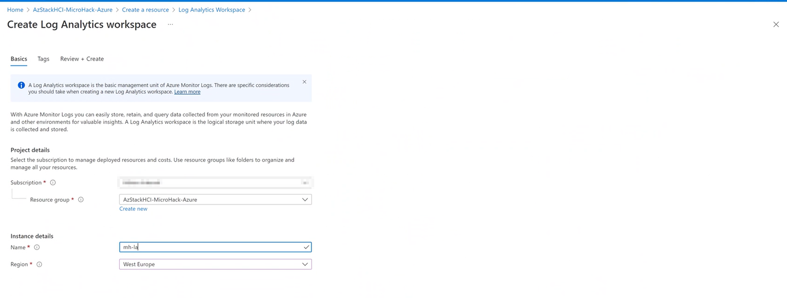

# **MicroHack Azure Stack HCI**

- [**MicroHack Azure Stack HCI**](#microhack-azure-stack-hci)
- [MicroHack introduction and context](#microhack-introduction-and-context)
- [Objectives](#objectives)
- [Prerequisites](#prerequisites)
- [Lab environment for this MicroHack](#lab-environment-for-this-microhack)
  - [Architecture](#architecture)
- [MicroHack Challenges](#microhack-challenges)
  - [Challenge 1 - First virtual machines on Azure Stack HCI](#challenge-1---first-virtual-machines-on-azure-stack-hci)
    - [Goal](#goal)
    - [Task 1: Create virtual machines on Cluster Manager via Windows Admin Center](#task-1-create-virtual-machines-on-cluster-manager-via-windows-admin-center)
    - [Task 2: Create necessary Azure Resources](#task-2-create-necessary-azure-resources)
    - [Task 3: Prepare the Azure Arc environment](#task-3-prepare-the-azure-arc-environment)
    - [Task 4: Domainjoin](#task-4-domainjoin)
- [Challenge 2 : Management / control plane fundamentals at the beginning](#challenge-2--management--control-plane-fundamentals-at-the-beginning)
    - [Goal](#goal-1)
    - [Task 1: Onboard your servers to Azure Arc](#task-1-onboard-your-servers-to-azure-arc)
    - [Task 2:](#task-2)
    - [Task 3:](#task-3)
    - [Goal](#goal-2)
    - [Task 1:](#task-1)
    - [Task 4:](#task-4)
- [Finished? Delete your lab](#finished-delete-your-lab)

# MicroHack introduction and context

This MicroHack scenario walks through the use of Azure Stack HCI with a focus on the best practices and the design principles and some interesting challenges for real world scenarios. Specifically, this builds up to include working with an existing infrastructure in your datacenter. 

This lab is not a full explanation of Azure Stack HCI as a technology, please consider the following articles required pre-reading to build foundational knowledge.

- [What is Azure Stack HCI?](https://docs.microsoft.com/en-us/azure-stack/hci/overview)
- [Watch a video to see an high level overview of the features from Azure Stack HCI](https://youtu.be/fw8RVqo9dcs)
- [eBook: Five Hybrid Cloud Use Cases for Azure Stack HCI](https://aka.ms/technicalusecaseswp)
- [What´s new for Azure Stack HCI at Microsoft Ignite 2021](https://techcommunity.microsoft.com/t5/azure-stack-blog/what-s-new-for-azure-stack-hci-at-microsoft-ignite-2021/ba-p/2897222)
- [Azure Stack HCI Solutions](https://hcicatalog.azurewebsites.net/#/)
- [Plan your solution with the sizer tool](https://hcicatalog.azurewebsites.net/#/sizer)
- [Azure Stack HCI FAQ](https://docs.microsoft.com/en-us/azure-stack/hci/faq)

💡 Optional: Read this after completing this lab to take your learning even deeper!

# Objectives

After completing this MicroHack you will:

- Know how to build or use Azure Stack HCI
- Understand use cases and possible scenarios in your hybrid world to modernize your infrastructure estate. 
- Get insights into real world challenges and scenarios

# Prerequisites

For this MicroHack we have a few prerequisites they are very important to be successful in this MicroHack. Normally, for the use of Azure Stack HCI, validated hardware is required from selected partners and such hardware can of course be used for the MicroHack. The alternative is the Azure Stack HCI Evaluation Lab, which allows to convert Azure Stack HCI to Hyper-V with Nested Virtualization.

In order to use the MicroHack time most effectively, the following tasks should be completed prior to starting the session.

- If you do not have own hardware then you need to go through the [Azure Stack HCI Evaluation Lab](https://github.com/Azure/AzureStackHCI-EvalGuide?msclkid=44e04d5fb4e811eca429547b3ced494b) 

- Download ISO FIles on Azure Stack HCI to location for example Cluster Shared Volumes: 
  - [Ubuntu](https://ubuntu.com/download)
  - [Windows Server 2022](https://software-static.download.prss.microsoft.com/sg/download/888969d5-f34g-4e03-ac9d-1f9786c66749/SERVER_EVAL_x64FRE_en-us.iso)

With these pre-requisites in place, we can focus on building the differentiated knowledge in the hybrid world on Azure Stack HCI to modernize your hybrid estate. 

# Lab environment for this MicroHack

Explain the lab ..

## Architecture

Description

Naming standards / taxonomie: 
- https://docs.microsoft.com/en-us/azure/cloud-adoption-framework/ready/azure-best-practices/resource-naming

MicroHack Series - Hybrid Stack HCI / Arc

MicroHack Series - Hybrid Stack HCI AKS / 
- 4 Challenge: AKS 
- 4 Challenge: Azure Arc Bridge 
- 5 Challenge: Arc enabled Data
- 6 Challenge: Arc enabled App Service

MicroHack Series - Hybrid AVD on Stack HCI
- 99 Challenge: Azure Virtual Desktop

# MicroHack Challenges 

Before you dive into the challenges please make sure that the pre-requisites are fulfilled otherwise move on with the challenges. [Jump directly to prerequisites to verify](#prerequisites)

## Challenge 1 - First virtual machines on Azure Stack HCI

### Goal 

The goal of this exercise is to deploy the first virtual machines on your Azure Stack HCI. We will use this virtual machines in the next challenges and all other challenges are directly connected to this challenge. 

### Task 1: Create virtual machines on Cluster Manager via Windows Admin Center

2x Win
 - win-app
 - win-file
1x Lin
 - lin-app-mi

 Sizing, etc. 

### Task 4: Domainjoin

!! Summarize the challenge !!

# Challenge 2 - Management / control plane fundamentals at the beginning

### Goal

At the beginning it is always a good approach setting up the stage, onboard the necessary infrastructure and management components to have the right focus and support for the next challenges. In this section the focus will be on onboarding the servers we have created in the first challenge and integrate them in the necessary control plane & management tools. 

### Task 1: Create necessary Azure Resources 

- Azure RG
- Automation Account
- Log Analytics Workspace

Add Windows event logs
Add Syslog

### Task 2: Create Azure Policy for onboarding Azure Arc enabled Servers

- Azure Policy Asssignment

Azure Policy: initiative Enable Azure Monitor for VMs

Hint: Permissions Contronutor Policy
Alternative approach: manual deployment in VMs

### Task 3: Prepare the Azure Arc environment

- Setup Arc
- Service Principal
- generate Scripts

# Challenge 3 - Onboard your servers to Azure Arc

### Goal

Onboard servers to Azure Arc

### Task 1: Windows VMs

### Task 2: Linux VMs

Be aware to block Azure IDMS endpoint! 

### Task 3: Enable Update Management

https://docs.microsoft.com/en-us/azure/azure-monitor/logs/computer-groups#creating-a-computer-group

Save as function
schedule update (your local time + 6 min)

### coffee break

### Task 4: Enable Inventory

### Task 5: Enable VM Insights

### Coffee break

# Challenge 4 - Access Azure resources using Managed Identities from your on-prem servers

### Goal

Access Key Vault using Managed Identities

### Task 1: Create Key Vault 

Create Key Vault with default settings

### Task 2: Assign permissions to Key Vault

### Task 3: Create Secret

### Task 4: Retrieve secret via Bash

ChallengeTokenPath=$(curl -s -D - -H Metadata:true "http://127.0.0.1:40342/metadata/identity/oauth2/token?api-version=2019-11-01&resource=https%3A%2F%2Fmanagement.azure.com" | grep Www-Authenticate | cut -d "=" -f 2 | tr -d "[:cntrl:]")
ChallengeToken=$(cat $ChallengeTokenPath)
if [ $? -ne 0 ]; then
    echo "Could not retrieve challenge token, double check that this command is run with root privileges."
else
    curl -s -H Metadata:true -H "Authorization: Basic $ChallengeToken" "http://127.0.0.1:40342/metadata/identity/oauth2/token?api-version=2019-11-01&resource=https%3A%2F%2Fvault.azure.net"
fi

Extract Refresh Token

curl 'https://mh-keyvault0815.vault.azure.net/secrets/kv-secret?api-version=2016-10-01' -H "Authorization: Bearer $token"

### Optional: Certificate IIS

# Challenge 5 - Create Hybrid Fileservices

## Goal

The Goal of this challenge is to show the very common hybrid scenario of Fileservices.  
You will learn how to configure the on premises Server and needed Azure Service to create a Hybrid File Service Deployment.

## Task 1: Configure the on premises Fileserver

For this challenge we will use one of the servers you created in [Challenge 1](#challenge-1---first-virtual-machines-on-azure-stack-hci).  
First start by adding a Data Disk to the Server "win-file".  
After this install the Fileserver Role on the Server.   

With a Working Fileserver you can create some demo data in your share. (Like text or office documents)

### Reference
[https://docs.microsoft.com/en-us/azure-stack/hci/manage/vm](https://docs.microsoft.com/en-us/azure-stack/hci/manage/vm)  
[https://docs.microsoft.com/en-us/windows-server/storage/file-server/file-server-smb-overview](https://docs.microsoft.com/en-us/windows-server/storage/file-server/file-server-smb-overview)

### Walkthrough - Spoilerwarning
[Walkthrough Task 1](./Walkthrough/Challenge5/task1.md)

## Task 2: Configure the File Sync Service

### Reference

### Walkthrough - Spoilerwarning
[Walkthrough Task 2](./Walkthrough/Challenge5/task2.md)

### Task 3: 
- 2 Challenge: Readiness Automation Account / Log Analytics
    - Change Tracking, Patch und das andere
    - Policy
    - guest Policys (Christian; Administrator Group)
    - Windows Admin center
    - Monitoring / Azure Monitor / Cluster Monitoring
    - MSFT Defender for Cloud!
  - Task 1 VM Deployment (setting up the basic lab environment)
    - 2 x Windows --> win-file / win-app
    - Linux --> lin-app-mi
  - Onboarding Arc - Interactively / At Scale
- 2 Challenge: Arc / MSI Access Secret in KeyVault / SQL 
- 3 Challenge: Fileserver / FileSync / Cloud Tiering (Christian)
- 4 Challenge: Backup (Nils)
   - Storage Account
   - VMs im Azure Stack HCI
   - Optional Tasks: Restore VM/File
   Hinweis: Arc enabled SQL MI
- 5 Challenge: Site recovery (Nils)
   - win-app nach Azure replizieren
   - Optional: failover initieren

Optional - 6 Challenge: Scale out storage - Storage Spaces Direct 

### Goal

### Task 1: 

**Explain the background...**

### Task 4: 

Before proceeding to challenge 3, ...

# Finished? Delete your lab

Thank you for participating in this MicroHack!
