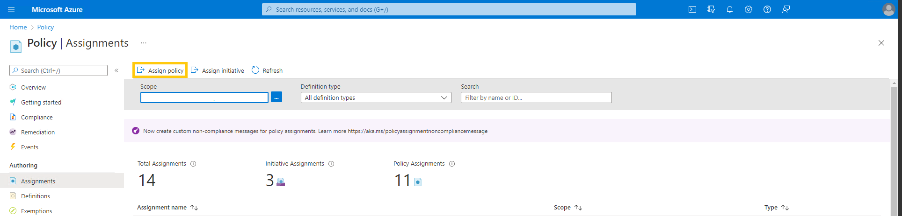
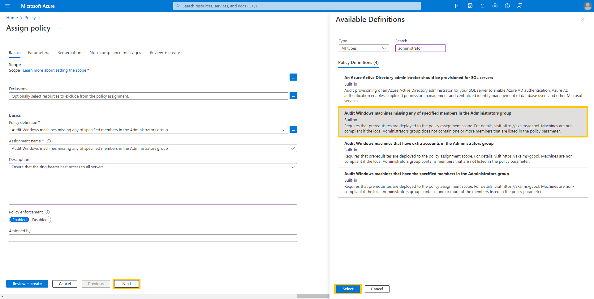
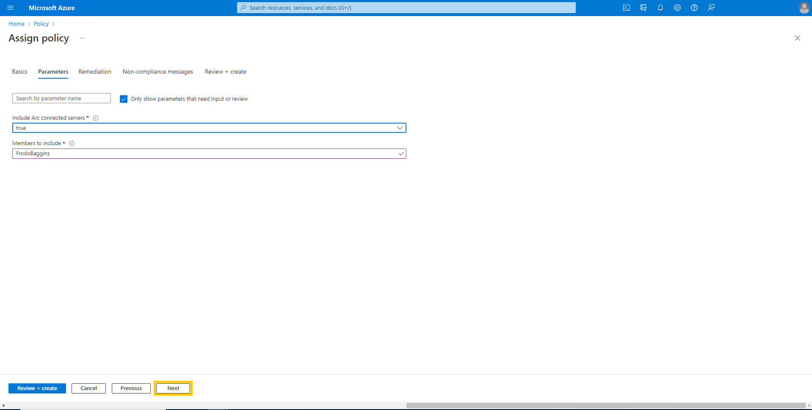
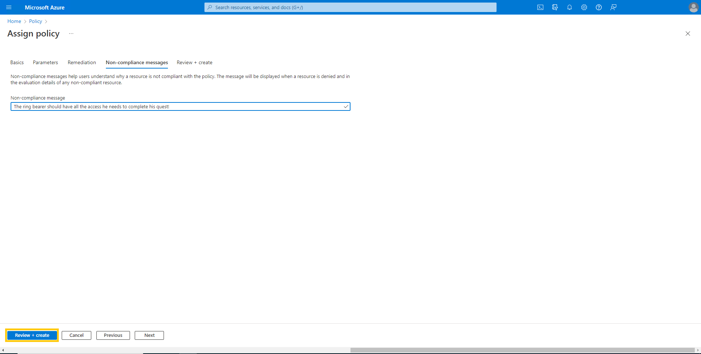
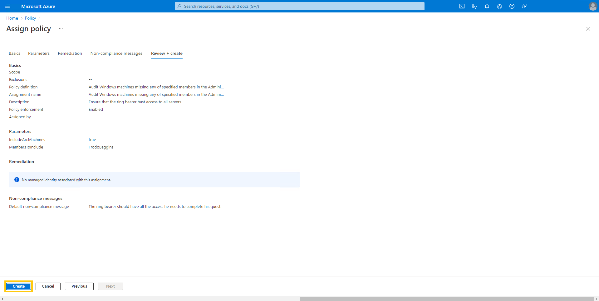

# Walkthrough Challenge 2 - Management / control plane fundamentals at the beginning

## Setup a Policy that checks if the user "FrodoBaggins" is part of the local administrators group

For this action you can leverage a policy that is already built into Azure.
Please Locate the Azure Policy Page as you have done before to assign the Policy to automatically onboard Azure Arc enabled servers.  
After that locate the assignment in the blade on the left side.  
From the assignments choose "Assign policy" from the top menu.

From the basics tab use the picker to select the policy "Audit Windows machines that have the specified members in the Administrators group".  
Give the assignment a name and description and click next.

On the parameters page make sure that you include Arc connected servers and define the needed member as "FrodoBaggins". Then hit next.

This example does not include remediation. If you want to learn more on how to use guest configuration to remediate the state of your servers please refer to   
[https://docs.microsoft.com/en-us/azure/governance/policy/concepts/guest-configuration-policy-effects](https://docs.microsoft.com/en-us/azure/governance/policy/concepts/guest-configuration-policy-effects)  
On Non-Compliance Message you can create a custom message that may contain additional information like link to internal documentation or just an explaination why this policy is set.

Review you policy assignment and click create.

After a few minutes you will be able to see the compliance state of your server.