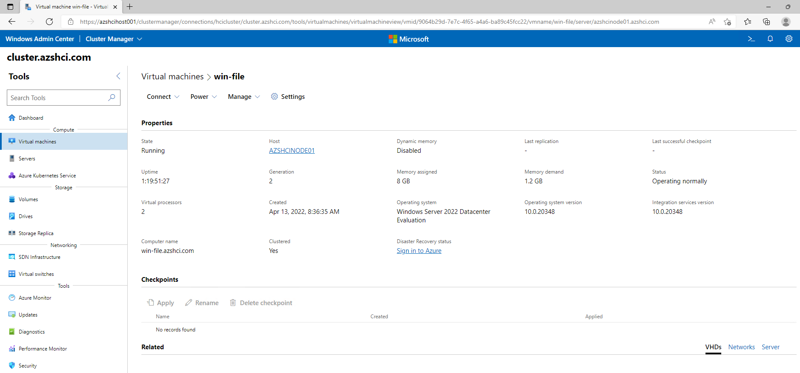
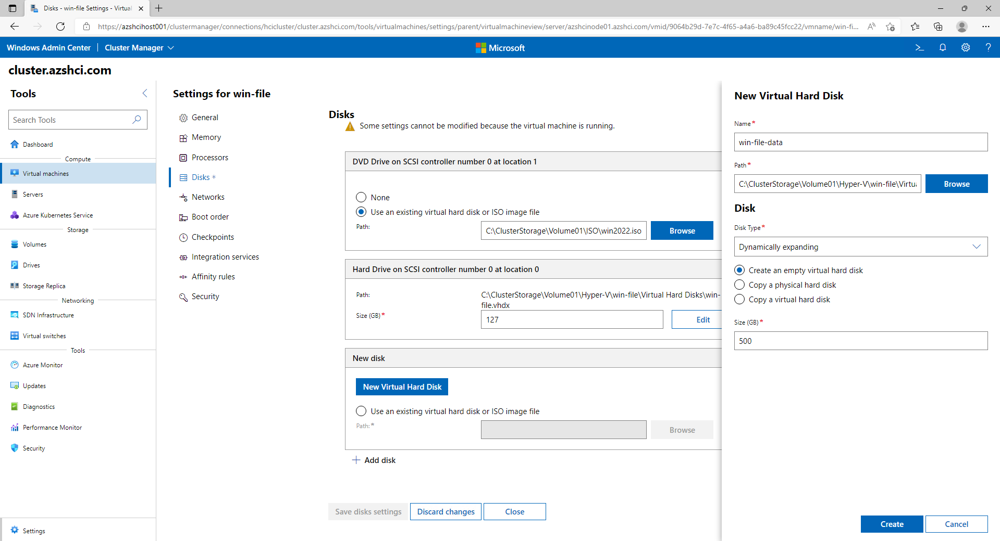
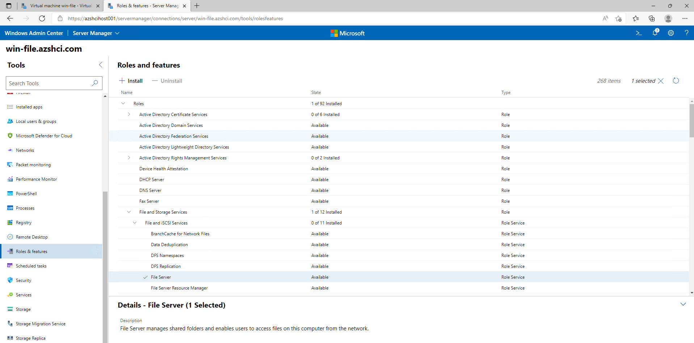
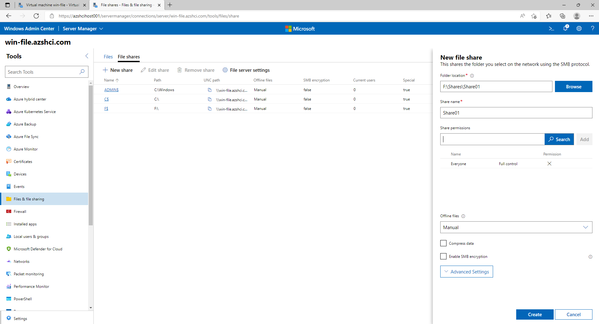

# Walkthrough Task 1 Challenge 5 - Configure the on premises Fileserver

## Prerequisites
This walkthrogh assumes that you have created the VMs like described in [Challenge 1](../../Readme.md#challenge-1---first-virtual-machines-on-azure-stack-hci).  
It requies you to do some configurations in the Windows Admin Center and also in your Azure Environment.

## Add Data Disk

To add a Data Disk to the VM "win-file" log in to the Window Admin Center and Locate the VM "win-file" on your HCI Cluster.


Using the Settings you can add another VHD to the VM. This will be used as Data Disk to contain the Fileshares.



After you have created the disk log on to the VM "win-file" to configure the disk. In this case we will show the Powershell commands but you can also use Windows Admin Center to do so. 

```powershell
# Use Powershell to gather Physical Disks
PS C:\Users\microhack> Get-PhysicalDisk

Number FriendlyName      SerialNumber MediaType   CanPool OperationalStatus HealthStatus Usage         Size
------ ------------      ------------ ---------   ------- ----------------- ------------ -----         ----
1      Msft Virtual Disk              Unspecified True    OK                Healthy      Auto-Select 500 GB
0      Msft Virtual Disk              Unspecified False   OK                Healthy      Auto-Select 127 GB

# Initialize the Physical Disk
PS C:\Users\microhack> Initialize-Disk -Number 1

# Create new Volume on the Disk
PS C:\Users\microhack> Get-Disk -Number 1 | New-Volume -FileSystem NTFS -DriveLetter F -FriendlyName 'Shares'

DriveLetter FriendlyName FileSystemType DriveType HealthStatus OperationalStatus SizeRemaining      Size
----------- ------------ -------------- --------- ------------ ----------------- -------------      ----
F           Shares       NTFS           Fixed     Healthy      OK                    499.87 GB 499.98 GB


```

To install the Fileserver Role you can again choose between Powershell and Windows Admin Center.  
To use Windows Admin Center locate the VM on your HCI Cluster and use the Connect Menu to choose "Use Windows Admin Center".  
This will bring you to the Admin Center Page of the the VM "win-file".

On the left side you can find "Roles & Features". Search for the "File and Storage Services" and locate the "File Server" item. Then click install.



After the Fileserver installed you can find "Files & file sharing" on the left Menu.  
Create a New Share by clicking "New Share" in the Files Shares Menu.   
Note: This is for demonstration purpose only. Please setup correct permissions in your environment.



Congratulations. You have a working Fileserver in you on premises Environment.