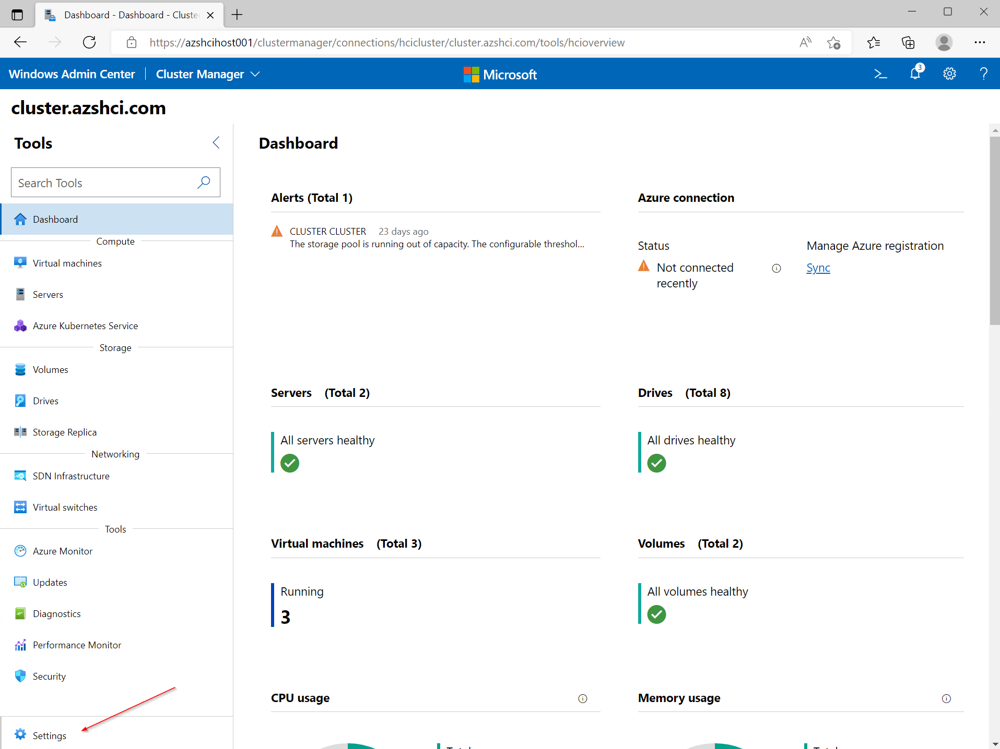
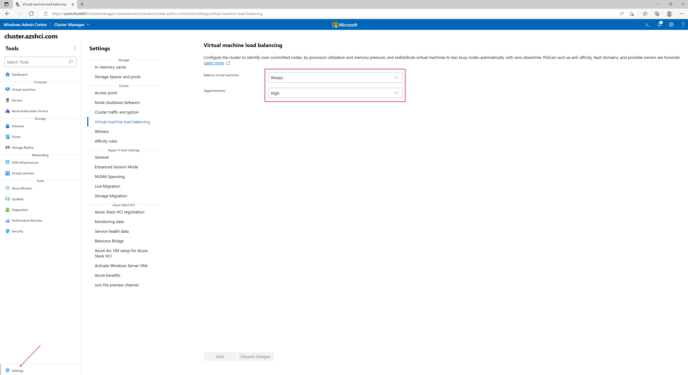
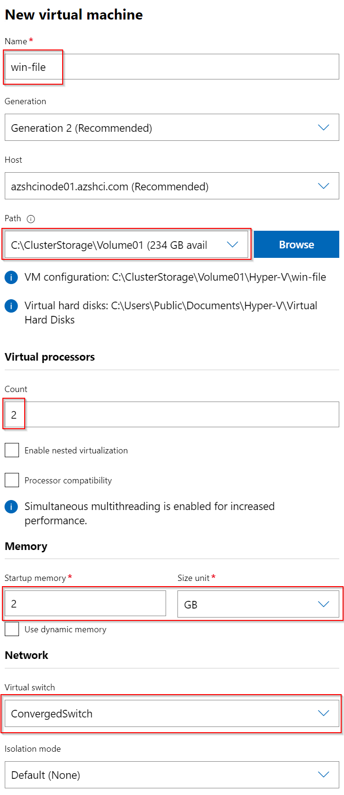
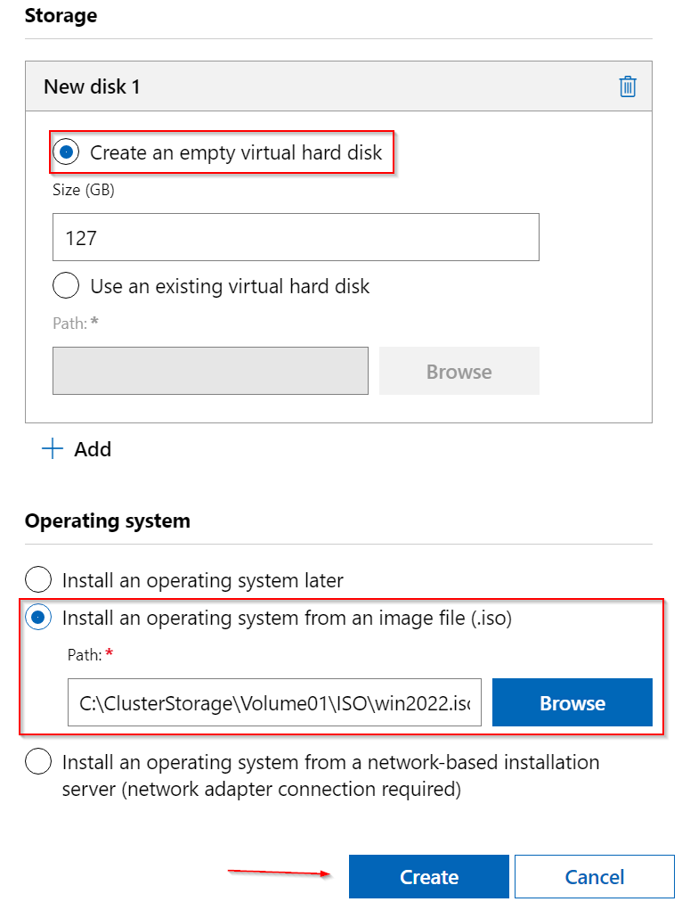
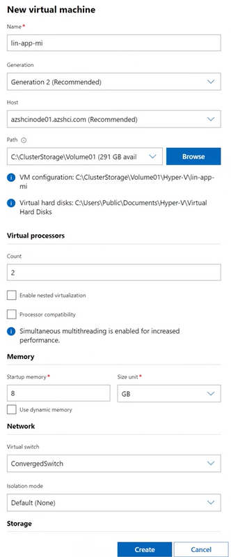
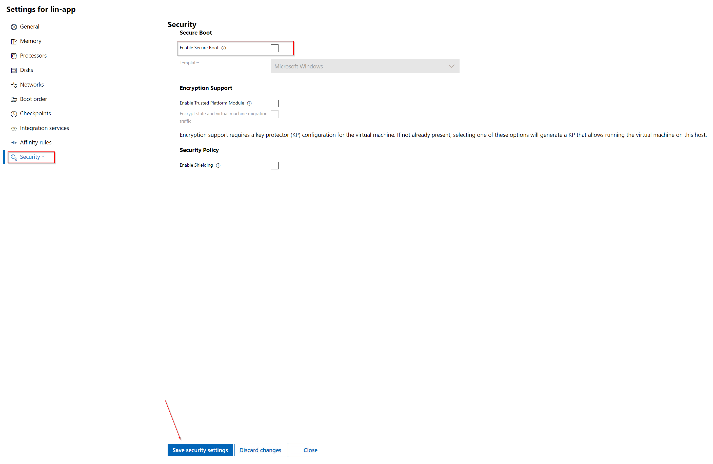
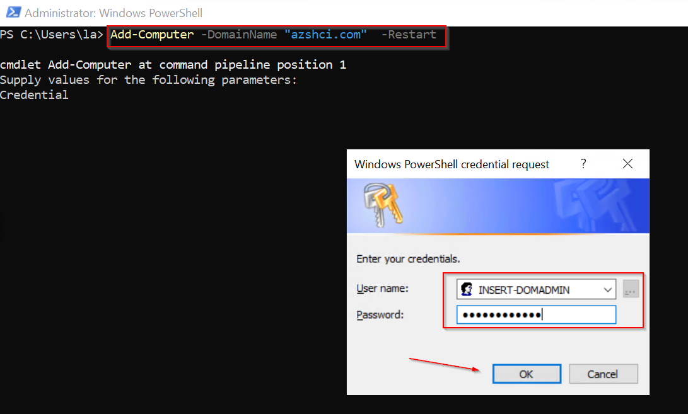

# Walkthrough Challenge 1 - Create your first virtual machines on Azure Stack HCI

Duration: 30 minutes

[Previous Challenge Solution](../challenge1/solution.md) - **[Home](../../Readme.md)** - [Next Challenge Solution](../challenge2/solution.md)

## Prerequisites

In order to successfully finish the first challenge you need to make sure that your Azure Stack HCI cluster is up and running like described in the[Prerequisites of the MicroHack](../../Readme.md#Prerequisites).

### Task 1: Create virtual machines on Cluster Manager via Windows Admin Center

1. Connect to your Azure Stack HCI cluster using the Windows Admin Center and open the general settings of your cluster.



2. Navigate to *Virtual Machine load balancing*. Set *Balance virtual machines* to *Always* and *Aggressiveness* to *High*.



3. Create two new Virtual Machines called win-app and win-file with 2 vCPU, 8 GB RAM and a NIC connected to *ConvergedSwitch*. Add a new disk under *Storage* and create an empty virtual hard disk with 127 GB size. Finally, select *Install an operating system from an image file* and select the ISO file for Windows Server 2022. 

- win-app
- win-file

`❗Hint: Please make sure to store the Virtual Machine's disk in the cluster storage under C:\ClusterStorage\Volume01\ and deploy the Virtual Machines across your two nodes.

 

4. Create a new Virtual Machine called lin-app-mi with the same settings as win-app and win-file but instead of selecting the ISO file for Windows Server, select the ISO file for Ubuntu Server.



5. Select the lin-app-mi in the Windows Admin Center and disable *Secure Boot* in the Security settings of the Virtual Machine.



### Task 2: Install the Operating System

1. Power on the newly created Virtual Machines, connect via the Windows Admin Center and install the OS with default settings.

`❗Hint: Take a note of your chosen username and password. 

### Task 3: Perform Domain Join

1. Connect via the Windows Admin Center to the Windows-based Virtual Machines.

2. Open the Windows PowerShell console using *Run as Administrator* and verify name resolution and connectivity to the domain controllers works properly. 

```
nslookup *INSERT-DOMAIN-NAME*
```

3. After successfully veryfing the name resolution join the servers to the domain using the following command:

```
Add-Computer –DomainName "INSERT-DOMAIN-NAME" -Restart

```



You successfully completed challenge 1! 🚀🚀🚀