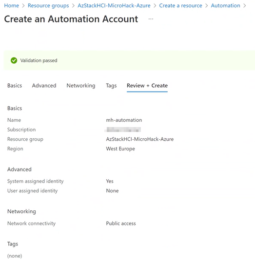
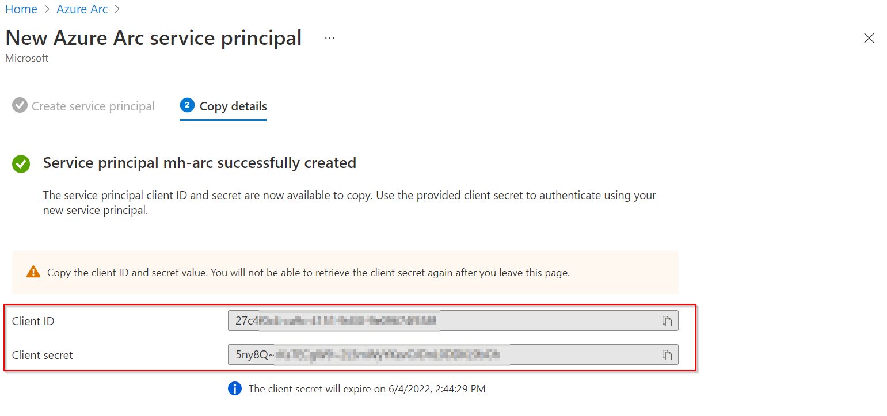
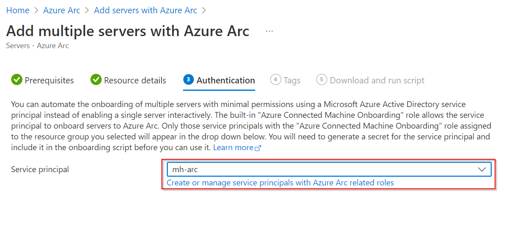

# Walkthrough Challenge 2 - Management / control plane fundamentals at the beginning

Duration: 30 minutes

[Previous Challenge Solution](../challenge1/solution.md) - **[Home](../../Readme.md)** - [Next Challenge Solution](../challenge3/solution.md)

## Prerequisites

Please ensure that you successfully passed [challenge 1](../../Readme.md#challenge-1---create-your-first-virtual-machines-on-azure-stack-hci) before continuing with this challenge.

### Task 1: Create necessary Azure resources

1. Sign in to the [Azure Portal](https://portal.azure.com/).

2. Create a new Resource Group called *AzStackHCI-MicroHack-Azure* in your favorite Azure region.

3. Create a new Azure Automation Account called *mh-automation* with default settings in the same Resource Group.

4. Create a new Log Analytics Workspace called *mh-la* with default settings in the same Resource Group.

### Task 2: Configure Log Analytics

1. Navigate to the Log Analytics Workspace and open *Agents configuration* in the left navigation pane.

2. Select *Add windows event log* and add the *System* logs to the workspace. Hit apply.

3. Navigate to Syslog in the top navigation pane, select *Add facility* and add *syslog* logs to the workspace. Hit apply.

### Task 3: Create a new service principal for Azure Arc
 
1. Navigate to *Azure Arc* using the top search bar and select *Service Principals* in the left navigation pane.

2. Configure the service principal with the following settings:

3. Please wait a few seconds until the creation of the Service Principal is complete. You should see the following:

`❗Hint: Take a note of the Client ID and Secret before you proceed!

### Task 4: Prepare the Azure Arc environment

1. Navigate to *Servers* in the left navigation pane and select *Add*.

2. Select *Add multiple servers* and hit *Generate script*.

3. Select *Next*.

4. Select the Azure resource group called *AzStackHCI-MicroHack-Azure* and ensure that Windows is selected.  

# Walkthrough Challenge 2 - Management / control plane fundamentals at the beginning

## Setup a Policy that checks if the user "FrodoBaggins" is part of the local administrators group

For this action you can leverage a policy that is already built into Azure.
Please Locate the Azure Policy Page as you have done before to assign the Policy to automatically onboard Azure Arc enabled servers.  
After that locate the assignment in the blade on the left side.  
From the assignments choose "Assign policy" from the top menu.

From the basics tab use the picker to select the policy "Audit Windows machines that have the specified members in the Administrators group".  
Give the assignment a name and description and click next.

On the parameters page make sure that you include Arc connected servers and define the needed member as "FrodoBaggins". Then hit next.

This example does not include remediation. If you want to learn more on how to use guest configuration to remediate the state of your servers please refer to   
[https://docs.microsoft.com/en-us/azure/governance/policy/concepts/guest-configuration-policy-effects](https://docs.microsoft.com/en-us/azure/governance/policy/concepts/guest-configuration-policy-effects)  
On Non-Compliance Message you can create a custom message that may contain additional information like link to internal documentation or just an explaination why this policy is set.

Review you policy assignment and click create.

After a few minutes you will be able to see the compliance state of your server.

### Task 3: Prepare the Azure Arc environment

You successfully completed challenge 2! 🚀🚀🚀
