# Walkthrough Challenge 2 - Management / control plane fundamentals at the beginning

Duration: 30 minutes

[Previous Challenge Solution](../challenge2/solution.md) - **[Home](../../Readme.md)** - [Next Challenge Solution](../challenge4/solution.md)

## Prerequisites

Please ensure that you successfully passed [challenge 2](../../Readme.md#challenge-2---management--control-plane-fundamentals-at-the-beginning) before continuing with this challenge.

### Task 1: Onboard the Windows Virtual Machines to Azure Arc

1. Connect via the Windows Admin Center or RDP to the Virtual Machine win-app.

2. Open the Windows PowerShell ISE using *Run as Administrator* and paste the [generated script from task 4 in challenge 2](../challenge2/solution.md#task-4-prepare-the-azure-arc-environment) into the editor. Make sure to insert your correct Client ID and Secret.

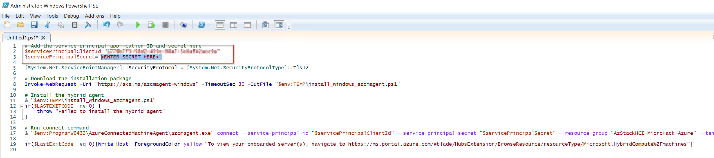

3. After verifying the Client ID and Secret please execute the script. The Windows-based Virtual Machines should install the agent and successfully connect to Azure Arc. 

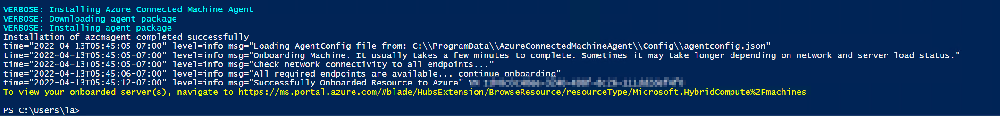

4. Repeat step 1 - 3 on the other Windows-based Virtual Machine win-file. 

### Task 2: Onboard the Linux Virtual Machine to Azure Arc

1. Connect via SSH to the Virtual Machine linux-app.

2. Elevate your privileges using the following command:

```
sudo -i
```

3. Paste the [generated script from task 4 in challenge 2](../challenge2/solution.md#task-4-prepare-the-azure-arc-environment) into your SSH session. Make sure to insert your correct Client ID and Secret before.

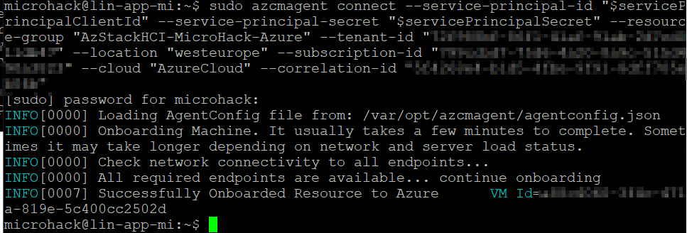

`❗Hint: By default, the installation of the Azure Arc agebt is not permitted on Virtual Machines that are already hosted on Azure. This should not apply to our Virtual Machines as they are nested in Azure but the Linux agent may state that the Virtual Machine is in Azure resulting in the installation being denied. [Blocking access to Azure IMDS is a simple workaround if you receive an error during agent installation.](https://docs.microsoft.com/en-us/azure/azure-arc/servers/plan-evaluate-on-azure-virtual-machine#reconfigure-azure-vm)

### Task 3: Enable Update Management for Azure Arc enabled Servers

1. Sign in to the [Azure Portal](https://portal.azure.com/).

2. Navidgate to your Azure Automation Account that was created in the [previous challenge](../challenge2/solution.md#task-1-create-necessary-azure-resources).

3. Select *Update Management* in the left navigation pane and enable the Update Management. Please make sure to select the Log Analytics workspace that was created in the [previous challenge](../challenge2/solution.md#task-2-create-necessary-azure-resources). 

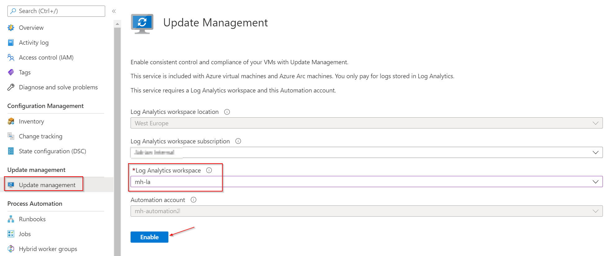

4. Once the deployment of Update Management is complete, you can onboard existing and future machines by hitting *Manage machines* and selecting *Enable on all available machines and future machines*.

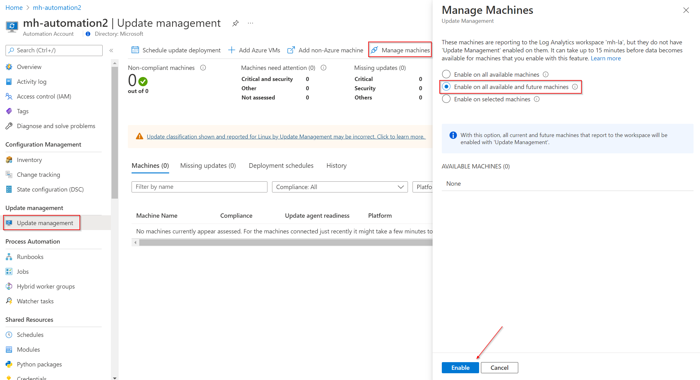

5. Now, it's time to create a schedule for each OS platforms. First, go to your Log Analytics Workspace *mh-la* and select *Logs* in the left navigation pane. Now create the following Kusto query:

```
Update | distinct Computer
```

6. Select *Save as..* and name the function *GetAllArcVMs*. Please make sure to check *Save as computer group* and hit *Save*

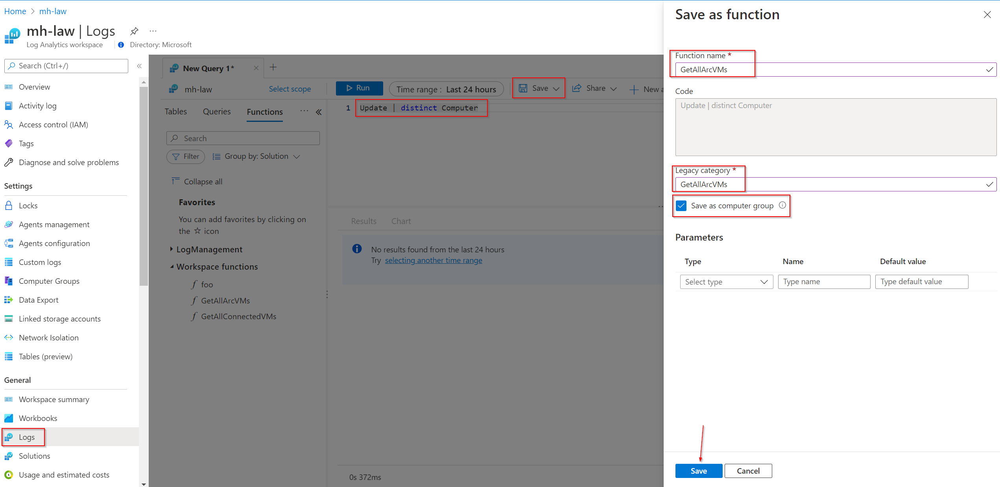

7. Go back to *Update Management* in the automation account and select *Schedule update deployment*. Please create an update schedule for each OS platform with the following settings:

- Name: Update Windows
- Groups to update: Non-Azure -> add *GetAllArcVMs*
- Schedule Settings: Your local time plus 7 minutes; Recurring

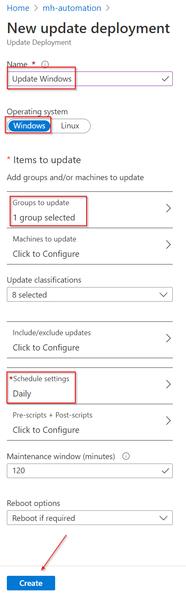


### Task XX: Create an Azure Policy Guest Configuration for your Azure Arc VMs

## Setup a Policy that checks if the user "FrodoBaggins" is part of the local administrators group

For this action you can leverage a policy that is already built into Azure.
Please Locate the Azure Policy Page as you have done before to assign the Policy to automatically onboard Azure Arc enabled servers.  
After that locate the assignment in the blade on the left side.  
From the assignments choose "Assign policy" from the top menu.

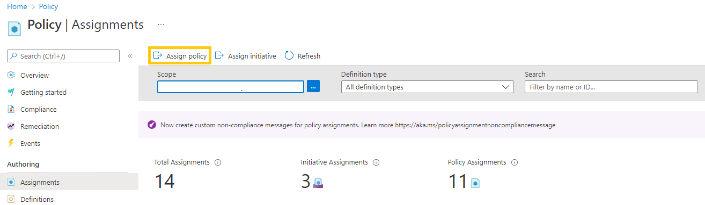

From the basics tab use the picker to select the policy "Audit Windows machines that have the specified members in the Administrators group".  
Give the assignment a name and description and click next.

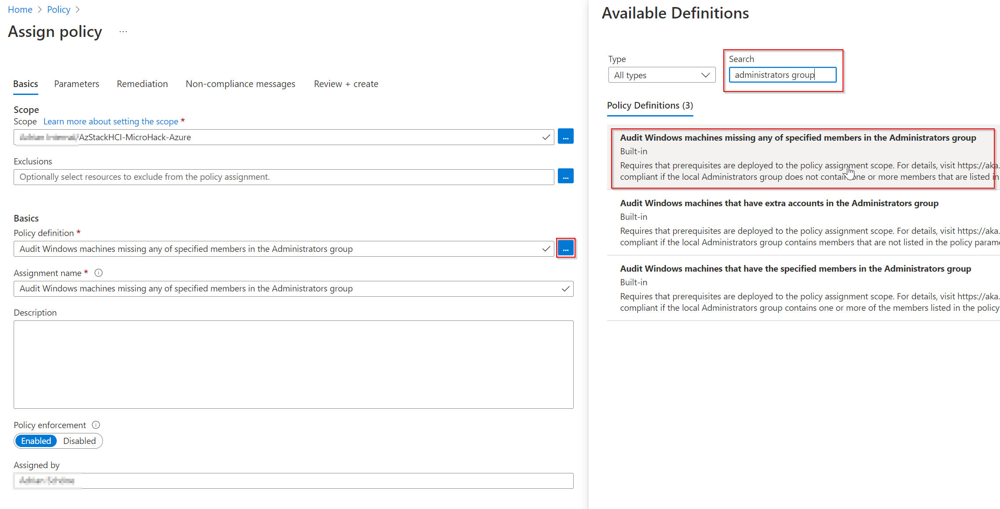

On the parameters page make sure that you include Arc connected servers and define the needed member as "FrodoBaggins". Then hit next.

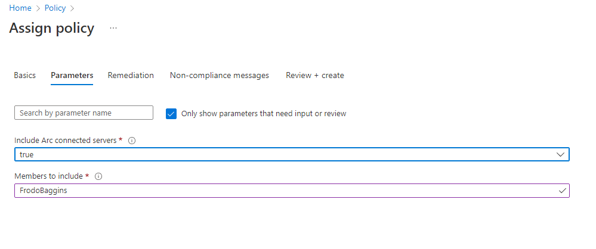

This example does not include remediation. If you want to learn more on how to use guest configuration to remediate the state of your servers please refer to   
[https://docs.microsoft.com/en-us/azure/governance/policy/concepts/guest-configuration-policy-effects](https://docs.microsoft.com/en-us/azure/governance/policy/concepts/guest-configuration-policy-effects)  
On Non-Compliance Message you can create a custom message that may contain additional information like link to internal documentation or just an explaination why this policy is set.

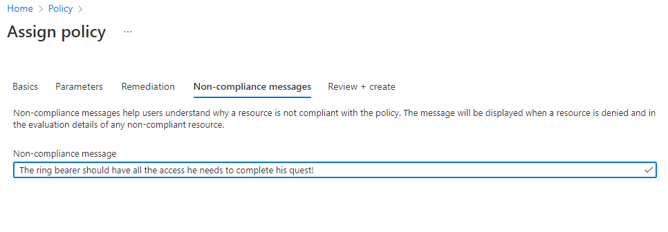

Review you policy assignment and click create.

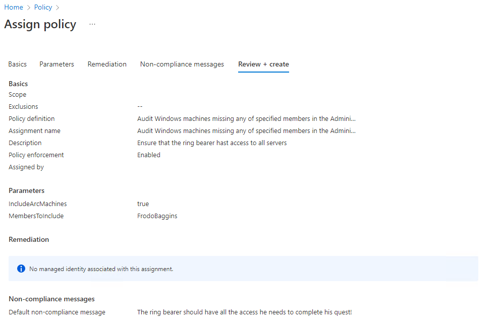

After a few minutes you will be able to see the compliance state of your server.


### Task 3: Prepare the Azure Arc environment

You successfully completed challenge 2! 🚀🚀🚀
