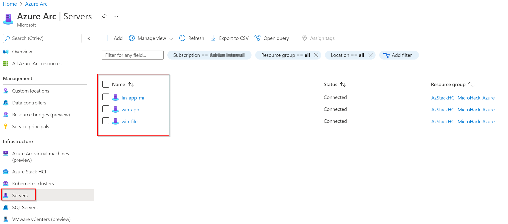
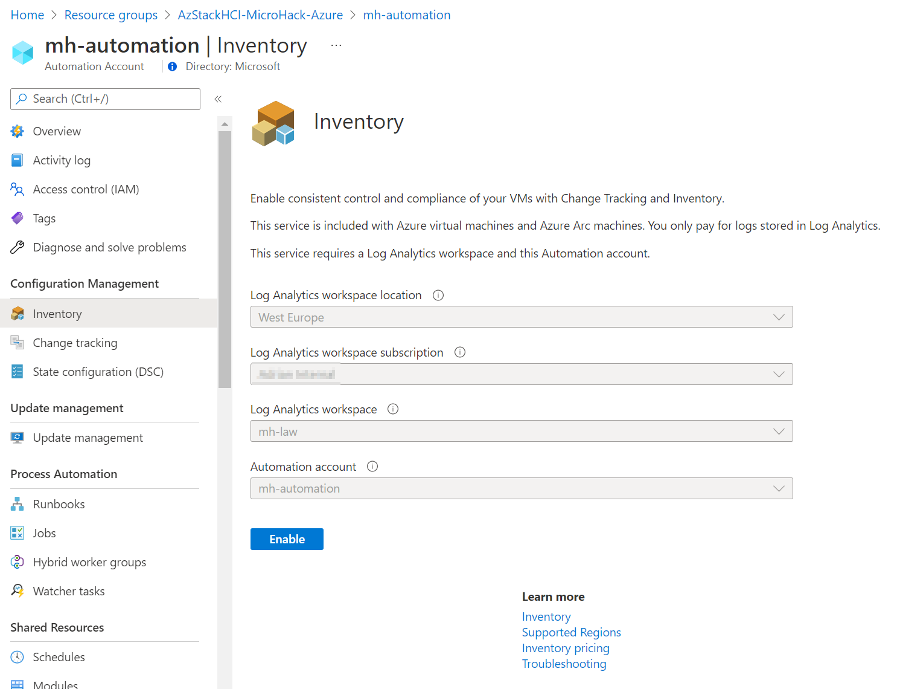
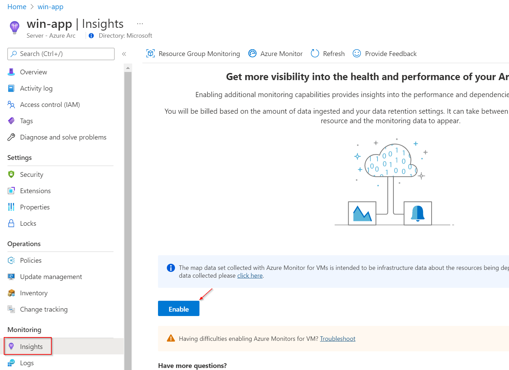

# Walkthrough Challenge 3 - Onboard your servers to Azure Arc

Duration: 30 minutes

[Previous Challenge Solution](../challenge2/solution.md) - **[Home](../../Readme.md)** - [Next Challenge Solution](../challenge4/solution.md)

## Prerequisites

Please ensure that you successfully passed [challenge 2](../../Readme.md#challenge-2---management--control-plane-fundamentals-at-the-beginning) before continuing with this challenge.

### Task 1: Onboard the Windows Virtual Machines to Azure Arc

1. Connect via the Windows Admin Center or RDP to the Virtual Machine win-app.

2. Open the Windows PowerShell ISE using *Run as Administrator* and paste the [generated script from task 4 in challenge 2](../challenge2/solution.md#task-4-prepare-the-azure-arc-environment) into the editor. Make sure to insert your correct Client ID and Secret.


3. After verifying the Client ID and Secret please execute the script. The Windows-based Virtual Machines should install the agent and successfully connect to Azure Arc. 


4. Repeat step 1 - 3 on the other Windows-based Virtual Machine win-file. 

### Task 2: Onboard the Linux Virtual Machine to Azure Arc

1. Connect via SSH to the Virtual Machine linux-app.

2. Elevate your privileges using the following command:

```
sudo -i
```

3. Paste the [generated script from task 4 in challenge 2](../challenge2/solution.md#task-4-prepare-the-azure-arc-environment) into your SSH session. Make sure to insert your correct Client ID and Secret before.


`❗Hint: By default, the installation of the Azure Arc agebt is not permitted on Virtual Machines that are already hosted on Azure. This should not apply to our Virtual Machines as they are nested in Azure but the Linux agent may state that the Virtual Machine is in Azure resulting in the installation being denied. [Blocking access to Azure IMDS is a simple workaround if you receive an error during agent installation.](https://docs.microsoft.com/en-us/azure/azure-arc/servers/plan-evaluate-on-azure-virtual-machine#reconfigure-azure-vm)

4. Please verify that you can see all three Virtual Machines in your Azure Arc Dashboard.



### Task 3: Enable Update Management for Azure Arc enabled Servers

1. Sign in to the [Azure Portal](https://portal.azure.com/).

2. Navigate to your Azure Automation Account that was created in the [previous challenge](../challenge2/solution.md#task-1-create-necessary-azure-resources).

3. Select *Update Management* in the left navigation pane and enable the Update Management. Please make sure to select the Log Analytics workspace that was created in the [previous challenge](../challenge2/solution.md#task-2-create-necessary-azure-resources). 


4. Once the deployment of Update Management is complete, you can onboard existing and future machines by hitting *Manage machines* and selecting *Enable on all available machines and future machines*.


5. Now, it's time to create a schedule for each OS platforms. First, go to your Log Analytics Workspace *mh-la* and select *Logs* in the left navigation pane. Now create the following Kusto query:

```
Update | distinct Computer
```

6. Select *Save as..* and name the function *GetAllArcVMs*. Please make sure to check *Save as computer group* and hit *Save*


7. Go back to *Update Management* in the automation account and select *Schedule update deployment*. Please create an update schedule for Windows with the following settings:

- Name: Update Windows
- Groups to update: Non-Azure -> add *GetAllArcVMs*
- Schedule Settings: Your local time plus 7 minutes; Recurring


8. Repeat step 7 for Linux.

### Task 4: Enable Inventory for Azure Arc enabled Servers

1. Navigate to your Azure Automation Account, select *Inventory* in the left navigation pane and enable *Inventory*.




### Task 5: Enable Virtual Machine Insights

1. Navigate to your Virtual Machines, select VM Insights in the left navigation pane and enable *Insights*.




### Coffee Break of 10 minutes to let the data flow between your Virtual Machines and Azure

After your coffee break you should see that the Virtual Machines are reporting their status. You can now check the Update Management for pending updates, verify what software is installed on the machines and get deep insights of the utilization of your Virtual Machines. 

### Task 6: Create an Azure Policy Guest Configuration for your Azure Arc VMs

## Setup a Policy that checks if the user "FrodoBaggins" is part of the local administrators group


1. Please navigate to Azure Policy as you did it before in [challenge 2 task 5](../challenge2/solution.md#task-5-assign-azure-policy-initiative-to-your-azure-arc-resource-group).

2. Navigate to *Assignments* in the left navigation pane and select *Assign policy* in the top menu.


3. In this section you can now configure the assignment with the following settings and create the assignment:

- Scope: Please select the resource group called *AzStackHCI-MicroHack-Azure*
- Policy Definition: Please search for *administrators group* and select *Audit Windows machines missing any of the specified members in the Administrators group*.
- Parameters: Please ensure to set *Include Arc connected servers* to *true and *Members to include* to *FrodoBaggins*.


`❗Hint: This example does not include remediation. If you want to learn more on how to use guest configuration to remediate the state of your servers please refer to [Remediation options for guest configuration](https://docs.microsoft.com/en-us/azure/governance/policy/concepts/guest-configuration-policy-effects). 

4. On Non-Compliance Message you can create a custom message that may contain additional information like link to internal documentation or just an explaination why this policy is set.


5. Review the policy assignment and select *Create*.


6. After a few minutes you will be able to see the compliance state of your Windows-based servers.

You successfully completed challenge 3! 🚀🚀🚀
