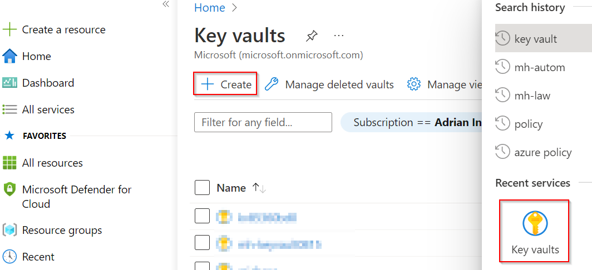

# Walkthrough Challenge 4 - Access Azure resources using Managed Identities from your on-prem servers

Duration: 30 minutes

[Previous Challenge Solution](../challenge3/solution.md) - **[Home](../../Readme.md)** - [Next Challenge Solution](../challenge5/solution.md)

## Prerequisites

Please ensure that you successfully passed [challenge 3](../../Readme.md#challenge-3---onboard-your-servers-to-azure-arc) before continuing with this challenge.

### Task 1: Create an Azure Key Vault

1. Navigate to *Azure Key Vault* using the top search bar and select *Create* in the top navigation pane.

2. 

You successfully completed challenge 4! 🚀🚀🚀