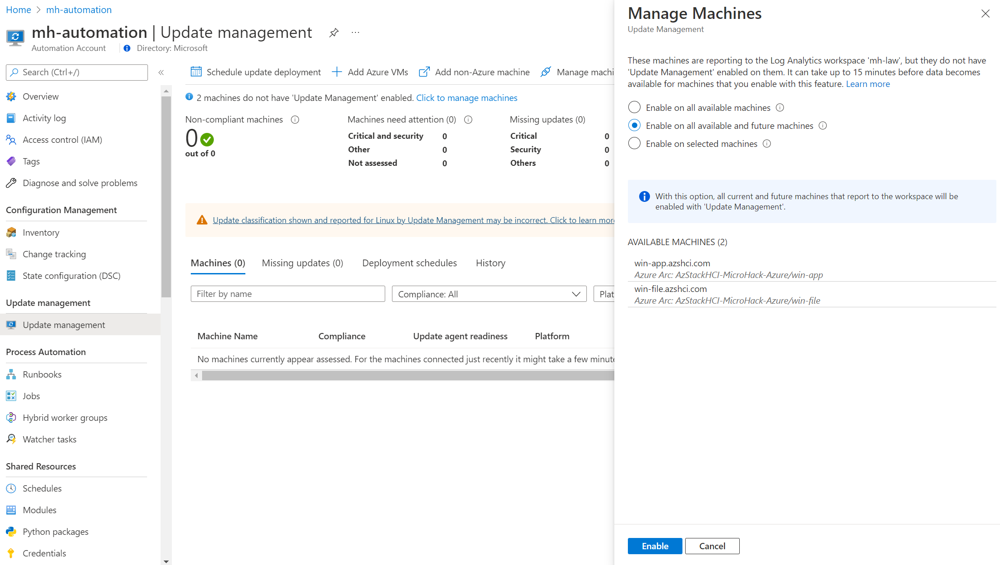

# **MicroHack Azure Stack HCI - Part I**

[toc]

# Challenge 2
### Task 1: Create necessary Azure Resources 

- Azure RG
- Automation Account
- Log Analytics Workspace

Add Windows event logs
Add Syslog

### Task 2: Create Azure Policy for onboarding Azure Arc enabled Servers

- Azure Policy Asssignment

Azure Policy: initiative Enable Azure Monitor for VMs

Hint: Permissions Contronutor Policy
Alternative approach: manual deployment in VMs

### Task 3: Prepare the Azure Arc environment

- Setup Arc
- Service Principal
- generate Scripts

challenge 3

### Task 1: Windows VMs

### Task 2: Linux VMs

Be aware to block Azure IDMS endpoint! 

### Task 3: Enable Update Management

https://docs.microsoft.com/en-us/azure/azure-monitor/logs/computer-groups#creating-a-computer-group

Save as function
schedule update (your local time + 6 min)

### coffee break

### Task 4: Enable Inventory

### Task 5: Enable VM Insights

### Coffee break

# challenge 4

### Task 1: Create Key Vault 

Create Key Vault with default settings

### Task 2: Assign permissions to Key Vault

### Task 3: Create Secret

### Task 4: Retrieve secret via Bash

ChallengeTokenPath=$(curl -s -D - -H Metadata:true "http://127.0.0.1:40342/metadata/identity/oauth2/token?api-version=2019-11-01&resource=https%3A%2F%2Fmanagement.azure.com" | grep Www-Authenticate | cut -d "=" -f 2 | tr -d "[:cntrl:]")
ChallengeToken=$(cat $ChallengeTokenPath)
if [ $? -ne 0 ]; then
    echo "Could not retrieve challenge token, double check that this command is run with root privileges."
else
    curl -s -H Metadata:true -H "Authorization: Basic $ChallengeToken" "http://127.0.0.1:40342/metadata/identity/oauth2/token?api-version=2019-11-01&resource=https%3A%2F%2Fvault.azure.net"
fi

Extract Refresh Token

curl 'https://mh-keyvault0815.vault.azure.net/secrets/kv-secret?api-version=2016-10-01' -H "Authorization: Bearer $token"

### Optional: Certificate IIS