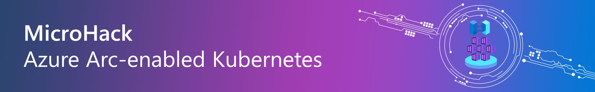
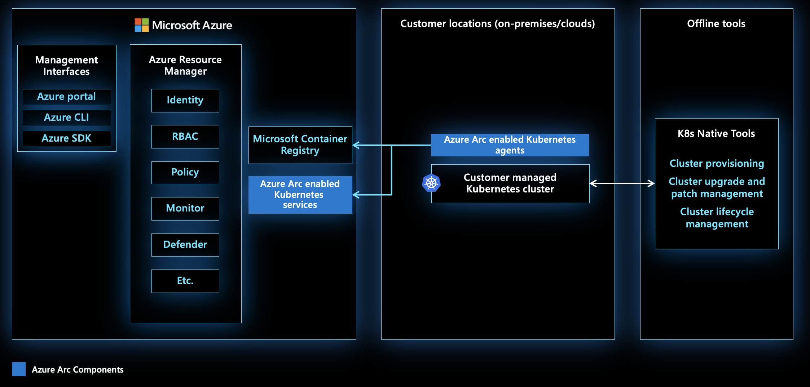

# MicroHack Azure Arc-enabled Kubernetes

* [**MicroHack Introduction**](#microhack-introduction)
  * [What is Azure Arc for Kubernetes?](#what-is-azure-arc-for-kubernetes)
* [**MicroHack Context**](#microhack-context)
* [**Objectives**](#objectives)
* [**General Prerequisites**](#general-prerequisites)
* [**MicroHack Challenges**](#microhack-challenges)
  * [Challenge 01 - Onboarding your Kubernetes Cluster](challenges/challenge-01.md))
  * [Challenge 02 - Enable Azure Monitor for Containers](challenges/challenge-02.md)
  * [Challenge 03 - Deploy CPU based Large & Small Language Models (LLM/SLM) on Azure Arc-enabled Kubernetes](challenges/challenge-03.md)
  * [Challenge 04 - Deploy SQL Managed Instance](challenges/challenge-04.md)
  * [Challenge 05 - Configure GitOps for Cluster Management](challenges/challenge-05.md)
* [**Contributors**](#contributors)

## MicroHack Introduction

### What is Azure Arc for Kubernetes?

Azure Arc-enabled Kubernetes allows you to attach Kubernetes clusters running anywhere so that you can manage and configure them in Azure. By managing all of your Kubernetes resources in a single control plane, you can enable a more consistent development and operation experience, helping you run cloud-native apps anywhere and on any Kubernetes platform.

Once your Kubernetes clusters are connected to Azure, you can:

- View all connected Kubernetes clusters for inventory, grouping, and tagging, along with your Azure Kubernetes Service (AKS) clusters.

- Configure clusters and deploy applications using GitOps-based configuration management.

- View and monitor your clusters using Azure Monitor for containers.

- Enforce threat protection using Microsoft Defender for Kubernetes.

- Ensure governance through applying policies with Azure Policy for Kubernetes.

- Grant access and connect to your Kubernetes clusters from anywhere, and manage access by using Azure role-based access control (RBAC) on your cluster.

- Deploy machine learning workloads using Azure Machine Learning for Kubernetes clusters.

- Deploy and manage Kubernetes applications from Azure Marketplace.

- Deploy Azure PaaS services that allow you to take advantage of specific hardware, comply with data residency requirements, or enable new scenarios. Examples of services include:

    - Azure Arc-enabled data services
    - Azure Machine Learning for Kubernetes clusters
    - Workload Orchestration
    - Event Grid on Kubernetes
    - App Services on Azure Arc
    - Open Service Mesh

## MicroHack Context

This MicroHack is a challenge-based experience which will walk you through the onboarding process and step by step enabling additional use cases.

💡 *Optional*: Have a look at the following resources after completing this lab to deepen your learning:

* [Azure Arc-enabled Kubernetes documentation](https://learn.microsoft.com/en-us/azure/azure-arc/kubernetes/)
* [Azure Arc Jumpstart - Arc-enabled Kubernetes](https://jumpstart.azure.com/azure_arc_jumpstart/azure_arc_k8s)
* [Azure Arc Jumpstart - Data Services](https://jumpstart.azure.com/azure_arc_jumpstart/azure_arc_data)
* [Azure Arc - Workload Orchestration](https://learn.microsoft.com/en-us/azure/azure-arc/workload-orchestration/overview)
* [Azure Arc Jumpstart - Machine Learning](https://jumpstart.azure.com/azure_arc_jumpstart/azure_arc_ml)
* [Azure Arc Jumpstart - Iot Operations](https://jumpstart.azure.com/azure_arc_jumpstart/azure_edge_iot_ops)
* [Speed Innovation with Arc-enabled Kubernetes Applications](https://techcommunity.microsoft.com/blog/azurearcblog/speed-innovation-with-arc-enabled-kubernetes-applications/4298658)
* [Azure Arc-Enabled Kubernetes now available on Azure Marketplace](https://techcommunity.microsoft.com/blog/azurearcblog/azure-arc-enabled-kubernetes-now-available-on-azure-marketplace/4034060)
* [Introduction to Azure Arc landing zone accelerator for hybrid and multicloud](https://learn.microsoft.com/en-us/azure/cloud-adoption-framework/scenarios/hybrid/enterprise-scale-landing-zone)

## Objectives

After completing this MicroHack you will be familiar with:

* How to connect your Kubernetes cluster running anywhere to Azure Arc
* Understand how you can streamline your operations and development processes for your Kubernetes clusters running anywhere
* Deploying Azure PaaS services such as SQL Managed Instance in your Kubernetes cluster running anywhere 

## MicroHack Challenges

In order to play through the challenges, your microhack coach prepared a k8s cluster for you, which you will use as your onprem environment. In the case of this microhack, we are using an K3s cluster. 

For each user there are two resource groups pre-created by your coach. 
| Name            | Description                                                                                 |
|-----------------|---------------------------------------------------------------------------------------------|
| xy-k8s-onprem   | In this resource group you can find the k8s cluster which simulates your onprem environment |
| xy-k8s-arc      | Into this resource group your arc resources will be stored                                  | 
(xy is a placeholder for your LabUser number you will receive from your coach to access the environment)
### General Prerequisites

In order to successfully work through the challenges in this MicroHack, you will need the following prerequisites:

* [An Azure account with owner permissions on an active subscription](https://azure.microsoft.com/free/?WT.mc_id=A261C142F) 
* [Azure CLI](https://learn.microsoft.com/en-us/cli/azure/install-azure-cli) (Hint: Make sure to use the lastest version)
* [kubectl](https://kubernetes.io/docs/tasks/tools/install-kubectl-linux/#install-using-native-package-management)
* [Helm](https://helm.sh/docs/intro/install/)

💡*Hint*: 
* The solution has been verified using [Visual Studio Code](https://code.visualstudio.com/) with integrated Linux Bash Shell ([WSL](https://learn.microsoft.com/en-us/windows/wsl/install)). 
* In order to clone this repository to your local system, use either git or the github plugin for VSC. 

## Contributors
* Simon Schwingel [GitHub](https://github.com/skiddder); [LinkedIn](https://www.linkedin.com/in/simon-schwingel-b602869a/)
* Lars Fischer [GitHub](https://github.com/MSFT-LarsFisch); [LinkedIn](https://www.linkedin.com/in/lars-fischer-5464a5175/)

## Get Started
[Challenge-01](challenges/challenge-01.md)