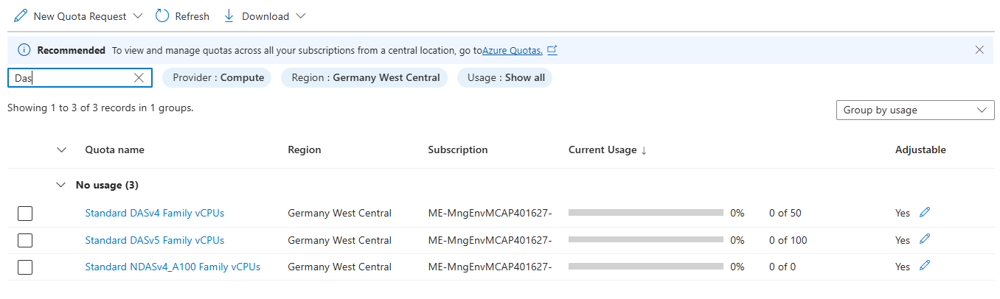

# Environment Setup
When working through the challenges of this microhack, it's assumed that you have an onprem k8s cluster available which you can use to arc-enable it. Also, it's assumed that you have a container registry, which you can use for the gitops challenge.

In this folder you find terraform code to deploy a **K3s cluster** and container registry in Azure for each participant of the microhack. It's intended that coaches create these resources for their participants before the microhack starts, so the participants can directly start with challenge 1 (onboarding/arc-enabling their cluster).

## K3s Architecture

This Terraform configuration deploys a **3-node K3s cluster** in Azure VMs, simulating an on-premises Kubernetes environment for Azure Arc enablement.

Each deployment creates:
- **1 Master Node**: K3s server with embedded etcd (10.{100+index}.1.10)
- **2 Worker Nodes**: K3s agents (10.{100+index}.1.11, 10.{100+index}.1.12)
- **Virtual Network**: Isolated network per cluster (10.{100+index}.0.0/16)
- **Network Security Groups**: Allow SSH and Kubernetes traffic
- **Public IPs**: For SSH access to all nodes

## Resources to be deployed
2 resource groups, 1 K3s cluster (3 VMs), 1 container registry per participant where xy represents the participant number:
```
subscription
|
├── <xy>-k8s-arc (resource group)
|   |
│   └── <xy>mhacr (container registry)
|   |
|   └── <xy>-law (log analytics workspace)
|
└── <xy>-k8s-onprem (resource group)
    |
    ├── <xy>-k8s-master (VM - K3s server)
    ├── <xy>-k8s-worker1 (VM - K3s agent)
    ├── <xy>-k8s-worker2 (VM - K3s agent)
    ├── <xy>-k8s-vnet (Virtual Network)
    └── Associated NICs, NSGs, and Public IPs
```

## Prerequisites
* bash shell (tested with Ubuntu 22.04)
* Azure CLI
* terraform
* clone this repo locally, so you can adjust the deployment files according to your needs
* Azure subscription
* User account with subscription owner permissions
* Sufficient quota limits to support creation of K3s VMs per participant 

## K3s Default Configuration
- **VM Size**: Standard_D4ds_v6 (sufficient for K3s, smaller than AKS requirements)
- **OS**: Ubuntu 22.04 LTS
- **K3s Version**: v1.33.6+k3s1
- **Admin User**: Set via admin_user in fixtures.tfvars
- **VMs per cluster**: 3 VMs (1 master + 2 workers)
- **Password**: Must be set in fixtures.tfvars (no default value)

If you don't change the default value of parameter "vm_size" in variables.tf, three Standard_D4ds_v6 VMs per cluster are used (1 master + 2 workers). If you have many participants you need to ensure that the quota limit in your subscription is sufficient to support the required cores. The terraform code will distribute the K3s clusters to 10 different regions. This setting can be adjusted via the parameter "onprem_resources" (variables.tf) value.

You can check this limit via Azure Portal (subscription > settings > Usage & Quotas):




## Installation instructions
As a microhack coach, you will be given a subscription in the central microhack tenant. Terraform expects the subscription id within the azurerm provider. Therefore, you need to to create the provider.tf file in this folder. To achieve this

* Copy the provider-template.txt and rename the copy to 'provider.tf'.
* Login to Azure CLI and run the "start_here.sh" script located in this folder
```bash
az logout # only if you were logged in with a different user already
az login  # in the browser popup, provide the user credentials you got from your microhack coach

./start_here.sh # sets the subscription_id in the provider.tf file
```

The terraform code deploys **K3s clusters** on Azure VMs which will be used as onprem k8s clusters. We chose K3s as it provides a true "on-premises" experience compared to AKS, making Arc enablement more realistic and meaningful for learning purposes.

## How K3s Setup Works

The K3s installation is **fully automated** during VM provisioning using cloud-init:

1. **k3s-master-setup.sh**: Automatically runs on the master VM during boot
   - Installs Docker and required packages
   - Downloads and installs K3s server with embedded etcd
  - Configures kubeconfig for the configured `admin_user`
   - Creates a script to retrieve the node token for workers

2. **k3s-worker-setup.sh**: Automatically runs on worker VMs during boot
   - Installs Docker and required packages
   - Waits for the master to be ready
   - Downloads and installs K3s agent
   - Connects to the master using the shared cluster token

The scripts are executed via Terraform's `custom_data` parameter, so **no manual intervention is required**. The cluster will be ready approximately 5-10 minutes after VM deployment completes.

The K3s deployment uses VM managed identities and doesn't require service principals like AKS deployments.

* Create a file called fixtures.tfvars and set the admin password for the VMs:

* All resources which are created by this terraform code will get a two-digit numeric prefix. It's intended that each user easily finds "his" resources. If a user i.e. got assigned the account "LabUser-37" he should work with the resources with the prefix "37". The central microhack team precreates the user accounts and assigns them to the different microhacks (which ususally run in parallel on the same day). So the users probably do not start with "01". Depending on what user accounts you got provided, you can use the start_index and end_index in the fixtures.tfvars file to adjust the prefixes to match your user numbers. Example: You receive the users LabUser-50 to LabUser-59, set the start_index value to 50 and the end_index value to 59. Make sure you saved your changes.

* your fixtures.tfvars file should now look like this:
```terraform
# Deployment range
start_index = 37
end_index = 39

# Security - REQUIRED
admin_user     = "<replace-with-your-own-user-name>"
admin_password = "<replace-with-your-own-secure-password>"
cluster_token  = "<replace-with-your-own-secure-cluster-token>"   # Simple string for K3s
```

```bash
terraform init # download terraform providers

terraform plan -var-file=fixtures.tfvars -out=tfplan

# have a look at the resources which will be created. There should be resource groups per participant, K3s VMs, and Azure container registry.
# after validation:

terraform apply tfplan
``` 

### What Happens After Deployment

1. **VMs are created** with Ubuntu 22.04 LTS
2. **K3s setup scripts run automatically** via cloud-init:
   - Master node: Installs K3s server, configures networking, sets up kubeconfig
   - Worker nodes: Wait for master, then join the cluster as K3s agents
3. **Cluster becomes ready** in ~5-10 minutes after VM deployment
4. **SSH access** is available immediately with the admin_user and your password

The expected output looks approximately like this depending on the start_index and end_index parameters:
```bash
Outputs:

acr_names = {
  "37" = "37mhacr"
  "38" = "38mhacr"
}
k3s_cluster_info = {
  "37" = {
    "kubeconfig_setup" = "mkdir -p ~/.kube && scp <admin_user>@x.x.x.x:/home/<admin_user>/.kube/config ~/.kube/config && sed -i 's/127.0.0.1/x.x.x.x/g' ~/.kube/config"
    "master_ssh" = "ssh <admin_user>@x.x.x.x"
    "worker1_ssh" = "ssh <admin_user>@y.y.y.y"
    "worker2_ssh" = "ssh <admin_user>@z.z.z.z"
  }
  "38" = {
    "kubeconfig_setup" = "mkdir -p ~/.kube && scp <admin_user>@20.19.166.105:/home/<admin_user>/.kube/config ~/.kube/config && sed -i 's/127.0.0.1/a.a.a.a/g' ~/.kube/config"
    "master_ssh" = "ssh <admin_user>@a.a.a.a"
    "worker1_ssh" = "ssh <admin_user>@b.b.b.b"
    "worker2_ssh" = "ssh <admin_user>@c.c.c.c"
  }
}
law = {
  "37" = "/subscriptions/.../resourceGroups/37-k8s-arc/providers/Microsoft.OperationalInsights/workspaces/37-law"
  "38" = "/subscriptions/.../resourceGroups/38-k8s-arc/providers/Microsoft.OperationalInsights/workspaces/38-law"
}
rg_names_arc = {
  "37" = "37-k8s-arc"
  "38" = "38-k8s-arc"
}
rg_names_onprem = {
  "37" = "37-k8s-onprem"
  "38" = "38-k8s-onprem"
}
```

**Important**: Wait 5-10 minutes after terraform completes before trying to access the K3s cluster to allow the setup scripts to finish.

## Post-Deployment - Accessing Your K3s Cluster

### 1. Access your cluster
```bash
# Set admin username (must match the admin_user value in fixtures.tfvars)
admin_user="<replace-with-admin-user-from-fixtures.tfvars>"

# Extract user number from Azure username before '@' (e.g., LabUser-37@... -> 37)
azure_user=$(az account show --query user.name --output tsv)
user_number=$(echo "${azure_user%@*}" | grep -oE '[0-9]+' | tail -n1 | sed 's/^0*//; s/^$/0/')

# Get public ip of master node via Azure CLI according to user-number
master_pip=$(az vm list-ip-addresses --resource-group "${user_number}-k8s-onprem" --name "${user_number}-k8s-master" --query "[0].virtualMachine.network.publicIpAddresses[0].ipAddress" --output tsv)

echo "Connecting to master node: $master_pip with user: $admin_user"

# Create .kube directory if it doesn't exist
mkdir -p ~/.kube

# Copy the kubeconfig to standard location
scp $admin_user@$master_pip:/home/$admin_user/.kube/config ~/.kube/config

# Replace localhost address with the public ip of master node
sed -i "s/127.0.0.1/$master_pip/g" ~/.kube/config

# Now kubectl works directly
kubectl get nodes
```

### 2. Verify K3s Installation
```bash
# On master node
kubectl get nodes
systemctl status k3s

# On worker nodes
systemctl status k3s-agent
```

## Troubleshooting

### Check K3s Logs
```bash
# On master node
kubectl get nodes

systemctl status k3s

sudo journalctl -u k3s -f

# On worker nodes
systemctl status k3s-agent

sudo journalctl -u k3s-agent -f
```

### Verify Network Connectivity
```bash
# From worker to master (port 6443 should be open)
telnet <master_private_ip> 6443
```

### Reset K3s Installation (if needed)
```bash
# On master
sudo /usr/local/bin/k3s-uninstall.sh

# On worker nodes
sudo /usr/local/bin/k3s-agent-uninstall.sh
```

## Security Notes
- VMs use password authentication (consider using SSH keys for production)
- Network security groups restrict access to necessary ports only
- K3s runs without Traefik (disabled for flexibility)
- Docker is installed for container runtime and additional workloads

## Clean Up - After Microhack

When done with the microhack, call terraform destroy to clean up.

```bash
terraform destroy -var-file=fixtures.tfvars
```

This will remove all created resources including VMs, networks, and public IPs.

[To challenge 01](../challenges/challenge-01.md)

