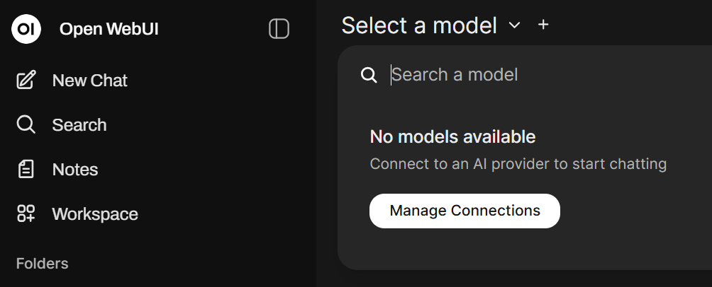
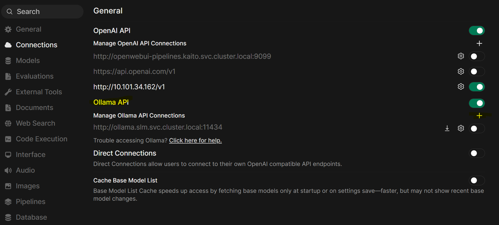
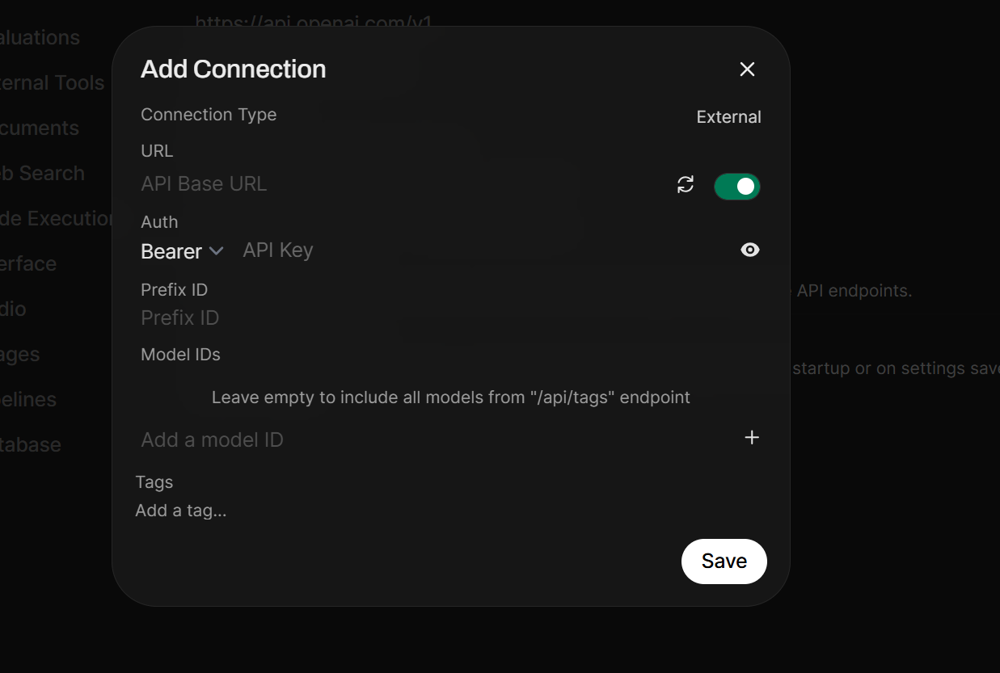

# Walkthrough Challenge 3 - Deploy CPU based Large & Small Language Models (LLM/SLM)

[Back to challenge](../../challenges/challenge-03.md) - [Next Challenge's Solution](../challenge-04/solution.md)

## Prerequisites
* You have an arc-connected k8s cluster/finisched challenge 01.
* Verify the firewall requirements in addition to the Azure Arc-enabled Kubernetes network requirements.
* You must be logged in to az cli (az login)
* You need kubectl and helm 

## Task 1 - Check the Kubernetes cluster, check nodes and size
Execute the following script in your bash shell to access the kuberentes cluster:
```bash
kubectl get nodes
kubectl get all --all-namespaces
```

## Task 2 - Create a new namespace and prepare the helm repository

```bash
helm repo add otwld https://helm.otwld.com/
helm repo add open-webui https://helm.openwebui.com/
helm repo update
kubectl create namespace aimh
```

## Task 3 - install ollama and openwebui as an AI framework running in the Azure Arc enabled kubernetes Cluster


### Step 1: Install ollama with phi4-mini

```bash
helm install ollama otwld/ollama \
  --namespace aimh \
  --set service.type=ClusterIP \
  --set ollama.port=15000 \
  --set persistentVolume.enabled=true \
  --set persistentVolume.size=20Gi \
  --set ollama.models.pull[0]=phi4-mini:latest \
  --set ollama.models.run[0]=phi4-mini:latest \
  --set resources.requests.cpu="2" \
  --set resources.requests.memory="2Gi" \
  --set resources.limits.cpu="4" \
  --set resources.limits.memory="4Gi"
```

### Step 2: Install openwebUI

```bash
helm install openwebui open-webui/open-webui \
  --namespace aimh \
  --set service.type=NodePort \
  --set service.nodePort=30080 \
  --set ollama.enabled=false \
  --set ollamaUrls[0]="http://ollama.slm.svc.cluster.local:15000" \
  --set persistence.enabled=true \
  --set persistence.size=5Gi
```

Get the external IP of the openwebui
```bash
kubectl get svc -n aimh

azure_user=$(az account show --query user.name -o tsv)
user_number=$(echo "${azure_user%@*}" | grep -oE '[0-9]+' | tail -n1 | sed 's/^0*//; s/^$/0/')
node_pip=$(az vm list-ip-addresses \
  --resource-group "${user_number}-k8s-onprem" \
  --name "${user_number}-k8s-master" \
  --query "[0].virtualMachine.network.publicIpAddresses[0].ipAddress" -o tsv)

echo "Open: http://${node_pip}:30080"
```

## Task 5 - Access the openwebUI and run a prompt
open webbrowser to access the external IP, create user login to the openwebUI portal 


add an ollama connection


add IP Address and port and click in save(2x)

and try out your first prompt
If your connection works, you should see in the upper left corner the deployed model "phi4-mini".

You successfully completed challenge 3! 🚀🚀🚀

[Next challenge](../../challenges/challenge-04.md) - [Next Challenge's Solution](../challenge-04/solution.md)
